### 1.2 天体物理学的观测方法简介

天文学包括天体物理学都是基于观测的科学。我们对宇宙的认识，首先是通过对各种宇宙天体的观测而得到的。观测接收到的宇宙信息，主要来自天体发出的电磁波辐射。虽然许多天体还有高能粒子发射甚至引力波辐射，但前者不仅数量极少，而且极难捕捉；而后者尽管人们已经付出巨大的努力，但至今仍未得到任何肯定的直接观测结果。因此，天体的电磁波辐射仍然是我们获取宇宙信息的主要来源。

电磁波按波长从长到短(光子能量从小到大)分为射电、红外、可见光、紫外、X射线和γ射线等不同波段(见图1.18a)。射电波段的波长在1 mm以上，其中10 cm\~1 mm的一段通常称为微波；其他波段的波长范围是：红外1 mm\~0.76 μm；

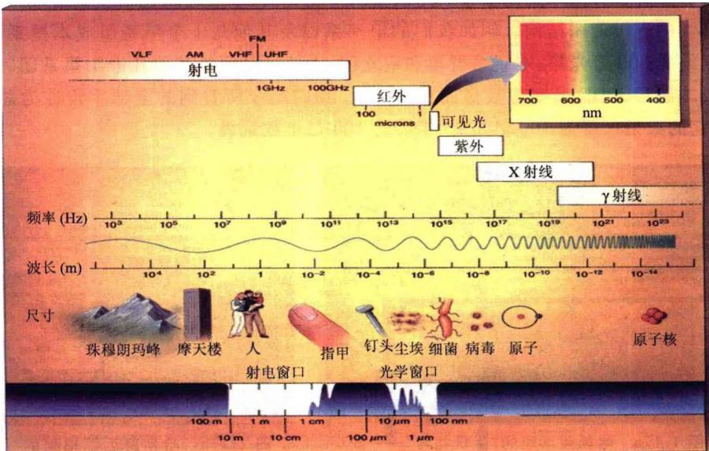
图1.18a 电磁波谱

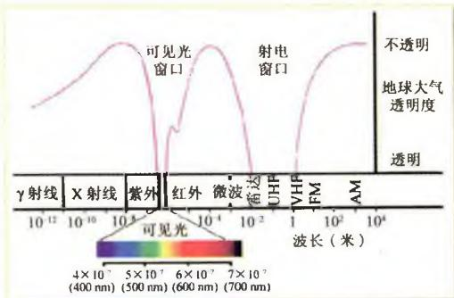
图1.18b 不同波段电磁波的
大气透明度与大气窗口

可见光 $0.76 \mu m \sim 0.4 \mu m$ ; 紫外 $0.4 \mu m \sim 10 nm$ ; X 射线 $10 nm \sim 0.001 nm$ ; $\gamma$ 射线的波长 $\leqslant 0.001 nm$ 。

自遥远天体发出的电磁波辐射，必须穿过大气层才能到达地面。大气层对电磁波的许多波段会产生强烈吸收，使得大气层对这些波段变为不透明。例如，大气中的臭氧层和氧原子分子以及氮原子分子会强烈吸收紫外、X射线和γ射线的辐射，大气中水分子和二氧化碳分子会强烈吸收一部分红外辐射，因而地面观测就接收不到这些波段的天体辐射信息。所幸的是，大气层对可见光和波长30m\~1mm的射电波是透明的，这就是所谓大气窗口（见图1.18b），其中可见光窗口不仅使我们可以进行天文观测，而且可以使阳光透过这个窗口普照大地，地球上的万物才得以生生不息。实际上，还有部分红外光线（波长22μm\~1μm）可以透过大气层，尽管这个红外窗口的一部分是半透明的，还有一部分是断续性透明的。习惯上，常常把可见光窗口和红外窗口统称为光学窗口。

#### 1.2.1 地面观测

光学望远镜 望远镜是人眼的视野延伸和功能扩展。第一架用于天文观测的望远镜，是伽利略于1609年亲手制造的折射式望远镜(图1.19)。他用它发现了月

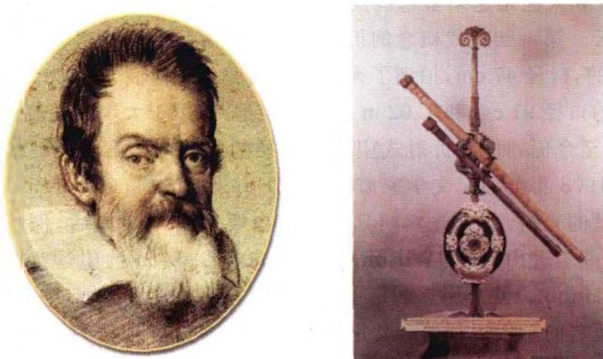
图1.19 伽利略和他制造的望远镜

亮上的环形山和“海”（月面上平坦的陆地），木星的四颗卫星以及太阳黑子和金星的盈亏。他还看到了许多肉眼看不到的恒星，并发现银河是由点点繁星组成的。1668年，牛顿也制造出了第一架反射式望远镜（图1.20）。我们看到，在人类探索自然奥秘的过程中，这两位近代物理学的先驱始终一先一后，不仅都为创立经典力学做出了杰出贡献，而且都通过亲手制作的望远镜，把智慧的目光投向了浩瀚的宇宙。

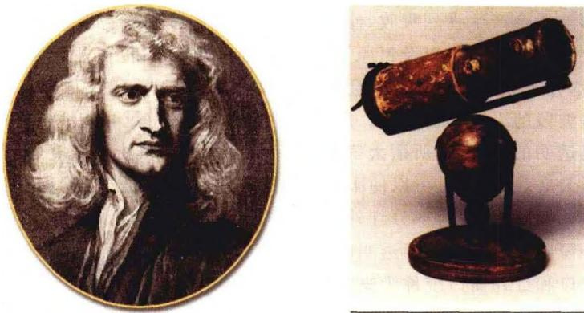
图1.20 牛顿和他制造的望远镜

1781年，英国天文学家威廉·赫歇尔用自制的口径 $15\mathrm{cm}$ 的反射望远镜发现了天王星。1845年英国罗斯伯爵（T. Ross）制造的金属面反射望远镜，口径达 $1.54\mathrm{m}$ ，长 $17\mathrm{m}$ 。他用这架望远镜发现了河外星系M31的旋涡结构，还发现了著名的蟹状星云。第一架现代概念的折射望远镜是由美国克拉克(A. Clark)父子于1862年建造的，口径 $47\mathrm{cm}$ ，拍到了天狼伴星的照片。他们于1888年和1897年相继建造完成的口径 $91\mathrm{cm}$ 和 $1.02\mathrm{m}$ 的折射望远镜，由于大块光学玻璃制造和加工的难度极大，至今仍列世界折射式望远镜口径的前两位。第一架现代概念的反射式望远镜是1908年美国天文学家海尔(G. Hale)建造的，口径 $1.53\mathrm{m}$ ，它首次拍到了天狼伴星的光谱，并由此判断其为一颗白矮星。10年以后，仍然在海尔的主持下，完成了威尔逊山(Mt. Wilson)天文台口径 $2.54\mathrm{m}$ 的望远镜的建造。1924年，哈勃(E. Hubble)就是用它测定了仙女座大星云的距离，确认它是河外星系，并进而发现了著名的星系退行的哈勃定律。在海尔多方奔走努力下，1948年帕洛玛山(Mt. Palomar)天文台又建成了口径 $5.08\mathrm{m}$ 的望远镜(它被命名为海尔望远镜，以纪念1938年去世的海尔)。主镜用整块玻璃制造的如此大口径光学望远镜，其镜片自身的重量，使得镜片加工以及望远镜的机械和控制系统的制造水平已经达到极限，故在这架望远镜建成后的近半个世纪的时间里，它一直是世界上最大最好的望远镜，取得了许多意义重大的天文发现。

为了建造地面上口径更大的望远镜，人们采用薄镜镶拼技术并利用计算机辅助控制的主动光学系统，终于在1993年建成了口径 $10\mathrm{m}$ 的光学望远镜凯克I（KeckI）。这台望远镜安装在海拔 $4200\mathrm{m}$ 的美国夏威夷莫纳凯亚(Mauna Kea)天文台，它由36块直径 $1.8\mathrm{m}$ 的六边形镜片镶拼而成，每块镜片的厚度仅 $10\mathrm{cm}$ 。而要用整块玻璃制造的话，镜片的厚度将达 $1.5\mathrm{m}$ 以上，重量将超过150吨。这一组合镜面望远镜的制造技术解决了在地面上制造甚大型望远镜的难题，并由此引发了一轮甚大型望远镜的建造热潮。1996年，第二台 $10\mathrm{m}$ 望远镜凯克II（KeckII）也建造完成，它与凯克I的结构完全一样，并同样安装在夏威夷莫纳凯亚天文台，两者相距 $85\mathrm{m}$ （见图1.21）。到目前为止，全世界口径大于 $8\mathrm{m}$ 的光学望远镜已有14台。除了上面两台凯克望远镜外，其余的是：位于美国得州麦克唐纳天文台的 $9.2\mathrm{m}$ Hobby-Eberly望远镜HET(1999年)；分别安装于美国夏威夷和南美智利的两台 8.1 m 双子座(Gemini N & S)望远镜(1999/2002 年);位于夏威夷的 8.2 m 昴星团(Subaru)望远镜(日本,1999 年);位于智利的 4 台口径均为 8.2 m, 即可以单独使用,也可以组合成等效口径为 16 m 的超大型光学干涉望远镜 VLT(欧洲南方天文台(ESO),2000 年);由美国和意大利共同建造、安装于美国亚利桑那州的 2×8.4 m 双筒望远镜 LBT(2005 年);位于西班牙卡纳里岛的 10.4 m 望远镜 GTC(2005 年);以及建于南非的 11 m 南非大望远镜 SALT(2005)。欧洲目前正在计划建造的极大望远镜(ELT)有效直径将达 42m,是今天最大地面光学望远镜的 4 倍。

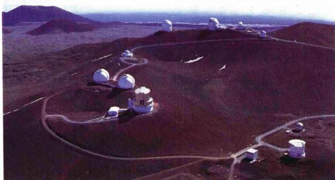
图1.21a 美国夏威夷莫纳凯亚天文
台，图的左边可见凯克Ⅰ和凯克Ⅱ

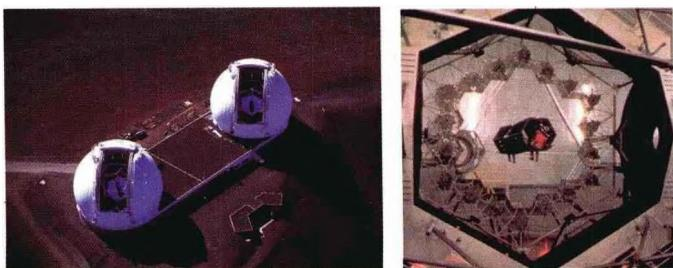
图1.21b 凯克望远镜及其内部

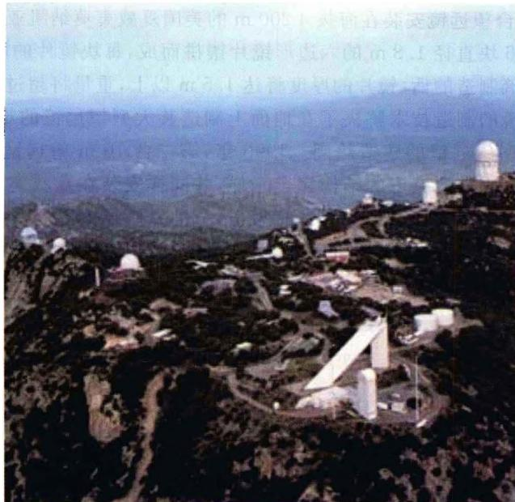
图 1.22 美国亚利桑那州的基特峰天文台

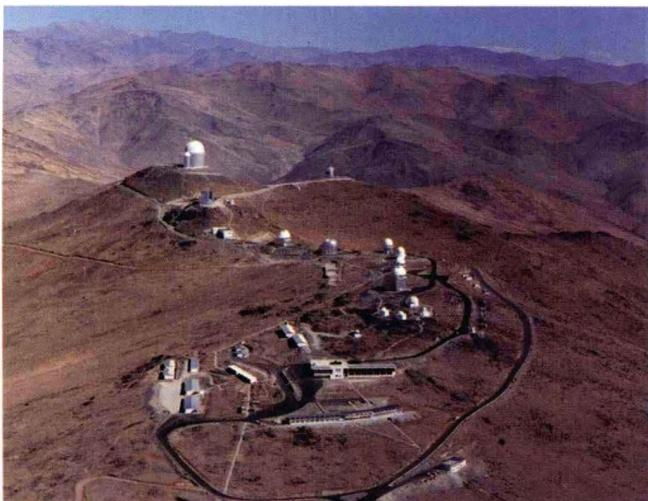
图 1.23 位于南美智利的欧洲南方天文台(ESO)

光学望远镜不仅用于天体的成像和亮度(光度)测量,还可以拍摄天体的光谱,为我们了解天体的化学成分及物理状态(如温度、压力、气体湍动速度等)提供重要的信息。随着光学、微电子和信息科学技术的发展,一架望远镜可以同时拍摄的天体光谱数目,从几条、几十条已经达到千条以上。例如美国的 SDSS(Sloan 数字巡天望远镜,见图 1.24),利用光纤传导、CCD 成像和计算机控制技术,可以同时拍摄

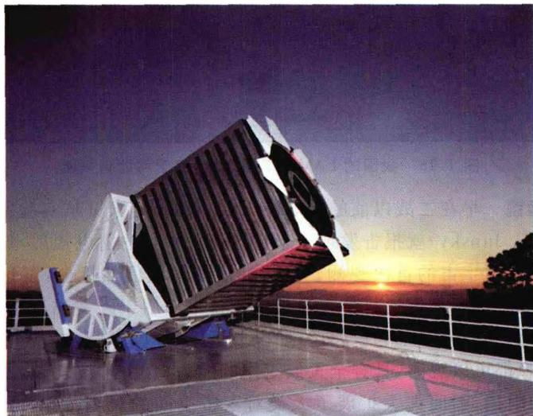
图 1.24 美国的 SDSS(Sloan Digital Sky Survey)望远镜

600 条光谱, 至今已完成了约百万个天体的光谱拍摄工作。我国正在建造的 LAMOST 望远镜(即大天区面积多目标光纤光谱望远镜), 是一台地平式反射施密特望远镜(图 1.25), 主镜由 37 块直径 1.1 m 的六边形镜面组成, 有效通光口径为 4 m, 内设 4000 根直径 0.3 mm 的光导纤维, 可同时拍摄 4000 个天体的光谱, 并即时将光谱信息送入大型计算机处理。这台望远镜投入使用后，预计3年内可以获得数以千万计的天体光谱，使我国在大天区范围和大样本方面的观测水平处于世界领先地位。近年来，我国在云南丽江建成了口径2.4m的光学望远镜，并已在西藏、新疆勘察了若干适宜天文观测的地点，为下一步建造更大口径的普适型望远镜做前期准备。

图 1.25 我国的 LAMOST 望远镜, 建于河北省兴隆

射电望远镜 早在二战以前的 1932～1935 年间，美国贝尔实验室的无线电工程师央斯基(K. Jansky)就报告发现了来自银河系中心的射电辐射，这是人们透过大气层射电窗口对宇宙的首次观测。二战期间的一次偶然机会，雷达工作者发现了太阳射电。战后，还是雷达科技人员把雷达技术应用于天文观测，揭开了射电天文学发展的序幕。与光学望远镜相比，射电望远镜可以透过云层，不受气象条件的影响，白天夜晚都可以观测，具有全天候工作的能力；且由于波长长，不受星际和星系际尘埃云的阻挡，因而大大扩展了人类对宇宙空间的观测范围。20 世纪 60 年代著名的天文学四大发现，都是利用射电望远镜或射电接收装置观测而得到的。

与光学望远镜类似，射电望远镜的基本技术指标有两项，即灵敏度和分辨率。前者主要取决于接收天线的有效面积及信号处理系统的信噪比；后者与光学望远镜一样，主要受到电磁波衍射的限制。分辨率 $\theta$ 与电磁波长 $\lambda$ 和望远镜天线口径 D 之间的关系为

$$
\theta = 1. 2 2 \frac {\lambda}{D} (\text { 弧度 })\tag{1.3}
$$

因为射电波的波长比可见光波长大许多,所以要提高射电望远镜的分辨率,必须使接收天线的口径非常大。

目前世界上最大的单面射电望远镜建在西印度群岛中波多黎各(美国属地)的阿雷西博(Arecibo)天文台,1963年建成,属于康奈尔大学和美国国家天文学和电离层中心。接收天线是一面直径305 m的巨大金属网碟,置于群山中的一个天然碗形谷地上不动(图1.26a),依靠地球的自转扫描不同的天区。1986年天线直径又扩展为366 m。多年以来,全球最大的可转动跟踪的射电望远镜位于德国艾菲斯堡,属于马克思·普朗克射电天文研究所,它的天线直径为100 m,内部80 m的表面由金属板片制成,可以用于厘米波段的观测;外部20 m是网眼结构,用于衍射影响较大的长波观测。最新的单面大射电望远镜名为伯德望远镜,也称GBT望远镜(图1.26b),不久前安装于美国西弗吉尼亚格林班克的NRAO(美国国家射电天文台)。这是一台全动式100 m望远镜,由于采用了阶跃式的臂支撑接收机,不会阻挡天线,因而能比德国的望远镜利用更多的积光面积,从而优化了灵敏度和成像质量,可以观测波长短至7 mm的射电辐射。附带补充的是,这里原有一台口径91 m、居世界第二位的可跟踪式射电望远镜,1962年建成,但不幸于1988年突然意外坍塌,成为大型望远镜历史上唯一的一次严重事故。

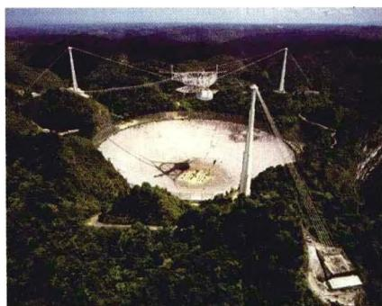
图1.26a 位于波多黎
各的阿雷西博射电天文台

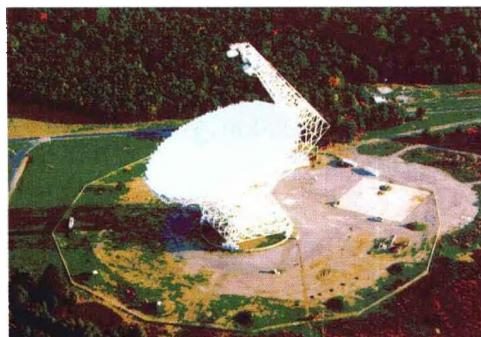
图 1.26b 位于美国西弗吉
尼亚州格林班克的GBT

由于射电波长比光波波长可以大几个数量级，而单面射电镜的天线口径最多只比光学望远镜大两个量级，故单面射电镜的分辨率一般总是低于光学望远镜。综合口径技术的发明使这一问题得以解决。这一技术的关键是运用电磁波的干涉原理，用多面天线组成射电望远镜阵同时观测一个目标，观测结果为多面镜的干涉结果，相当于扩大了望远镜的总口径，可以得到很高的分辨率。例如两台分开很远距离的射电望远镜进行干涉测量，相当于使分辨率公式中的望远镜口径加大到两台望远镜之间的距离（即所谓基线长度）。目前使用的甚长基线干涉(VLBI)技术，可以允许进行干涉测量的望远镜放置在地球上的任何地方，甚至空间轨道和月球上。用VLBI观测得到的分辨率，现已高达 $10^{-4}$ 角秒，大大超过了光学望远镜。图1.27为位于美国新墨西哥州索科罗附近的综合口径射电望远镜阵(VLA)，它于1981年建成，由27台口径各 $25\mathrm{m}$ 的单面镜按Y字形排列，总长度达 $27\mathrm{km}$ 。望远镜旁有铁轨，以便于望远镜之间的距离根据分辨率的需要而改变。美国的甚长基线阵(VLBA)，跨距 $8000\mathrm{km}$ ，西起夏威夷，东至西印度群岛中的美属维尔京群岛圣克罗伊，由10台口径 $25\mathrm{m}$ 的射电望远镜组成，每台的天线重达240吨。位于美国新墨西哥州的毫米波阵列望远镜(MMA)，由40台 $8\mathrm{m}$ 射电望远镜组成环行阵列，可沿一个圆形轨道移动，轨道直径为 $30\mathrm{km}$ ，工作波段主要在毫米波段，最短至 $0.8\mathrm{mm}$ ，据称是目前世界上灵敏度和分辨率都最高的射电望远镜阵列，其观测结果可与哈勃空间望远镜媲美。其他国家的射电镜阵列主要还有：英国的微波联线干涉网(MERLIN)，由英国本土的7台射电望远镜组成，基线跨度 $220\mathrm{km}$ ，中心是焦德雷尔班克天文台(位于曼彻斯特)口径 $76\mathrm{m}$ 的旋转抛物面射电望远镜；欧洲甚长基线干涉网(EVN)，总部设在荷兰德文格路天文台，共有欧洲及全球40多个天文台参加，其中包括我国上海天文台和乌鲁木齐天文站的两台 $25\mathrm{m}$ 射电望远镜；印度巨型米波射电望远镜阵(GMRT)，1994年建成，由30台口径 $45\mathrm{m}$ 的旋转抛物面天线组成，位于海拔 $650\mathrm{m}$ 的德干高原上普纳市北面，18台天线沿Y字的三条臂排列，每臂长 $25\mathrm{km}$ ，另12台集中在中心区 $5\mathrm{km}$ 的范围内，目前是亚洲最大的射电望远镜阵列。

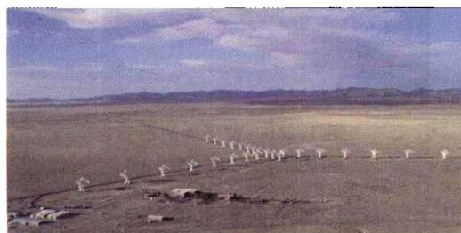
图 1.27a 位于美国新墨西哥州的综合口径射电望远镜阵(VLA)

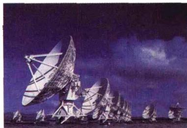
图 1.27b VLA 的射电望远镜近景

近年来，我国在大型射电望远镜建造方面已迈开步伐，“十一五”期间计划在贵州建造一台口径500 m、类似于美国阿雷西博的固定式望远镜，称为FAST。贵州有丰富的喀斯特地貌资源，非常适合于建造超大型射电望远镜。这台望远镜建成后，我国还将通过国际合作的方式，继续在贵州建造一台口径1 000 m的超大型射电望远镜。

#### 1.2.2 空间望远镜

地球大气的影响使我们在地面只能利用射电、可见光及近红外窗口进行观测，这大大限制了我们对宇宙奥秘的探索研究。即使在可见光波段，由于天气变化和大气的透明度、视宁度以及周围人类活动（例如城市灯光）的影响，使得光学望远镜理论上的分辨率和灵敏度通常都要大打折扣。而高度100 km以上的大气层外空间，完全摆脱了地球大气的影响，可以全天候、全波段地进行观测，因而成为天文观测最理想的场所。随着人类探空技术的飞速发展，越来越多的空间观测设备被送入太空轨道，激动人心的发现接连不断。人类多年梦想的全波段深空探测的崭新时代已经到来。

可见光波段 在大气层外轨道运行的空间望远镜中,最著名的就是哈勃空间望远镜(Hubble Space Telescope.简称 HST)了。它于 1990 年 4 月 25 日由发现者号航天飞机送上太空(图 1.28a),已经成功发回大量高度清晰的宇宙图片,使我们能够窥探到宇宙深处的壮观景象。哈勃望远镜主镜的口径为 2.4 m,长 13.6 m,地面重量为 12.5 吨。它主要工作于可见光波段,同时也可以用于部分红外和紫外波段的观测,比地面光学望远镜的工作波长范围宽 3 倍。它的角分辨率高达 0.05"\~0.014",大约是同样口径的地面光学望远镜的 10 倍。“哈勃”刚发射升空不久,就发现光学系统存在较严重的球差,致使传回地面的照片比较模糊。1993 年 12 月 2 日至 13 日,由奋进号航天飞机载运的 7 名宇航员对“哈勃”进行了空间维修,在光路上放置了一枚只有分币大小的改正镜片,使“哈勃”完全恢复了视力。后来,在 1997 年 2 月又有过一次检修,至今一直在有效地工作。目前,准备接替“哈勃”工作的下一代空间望远镜(以前称为 NGST,现命名为 JWST,以纪念美国宇航局即 NASA 的首任局长 James Webb)正在研制过程中(图 1.28d)。它的口径达 6 m,是“哈勃”的 2.5 倍,预期在 2012 年前发射升空。JWST 可以观测到的天体,比现有最大地面望远镜或空间红外望远镜看到的要暗 400 倍。这将大大扩展人类的视野,使我们能够观察到宇宙大爆炸之后不久发生的现象,了解宇宙第一代恒星和星系的形成过程。

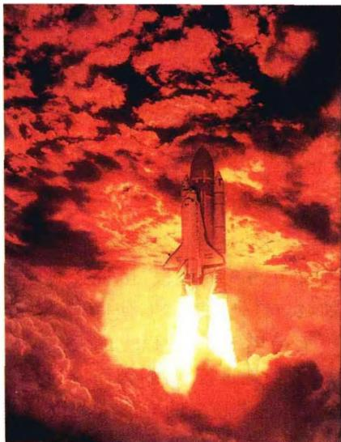
图 1.28a 哈勃空间望远镜(HST)由发现者号航天飞机送上太空(1990 年)

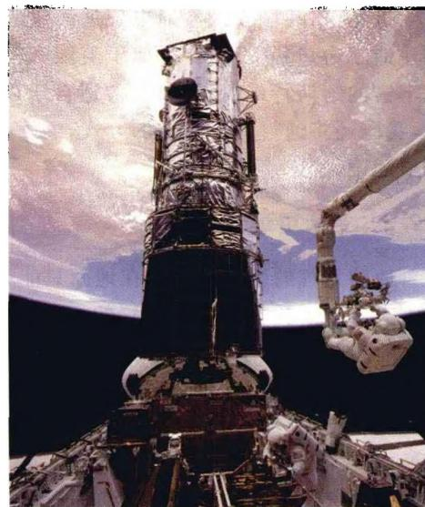
图 1.28b 1993 年“哈勃”第一次大修

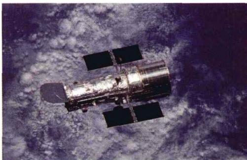
图 1.28c 环绕地球飞行的“哈勃”

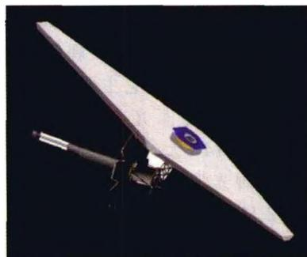
图1.28d 下一代空间望远镜JWST(NGST)

微波波段 微波波段最重要的观测目标是宇宙微波背景辐射(见第7章)。1989年11月18日，COBE(Cosmic Background Explorer，即宇宙背景辐射探测器)卫星(见图1.29a)由NASA发射升空，并很快取得了许多重要的观测结果，其中最重要的是发现了宇宙背景辐射严格的黑体谱形式，从而确认了宇宙早期是一个热宇宙，为大爆炸宇宙理论提供了最关键的支持。此后，耗资1.45亿美元的WMAP卫星（Wilkinson Microwave Anisotropy Probe，即威尔金森微波各向异性探测器，见图1.29b)也于2001年6月30日升入太空，继续对宇宙微波背景辐射进行更精确的观测。这两颗探测卫星获得的大量数据，使宇宙学研究进入了精确宇宙学阶段。今后不久，欧洲的“普朗克”卫星（PLANCK，图7.14c）也将发射升空。

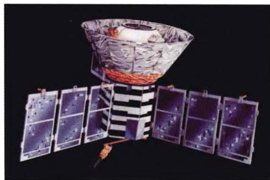
图1.29a COBE卫星

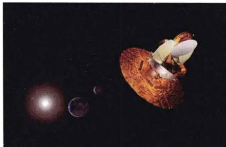
图1.29b WMAP卫星

红外波段 早期执行空间红外观测的是红外天文卫星(IRAS, 图1.30a), 它是按照美、荷、英等国的联合方案于1983年1月发射的, 轨道为高度约 $900 \mathrm{~km}$ 的极轨道, 主要任务是系统的巡天观测以及部分特定天体的观测。直径 $0.6 \mathrm{~m}$ 的望远镜被冷却至极低温度, 以减弱仪器本身的热噪声。它在4个较窄的波段上工作, 这四个波段的中心分别位于12、25、60和 $100 \mu \mathrm{m}$ 。IRAS大规模的巡天发现了100000个以上的红外点源, 并建立了全球共用的红外数据库。1995年, 欧洲空间局(ESA)发射的红外空间天文台(ISO)也投入了使用。ISO提供了扩展到远红外的宽广波段, 装备了较大的望远镜和灵敏度高的探测器阵列(比IRAS的分辨率提高了1000倍), 具备了获得高质量红外光谱的能力。2003年8月28日, 迄今最大的红外空间望远镜——斯必泽空间望远镜（Spitzer Space Telescope，亦称为SIRTF或SST，图1.30b），几经推迟终于由NASA发射升空。它在太阳同步轨道运行，望远镜口径0.85m，完全由液氦致冷，主要任务是对恒星和星系早期演化进行研究，并探测大红移的红外星系，以及“褐矮星”、暗伴星等低温天体，至今已取得许多观测成果。

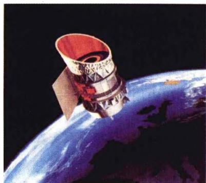
图1.30a 红外天文卫星IRAS

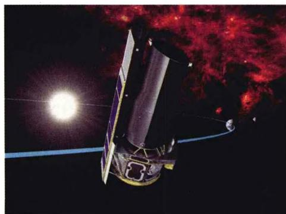
图1.30b 斯必泽红外空间望远镜

紫外波段 紫外辐射不能穿透地球大气，因此必须利用空间观测设备。早期升空工作的紫外卫星有哥白尼卫星(1972～1981)和国际紫外探索者卫星(IUE, 1978～1996, 图1.31a)，其中IUE装备了0.45 m反射镜，分辨率为3′′，以及可以拍摄紫外光谱的摄谱仪。如前所述，HST也可用于紫外观测。1998年发射的远紫外光谱探测卫星FUSE(Far Ultraviolet Spectroscopic Explorer satellite, 图1.31b)，装备有0.64 m的反射镜和高分辨率的摄谱仪，其主要任务是研究宇宙中的元素丰度、星际介质和恒星大气，深入了解星系的化学演化。目前，我国正在与俄罗斯、欧洲合作研制世界空间天文台（WSO），它的镜片口径达1.7 m，工作于紫外波段。WSO投入使用后，可以使我们对宇宙极早期物质的化学组成以及恒星和星系的演化过程有更深入的了解。

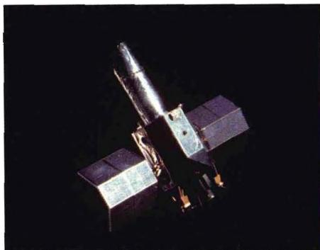
图 1.31a 国际紫外探索者卫星 IUE

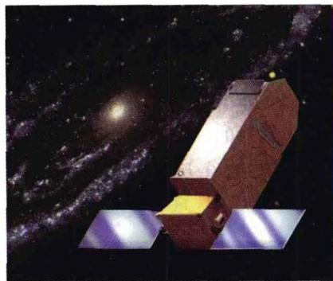
图 1.31b 远紫外光谱探测卫星 FUSE

X射线波段 X射线天文学(以及下面的γ射线天文学)属于高能天文学,是观测天文学中最年轻的领域之一。X射线天文学的历史伴随着高空探测(气球)和空间天文学的发展。早期的X射线观测用探空火箭(它只能进行时间极短的飞行,采集数据的时间只有几分钟)和高空气球,而且气球还不能够升到整个大气层之上。第一个从事X射线观测的卫星是Uhuru卫星(1970年发射升空),它首次进行了全天的巡天观测,发现了339个发射强X射线的天体。Uhuru是一个比较小的卫星,只运行了两年多时间,就因电源耗尽而停止了工作。在它之后,NASA发射了许多更大的卫星，它们组成了高能天文台(HEAO)计划。HEAO系列中的第二个卫星是爱因斯坦天文台(HEAO-Einstein)，它率先使用了掠射成像技术，构成第一代X射线望远镜，并得到了第一张X射线天体像，大大增进了我们对各类天体本质的了解。1990年伦琴卫星(ROSAT，图1.32a)发射升空，它在灵敏度和角分辨率上有了一个大的飞跃，在上天之后八年半的时间内共发现约15万个X射线源。1999年7月和12月，NASA和ESA又分别发射了钱德拉X射线空间天文台(原名AXAF(Advanced X-Ray Astrophysics Facility)，图1.32b)和XMM-Newton X射线空间望远镜(图1.32c，XMM为X-ray Multi-Mirror的缩写)。由哥伦比亚航天飞机送入太空的钱德拉X射线空间天文台，是以已故美籍印度裔著名天体物理学家钱德拉塞卡(S.Chandrasekhar)的名字命名的。它总长约45英尺（超过 $13\mathrm{m}$ ），镜面直径达14英尺（超过 $4\mathrm{m}$ ），是迄今最大、最重、最昂贵的空间探测设备，其轨道远地点高度14万 $\mathrm{km}$ ，近地点高度1.6万 $\mathrm{km}$ 。它提供了亚毫角秒的天体像和光栅分光测量，其主要任务是以高分辨率证认宇宙中的X射线天体，并拍摄其X射线光谱。这对研究恒星晚期演化、特别是对于探测黑洞和宇宙暗物质有重要意义。XMM-Newton是ESA迄今发射的最大的空间望远镜，它由3架X射线望远镜组成，每架长度为 $2.5\mathrm{m}$ ，直径 $90\mathrm{cm}$ ，具有很大的有效采光面积，同时还可以进行光学波段的观测。这两台X射线空间望远镜所得到的观测数据已得到广泛采用。

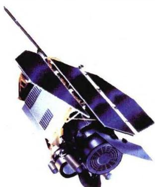
图1.32a 伦琴X射线卫星ROSAT

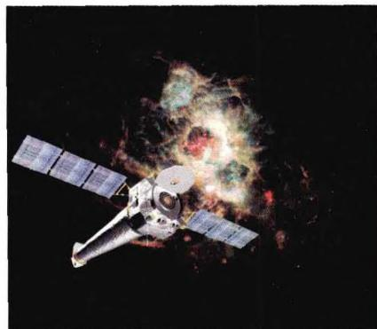
图1.32b 钱德拉X射线空间天文台(即AXAF)

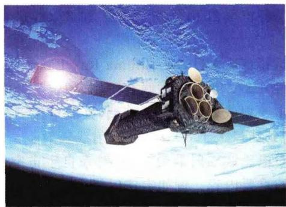
图1.32c XMM-NewtonX射线空间望远镜

γ射线波段 对宇宙γ射线的观测早在20世纪60年代就开始了，第一颗γ射线卫星是Explorer XI，重量只有30磅。其后，一系列γ射线探测装置及卫星被陆续送入太空，观测的灵敏度越来越高，仪器的重量也越来越大。例如，1991年4月5日，由大西洋号航天飞机送入轨道的康普顿γ射线空间天文台（CGRO，图1.33a），地面重量达到了17吨。它的主要任务是进行γ射线巡天观测，搜寻宇宙中的γ射线源，对较强的γ射线源进行高灵敏度、高分辨率的成像以及光变和光谱的测量。它自发射升空后已观测记录到数千个宇宙γ射线暴，为高能天体物理研究提供了重要的参考数据。CGRO已于2000年6月4日完成预定使命陨落于太平洋中。目前在工作的空间γ射线望远镜，有ESA于2002年发射的INTEGRAL(International Gamma-Ray Astrophysics Laboratory)以及NASA发射的SWIFT，后者载有γ射线、X射线以及紫外/光学共3架望远镜(图1.33b)，是一台专用于观测宇宙γ射线暴的多波段空间观测设备。它可以在发现γ射线暴后的几分钟内，确定暴源的位置，精度在角秒范围；再结合地面大型望远镜对寄主星系的观测，就可以相当准确地测定暴源的距离。SWIFT于2004年11月20日发射后不久，就探测到一次γ射线暴(见图4.18)。紧接着，在2005年3月又发现了两次高红移的γ射线爆发，宇宙学红移分别为2.7和3.24，这在当时引起了很大的轰动。

新一代 $\gamma$ 射线望远镜(GLAST, 即 Gamma Ray Large Area Space Telescope, 见图 1.33c)目前正在由 ESA 和 NASA 联合研制, 预定于 2008 年内发射。它将以前所未有的精度对宇宙 $\gamma$ 射线暴进行巡天观测, 其能量探测范围是 $20\mathrm{MeV}$ 到 300 GeV, 同时还可以探测到能量大于 $8\mathrm{keV}$ 的 X 射线辐射。

除了上面介绍的对电磁波辐射的观测外，对来自宇宙空间的粒子的接收与测量也是天体物理观测的重要内容。例如宇宙射线，即宇宙带电粒子的射束，常常具有极高的能量。对它们的观测早在地面上就开始了。宇宙线也可以衰变为亚原子粒子，但这些粒子极难探测。中微子在恒星演化和宇宙演化中都起着重要作用，但由于中微子只参与弱相互作用和引力作用，故对它们的探测也是十分艰巨的工作，我们将在以后有关章节中介绍中微子的探测方法。此外，天体发送信息的另一个独特的窗口——引力波（见第4章），其在地球上的直接探测也是多年来人们奋斗追求的目标，但看来这一任务比中微子探测更加艰巨。尽管许多人已经付出巨大努力，但至今还没有任何直接探测到引力波的可靠结果。

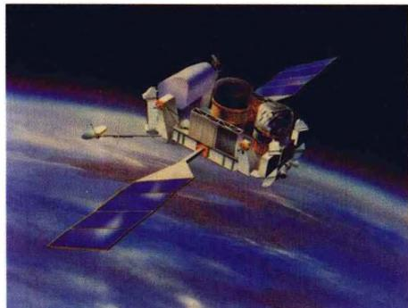
图1.33a 康普顿 $\gamma$ 射线空间天文台CGRO

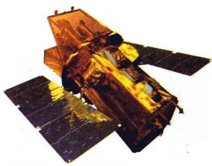
图1.33b 空间 $\gamma$ 射线望远镜SWIFT

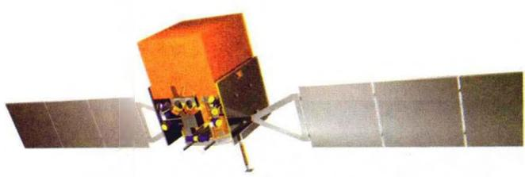
图1.33c 即将发射升空的空间 $\gamma$ 射线望远镜GLAST

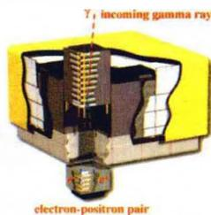
图1.33d GLAST的 $\gamma$ 射线探测装置

#### 1.2.3 空间飞船考察

随着航天科学技术的不断发展进步,现在人们不但可以在地球上和近地空间接收天体的辐射信息,还可以通过发送各类空间飞船,对天体做近距离观测,甚至在天体上着陆拍摄图像乃至采集标本(目前还只限于太阳系内的天体)。人类首次对月球的系列探测是前苏联于1959年至1966年期间进行的,共发射了24个月球探测器,实现了首次拍摄到月球背面照片、探测器月面软着陆、月球车自动行驶月面考察和采集月岩标本等系列任务，获得了大量珍贵的资料。1966年至1972年，美国实施了系列“阿波罗登月计划”，共发射17艘阿波罗飞船，其中阿波罗11～17号为载人登月飞船。除阿波罗13号因技术故障未实现登月外，其余6次共有12名宇航员成功登月（参见图1.34），在月面停留的时间共300小时。其中，1969年7月21日，执行阿波罗11号飞行使命的美国宇航员阿姆斯特朗(N.Armstrong)，在千古荒凉寂寞的月面上留下了人类的第一个足迹(图1.34b)，这成为阿波罗系列登月行动中的最辉煌亮点，在人类探索宇宙的历史上留下了永远的记忆。我国的嫦娥一号探月卫星，承载着中国人几千年的奔月梦想，于2007年10月24日顺利发射升空，并成功进入绕月轨道（图 1.35a），发回了清晰的月面照片（图 1.35b,c）。

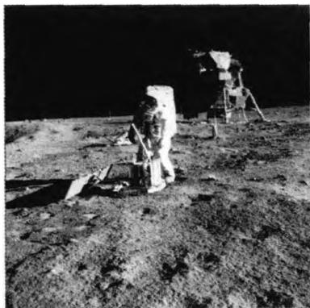
图1.34a 阿波罗11号登月

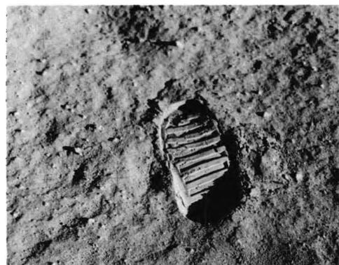
图1.34b 人类在月球上的第一个足迹

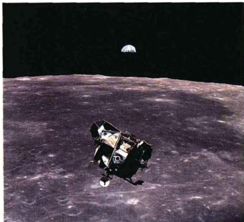
图 1.34c 阿波罗 11 号从月球返回地球

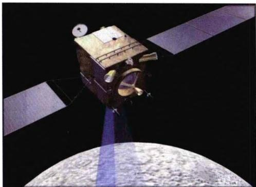
图 1.35a “嫦娥一号”卫星绕月探测

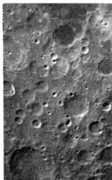
图1.35b “嫦
娥一号"拍摄的

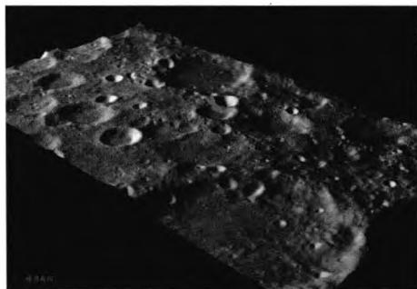
图1.35c “嫦娥一号”得到的
第一幅月球三维立体图像
首张月面照片

对于太阳系行星的探索考察也早在20世纪60年代就开始了。前苏联和美国先后发射了将近30个金星(包括水星)探测器和20多个火星探测器，其中最著名的是美国发射的10次“水手号”系列行星和行星际空间探测器。它们发现了水星表面与月球类似的地貌和物理环境，发现了金星很慢的自转以及大气上空的浓密云团，并测量了金星大气的成分、温度、压力，发现火星上面没有传说中的“运河”而有环形山和巨火山，有河床但没有水和生命存在的迹象，大气层也比预计的稀薄得多。1975年，美国又相继发射了海盗1号和2号探测器，它们在火星表面成功实现了软着陆，并在降落的过程中，测量了火星大气温度、气压的分布情况。降落之后，向地球发回了令人惊叹的周景全彩色图，显示火星上有干涸的河床，有流水冲击的特征,这表明火星过去可能有过大量的水。它们并利用机械臂在火星表面取样且现场进行了生物化学实验,但实验结果没有发现任何有机化合物。

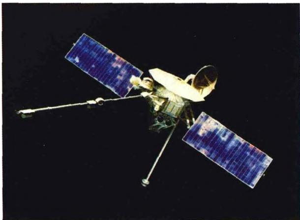
图 1.36a 水手 10 号行星探测器

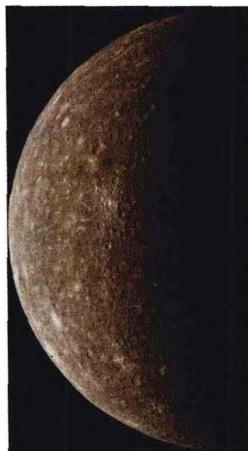
图1.36b 水手
10号拍摄的水星

美国的另一个行星探测器系列是先驱者号，从1958年至1973年共发射11次，前3次没有成功，自1959年发射先驱者4号开始取得成功。其中特别要提到的是1972年3月发射的先驱者10号，于1973年12月在距木星表面14万km处飞掠木星，成为第一个木星探测器，并借助木星的引力场加速至超过第三宇宙速度，于1989年4月越过冥王星轨道，成为第一个冲出太阳系的人造天体。1973年发射的先驱者11号，先后飞掠木星、土星，发回了大量照片，然后也和先驱者10号一样飞出了太阳系。这两艘飞船上都携带着有关太阳系和地球文明的信息（图1.37），期望茫茫太空中的智慧生物能够有一天收到并解读它们。

继先驱者号之后，1977年美国又先后发射了旅行者1号和2号，它们发现木星有光环，木卫一有活跃的硫火山，还新发现了木星的3颗卫星和土星的7颗卫星。对于天王星和海王星的考察也有许多重要发现，例如天王星的磁场轴与它本已偏斜很大的自转轴之间有很大的交角，并新发现了它的10颗卫星及一个光环，还在天卫一上发现了冰海峡。与天王星比较起来，海王星的气候十分活跃，云的形状多种多样。另外又新发现它的6颗卫星，2个光环。在探测完木星、土星、天王星、海王星和冥王星之后，它们也都飞出太阳系。如果没有意外发生，我们将能与它们保持联系，直到2030年。它们各自携带了一套“地球之声”的光盘，上面刻录有115幅照片、60种语言的问候语、35种地球上的各类自然音响和27首音乐等地球文明信息。这些信息中包括中国长城和中国人家宴的照片，以及粤语、厦门话和客家话的问候，还有中国古曲《流水》。这套光盘作为地球的名片，希望有朝一日能被“外星人”收到，并与地球文明建立联系。然而，这两艘飞船分别要在14.7万年和55.5万年之后才能到达太阳系外的另一颗恒星。

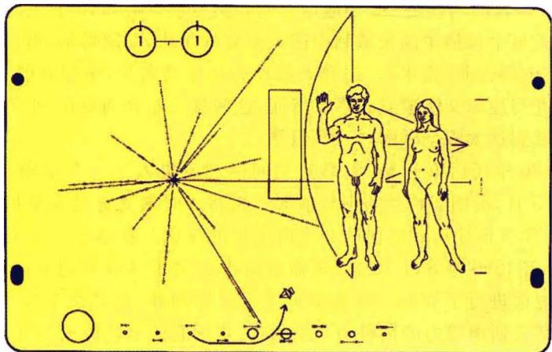
图 1.37a 先驱者号携带的有关地球人的信息之一:6×9 英寸的镀金铝板,上面刻有人类的男女裸像,以及太阳与九大行星位置的示意图,并指明人类就在太阳系的第三颗行星上

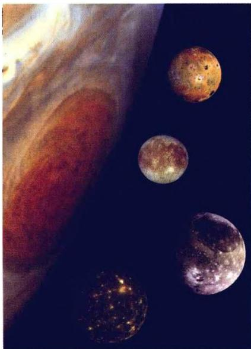
图 1.37b 旅行者号拍摄的木星大红斑以及由伽利略首次发现的四大卫星的照片组合

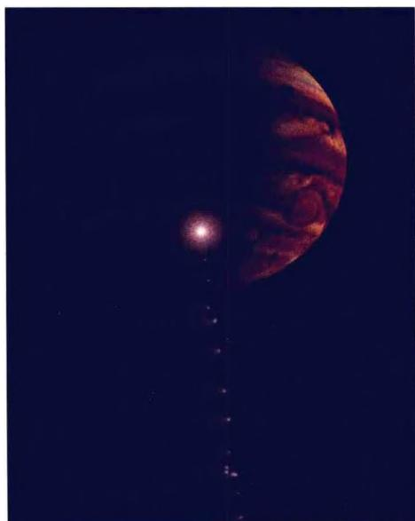
图1.37c 伽利略号拍摄的1994年彗星-木星相撞

20世纪80年代后期开始，人类的空间探测又进入了一个空前活跃的时期。1989年5月5日，美国亚特兰蒂斯号航天飞机将当时最先进的金星探测器麦哲伦号带上太空，并于5月6日把它送上飞向金星的旅途。在经过462天的太空飞行后，麦哲伦号于1990年8月10日，飞临离地球2.54亿km的地方，运用综合孔径雷达对金星表面进行了探测。欧洲的首个金星探测器“金星快车”，于2005年11月9日自哈萨克斯坦境内的拜科努尔发射场，搭乘联盟号运载火箭升空。“金星快车”的研发工作耗时4年，造价3亿欧元。2006年4月11日，“金星快车”完成了减速过程，顺利地进入环绕金星的椭圆形轨道。“金星快车”的主要任务是，对神秘的金星大气层进行更精确的探测，分析其化学成分。此外，探测器还将就太阳风对金星大气和磁场的影响进行分析，并观测金星气候变化。观测结果表明，金星没有表面水源，大气层中聚集了浓厚有毒的二氧化碳，大气压力是地球海平面的90多倍。金星表面的最高气温达摄氏477度，是太阳系中最热的行星。

对外行星的探测也是高潮迭起。1989年10月18日，亚特兰蒂斯号航天飞机把伽利略号木星探测器送入飞往木星的轨道。伽利略号是NASA研制的第一艘核动力宇宙飞船，造价15亿美元，发射后飞越金星一次、地球两次，借两行星的引力得到加速。它历时6年，驰骋40亿km，于1995年7月飞抵木星，然后向木星投放了一只大气探测器，获得了有关木星大气的结构、化学组成、雷电和云层等观测数据。伽利略号本身则进入环绕木星飞行的轨道，对木星及其卫星做进一步考察。1996年它发现了覆盖木卫三表面的冰层和冰盖下的环形山，以及冰盖下可能存在厚厚的液态氧，随后又发现了木卫二表面也覆盖着冰层，但冰层上面可能存在液态水和浮冰，冰盖下面则是大量的液态水，水下隐藏着海底火山不断提供热量。1999年它又拍到木卫一上正在喷发的火山照片，并对木星上的大红斑进行了近距离的拍摄。伽利略号还在飞往木星途中，拍摄了一部地球在太空中运转的电影，并在1994年拍下苏梅克-列维彗星碎片撞进木星大气层的珍贵照片（图1.37c）。2003年9月21日，伽利略号结束了其长达14年的探测使命。随着探测器逐渐失去功效，NASA决定将它撞入木星，以避免其上的核物质对木星卫星上的潜在生命造成威胁。

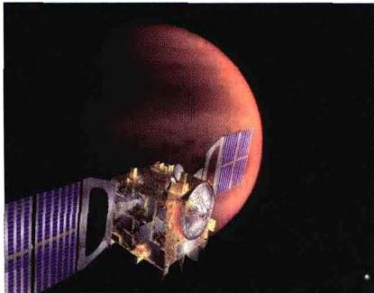
图 1.38a “金星快车”
进入环绕金星轨道

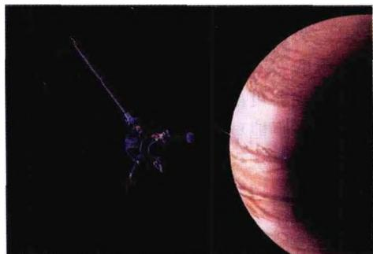
图 1.38b 伽利略号考察木星

对土星的探测是由“卡西尼-惠更斯”计划实现的。这个计划由NASA和ESA以及意大利航天局合作，卡西尼土星探测飞船由NASA负责建造，以意大利出生的法国天文学家卡西尼(J. Cassini)的名字命名；卡西尼携带的惠更斯探测器以荷兰物理学家、天文学家和数学家惠更斯的名字命名，由法国阿尔卡特空间公司负责制造。1997年10月15日，这一20世纪最大的行星探测器从肯尼迪航天中心发射升空，开始了漫长的32亿km的土星探测之旅。2004年7月1日，在太空旅行了7年后，卡西尼号进入土星轨道，正式开始其为期4年的土星探测使命，对土星及其大气、光环、卫星和磁场进行深入考察。2004年12月25日凌晨，惠更斯探测器脱离位于环土星轨道的卡西尼号飞船，飞向土星最大的一颗卫星土卫六，并于2005年1月14日，抵达土卫六上空1270km的目标位置，同时开启自身的降落程序，穿越土卫六的大气层，成功登陆土卫六。土卫六是太阳系中的第二大卫星，直径5120km，仅次于木卫三，有厚厚的大气层，表面的物理条件与原始地球极其类似。

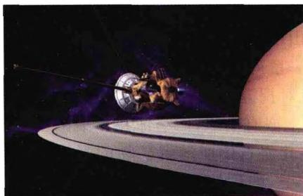
图1.39a 卡西尼号到达土星

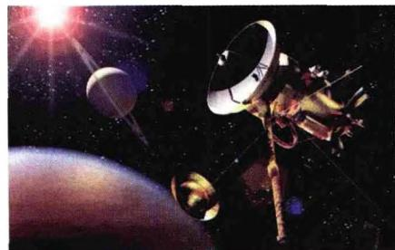
图 1.39b “惠更斯”从卡西
尼号上释放，向土卫六降落

以前人们曾猜测，土卫六的表面可能到处是液态烃形成的湖。但在“惠更斯”发回的土卫六彩色照片中，星球表面就像海绵一样多孔而富有弹性，处于最上面的，是一层薄薄的岩石外壳。此外，科学家还从照片中物体的底部发现了侵蚀的痕迹，这表明它们此前可能遭到过河流的冲刷。

火星是距地球最近的行星，这个红色星球曾让人类产生过无数幻想，移民火星的希望之火也从来没有熄灭。40多年来，前苏联、美国、欧洲和日本共计划了30多次火星探测，其中三分之二以失败告终，但研究一直没有排除火星上有生命存在的可能性。从1996年开始，NASA开始执行新一轮火星探测10年计划。其中最令全球电视观众难忘的是，1996年12月发射的“火星探路者”，1997年7月进入火星大气层并借助降落伞降落在火星表面的壮观过程。它成功地释放了火星车，使其在火星表面行走并采集火星表面的岩石和土壤样品，现场进行化学分析然后把信息发回到地球。火星车发回的分析数据表明，火星的岩石和地球的岩石一样，都是氧化硅化合物。同时，它还发现火星表面明显地存在着许多被洪水冲刷过的河床痕迹，这说明火星历史上曾有过大量的氧气和液态水。

特别值得一提的是2003年，这一年可以说是火星年。6月11日和7月8日，NASA连续发射了“勇气号”和“机遇号”火星车（图1.40a），6月3日欧洲发射了“火星快车”（图1.41a），加上仍在火星轨道上工作的美国火星环球勘测者号和奥德赛号探测器，形成了5个探测器共探火星的壮举。这些探测器的主要任务是，研究火星地质历史、调查水在火星上的作用、判断火星过去的环境是否适合生命生存。

经过近7个月的旅行，“勇气号”和“机遇号”于2004年1月先后到达火星。“勇气号”的着陆地点“古谢夫环形山”曾发现过干涸河床存在的迹象。“机遇号”降落在“梅里迪亚尼平面”，据探测此地存在氧化铁，这种矿物通常在有液态水的环境下生成。这两个着陆区域相距约9600 km，分别位于火星的相反两侧。着陆以后，“勇气号”火星车在名为“哥伦比亚”的火星山区发现了火星上曾经有水的新证据。它在一块被称为“克洛维斯”的岩石上做了一系列实验，发现该岩石上有曾被大量水深深磨蚀的印记。“机遇号”着陆后，重点对裸露的火星岩床及其上面的岩石进行探测。在它拍到的照片上，发现许多岩石上嵌有小球，而小球并非集中在特定岩层中，这显示它们有可能是被水浸泡过的多孔岩石中所溶解矿物的凝结产物。这表明，该着陆区域表面过去曾被液态水浸透，这个区域看来曾有过适合生命居住的良好环境。这两台火星车还利用携带的显微成像仪、阿尔法粒子X射线分光计以及穆斯堡尔分光计，对一些岩石进行了精密的物理化学分析，分析结果均表明这些区域历史上曾覆盖过大量富含矿物质的液态水。

为了进一步研究火星表面液态水的历史状况，2007年8月4日，NASA又发射了“凤凰号”火星探测器(图1.40b)，它飞行6.8亿km，于2008年5月25日在火星北极附近成功实现软着陆，开始了在北部平原上长达三个月的探测活动。这是在“海盗号”探测任务之后时隔30年，机器人首次在火星表面以下取样。不同于“机遇号”及“勇气号”用滚轮移动，“凤凰号”用三条腿支撑，机械臂长20英尺，一铲就能在火星上挖出20英寸深的沟。它的任务是：采集冻土和冰块进行分析，寻找火星远古时期存在液态水的证据；对火星土壤样本进行化学分析以研究其物质构成。

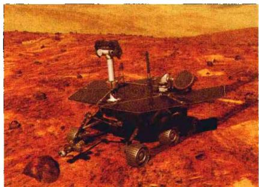
图 1.40a “勇气号”在火星上考察

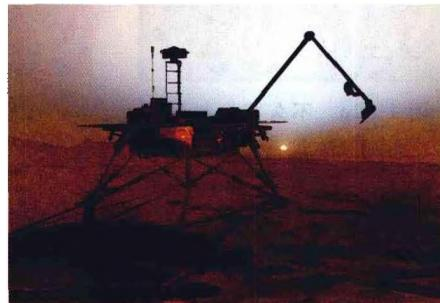
图 1.40b “凤凰号”在
火星上降落后的想象图

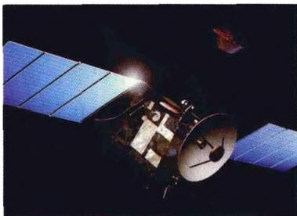
图 1.41a 欧洲发射的“火星快车”

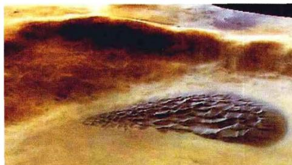
图 1.41b “火星快车”发回的高清晰“火星泪”图像。实际是一个远古时期留下的陨石坑内部，一堆由火山灰形成的深色玄武岩沙丘

除美国外，俄罗斯和日本也都制定了新的火星探测计划。俄不久前拟定了火星登陆方案，将与美国、欧洲、日本和加拿大的航天部门合作，于2015年左右向火星发射载人飞船和货运飞船，对火星进行实地考察。可以预计，在未来的20年内，人类登上火星的多年愿望将会最终实现。

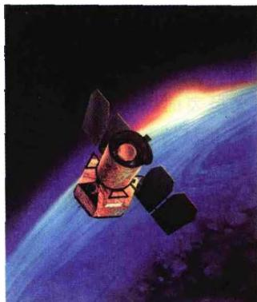

图 1.42b 正在研制的 SIM 行星探索者 (SIM Planet Quest)，将对太阳系外的类地行星及生命进行考察

图 1.42a 不久将发射升空的星系演化望远镜 GALEX, 是一台大视场 (1.2°) 紫外星系巡天空间望远镜, 可以对几百个星系同时做仔细观测

图 1.43 2005 年 10 月 12 日, 我国神州 6 号发射升空

在空间探测方面，我国已经成功地于2003年和2005年分别发射了神州5号和神州6号飞船，实现了中华民族遨游太空的千年梦想。在“十一五”期间，“神州”系列还将继续发射，并完成宇航员太空行走等一系列预定任务。此外，“嫦娥”探月系列工程以及进行太阳同步观测的“夸父”工程也都在

紧张有序地实施之中。继“嫦娥一号”之后，中国又把科学探测的目光瞄向了火星。中国自行研制的火星探测器将搭乘俄罗斯火箭，于2009年月10月飞向太空，并与俄探测器一起完成对火星环境的探测任务。总之，中华民族向着探索宇宙的宏伟目标，正在一步一步坚实地向前迈进。不久的将来，中国人将登上月球、深入太空，遨游更加广阔的宇宙世界。
