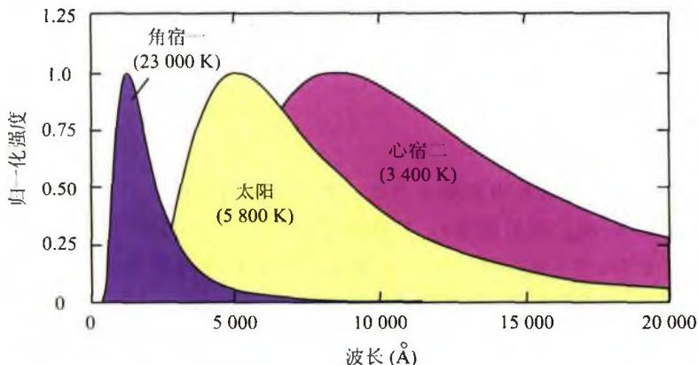
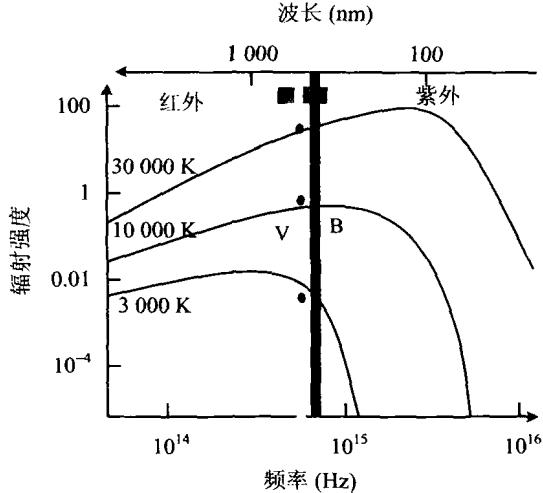
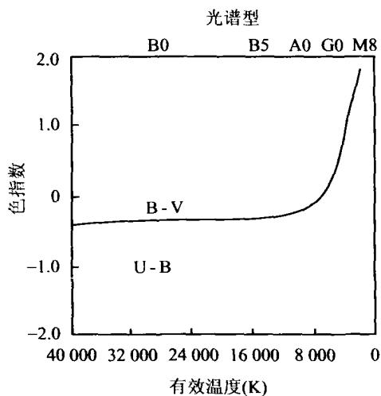

### 2.2 温度

#### 2.2.1 色指数与色温度

我们不可能像在实验室里那样去直接测量恒星或其他天体的温度，而只能通过间接的办法进行。上面已经提到，恒星在不同波长处的亮度是不同的。这其中的原因是，恒星发出的电磁辐射可以近似看成是黑体辐射，而黑体辐射有一个随波长而变的强度分布，即普朗克分布。同时，根据黑体辐射的维恩(W. Wien)位移定律，黑体辐射能量分布曲线最大值对应的波长 $\lambda_{max}$ 与黑体温度 T 之间的关系为

$$
\lambda_ {\max} = \frac {b}{T}\tag{2.7}
$$

其中 $b$ 是维恩位移常量， $b = 2.898 \times 10^{-3} \mathrm{~m} \cdot \mathrm{K}$ 。显然温度越高， $\lambda_{\max}$ 越向短波方向移动（参见图2.1）。也就是说，表面温度高的恒星，其辐射能量主要位于短波区；表面温度低的恒星，其辐射能量主要位于长波区。因此恒星的颜色能告诉我们恒星表面的温度。

图 2.1 不同温度的黑体辐射谱

为了测出 $\lambda_{\mathrm{max}}$ ，可以用一系列波长不同但波长间隔很小的滤光片去逐个测试。但这样做的效率很低也没有必要。天文学家有一个简单快捷的办法，只需通过两三次测量就可以得出温度，这就是利用色指数。同一颗星在不同波段的测光星等之差称为色指数。常用的色指数定义为恒星的照相星等和目视星等（或仿视星等）之差，用 $C$ 来表示， $C = m_{\mathrm{p}} - m_{\mathrm{v}}$ 或 $C = m_{\mathrm{p}} - m_{\mathrm{pv}}$ 。由于人眼对黄绿光敏感，而照相底片对蓝紫光敏感，故蓝色星在照相底片上比目视要亮一些，而红色星在照相底片上比目视要暗一些。因此，蓝色星的色指数为负值而红色星的色指数为正值。研究表明，恒星的表面温度与色指数 $C$ 之间的近似关系为：

$$
T = \frac {7 2 0 0}{C + 0 . 6 4} \mathrm{K}\tag{2.8}
$$

这样定义的恒星表面温度称为色温度。由此可见，色指数越负，恒星的表面温度就越高；反之，色指数越正，恒星的表面温度就越低。

除了上述由两色测光定义的色指数外，还常采用在几个不同波段上测量星光强度的多色测光系统。现在已经有一套标准滤光片来测量不同波长处的恒星亮度，以代替照相底片和目视测量。这套滤光片包括 $U$ （紫外）、 $B$ （蓝）、 $V$ （可见光中心）、 $R$ （红）以及 $I$ （红外）等颜色，其相应的波长及滤色宽度见表2.1。对同一颗恒

表 2.1 多色测光系统的滤光片参数

| 滤光片 | 峰值波长(nm) | 滤波宽度(nm) |
|---|---|---|
| U | 350 | 70 |
| B | 435 | 100 |
| V | 555 | 80 |
| R | 680 | 150 |
| I | 800 | 150 |

星，不同的滤光片给出各自的星等，因而可以构成 $UBV$ 三色测光系统以及更多色的测光系统。在 $UBV$ 三色测光系统的情况下，色指数直接写为 $B - V$ 或 $U - B$ 。此时色温度的形式与(2.8)式有所不同，例如用 $B - V$ 表示时有

$$
T = \frac {7 0 9 0}{(B - V) + 0 . 7 1} \mathrm{K}\tag{2.9}
$$

而对于表面温度在 $4\ 000\ K \sim 10\ 000\ K$ 的恒星, 更好的近似关系为

$$
T = \frac {8 5 4 0}{(B - V) + 0 . 8 6 5} \mathrm{K}\tag{2.10}
$$

图2.2表示不同温度的黑体辐射相应的 $B, V$ 星等的比较。图2.3给出色指数与色温度之间的对应关系。

图 2.2 不同温度的黑体辐射

相应的 $B, V$ 星等比较

图 2.3 恒星的色指数 B-V 和
U-B与色温度的关系

还需要指出,除了地球大气消光以外,星际红化和星际消光也可以影响到观测的恒星颜色和星等。星际红化是指,星际空间存在大量的气体和尘埃,它们对短波光线的散射很强烈,因而使恒星的颜色显得偏红;星际消光是指,这些气体和尘埃还会吸收或屏蔽光线,使得星光变暗。故在实际观测中,也要做星际红化和星际消光方面相应的改正。

#### 2.2.2 有效温度

除了用色指数定义的色温度外，通常还把与恒星的光度 L 相同的绝对黑体的温度，定义为恒星的有效温度 $T_{e}$ ，即

$$
L = 4 \pi R ^ {2} \sigma T _ {e} ^ {4} \Rightarrow T _ {e} = \left(\frac {L}{4 \pi R ^ {2} \sigma}\right) ^ {1 / 4}\tag{2.11}
$$

其中 R 为恒星的半径， $\sigma$ 为斯特藩-玻尔兹曼常量。显然，有效温度也就是辐射功率与恒星相同的等效黑体的温度。

