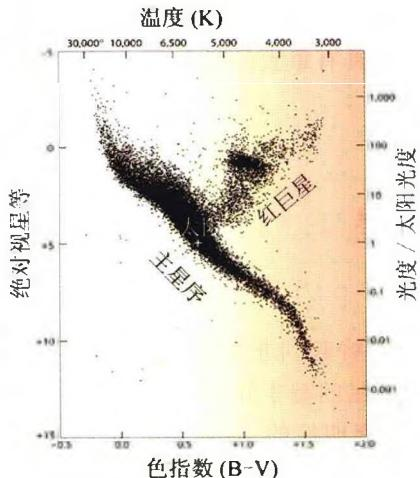
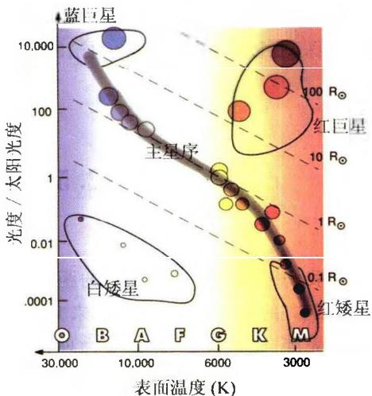

### 2.4 赫罗图

1905年丹麦天文学家赫茨普龙(E. Hertzsprung)发现，K和M光谱型的恒星中，有一些星的光度很低，比太阳要暗很多；而另一些星的光度非常高，是太阳的几百倍甚至上千倍。他于是把前者称为“矮星”，后者称为“巨星”。1911年他测定了几个银河星团(如昴星团、毕星团)中的恒星的光度和颜色，并将这两者分别作为纵坐标和横坐标，把这些恒星标在图中。结果表明，这些星大都落在一条连续带上，其余的星(巨星)则形成小群。1913年美国天文学家罗素(H. Russell)研究了恒星的光度和光谱，也画出一张表明恒星光度和光谱型之间的关系图。经过对比，发现颜色等价于光谱型或表面温度。实际上，他们两个人得到的图所表示的，都是恒星的光度与光谱型之间存在着相关性。因此，后来将这类光度-光谱型图称为赫茨普龙-罗素图，简称赫罗图(Hertzsprung-Russell Diagram)或HR图(图2.7)。图中横轴表示光谱型(或温度、或色指数)，纵轴表示光度(或绝对星等)。

图 2.7a 画出的是一张 4 万多颗近距离恒星的赫罗图。这些恒星由依巴谷天文卫星精确测量了距离，从而得到了准确的绝对星等。从图中可见，有 3 个明显的恒星聚集区：

主星序：从左上到右下的一个狭窄的带称为主星序。主星序的意义是，温度相同的恒星，大多数光度（以及大小）也基本相同，它们构成了主星序。我们观测到的 $90\%$ 以上的恒星都位于主星序上，称为主序星。太阳也是一颗普通的主序星。后面我们将会看到，主序星阶段是恒星一生中最稳定的阶段，恒星在这个阶段停留的时间占到整个寿命的90%以上。

巨星和红超巨星:位于赫罗图右上方的是红巨星和红超巨星。它们的半径比太阳大几十倍到几百倍。肉眼可见的大角星(牧夫座 $\alpha$ 星)、毕宿五(金牛座 $\alpha$ 星)是红巨星,参宿四(猎户座 $\alpha$ 星)和心宿二(天蝎座 $\alpha$ 星)是红超巨星。它们都是银河系中体积巨大的恒星。例如,如果把参宿四放在太阳的位置上,则地球和火星的轨道都将被它所吞没。红巨星和红超巨星都是恒星演化到离开主星序后形成的。

白矮星: 白矮星位于赫罗图的左下方, 它们的体积很小, 半径仅为太阳的 1/40～1/100。天狼星伴星就是一颗典型的白矮星, 它的体积只有太阳的四千万分之一, 比地球还要小。白矮星是超新星爆发的产物, 是一部分恒星演化的最终归宿。

图 2.7a 由依巴谷卫星测定了三角视差的 4 万多颗近距离恒星的赫罗图。纵坐标分别用绝对星等及光度表示，横坐标分别用色指数和温度表示

图 2.7b 赫罗图中的等半径线, 注意横坐标同时用温度和光谱型表示

图 2.7b 所示的赫罗图上，一组平行的虚线表示恒星等半径线。从物理上很容易对此加以解释。由于恒星的光度 L、表面有效温度 $T_{e}$ 以及半径 R 之间满足

$$
L = 4 \pi R ^ {2} \sigma T _ {e} ^ {4}\tag{2.18}
$$

其中 $\sigma$ 为斯特藩-玻尔兹曼常量, 对太阳有

$$
L _ {\odot} = 4 \pi R _ {\odot} ^ {2} \sigma T _ {e \odot} ^ {4}\tag{2.19}
$$

上面两式相除,可得

$$
\lg \frac {L}{L _ {\odot}} = 2 \lg \frac {R}{R _ {\odot}} + 4 \lg \frac {T _ {e}}{T _ {e \odot}}\tag{2.20}
$$

利用(2.5)式,并代入太阳的有关数据,最后得到

$$
\lg \frac {R}{R _ {\odot}} = 8. 4 9 - 0. 2 M - 2 \lg T _ {e}\tag{2.21}
$$

其中 $M$ 为恒星的绝对星等。这样，以绝对星等为纵坐标，以 $\lg T_{e}$ 为横坐标的赫罗图上，恒星的等半径线是一组平行线。因而，如果知道一颗星在赫罗图上的位置，就知道了它的半径。同时(2.21)也表明，温度相同的情况下，光度越大亦即绝对星等越小的恒星，其半径也越大。联系到前面关于巨星和矮星的说法，我们也可以说，巨星的光度大、体积大，而矮星的光度小、体积小。

赫罗图的建立是现代天文学发展史上的里程碑之一。恒星的表面温度和光度这两个参量，就可以反映出恒星的基本物理特征。因而，赫罗图为恒星物理的研究提供了深刻启示，对恒星演化理论的形成和发展也具有重大的意义。

