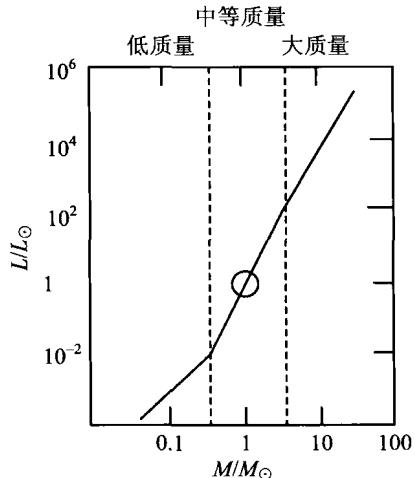
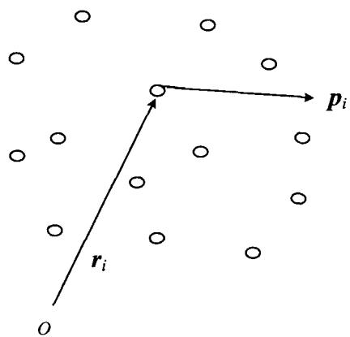

### 2.7 恒星质量的测定

#### 2.7.1 双星系统

单个恒星的质量是无法用动力学方法直接得到的，只有双星系统才有可能根据轨道运动求出质量。从牛顿力学我们知道，如果双星的质量分别是 $M_{1}$ 和 $M_{2}$ ，两星之间的距离是 r，公转周期是 T，则由开普勒第三定律有

$$
\frac {r ^ {3}}{T ^ {2}} = \frac {G}{4 \pi^ {2}} (M _ {1} + M _ {2})
$$

T, r 通过观测得到后, 就知道了两星的质量之和; 再根据下面要谈到的质光关系, 由两颗星的光度比可以得到它们的质量比, 这样就最后求出两颗星各自的质量。表 2.5 列出了典型的主序星的质量。

#### 2.7.2 质光关系

(2.30)

由恒星结构理论(见3.3节)得知,一个主序星一旦质量确定,那么它的半径和温度也就确定了,并因此也确定了光度。光度对于质量的倚赖

表 2.5 光谱型与典型质量

| 光谱型 | $M/M_{\odot}$ |
|---|---|
| O5 | 40 |
| B5 | 7.1 |
| A5 | 2.2 |
| F5 | 1.4 |
| G5 | 0.9 |
| K5 | 0.7 |
| M5 | 0.2 |

关系称为质光关系，从恒星理论得到的质光关系如图2.20。除物理性质特殊的巨星、白矮星和某些致密天体外，占恒星总数 $90\%$ 的主序星都符合这一质光关系。它可以近似地表示为，光度是质量的幂函数：

$$
L / L _ {\odot} \propto (M / M _ {\odot}) ^ {\alpha}\tag{2.31}
$$

但单一的 $\alpha$ 值并不适用于主星序的整个质量范围。研究表明， $\alpha$ 的近似值为

$$
\begin{array}{l l} {\alpha = 1. 8 \qquad \text {对于} M <   0. 3 M _ {\odot}} & {\mathrm{(低质量)}} \\ {\alpha = 4. 0 \qquad \text {对于} 0. 3 M _ {\odot} <   M <   3 M _ {\odot}} & {\mathrm{(中等质量)}} \\ {\alpha = 2. 8 \qquad \text {对于} M > 3 M _ {\odot}} & {\mathrm{(大质量)}} \end{array}\tag{2.32}
$$

图2.20 主序星的质光关系

#### 2.7.3 位力定理

对于一个由大量恒星组成的球状星团或椭圆星系，我们可以由该系统动力学平衡时的特征对其整体质量做出估计。这一方法根据的是位力定理。如图2.21所示， $n$ 个粒子组成一个宏观稳定的动力学体系（例如星团、星系或星系团）。设第 $i$ 个粒子的位置矢量为 $\pmb{r}_i$ ，动量为 $\pmb{p}_i$ ，则有（为简单起见，我们设所有的粒子质量均为 $m$ ）

$$
\boldsymbol {p} _ {i} = m \frac {\mathrm{d} \boldsymbol {r} _ {i}}{\mathrm{d} t}, \boldsymbol {F} _ {i} = \frac {\mathrm{d} \boldsymbol {p} _ {i}}{\mathrm{d} t}\tag{2.33}
$$

其中 $F_{i}$ 为第 i 个粒子所受到的其他所有粒

子的合力。不难看出，下列等式成立

$$
\begin{array}{r l} \frac {\mathrm{d}}{\mathrm{d} t} \sum_ {i} \boldsymbol {p} _ {i} \cdot \boldsymbol {r} _ {i} & = \sum_ {i} \boldsymbol {p} _ {i} \cdot \frac {\mathrm{d} \boldsymbol {r} _ {i}}{\mathrm{d} t} + \sum_ {i} \frac {\mathrm{d} \boldsymbol {p} _ {i}}{\mathrm{d} t} \cdot \boldsymbol {r} _ {i} \\ & = 2 \times \frac {1}{2} \sum_ {i} \frac {\boldsymbol {p} _ {i} ^ {2}}{m} + \sum_ {i} \boldsymbol {F} _ {i} \cdot \boldsymbol {r} _ {i} = 2 T + \sum_ {i} \boldsymbol {F} _ {i} \cdot \boldsymbol {r} _ {i} \end{array}\tag{2.34}
$$

图2.21 位力定理的证明： $n$ 个粒子组成的束缚系统

式中 $T \equiv \sum_{i} p_{i}^{2} / 2m$ 为整个系统的动能。取上式对时间尺度 $\tau$ 的平均，有

$$
\frac {1}{\tau} \int_ {0} ^ {\tau} \frac {\mathrm{d}}{\mathrm{d} t} \sum_ {i} \boldsymbol {p} _ {i} \cdot \boldsymbol {r} _ {i} \mathrm{d} t = \left\langle 2 T + \sum_ {i} \boldsymbol {F} _ {i} \cdot \boldsymbol {r} _ {i} \right\rangle\tag{2.35}
$$

对于一个束缚系统，每个成员的 $r_i, p_i$ 的大小都是有限的，故 $\sum_{i} p_i \cdot r_i$ 对时间求导后再积分也是有限的，因而当 $\tau \to \infty$ 时，(2.35)式的左边趋于零，这意味着它的右边也必定趋于零，即时间平均值

$$
\left\langle 2 T + \sum_ {i} \boldsymbol {F} _ {i} \cdot \boldsymbol {r} _ {i} \right\rangle = 0\tag{2.36}
$$

设此系统是一个保守力系统,则力 F 与势

能函数 $V(\pmb{r})$ 之间的普遍关系给出

$$
\pmb {F} _ {i} = - \nabla V (\pmb {r} _ {i})\tag{2.37}
$$

如果 $V(r)\propto r^n$ ，就有

$$
\sum_ {i} \nabla V (\boldsymbol {r} _ {i}) \cdot \boldsymbol {r} _ {i} = \sum_ {i} \frac {\partial V (\boldsymbol {r} _ {i})}{\partial \boldsymbol {r} _ {i}} \cdot \boldsymbol {r} _ {i} = n \sum_ {i} V (\boldsymbol {r} _ {i}) = n V\tag{2.38}
$$

式中 V 为系统总的势能。因此，(2.36)变为

$$
\langle 2 T - n V \rangle = 0 \Rightarrow 2 \langle T \rangle - n \langle V \rangle = 0\tag{2.39}
$$

在引力势的情况下 $n = -1$ ，故最终得到

$$
2 \langle T \rangle + \langle V \rangle = 0\tag{2.40}
$$

这就是引力束缚系统位力定理的普遍形式。假设在我们所考虑的系统中，每个成员的方均速度都一样，则单个成员的平均动能可以写成 $\langle T_i\rangle = m\langle v^2\rangle /2$ ；再设整个系统的几何形状近似于球形，这样位力定理(2.40)就可以具体写为

$$
M \langle v ^ {2} \rangle - \frac {3}{5} \frac {G M ^ {2}}{R} = 0\tag{2.41}
$$

其中 M 为体系(星团或星系)的总质量，R 为它的平均几何尺度。显然，这样得出

的质量是动力学质量,它的大小为

$$
M \sim \frac {5}{3} \frac {R \langle v ^ {2} \rangle}{G}\tag{2.42}
$$

位力定理广泛应用于各类自引力束缚系统，甚至包括由大量星系组成的星系团。在实际应用中， $\langle v^2 \rangle$ 可以根据恒星谱线的多普勒频移求出。当然，由多普勒频移求出的只是视线方向的速度，但如果设恒星的速度分布是大体各向同性的，则 $\langle v^2 \rangle$ 可以取为视线方向方均速度的3倍。

