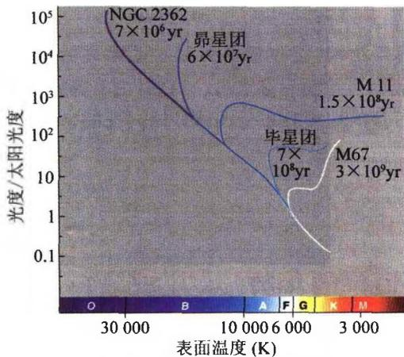

### 2.8 恒星的年龄

恒星年龄的确定是进一步估计星系以及宇宙年龄的基础。我们将在下一章中看到，恒星的一生主要是在主序星阶段度过的。但不同质量的恒星，在主星序阶段停留的时间长短也不同，质量越大的恒星，其寿命也越短。这一点定性地不难理解，因为恒星的总能量 $E \propto M$ （爱因斯坦质能关系），但恒星的光度即能量损失率为 $L \propto M^{\alpha}$ （质光关系），且 $\alpha > 1$ ，这样恒星的寿命 $\tau$ 大致为

$$
\tau \sim \frac {E}{L} \propto M ^ {1 - a} = \frac {1}{M ^ {a - 1}}\tag{2.43}
$$

故恒星质量越大，演化越快，寿命越短。例如取 $\alpha = 4, \tau \propto 1 / M^3$ ，因而当 $M = 10M_{\odot}$ 时有 $\tau \sim 10^{-3}\tau_{\odot} \sim 10^{7}$ 年。

实际上，不是全部的恒星质量都转化为辐射能。主星序阶段主要发生的是，核心区域的氢聚变为氦。一旦核心部分的氢燃烧完，恒星便离开主星序。核心部分可能最后演变为白矮星、中子星或黑洞。我们将在下一章中具体介绍这些过程。详细的理论计算给出的恒星寿命大致为

$$
\tau = \left\{ \begin{array}{l l} 1 0 ^ {1 0} \left(\frac {L _ {\odot}}{L}\right) ^ {2 / 3} & \text {年} (L <   L _ {\odot}) \\ 1 0 ^ {1 0} \left(\frac {L _ {\odot}}{L}\right) ^ {3 / 4} & \text {年} (L > L _ {\odot}) \end{array} \right.\tag{2.44}
$$

再来讨论一下星团年龄的测定。一个星团中包含成千上万甚至百万颗恒星，可以把它们的光度和光谱型画在一张赫罗图上，称为星团赫罗图。星团中的恒星可以看成是同时形成的，但它们的质量不同，故演化的快慢也不同。此外，这些恒星可以看成具有相同的化学组成(因为由同一星云所形成)。由于质量大的恒星演

图2.22 星团赫罗图上的转向
点，该星团的年龄标注在曲线上

化得快，故先离开主星序，因此在星团赫罗图上就出现主序转向点（如图2.22所示）。显然，星团越年轻，主序转向点越靠主序上方。反之，星团越老，主序转向点越下降。这样，星团赫罗图上转向点位置的高低就直接显示出星团年龄的大小。实际研究中，首先是根据恒星演化理论计算出不同年龄、不同化学成分的各种星团的赫罗图，然后，再把观测到的星团赫罗图与理论赫罗图相比较，就可以得出星团的年龄。但应强调，所得的结果是与恒星演化的

理论模型有关的。目前，宇宙中最古老的球状星团的年龄一般认为是 $t_{\mathrm{GC}} \approx 13 - 17$ Gyr(1 Gyr = 10 $^{9}$ 年 = 10 亿年)，这就给出宇宙年龄的下限。

小结 至此,我们已经讨论了有关恒星的各种基本物理量的测量方法,其中有些方法(例如用位力定理求质量)不仅适用于恒星,还适用于更大尺度的天体结构(例如星系和星系团)。从以上讨论中我们看到,恒星的基本物理参数可以在一个很大范围内变化,通常跨越许多量级,如表2.6所示。但我们注意到,在所有这些物理量中,只有质量的变化范围不是很大,只跨越三个量级。如我们将在下一章中看到的,恒星的质量决定了恒星演化的进程,也决定了恒星的其他物理特征。同时,只有在表2.6所列的质量范围内才能够形成恒星,主要原因是,如质量太小,则核反应无法开始,也就形成不了恒星;而如质量过大,则恒星寿命太短,几乎还没有形成稳定的星体结构,恒星就坍缩了。

表 2.6 恒星主要物理参数的范围

| 物理量 | 变化范围 | 跨越数量级 |
|---|---|---|
| 光度( $L_{\odot}$ ) | $10^{-4} \sim 10^{6}$ | 10 |
| 半径( $R_{\odot}$ ) | $10^{-3} \sim 10^{3}$ | 6 |
| 质量( $M_{\odot}$ ) | $10^{-1} \sim 10^{2}$ | 3 |
| 密度( $g/cm^{3}$ ) | $10^{-9}$ (红超巨星) $\sim 10^{16}$ (白矮星) | 25 |
