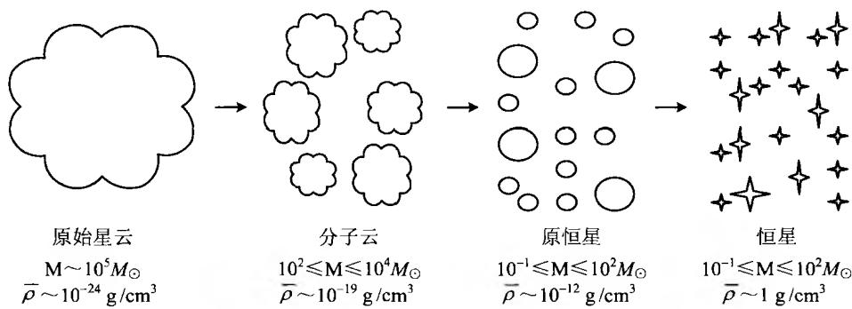
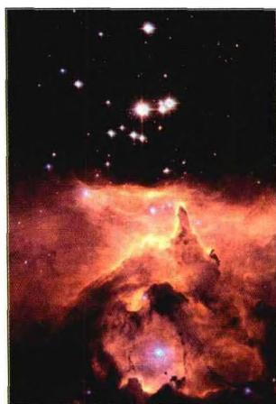
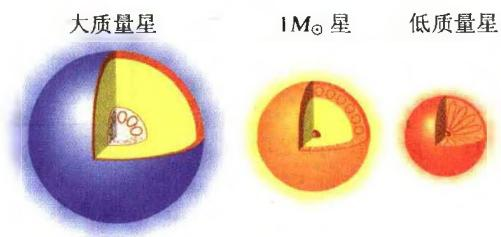
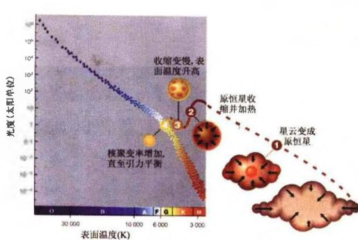
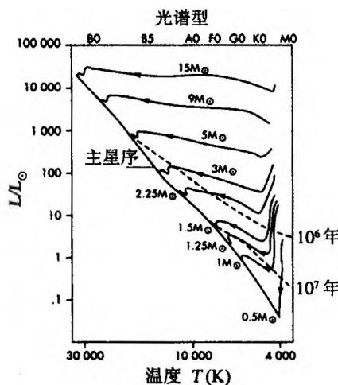

## 第 3 章 恒星的形成与演化

人们很早就已经猜想到，恒星是由星际物质凝聚而形成的。但是对于恒星的能源和演化过程，却长期没有一致的看法。这一问题曾与有关地球年龄的争论紧密联系。三百多年前，社会的主流看法还认为地球的年龄仅为数千年，其中最重要的观点当然是基于神学。例如基督教的厄谢尔(Ussher)主教于1654年提出，将圣经创始者的年龄和有纪录的历史年代加到一起，就可以算出地球是在公元前4004年形成的。但在18世纪，地质学家詹姆斯·赫顿(James Hutton)就指出，高山和丘陵要经过非常长的时间才能经风和水的侵蚀而形成，几千年的时间根本不够。达尔文于1859年出版《物种起源》一书，提出自然选择的生物进化已持续了非常久远的时间，他据此估计地球已存在了三亿年。直到20世纪初叶，人们根据放射性同位素方法，才测定出地球上最古老的岩石年龄大约有46亿年。这当然表明太阳也具有大致相同的年龄。

再回到太阳的能源问题。在认识到核反应之前，人们曾做过许多猜测，但都遇到很大困难。例如，如果假设太阳上面全是煤炭，则按照太阳的光度（辐射功率）计算，全部太阳质量只要5000年就会燃烧殆尽。如果太阳的能源来自流星的撞击，则每年必需要有大约1/100地球质量的流星物质落到太阳上。但这样会使太阳的质量不断增加，从而造成地球（和其他行星）轨道周期的变化，地球上“一年”的长度在几千年内就会发生显著的改变。这是与观测相矛盾的。19世纪亥姆霍兹（H. Helmholtz, 1854）和开尔文（Kelvin，即W. Thomson, 1861）曾分别提出收缩说，他们认为恒星依靠收缩释放引力能而辐射能量。到了20世纪初，人们了解到恒星分为巨星和矮星，收缩说于是更具体地认为，恒星演化的路径是：星云 $\rightarrow$ 红巨星 $\rightarrow$ 蓝白主序星 $\rightarrow$ 沿主星序演化 $\rightarrow$ 白矮星。但只要大致估算一下收缩所能够释放的能量，就不难发现这一学说也是无能为力的。设整个恒星的内能为 $U$ ，恒星的光度为 $L$ 。由上一章讨论过的位力定理， $U$ 和自引力能 $|V| \simeq GM^2 / R$ 是同量级的，所以恒星以光度 $L$ 辐射能量所能持续的时间 $\tau_k$ （称为开尔文时标）为

$$
\tau_ {k} = \frac {U}{L} \simeq \frac {| V |}{L} \simeq 3 \times 1 0 ^ {7} \left(\frac {M}{M _ {\odot}}\right) ^ {2} \left(\frac {R}{R _ {\odot}}\right) ^ {- 1} \left(\frac {L}{L _ {\odot}}\right) ^ {- 1} \mathrm{年}\tag{3.1}
$$

这一时间对太阳而言大约是 $3 \times 10^{7}$ 年。这样，如果太阳仅靠引力能释放（收缩）而提供辐射能量，则只能维持3000万年，这显然与放射性年代学测出的地球年龄不符，甚至要短于恐龙曾经统治地球的时间长度（约2亿年）。

20世纪20年代初，佩林(J.Perrin)和爱丁顿(S.Eddington)提出，恒星的能源可能是氢聚变为氦的热核反应，但他们没有给出具体的理论计算，而只是提出了一种猜测。当时的情况是，物理学家们对原子核反应几乎还没有任何了解，而且普遍认为在恒星内部，原子核是不可能发生反应的。直到20世纪 $30\sim 50$ 年代核物理学取得了巨大进展，人们仔细研究了氢核聚变以及其他重核聚变的系列反应，恒星能源以及演化过程的问题才得以彻底解决。

我们来估计一下核反应的时标。根据爱因斯坦的质能关系，一颗质量为 M、光度为 L 的恒星，如果将其全部静能转化为辐射能，则其演化时标（核反应时标）将是

$$
\tau_ {n} \sim \frac {M c ^ {2}}{L}\tag{3.2}
$$

这一时标与开尔文时标相比，对太阳而言有

$$
\frac {\tau_ {n}}{\tau_ {k}} \sim \frac {M _ {\odot} c ^ {2}}{G M _ {\odot} ^ {2} / R _ {\odot}} \sim \frac {c ^ {2}}{G M _ {\odot} / R _ {\odot}} \sim 1 0 ^ {6}\tag{3.3}
$$

这一时标长达几十万亿年，甚至远远大于宇宙的年龄。但实际上，氢核聚变反应只把大约0.007的静质量能转化为辐射能，而且如我们下面将会看到的，恒星一生的演化并不需要、也不可能将其全部核能都转化为辐射能，只需要恒星的中心部分（最多只占总质量的 $10\%$ )实现热核反应就足够了，且主要是氢聚变为氦的反应。这样得到的恒星核反应时标的理论结果见(2.44)，对太阳而言这一时标大约是100亿年。

### 3.1 恒星的形成阶段

#### 3.1.1 星云坍缩的条件与金斯判据

从弥散的星云形成恒星，首先要经过星云的引力收缩（坍缩）。当星云的温度不是很高(冷星云)，因而压力可以忽略时，这一引力收缩的时标与自由下落时标 $\tau_{ff}$ 近似相同。设星云大致为球形，质量为M半径为r，则一个位于星云边缘的气体粒子的加速度近似为

$$
\frac {r}{\tau_ {f f} ^ {2}} \sim \frac {G M}{r ^ {2}} \sim \frac {4 \pi}{3} G \bar {\rho} r\tag{3.4}
$$

其中 $\bar{\rho}$ 为星云气体的平均密度。由此得到自由下落时标为

$$
\tau_ {f f} \simeq \left(\frac {4 \pi}{3} G \bar {\rho}\right) ^ {- 1 / 2} \simeq 1. 6 \times 1 0 ^ {3} \left(\frac {r}{R _ {\odot}}\right) ^ {3 / 2} \left(\frac {M}{M _ {\odot}}\right) ^ {- 1 / 2} s\tag{3.5}
$$

可见这一时标非常短，而且星云的质量越大，引力收缩的时标就越短。对太阳而言，这一时标只有 $\tau_{ff} \sim 27$ 分钟。但实际上，气体的压力一般是不能忽略的，气体的压力产生于气体分子的随机热运动，这种随机热运动对于引力收缩来说是一种抗衡。因此，星云坍缩的必要条件是，自身引力必须要大于气体的压力。这一条件的具体表述是英国天文学家金斯(J. Jeans)在1902年研究星系形成问题时提出的，它表明，并不是所有的气体星云都可以形成恒星(以及星系)，只有满足一定物理条件时才能形成。这一理论也称为金斯引力不稳定性理论，它至今仍是研究恒星以及星系等天体形成过程的理论基础。

对于温度、密度都不太高(即非相对论性)的星云(设为流体)，且不考虑磁场，设其有关的物理量为质量密度 $\rho$ ，压强 P，速度 v，自引力势 $\Phi$ ，则下列方程组成立：

连续性方程：

$$
\frac {\partial \rho}{\partial t} + \bigtriangledown \cdot (\rho \pmb {v}) = 0\tag{3.6}
$$

动力学方程：

$$
\frac {\partial \boldsymbol {v}}{\partial t} + (\boldsymbol {v} \cdot \nabla) \boldsymbol {v} = - \frac {1}{\rho} \nabla p - \nabla \Phi\tag{3.7}
$$

泊松方程：

$$
\nabla^ {2} \Phi = 4 \pi G \rho\tag{3.8}
$$

前两个方程是我们熟知的流体力学基本方程,最后一个方程表明物质分布与自引力场的关系。再设无扰动(平衡状态)时,各有关物理量保持不变,则有

$$
\begin{array}{r l r l} & {\rho_ {0} = \text {常量}} & {(\text {质量分布均匀})} & {p _ {0} = \text {常量}} & {(\text {压力分布均匀})} \\ & {\pmb {v} _ {0} = 0} & {(\text {整体静止})} & {\Phi_ {0} = \text {常量}} & {(\text {均匀引力势})} \end{array}\tag{3.9}
$$

在小扰动的情况下,各物理量可以写成上述不变量(零级项)与一个小扰动量(一级项)之和:

$$
\rho = \rho_ {0} + \rho_ {1}, \quad p = p _ {0} + p _ {1}, \quad \boldsymbol {v} = \boldsymbol {v} _ {0} + \boldsymbol {v} _ {1}, \quad \Phi = \Phi_ {0} + \Phi_ {1}\tag{3.10}
$$

代入(3.6)～(3.8)并消去零级项，即可以得到

$$
\frac {\partial \rho_ {1}}{\partial t} + \rho \nabla \cdot \boldsymbol {v} _ {1} = 0 \quad (\rho \sim \rho_ {0})
$$

(3.11)

天体物理概论

$$
\frac {\partial \boldsymbol {v} _ {1}}{\partial t} = - \frac {v _ {s} ^ {2}}{\rho} \nabla \rho_ {1} - \nabla \Phi_ {1}, v _ {s} ^ {2} = \left(\frac {\partial P}{\partial \rho}\right) _ {s} \simeq \frac {p _ {1}}{\rho_ {1}}\tag{3.12}
$$

$$
\nabla^ {2} \Phi_ {1} = 4 \pi G \rho_ {1}\tag{3.13}
$$

其中 $v_{s}$ 为声速。把这些方程结合起来，可以得到关于 $\rho_{1}$ 的微分方程

$$
\boxed {\frac {\partial^ {2} \rho_ {1}}{\partial t ^ {2}} = v _ {s} ^ {2} \nabla^ {2} \rho_ {1} + 4 \pi G \rho \rho_ {1}}\tag{3.14}
$$

显然，如果没有等号右边第二项，(3.14)就是一个波速为 $v_{s}$ 的标准波动方程。在现在的情况下，等号右边第二项不为零，这就发生色散。如果我们仍取 $\rho_{1}$ 具有波的形式，即

$$
\rho_ {1} \propto \exp [ i (\boldsymbol {k} \cdot \boldsymbol {x} - \omega t) ]\tag{3.15}
$$

则可得到下述色散关系

$$
\omega^ {2} = k ^ {2} v _ {s} ^ {2} - 4 \pi G \rho\tag{3.16}
$$

此式表明,如果波数 k 小于一个临界值,即

$$
k <   k _ {J} = \left(\frac {4 \pi G \rho}{v _ {s} ^ {2}}\right) ^ {1 / 2}\tag{3.17}
$$

$\omega$ 就是虚数，因而 $\rho_{1}$ 就会有指数增长（或衰减）解。此时相应的临界波长为

$$
\lambda_ {J} \equiv \frac {2 \pi}{k _ {J}} = v _ {s} \sqrt {\frac {\pi}{G \rho}}\tag{3.18}
$$

称为金斯波长。以 $\lambda_{f}$ 为直径的体积内所包含的星云质量称为金斯质量 $M_{f}$

$$
M _ {J} \equiv \frac {\pi}{6} \rho \lambda_ {J} ^ {3} = \frac {\pi}{6} v _ {s} ^ {3} \sqrt {\frac {\pi^ {3}}{G ^ {3} \rho}} \simeq 1. 2 \times 1 0 ^ {5} M _ {\odot} \left(\frac {T}{1 0 0 \mathrm{K}}\right) ^ {3 / 2} \left(\frac {\rho}{1 0 ^ {- 2 4} \mathrm{gcm} ^ {- 3}}\right) ^ {- 1 / 2} \mu^ {- 3 / 2}\tag{3.19}
$$

其中 $\mu$ 为平均分子量。增长解是我们所期望的，它表明，当气体的质量 $M > M_{f}$ 时，就会出现引力不稳定性，气体云由此而坍缩。这个结论称为金斯判据。与它等效的另一种表述是，当星云的线尺度 $\lambda > \lambda_{f}$ 时，星云将坍缩。

为加深对金斯判据的理解, 还可以从另外几个角度来解释它。其一, 用引力和压力之间的关系。设有一个尺度为 $\lambda$ 、质量为 $M$ 的球形区域, 处于平均密度为 $\rho$ 的均匀流体背景之中。现此区域有一个 $\delta\rho>0$ 的密度扰动。如果单位质量流体所受到的引力 $F_{g}$ 超过作用在其上的压力 $F_{P}$ , 即

$$
F _ {g} \sim \frac {G M}{\lambda^ {2}} \sim \frac {G \rho \lambda^ {3}}{\lambda^ {2}} > F _ {p} \sim \frac {P \lambda^ {2}}{\rho \lambda^ {3}} \sim \frac {v _ {s} ^ {2}}{\lambda}\tag{3.20}
$$

则该扰动将增长。这一关系即给出 $\lambda > v_{s}(G\rho)^{-1/2}$ ，它在数量级上与(3.18)的结果是一致的。其二，如果单位质量流体的引力自能 $U$ 超过相应的热运动动能 $E_{T}$ ，即

$$
U \sim \frac {G \rho \lambda^ {3}}{\lambda} > E _ {T} \sim v _ {s} ^ {2}\tag{3.21}
$$

扰动也将增长。第三种解释是，扰动增长发生在自由下落时标 $\tau_{ff}$ 小于压力传播的时标 $\tau_{s}$ 时，即

$$
\tau_ {f f} \sim \frac {1}{(G \rho) ^ {1 / 2}} <   \tau_ {s} \sim \frac {\lambda}{v _ {s}}\tag{3.22}
$$

很容易看出,后面两种解释也都给出与(3.18)相一致的结果。

我们上面假设的星云状态是一种理想状态，它与实际状态之间的差异可能是很大的。例如，实际星云的中心密度一般比较高，因而中心附近物质的自由下落时标将比边缘附近物质的要小。也就是说，来自边缘的物质要比接近中心的物质滞后到达。这样，中心附近的物质密度会增长很快，使得核反应首先从中心附近开始。但核反应释放的巨大热能和辐射能也许会阻碍边缘物质的下落，甚至把它们驱散。这样的情况已经被实际观测到了。

金斯判据给出的是星云坍缩的必要条件。但要实际上形成一颗恒星，还需要满足以下几方面的要求：

在坍缩过程中，星云气体必须把一部分能量辐射掉，使总能量减少。这一过程的实现主要是通过各种形式的辐射，例如通过收缩过程中粒子的碰撞，使原子激发而发出辐射，或者热运动时产生热辐射。我们后面将谈到，星云气体中的分子对形成恒星起着重要作用。分子各种能态之间的跃迁会产生长波(红外)辐射，这种辐射比较容易透过稠密的云层而散发掉，从而使得星云冷却并进一步坍缩。

● 如果星云整体具有一定的原初角动量，则必须要以某种形式损失角动量，因为角动量会阻止收缩。可能的情况是，在垂直于角动量（自转轴）方向收缩停止，但平行于角动量方向的收缩可以继续，星云因此变扁且密度不断增大。最终星云碎裂，总的角动量被分解为各个碎块的自转角动量和轨道角动量，从而这些碎块得以进一步收缩而各自形成恒星。显然，这要求原初星云的质量足够大，以形成至少两个或更多的恒星。关于碎裂的机制我们将在下一小节中讨论。

\- 原始星云一般具有微弱磁场（由于部分原子被电离），例如观测到的星际云的普遍磁场强度大约至少有 $10^{-7}$ 高斯。虽然这一磁场十分微弱，但随着星云的收缩，磁场也被压缩（由于磁力线被“冻结”，磁通量不变，磁场强度与半径的平方成反比），磁场强度将变得很大。例如，如果太阳质量的星云尺度由 $10^{19} \mathrm{~cm} \rightarrow 10^{11} \mathrm{~cm}$ （相当于目前太阳的尺度），则收缩过程会使磁场强度增大 $10^{16}$ 倍，由原来的 $10^{-7}$ 高斯 $\rightarrow 10^{9}$ 高斯。但观测表明，恒星（如太阳）表面磁场强度一般只有1高斯量级，这就需要某种使磁能损失的机制。现在的看法是，当星云演化时，离子和中性原子之间并不是充分混合的，离子相对于中性原子有流动。流动的结果会使一些磁通量逃逸，因而磁场强度就不会像磁力线“冻结”时那么高。这个过程称为双极扩散。

#### 3.1.2 星云的快速收缩过程

星云是由星际物质(密度约为 $10^{-24}\sim10^{-23}$ g/cm $^{3}$ )凝聚成团而形成的,主要成分是氢(氢:氦:其他元素 $\approx0.71:0.27:0.02$ ),并可以分为电离氢云和中性氢云。电离氢云的温度在 $10^{4}$ K左右,而中性氢云在100K以下。由于温度低有利于凝聚,所以凝聚成恒星的星云都是中性氢云,其质量从几十个 $M_{\odot}$ 到 $10^{5}M_{\odot}$ ,密度比一般星际物质高出一个数量级,大约为 $10^{-23}\sim10^{-22}$ g/cm $^{3}$ 。根据(3.19),此时的金斯质量为 $M_{J}\simeq10^{3}\sim10^{4}M_{\odot}$ 。但我们知道,恒星的质量一般在 $0.1\sim100M_{\odot}$ 范围之内,所以由大质量的星云形成恒星,除了凝聚之外,还需要有一个碎裂的过程,如图3.1所示。

图3.1 原始星云的碎裂、凝聚过程

上述碎裂过程的实现，最重要的原因是 $M_{J}$ 在星云整个坍缩过程中不是常量，而是逐渐变化的。我们可以想像，在星云坍缩的初始阶段，由于密度还不是很大，星云对辐射基本上是透明的，收缩而释放的引力能比较容易辐射掉。这样的坍缩可以看成是等温的，故由(3.19)有 $M_{J} \propto \rho^{-1/2}$ ，也就是当密度变大时 $M_{J}$ 逐渐变小，这就使得原来很大的星云逐渐碎裂为越来越小的云团。但另一方面，我们不希望这样的碎裂过程无限地持续下去，最好到恒星质量大小为止，否则太小的云团不能引发核反应，就不能演化为恒星。幸而，星云等温收缩到一定程度时，不透明度加大，于是等温收缩变为绝热收缩。在绝热收缩的条件下，对于非相对论理想气体有 $p^{(1-\gamma)} T^{\gamma} =$ 常量，其中 $\gamma = 5/3$ ，因而 $p \propto T^{5/2}$ 。再由物态方程 $p \propto \rho T \Rightarrow T \propto \rho^{2/3}$ ，最后得到金斯质量

$$
M _ {J} \propto T ^ {3 / 2} \rho^ {- 1 / 2} \propto \rho^ {1 / 2}\tag{3.23}
$$

即在绝热坍缩过程中， $M_{J}$ 会随着密度增加而变大。因此，最小的 $M_{J}$ 发生在从等温收缩向绝热收缩转变的时刻，此时 $M_{J}\sim0.1M_{\odot}$ ，相应于恒星质量的下限，与表2.6所给出的恒星质量的观测结果是一致的。

对质量大的星云，当中心部分停止收缩后，辐射压向外的作用变得非常重要。这种作用力不仅阻止星云外围物质进一步落向中心，而且还可能把它们驱散。这一效应可能解释恒星质量的上限。图3.2为哈勃望远镜拍摄到的一个正在形成恒星的星云照片。

#### 3.1.3 星云的慢收缩过程——原恒星阶段

星云的快速收缩过程结束，就开始慢收缩。这时的星云称为原恒星，它发出的辐射能量来自于收缩所释放的引力能。在慢收缩过程中，引力几乎和气体压力相等，形成所谓准流体静力学平衡状态。由于此时的原恒星已变得不透明，辐射只能从表面附近逸出，内部的温度会迅速升高，中心和表面之间可能存在很大的温度梯度。1961年，日本天体物理

图3.2 哈勃望远镜拍摄到的一个正在形成恒星的星云

学家林忠四郎(Hayashi)首先认识到,这一阶段对流层的发展将变得很重要(见图3.3)。在对流层中,能量的传输可以主要依靠对流来进行,对流使得内部的热量很快地放出,因而温度梯度变小,内部温度降低。这一演化阶段称为林忠四郎阶段(Hayashi phase,简称林氏阶段)。研究表明,小质量的原恒星,内部对流的发展比较充分,使得内部温度与表面温度基本一致,因而收缩时表面温度基本不变,在赫罗图上的演化轨迹是沿着几乎垂直的林氏线(Hayashi track)下降(图3.4和

图 3.3 原恒星内部的对流层。
恒星的质量越大，对流层就越浅

图3.4 一个太阳质量的星云坍缩
为原恒星，再向主星序演化的过程

3.5)。但原恒星的质量越大，对流层就越浅(图3.3)，因而图3.5中相应的林氏线也就越不明显。对于 $M=1M_{\odot}$ 的原恒星，林氏阶段大约持续 $1.6\times10^{7}$ 年。而对于大质量的原恒星，林氏阶段的时间非常短，很快就过渡到主星序。对流还会产生另一个结果，即使得原恒星内部的化学成分变得比较均匀。

当进一步的引力收缩使中心部分又出现辐射平衡，并且辐射

平衡的部分逐渐扩大时，对流层急剧变浅，表面温度升高。这时原恒星在赫罗图上的演化路径向左转，最终到达主星序(图3.4和3.5)。此时中心处氢聚变为氦的核

反应开始,原恒星正式变成为恒星。向左演化的这一阶段对应于观测到的一种变星——金牛座T型星,它们的特点是:这种变星和弥漫星云密切成协,并成集团出现;都具有非周期的不规则光变,或者快速的光变叠加在长期的缓慢光变上;表面对流强,并且有强烈的物质抛射。

当中心部分的温度达到 $10^{6}$ K 时，氘核( $^{2}$ H)反应首先开始：

$$
\begin{array}{l}^ {2} \mathrm{H} + ^ {1} \mathrm{H} \rightarrow^ {3} \mathrm{He} + \gamma\\^ {2} \mathrm{H} + ^ {2} \mathrm{H} \rightarrow^ {3} \mathrm{He} + n\\^ {2} \mathrm{H} + ^ {2} \mathrm{H} \rightarrow^ {3} \mathrm{H} + p\end{array}\tag{3.24}
$$

因为原初氘的含量大约只有氢的 $10^{-4}$ （氘来源于宇宙早期的核合成），故上述反应进行得非常迅速，这一点氘很快就会烧

图3.5 不同质量的原
恒星向主星序的演化

光。虽然氘核反应不是恒星的主要能源，但是反应中产生了 $^{3}$ He，这对于接下来的

主序星阶段的核反应是有促进作用的。

