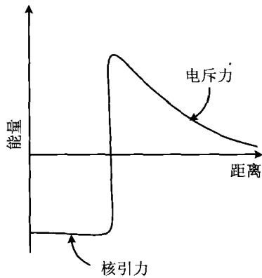
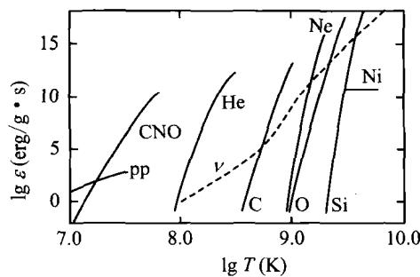
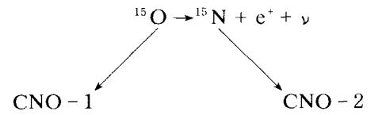

### 3.2 主序星阶段

当恒星中心温度达到 800 万度以上，氢聚变为氦的热核反应就开始了。反应产生大量的热量，使恒星达到完全的流体静力学平衡状态，从而成为正常的恒星，称为主序星。

氢核(质子)是带正电的粒子,要使聚变得以发生,它们的动能必须足够大,才能克服库仑势垒(见图3.6)的障碍。让我们做一个简单的估算。两个氢核之间的库仑势垒是

$$
V \sim e ^ {2} / r _ {0} \simeq 2 \times 1 0 ^ {- 6} \mathrm{erg} \simeq 1 \mathrm{MeV}\tag{3.25}
$$

其中 $r_{0} \approx 10^{-13}$ cm。设恒星中心的温度为 T，则粒子的平均动能 $\sim kT$ 。不难算出，克服库仑势垒所需要的温度为 $T \approx 1 \, MeV/k \approx 2 \times 10^{10} \, K$ ，这是一个极高的温度。如果原子核不止带一个正电荷，这一温度还要更高。但实际上，任何温度下的粒子速度分布都是麦克斯韦-玻尔兹曼分布，因而总是有一些粒子的速度（因而动能）非常大（即所谓的“高能尾巴”）。同时，根据量子隧道效应，即使粒子的动能小于库仑势垒的高度，粒子也有一定的穿透库仑势垒的几率。这两个方面的因素加起来，最终使得发生氢核

图3.6 两个氢核之间的相互作用势垒

聚变的温度降低到700万度左右。在恒星上要实现并维持这一温度，以使核反应持续进行，依靠的是恒星自身的引力。只要引力足够强，就可以把核反应物质约束在一起。但在地球上，这一温度就显得太高了，没有任何容器可以承受近千万度的高温。因此，要实现地球上人工控制的持续核聚变，只有利用超强磁场把等离子体约束起来，这种装置称为“托卡马克”。最近我国科学家已在这方面取得了世界领先的成就，但距离实际应用还有很长的路要走。

根据原子核反应理论,两体核反应的产能率,即原子核1和原子核2聚变时的

产能率 $\varepsilon_{n}$ (每单位质量的物质单位时间所产生的有效能量) 为

$$
\varepsilon_ {n} = \frac {n _ {1} n _ {2} \langle \sigma v \rangle Q}{\rho}\tag{3.26}
$$

式中 $n_{1}, n_{2}$ 是两种原子核的数密度， $\rho$ 是总的质量密度， $\sigma$ 是反应截面，v 是两原子核的相对运动速度（尖括号表示求平均值），反应的 Q 值可以查表得到。显然，核元素的丰度越高，密度越大，温度越高，核反应的产能率就越大。这些条件都直

图 3.7 热核反应的产能率

接与恒星的质量相联系。计算表明，氢燃烧的温度是 $T \sim 7 \times 10^{6} \mathrm{~K}$ ，这要求恒星的最小质量为 $0.08 M_{\odot}$ 。氦燃烧的温度是 $T \sim 1.5 \times 10^{8} \mathrm{~K}$ ，相应的恒星的最小质量是 $0.5 M_{\odot}$ 。图3.7画出了各种热核反应的产能率。从图中可以看到，当中心温度达到 $\sim 10^{7} \mathrm{~K}$ 时（相应的密度大约是 $100 \mathrm{~g/cm}^{3}$ ），首先开始的是pp链式反应（质子-质子链式反应或简称pp链）以及CNO循环反应。

1. pp 链

质量 $M \leqslant 2M_{\odot}$ ，中心温度 $7 \times 10^{6} \leqslant T_{c} \leqslant 2 \times 10^{7}$ K 的主序星，核心处发生的反应主要是 pp 链所代表的氢核聚变，它有 3 个分支：

pp-1:

$$
\begin{array}{l}^ {1} \mathrm{H} + ^ {1} \mathrm{H} \rightarrow^ {2} \mathrm{H} + e ^ {+} + \nu + \gamma\\^ {2} \mathrm{H} + ^ {1} \mathrm{H} \rightarrow^ {3} \mathrm{He} + \gamma\\^ {3} \mathrm{He} + ^ {3} \mathrm{He} \rightarrow^ {4} \mathrm{He} + 2 ^ {1} \mathrm{H}\end{array}\tag{3.27}
$$

其中 $\nu$ 表示中微子， $\gamma$ 表示光子。上述反应总的结果是

$$
4 ^ {1} \mathrm{H} \rightarrow^ {4} \mathrm{He} + 2 6. 2 0 \mathrm{MeV}\tag{3.28}
$$

中间生成物有 $^{2}H,^{3}He,e^{+},\nu,\gamma$ ，其中中微子 $\nu$ 携带走0.53 MeV的能量。这一数值是这样计算出来的：每个氢核（质子）的静质量是1.007825 amu（amu代表原子质量单位，1 amu=931.5 MeV），一个氦核的静质量是4.002603 amu，因此氢核聚变的静质量损失是

$$
\Delta m = (4 \times 1. 0 0 7 8 2 5 - 4. 0 0 2 6 0 3) \mathrm{amu} = 0. 0 2 8 7 0 \mathrm{amu} = 2 6. 7 3 \mathrm{MeV}\tag{3.29}
$$

这一能量减去光子辐射的能量 26.20 MeV，就得出中微子携带走的能量为 0.53 MeV。其他两个 pp 链分支是

$$
\mathrm{pp} - 2: \quad 4 ^ {1} \mathrm{H} \rightarrow^ {4} \mathrm{He} + 2 5. 6 7 \mathrm{MeV} \quad (\text {中间生成物Li,Be})\tag{3.30}
$$

$$
\mathrm{pp} - 3: \quad 4 ^ {1} \mathrm{H} \rightarrow^ {4} \mathrm{He} + 1 9. 2 3 \mathrm{MeV} (\text { 中   间   生   成   物 } \mathrm{Be}, \mathrm{B})\tag{3.31}
$$

显然，由于中间过程的不同，中微子携带走的能量也不同，这就使得最后辐射的能量也有所差异。计算表明，当温度逐渐升高时，氢核聚变也逐渐由 pp-1 为主过渡到 pp-3 为主。

#### 2. CNO 循环

$M \geqslant 2M_{\odot}, T_{c} \geqslant 2 \times 10^{7}$ K 的主序星，主要发生的核反应是 CNO 循环，它包括两个分支：

$$
{ } ^ { 1 2 } \mathrm{C} + { } ^ { 1 } \mathrm{H} \rightarrow { } ^ { 1 3 } \mathrm{N} + \gamma
$$

$$
{ } ^ { 1 3 } \mathrm{N} \rightarrow { } ^ { 1 3 } \mathrm{C} + \mathrm{e} ^ { + } + \nu
$$

$$
^ {1 3} \mathrm{C} + ^ {1} \mathrm{H} \rightarrow^ {1 4} \mathrm{N} + \gamma
$$

$$
{ } ^ { 1 4 } \mathrm{N} + { } ^ { 1 } \mathrm{H} \rightarrow { } ^ { 1 5 } \mathrm{O} + \gamma
$$

$$
{ } ^ { 1 6 } \mathrm{O} + { } ^ { 1 } \mathrm{H} \rightarrow { } ^ { 1 7 } \mathrm{F} + \gamma
$$

$$
{ } ^ { 1 7 } \mathrm{F} \rightarrow { } ^ { 1 7 } \mathrm{O} + e ^ { + } + \nu
$$

$$
{ } ^ { 1 7 } \mathrm{O} + { } ^ { 1 } \mathrm{H} \rightarrow { } ^ { 1 4 } \mathrm{N} + { } ^ { 4 } \mathrm{He}\tag{3.32}
$$

总的结果分别为

CNO-1:

$$
4 ^ {1} \mathrm{H} \rightarrow^ {4} \mathrm{He} + 2 5. 0 1 \mathrm{MeV}\tag{3.33}
$$

CNO-2:

$$
4 ^ {1} \mathrm{H} \rightarrow {} ^ {4} \mathrm{He} + 2 4. 8 0 \mathrm{MeV}\tag{3.34}
$$

我们注意到，在上面的反应中，碳、氮、氧只是反应的催化剂或中间生成物，它们的总量在经历一个反应循环后是保持不变的。

太阳的中心温度约为 $1.5 \times 10^{7} \mathrm{~K}$ ，在这一温度下，约有 $80\%$ 以上的能量由 pp 链产生，其余由 CNO 循环产生。如果恒星的质量是太阳的两倍，则 CNO 循环将是核聚变的主导过程。氢核聚变所产生的热量使得恒星内部的压力足以抵抗引力，因此恒星不再收缩，成为一颗稳定的主序星。只要核心部分的氢在继续燃烧，恒星就会一直停留在主序星阶段，没有明显的演化。一颗质量为 $M$ 的恒星，停留在主星序上的时间可以近似表示为

$$
\tau_ {n} \approx \frac {X q M E _ {n}}{L}\tag{3.35}
$$

其中 X 为氢元素丰度(定义见下一小节)，q 为氢核燃烧区域的质量与恒星总质量之比， $E_{n}$ 为单位质量的恒星物质核聚变所产生的能量，L 为恒星的光度。由上一章介绍过的质光关系，我们知道一般有 $L \propto M^{a}, \alpha \approx 2 \sim 4$ ，所以恒星的质量越大， $\tau_{n}$ 越短。理论计算的结果给出不同质量的恒星在主星序上停留的时间见表 3.1。

表 3.1 恒星质量与其在主星序停留时间

| 质量( $M_{\odot}$ ) | 主星序停留时间(年) |
|---|---|
| 100 | $2.7 \times 10^{6}$ |
| 10 | $2.6 \times 10^{7}$ |
| 1 | $1.0 \times 10^{10}$ |
| 0.5 | $1.7 \times 10^{11}$ |
