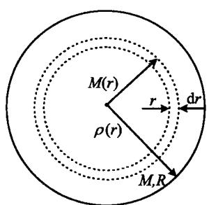
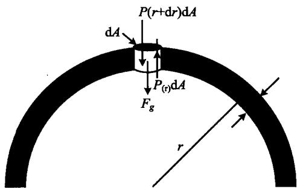

### 3.3 恒星结构的基本方程

与其他天体(例如星云、星系)相比,恒星的形状是最简单的,如果忽略自转,就可以把它们看作是球对称的结构。对于这样一个流体(气体)球来说(如图3.8a),在自身引力和内部压力的作用下,有如下一组基本方程:

图3.8a 球对称
的恒星结构

图 3.8b 流体静力学平衡计算简图

#### 1. 质量方程

$$
\mathrm{d} m (r) = 4 \pi r ^ {2} \rho (r) \mathrm{d} r \quad (\text {微分形式})\tag{3.36}
$$

或者

$$
m (r) = 4 \pi \int_ {0} ^ {r} \rho (r ^ {\prime}) r ^ {\prime 2} \mathrm{d} r ^ {\prime} \quad (\text {积分形式})\tag{3.37}
$$

这两个方程的意义是明显的,不需多做解释。

#### 2. 流体静力学平衡方程

考虑一个半径为 r 的球壳(图 3.8b)。设 r 处的流体压强为 $P(r)$ ，则作用在一个高为 dr，底面积为 dA 的圆柱体上的引力是

$$
F _ {g} = - \frac {G m (r)}{r ^ {2}} \rho (r) \mathrm{d} r \mathrm{d} A\tag{3.38}
$$

在静力学平衡的情况下，与这一引力相平衡的是作用在圆柱体上下表面的压力之差，即

$$
F _ {P} = \left[ P (r + \mathrm{d} r) - P (r) \right] \mathrm{d} A = \frac {\mathrm{d} P (r)}{\mathrm{d} r} \mathrm{d} r \mathrm{d} A\tag{3.39}
$$

由(3.38)和(3.39)两式相等,即得

$$
\frac {\mathrm{d} P (r)}{\mathrm{d} r} = - \frac {G m (r)}{r ^ {2}} \rho (r)\tag{3.40}
$$

这一方程就称为恒星的流体静力学平衡方程。利用这一方程，我们可以来粗略估计一下太阳中心的压强。把整个太阳看成为一个壳层是最简单的，此时壳层内表面收缩为一个点，即太阳中心；而外表面即太阳表面。在这一情况下有 $dr \sim R_{\odot}$ ， $dP \sim P_{c}, P_{c}$ 即中心压强（取表面压强为零；考虑到通常恒星的中心压强要比表面压强高出几个数量级，这一假设是合理的）。再假设太阳内部的密度是均匀的，因而由(3.40)可得

$$
P _ {c} \sim \frac {G M _ {\odot}}{R _ {\odot}} \frac {M _ {\odot}}{R _ {\odot} ^ {3}} = \frac {G M _ {\odot} ^ {2}}{R _ {\odot} ^ {4}}\tag{3.41}
$$

代入太阳的有关数据 $M_{\odot} \simeq 2 \times 10^{33} \, g, R_{\odot} \simeq 7 \times 10^{10} \, cm, (3.41)$ 给出 $P_{c} \sim 1 \times 10^{16} \, dyn/cm^{2}$ 。严格计算得到的结果是这一数值的大约 20 倍。

#### 3. 光度方程(能量方程)

如果某一壳层中有总能量产出，则意味着离开这一壳层的能量将大于进入该壳层的能量，超过的部分就是能量产出，它是恒星物质核聚变产能的结果（但要减去中微子造成的能量损失）。令 $\varepsilon(r)$ 为半径为 r 的壳层内，单位质量的恒星物质产出的能量。由于能量产出，这一壳层增加的光度为

$$
\mathrm{d} L (r) = 4 \pi r ^ {2} \rho (r) \varepsilon (r) \mathrm{d} r\tag{3.42}
$$

或者等效地表示成

$$
\frac {\mathrm{d} L (r)}{\mathrm{d} r} = 4 \pi r ^ {2} \rho (r) \varepsilon (r)\tag{3.43}
$$

这一方程反映了光度随半径的变化率。

#### 4. 能流方程(能量输运方程)

能量从恒星的内部传送到外部，主要有辐射、对流和热传导这三种输运方式。一般来说，由于恒星通常是由气体构成的，故热传导的作用并不重要，我们只需要考虑辐射和对流两种方式。但严格的理论分析表明，为了保证星体结构的稳定性，无论是哪种能量输运方式，都必须保证恒星内部的温度分布 $T(r)$ 不随时间而改变。

\- 辐射传能为主 当恒星内部的透明度较大时，辐射传能就成为主要的了。例如在一个半径为 $r$ 的球壳表面上（见图3.8a），总的辐射流量（光度）是

$$
L (r) = 4 \pi r ^ {2} F (r)\tag{3.44}
$$

其中辐射流密度(单位时间、通过单位面积的能量)F由斯特藩-玻尔兹曼定律给出，

$$
F (r) = \sigma T ^ {4} (r)\tag{3.45}
$$

式中， $\sigma$ 为斯特藩-玻尔兹曼常量。取(3.45)式的微分，得到

$$
\mathrm{d} F (r) = 4 \sigma T ^ {3} (r) \mathrm{d} T (r)\tag{3.46}
$$

另一方面， $\mathrm{d}F(r)$ 是由于恒星物质对辐射的吸收，且按吸收定律有

$$
\frac {\mathrm{d} F (r)}{F (r)} = - \kappa (r) \rho (r) \mathrm{d} r\tag{3.47}
$$

这里 $\kappa(r)$ 为吸收系数，负号表示由于吸收， $F(r)$ 随 r 的增加而减小。由 (3.44)～(3.47)，最后得到温度梯度为

$$
\frac {\mathrm{d} T}{\mathrm{d} r} = - \frac {\kappa (r) \rho (r) L (r)}{1 6 \pi r ^ {2} \sigma T ^ {3} (r)}\tag{3.48}
$$

● 对流传能为主 当恒星内部的不透明度很大时，对流就成为主要的能量输运方式了。在一般情况下，对流进行得很快，可以看成是绝热过程。按照热力学，这一过程满足方程

$$
\frac {1}{T} \frac {\mathrm{d} T}{\mathrm{d} r} = \frac {\gamma - 1}{\gamma} \frac {1}{P} \frac {\mathrm{d} P}{\mathrm{d} r}\tag{3.49}
$$

其中 $\gamma$ 为绝热指数，压强 $P$ 由(3.40)给出。方程(3.48)和(3.49)表明的是恒星内部温度梯度的分布，如前所述，在稳定的恒星结构情况下，它们应当是不随时间而变的。

#### 5. 物态方程

描述恒星结构的最后一个基本方程是物态方程，它把恒星内部的压强（压力）与温度、密度以及恒星的化学成分联系了起来。物态方程的一般形式是

$$
P = P (T, \rho , X, Y, Z)\tag{3.50}
$$

其中元素丰度 $X, Y$ 和 $Z$ 分别定义为氢、氦以及重元素各自的密度与恒星总密度之比：

$$
X \equiv \frac {\rho_ {\mathrm{H}}}{\rho}, \quad Y \equiv \frac {\rho_ {\mathrm{He}}}{\rho}, \quad Z \equiv \frac {\rho_ {\text {重元素}}}{\rho}\tag{3.51}
$$

这里我们把氢、氦以外的元素统称为重元素或金属元素（这只是一种习惯上的称呼法，实际上，像锂（Li）、铍（Be）、硼（B）这几种元素应当属于轻元素，但它们在自然界中的含量极少，故对上述定义没有影响。另一方面，像碳、氮、氧等元素虽然属于上述定义的重元素，但并不是通常意义下的金属元素）。显然，元素丰度 $X, Y, Z$ 之间满足关系式

$$
X + Y + Z = 1\tag{3.52}
$$

对大多数恒星来说， $X \approx 0.6 \sim 0.8$ ， $Y \approx 0.4 \sim 0.2$ ，重元素的含量非常少。这在本质上是与宇宙的演化历史有关的，我们将在宇宙学一章中再讨论这一问题。

物态方程给出的压力与其他物理量之间的关系一般是相当复杂的。当恒星内部的密度达到一定界限时，除了通常的气体压力（离子、电子等粒子所产生）和辐射压以外，还会出现一种量子效应造成的压力，即所谓的简并压力。我们知道，像电子、质子和中子这样的粒子称为费米子，它们的自旋量子数是1/2的奇数倍。对于费米子而言，有一个重要的量子力学原理即泡利(Pauli)不相容原理。这一原理说，对一个由费米子组成的系统，不能有两个或两个以上的粒子处在同一个量子态。例如，当一个自旋1/2的电子处于动量为p的能级上时，只能允许另一个自旋-1/2的电子处在这一能级上，其余的电子就要被排斥。这种费米子之间的排斥力就称为简并压力。这可以理解为，在简并气体里，由于较低的能级很快被占满了，故大多数粒子的能量远大于它们在普通气体里的能量。这一高的能量也相当于高的动量，因此由粒子动量交换所产生的压力也远远超过通常气体的压力，这就是简并压。我们下面会看到，对于热且密度低的恒星，粒子是非简并的，故压力主要是气体压力（离子、电子）和辐射压。而对于冷且密度高的恒星，费米子发生简并，如白矮星是电子简并，中子星是中子简并，此时压力=气体压+辐射压+简并压，并有可能主要是简并压。

我们还可以从下面的简单分析来理解简并压的产生。简并是量子效应，而量子效应的一个主要特征是，粒子的波动性变得非常显著。从量子论中我们知道，表征粒子波动性的一个重要参量是粒子的德布罗意波长，即

$$
\lambda_ {D} = \frac {h}{p}\tag{3.53}
$$

其中 p 是粒子的动量，h 是普朗克常量。设想一个电子被限制在一个边长为 L 的容器内，则它必然在这一容器内形成驻波，因而电子的最大德布罗意波长只能是 2L。如果压缩容器的大小即减小 L，电子的波长也要跟着减小，这样由(3.53)可知，相应的电子动量将增大。从经典统计力学的角度看来，这将使电子碰撞器壁的力变大。而另一方面器壁的面积也变小了，故总的效果是，电子对器壁的压强变大很多。由这个简单的分析可以看出，如果电子被限制在越来越小的空间里，简并压就会变得越来越显著。因此，可以把简并出现的条件简单地表述为，系统中粒子的平均德布罗意波长大于等于粒子之间的平均距离，即

$$
\bar {\lambda} _ {D} \geqslant \left(\frac {1}{n}\right) ^ {1 / 3} \Rightarrow \bar {\lambda} _ {D} \cdot n ^ {1 / 3} \geqslant 1\tag{3.54}
$$

式中，n 为粒子的平均数密度，不难看出，它的倒数相当于一个粒子所占的平均体积，再开立方就等于粒子之间的平均距离。

粒子数密度 n 以及简并压力的计算要用到量子统计理论。这里我们不去详细讨论这一理论，而只简单介绍一下它的结果。首先我们来看一下恒星物质中的粒子有哪些。恒星内部的温度很高，例如太阳中心的温度高达 $10^{7}$ K，在这样的温度下所有原子都会离解，成为等离子体。因此，在等离子体状态下，恒星物质中的主要粒子成分有自由电子、离子（原子核）和光子。

按照量子统计理论,一个由多种粒子组成的系统,在热平衡条件下,第 i 种粒子的数密度为

$$
n _ {i} = \int_ {0} ^ {\infty} f _ {i} (p) \mathrm{d} p = \frac {4 \pi g _ {i}}{h ^ {3}} \int_ {0} ^ {\infty} \frac {p ^ {2} \mathrm{d} p}{\exp (- \psi_ {i} + \varepsilon_ {i} / k T) + \eta}\tag{3.55}
$$

其中 $f_{i}(p)$ 称为第 $i$ 种粒子的分布函数，它是动量 $p$ 的函数，且由第二个等式我们看到

$$
f _ {i} (p) = \frac {4 \pi g _ {i}}{h ^ {3}} \frac {p ^ {2}}{\exp (- \psi_ {i} + \varepsilon_ {i} / k T) + \eta}\tag{3.56}
$$

这里假设了动量分布是球对称的，因此三维动量空间的积分化为一维积分时，被积函数要乘以 $4\pi p^2$ 。上面两式中， $g_i$ 代表自旋态数（电子、质子、中子以及光子的自旋态数都是2）， $\varepsilon_i$ 为粒子的动能， $\psi$ 称为化学势， $\eta$ 是一个参数，对费米子有 $\eta = +1$ ，对玻色子（例如光子）有 $\eta = -1$ 。

以电子为例，电子有 $g_{\mathrm{e}} = 2$ ，故(3.55)给出

$$
n _ {\mathrm{e}} = \int_ {0} ^ {\infty} f _ {\mathrm{e}} (p) \mathrm{d} p = \frac {8 \pi}{h ^ {3}} \int_ {0} ^ {\infty} \frac {p ^ {2} \mathrm{d} p}{\exp (- \psi_ {\mathrm{e}} + \varepsilon_ {\mathrm{e}} / k T) + 1}\tag{3.57}
$$

其中电子动能为

$$
\varepsilon_ {e} = \left(m _ {e} ^ {2} c ^ {4} + p ^ {2} c ^ {2}\right) ^ {1 / 2} - m _ {e} c ^ {2}\tag{3.58}
$$

这是狭义相对论中熟知的结果。(3.57)被积函数的分母中含有待定函数 $\psi_{e}$ ，因此很难积分出来。但在某些极限情况下，例如当 $\exp(-\psi_{e}+\varepsilon_{e}/kT)\gg1$ 时，(3.57)就过渡到非简并的麦克斯韦分布；而当 $\exp(-\psi_{e}+\varepsilon_{e}/kT)\ll1$ 时，就过渡到简并的费米分布。下面对这两种极限情况分别进行简要介绍。

\- 非简并情况 我们先来看一下非简并时的结果。此时由于 $\exp(-\psi_{\mathrm{e}} + \varepsilon_{\mathrm{e}} / kT) \gg 1$ ，(3.57)分母中的 $+1$ 可以忽略；再把非简并分为非相对论性 ( $kT < m_{\mathrm{e}}c^{2}$ ) 和相对论性 ( $kT > m_{\mathrm{e}}c^{2}$ ) 两种情况讨论。这两种情况亦分别相当于近似条件 $pc < m_{\mathrm{e}}c^{2}$ 和 $pc > m_{\mathrm{e}}c^{2}$ ，因此电子的动能 (3.58) 可以近似表示为

$$
\varepsilon_ {e} \simeq \left\{ \begin{array}{c c} p ^ {2} / 2 m _ {e} & (\text {非相对论性}) \\ p c & (\text {相对论性}) \end{array} \right.\tag{3.59}
$$

把(3.59)代入(3.57)，就可以得到这两种情况下，(3.57)对 $p$ 的积分结果分别是

$$
n _ {\mathrm{e}} = \left\{ \begin{array}{c c} 2 (2 \pi m _ {\mathrm{e}} k T / h ^ {2}) ^ {3. 2} \mathrm{e} ^ {\psi_ {\mathrm{e}}} & (\text {非相对论性}) \\ 2 \pi (2 k T / h c) ^ {3} \mathrm{e} ^ {\psi_ {\mathrm{e}}} & (\text {相对论性}) \end{array} \right.\tag{3.60}
$$

统计力学中，(电子)气体的压力由下式给出

$$
P _ {\mathrm{e}} = \frac {1}{3} \int_ {0} ^ {\infty} p v f _ {\mathrm{e}} (p) \mathrm{d} p = \frac {1}{3} \int_ {0} ^ {\infty} p \frac {\partial \varepsilon_ {\mathrm{e}}}{\partial p} f _ {\mathrm{e}} (p) \mathrm{d} p\tag{3.61}
$$

利用(3.59)的近似不难验证,非简并情况下的压力为

$$
P _ {\mathrm{e}} = \left\{ \begin{array}{c c} 2 (2 \pi m _ {\mathrm{e}} k T / h ^ {2}) ^ {3 / 2} \mathrm{e} ^ {\psi_ {\mathrm{e}}} k T & (\text {非相对论性}) \\ 2 \pi (2 k T / h c) ^ {3} \mathrm{e} ^ {\psi_ {\mathrm{e}}} k T & (\text {相对论性}) \end{array} \right.\tag{3.62}
$$

与(3.60)相比较我们马上看到,无论是非相对论性还是相对论性情况,气体的压力与数密度之间的关系仍然遵从通常的玻意耳定律

$$
P = n k T\tag{3.63}
$$

也就是说，非简并情况下我们仍然可以用经典统计力学的结果，而不需要考虑量子效应。

\- 简并情况 此时由于 $\exp (-\psi_{\mathrm{e}} + \varepsilon_{\mathrm{e}} / kT)\ll 1$ ，(3.57)就变成平凡的积分。但要注意，此时的积分上限并不是无穷大。这是因为，电子从占据最低能量（动量）的量子态开始，根据泡利不相容原理，每一能级只能允许有两个不同自旋的电子，其余的电子必须依次占据越来越高的能级。因为粒子的总数是有限的，故最高的能量（动量）值也是有限的。通常把最高的动量值称为费米动量 $p_{\mathrm{F}}$ ，因此(3.57)的积分上限应当是 $p_{F}$ 。设电子总数为 $N_{e}$ ，占据的空间体积为 V，则(3.57)积分的结果是

$$
n _ {\mathrm{e}} = \frac {N _ {\mathrm{e}}}{V} = \frac {8 \pi}{3 h ^ {3}} p _ {\mathrm{F}} ^ {3} = \frac {2}{h ^ {3}} \frac {4 \pi}{3} p _ {\mathrm{F}} ^ {3}\tag{3.64}
$$

这一结果有一个非常直观的解释:电子在动量空间填满一个半径为 $p_{F}$ 的费米球,它的体积是 $4\pi p_{F}^{3}/3$ ,体积前面系数中的2代表两种自旋态( $g_{e}=2$ )。

电子简并压可以根据(3.61)求出：

$$
P _ {\mathrm{e}} = \frac {1}{3} \int_ {0} ^ {p _ {\mathrm{F}}} p v f _ {\mathrm{c}} (p) \mathrm{d} p = \frac {8 \pi}{3 h ^ {3}} \int_ {0} ^ {p _ {\mathrm{F}}} p ^ {3} v \mathrm{d} p
$$

非相对论性情况下有 $v = p/m_{e}$ ，故压力为

$$
P _ {\mathrm{c}} = \frac {8 \pi}{1 5} \frac {p _ {\mathrm{F}} ^ {5}}{m _ {\mathrm{e}} h ^ {3}}\tag{3.65}
$$

相对论性情况下近似有 $v \sim c$ ，此时压力为

$$
P _ {\mathrm{c}} = \frac {2 \pi c}{3 h ^ {3}} p _ {\mathrm{F}} ^ {4}\tag{3.66}
$$

(3.65)或(3.66)与(3.64)联立消去 $p_{\mathrm{F}}$ ，就得到 $P_{\mathrm{e}}$ 与 $n_{\mathrm{e}}$ 的关系。显然这一关系比较复杂，不再是简单的玻意耳定律。

我们再来分析一下(3.54)给出的简并条件。利用分布函数(3.56)，电子的平均德布罗意波长是

$$
\begin{array}{r l} \bar {\lambda} _ {D} = & \langle \lambda_ {D} \rangle = \int_ {0} ^ {\infty} (h / p) f _ {\mathrm{e}} (p) \mathrm{d} p \Big / \int_ {0} ^ {\infty} f _ {\mathrm{c}} (p) \mathrm{d} p \\ = & \left\{ \begin{array}{l l} 2 (h ^ {2} / 2 \pi m _ {\mathrm{e}} k T) ^ {1 / 2} & \text {非相对论性} k T <   m _ {\mathrm{e}} c ^ {2} \\ h c / 2 k T & \text {相对论性} k T > m _ {\mathrm{e}} c ^ {2} \end{array} \right. \end{array}\tag{3.67}
$$

由此可见， $\bar{\lambda}_D \cdot n^{1/3} \geqslant 1$ 的简并条件意味着，当温度一定（ $\bar{\lambda}_D$ 一定）时，密度越大，粒子越容易简并；而密度一定时，温度越低， $\bar{\lambda}_D$ 就越大，粒子也越容易简并。此外我们还看到，在同样的密度和温度下，质量越小的粒子越容易简并。

以上对于电子的讨论结果完全可以照搬到其他费米子,例如中子和质子,只需要把粒子的质量换一下就行了。知道了每一种粒子的数密度以后,就可以求得总的粒子数密度

$$
n = \sum_ {i} n _ {i}\tag{3.68}
$$

以及总压力

$$
P = \sum_ {i} P _ {i}\tag{3.69}
$$

因此，系统的总压力决定于 n 和 T。

通常我们希望物态方程具有(3.50)那样的形式，即其中出现的是质量密度 $\rho$ 而不是粒子数密度 $n$ 。这一点不难做到，因为 $\rho$ 和 $n$ 之间的关系并不复杂。如果粒子只有一种，其质量为 $m$ ，则马上有 $\rho = nm$ 。但一般情况下系统中有多种粒子（如电子、离子、中性原子等，且每种元素的原子质量也各有不同）。我们就需要利用(3.51)定义的元素丰度，把不同种类的粒子 $\rho$ 和 $n$ 之间的关系表述出来。例如氢，在完全电离的情况下产生一个自由电子和一个离子(氢核)，因此自由电子和离子的数密度都是 $X\rho /m_{\mathrm{H}}$ ：其中 $X\rho = \rho_{\mathrm{H}}$ ，即单位体积中所含氢原子的质量；它除以每个氢原子的质量 $m_{\mathrm{H}}$ ，自然得到单位体积中氢原子的数密度，也就是电离后自由电子和氢离子的数密度。其他元素的情况类似，只要注意电离后的自由电子数与离子数之比。不同元素有不同的比值，例如对于氦，这一比值是2。表3.2给出完全电离状态下，用元素丰度和总质量密度 $\rho$ 表示的各种粒子的数密度。表中关于重元素的结果只是近似值，<A>表示平均原子量，同时也假设了，每种重元素的原子核中，质子和中子的数目大致相当。

利用表 3.2 的结果,我们就可以写下一般形式的物态方程:

● 非简并等离子体情况 此时热平衡条件下各成分的分压力是

$$
P _ {i} = n _ {i} k T\tag{3.70}
$$

总压力为

$$
P = n k T, \quad n = \sum_ {i} n _ {i}\tag{3.71}
$$

表 3.2 各种粒子的数密度

| 元素种类 | 离子数密度 | 自由电子数密度 |
|---|---|---|
| H | $\frac{X\rho}{m_{\text{H}}}$ | $\frac{X\rho}{m_{\text{H}}}$ |
| He | $\frac{Y\rho}{4m_{\text{H}}}$ | $\frac{Y\rho}{2m_{\text{H}}}$ |
| 重元素 | $\frac{Z\rho}{\langle A\rangle m_{\text{H}}}$ | $\frac{Z\rho}{2m_{\text{H}}}$ |

把表 3.2 的总粒子数密度加起来，并忽略重元素离子的贡献（因为一般有 $\langle A\rangle\gg1$ ），得到

$$
n = \frac {\rho}{m _ {\mathrm{H}}} \left[ 2 X + \frac {3}{4} Y + \frac {1}{2} Z \right]\tag{3.72}
$$

故物态方程最后写为

$$
P = \frac {\rho k T}{m _ {\mathrm{H}}} \left[ 2 X + \frac {3}{4} Y + \frac {1}{2} Z \right] + \frac {1}{3} a T ^ {4}\tag{3.73}
$$

式中最后一项 $\frac{1}{3} aT^4 = P_r$ ，代表光子产生的辐射压。

\- 简并气体情况 以简并电子气体为例, 把表 3.2 最后一列的自由电子数密度写成用元素丰度表示的形式:

$$
n _ {\mathrm{e}} = \frac {\rho}{m _ {\mathrm{H}}} \left(X + \frac {1}{2} Y + \frac {1}{2} Z\right) = \frac {1}{2} (1 + X) \frac {\rho}{m _ {\mathrm{H}}}\tag{3.74}
$$

最后一步是忽略了 $Z$ （因为一般情况下恒星的金属丰度都很低），并利用了(3.52)的关系式。因此，(3.64)给出的 $p_{\mathrm{F}}$ 与 $n_{\mathrm{e}}$ 之间的关系就可以转换为 $p_{\mathrm{F}}$ 与 $\rho$ 的关系，再用(3.65)或(3.66)就可以得到所求的物态方程。例如，非相对论性情况下(3.65)化为

$$
P _ {\mathrm{c}} = \frac {h ^ {2}}{2 0 m _ {\mathrm{e}} m _ {\mathrm{H}}} \left(\frac {3}{\pi m _ {\mathrm{H}}}\right) ^ {2 / 3} \left(\frac {1 + X}{2} \rho\right) ^ {5 / 3}\tag{3.75}
$$

而相对论性情况下(3.66)化为

$$
P _ {\mathrm{e}} = \frac {h c}{8 m _ {\mathrm{H}}} \left(\frac {3}{\pi m _ {\mathrm{H}}}\right) ^ {1 / 3} \left(\frac {1 + X}{2} \rho\right) ^ {4 / 3}\tag{3.76}
$$

这里我们看到，简并气体的压力是与温度无关的，这与通常的非简并气体有很大不同。此外，物态方程中，总压力还应当包括离子压以及辐射压的贡献：

$$
P = P _ {\mathrm{e}} + P _ {I} + \frac {1}{3} a T ^ {4}\tag{3.77}
$$

其中非简并的离子压力由玻意耳定律给出，由表3.2看出它应当是

$$
P _ {I} = \Big (X + \frac {1}{4} Y \Big) \frac {\rho k T}{m _ {\mathrm{H}}}\tag{3.78}
$$

小结 上面一共有五个关于恒星结构的基本方程：

质量分布方程

$$
\frac {\mathrm{d} m (r)}{\mathrm{d} r} = 4 \pi r ^ {2} \rho (r)\tag{3.36}
$$

流体静力学平衡方程

$$
\frac {\mathrm{d} P (r)}{\mathrm{d} r} = - \frac {G m (r)}{r ^ {2}} \rho (r)\tag{3.40}
$$

光度方程

$$
\frac {\mathrm{d} L (r)}{\mathrm{d} r} = 4 \pi r ^ {2} \rho (r) \varepsilon (r)\tag{3.43}
$$

$$
\frac {\mathrm{d} T (r)}{\mathrm{d} r} = - \frac {\kappa (r) \rho (r) L (r)}{1 6 \pi r ^ {2} \sigma T ^ {3} (r)}
$$

(辐射为主)

$$
\frac {1}{T (r)} \frac {\mathrm{d} T (r)}{\mathrm{d} r} = \frac {\gamma - 1}{\gamma} \frac {1}{P (r)} \frac {\mathrm{d} P (r)}{\mathrm{d} r}\tag{3.48}
$$

(对流为主)

(3.49)

物态方程

$$
P = P (\rho , T, X Y Z)\tag{3.50}
$$

这5个方程要确定5个未知数： $m(r),P(r),L(r),T(r),\rho (r)$ ，因而方程组是封闭的，可以通过数值计算方法求解。当然，核产能率 $\varepsilon$ 、吸收系数 $\kappa$ 以及化学元素组成 $X,Y,Z$ 等参数需要事先给定。上述结论称为恒星结构的解的唯一性定理：平衡的恒星球体的内部结构，由它的化学成分和总质量唯一确定。我们以后会看到，当核燃烧使得化学成分发生变化时，恒星的结构也会随之而变化。但在主序星阶段，虽然核心区域的氢核聚变使化学成分发生了改变，这种改变会使恒星的光谱型和光度产生一定变化，但这一变化不是很大。变化的结果，只导致主星序在赫罗图上成为一条有一定宽度的带，而不是一条细线，正如我们在赫罗图中看到的那样（如图2.7）。不同质量的恒星首次在主星序上出现时，都对应于赫罗图上的一个点，称为零龄主序星。把所有这些点连起来，就得到一条线，这条线称为零龄主序。

前面我们估计了太阳的中心压强,现在我们再来估计一下太阳的中心温度。把上面方程组中的前两个方程相除,即得到

$$
4 \pi r ^ {2} \frac {\mathrm{d} P}{\mathrm{d} m} = \frac {G m}{r ^ {2}}\tag{3.79}
$$

再设

$$
\frac {\mathrm{d} P}{\mathrm{d} m} \sim \frac {P _ {c}}{M} \Rightarrow 4 \pi R ^ {2} \frac {P _ {c}}{M} \sim \frac {G M}{R ^ {2}}\tag{3.80}
$$

其中 M, R 分别为恒星的质量和半径, $P_{c}$ 为恒星中心的压强。因此有

$$
P _ {c} \sim \frac {G}{4 \pi} \frac {M ^ {2}}{R ^ {4}}\tag{3.81}
$$

这与前面(3.41)的结果基本相同。再利用玻意耳定律并假设恒星密度均匀，就得出

$$
\begin{array}{r l} {T _ {\mathrm{c}} \sim \frac {P _ {\mathrm{c}}}{k n} \sim \frac {\mu m _ {\mathrm{H}}}{k \rho} P _ {\mathrm{c}}} & {(\mu \text {为平均分子量})} \\ {\sim \frac {\mu m _ {\mathrm{H}} G}{3 k} \cdot \frac {M}{R}} \end{array}\tag{3.82}
$$

代入太阳的参数 $M_{\odot}=2\times10^{33}$ g, $R_{\odot}=7\times10^{10}$ cm，上述估计给出 $T_{c}\sim10^{7}$ K，这与数值计算的结果在数量级上是完全一致的。

