### 3.6 超新星

我们在第2章中已经介绍过超新星的主要特征。超新星爆发是恒星世界发生的最剧烈的活动，爆发时释放的能量可达 $10^{47} \sim 10^{53}$ erg，亮度堪比整个星系。实际上，超新星爆发时，发出的光辐射只占超新星总能量释放的很小部分，大部分能量转化为外壳抛射的动能以及中微子携带的动能。根据观测特点，通常把超新星分为两大类，即I型和II型。两者的光变曲线有很大不同（图2.15），但最主要的区别还是光谱中所反映的：I型无氢，II型有氢。近些年来，随着观测资料的不断补充丰富，又把I型超新星分为Ia、Ib和Ic三个子型，把II型分为II-L和II-P两个子型。所有的I型除了共同特点即都无氢外，Ia有硅（电离硅SiⅡ谱线）但无氦，Ib和Ic都无硅，但Ib有氦，而Ic则无氦。II型的两个子型的区别在于光变曲线，II-L的光变曲线是线性的，而II-P的具有平台结构。现在认为，Ia型超新星是由密近双星系统（见下一节）中白矮星爆炸而形成的，爆炸后完全粉碎。II型超新星爆发的原因是中心铁核爆炸，爆炸后形成致密残骸——中子星或黑洞。Ib和Ic实际上与II型的爆发机制相同，物理上应属于一类，都是中心有一个致密的铁核，但Ib的外层中仍保留一定数量的氦，而Ic除了铁中心核外，外层所有的物质都被强大的星风吹散掉了。

#### 3.6.1 Ia型超新星

I a型超新星出现在各类星系中，特别是椭圆星系里比较多；在旋涡星系中，它们并不出现在旋臂上，而是出现在星系晕和旋臂之间。所有这些地方都是属于没有年轻恒星存在的地区。这使人们想到，I a型超新星爆发前应当是年老的、小质量的恒星。另一方面，I a型的光谱中缺乏氢，这曾使人们长期感到困惑，因为很难理解它们在爆发前如何失去氢壳层。把这两方面的特点综合起来，现在的普遍看法是，I a型超新星爆发前是密近双星中的一颗子星（见图3.18），质量大约为 $3M_{\odot}\sim8M_{\odot}$ ，演化到晚期形成碳-氧中心核，中心密度可达 $2\times10^{9}~g/cm^{3}$ ，核中电子发生简并，成为一颗碳-氧白矮星。它周围的气壳由于另一颗子星的引力吸积而被完全剥离掉，这就同时解释了老年星和氢缺失的问题。在这一情况下，白矮星再反过来吸积另一颗伴星周围的物质，当质量超过钱德拉塞卡（S. Chandrasekhar）极限（见下一章4.1.1节）时，就会坍缩而触发碳燃烧，同时伴随超声速运动——爆轰波（激波）。爆轰波传到未燃烧的部分时，压缩并加热物质，激波扫过的地方迅速升温到点火温度，立即触发核燃烧。整个反应看上去像是失控的核爆炸。在爆炸中同时进行极其迅速的连锁核反应，产生出包括铁在内的一系列重元素。光辐射的能量主要来自爆发时形成的放射性元素 $^{56}Ni$ ，然后衰变为 $^{56}Co$ ，再衰变为 $^{56}Fe$ 。由于发生坍缩的临界质量（即钱德拉塞卡极限）是一定的，故可以认为，所有I a型超新星爆发时释放的能量(包括光度)是相同的,绝对星等大约为 $-19.3^{m}$ ,这就使Ia型超新星成为理想的标准烛光。在宇宙学一章中我们会看到,正是利用Ia型超新星的这一特性,才发现了宇宙在加速膨胀,并由此引发了对宇宙暗能量的研究。因此,Ia型超新星对于宇宙学和物理学都具有重要的意义。

(a) I型超新星
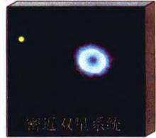

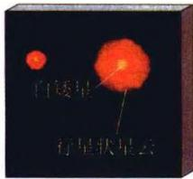

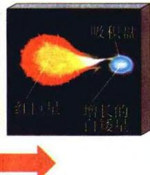

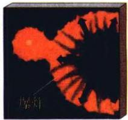

(b) II型超新星
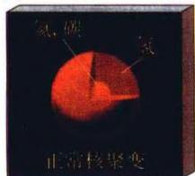

时间
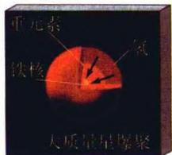

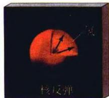

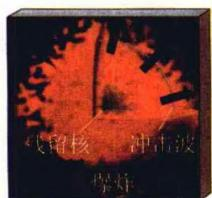
图 3.18 超新星的形成: (上) I a 型超新星 (下) II 型超新星

#### 3.6.2 Ⅱ型超新星

Ⅱ型超新星(包括 I b 和 I c 型)一般认为是 $8 \sim 30 M_{\odot}$ 的大质量恒星,演化到晚期形成铁中心核,铁核外面是 ${}^{32}S$ 、 ${}^{28}Si$ 、 ${}^{24}Mg$ 、 ${}^{20}Ne$ 、 ${}^{16}O$ 等重元素组成的一层层外壳(图 3.19a)。由于核聚变停止,铁中心核压力骤然下降,从而引发引力坍缩致使温度升高。当温度达到 $5 \times 10^{9} K$ 时(此时相应的密度达 $10^{10} g/cm^{3}$ ),铁原子核被光致分解(见(3.101)式),生成的氦亦立即被光致分解

$$
^ 4 \mathrm{He} \leftrightarrow 2 \mathrm{p} + 2 \mathrm{n} - 2 8. 3 \mathrm{MeV}\tag{3.102}
$$

这两个质子又马上俘获电子变成中子，导致恒星核心强烈地中子化：

$$
\mathbf {p} + \mathbf {e} ^ {-} \rightarrow \mathbf {n} + \nu_ {\mathrm{e}}\tag{3.103}
$$

上述光致分解和中子化都产生大量的中微子，且都是强烈的吸热过程。吸热使温度骤降，大量电子被俘获又使简并压大为降低，这两方面的结果就使得核心继续坍缩。当密度超过 $10^{11}\mathrm{g} / \mathrm{cm}^3$ 时，原子核与中微子之间的中性流（ $\mathbf{Z}^0$ 粒子）相互作用使中微子发生强烈散射，因而中微子 $\nu_{\mathrm{e}}$ 的平均自由程比恒星半径小很多， $\nu_{\mathrm{e}}$ （在恒星内部，主要是 $\nu_{\mathrm{e}}$ 起作用）被封闭在恒星的中心核外层，即中子化核心的外缘或外壳处，这称为中微子俘获（沉淀）。这些被俘获的中微子有很高的能量（内核坍缩释放的引力能大部分转移给中微子)，受到震动后，即引起爆发。强大的中微子束会对富含铁原子核的外壳产生足够高的压力，将外壳驱散，形成猛烈的超新星爆发（参见图3.19b和图3.18）。被吹散的外壳形成超新星遗迹，中子化的核心遗留下来形成中子星。与Ia型超新星爆发时的情况类似，在爆炸中也同时进行迅速的连锁核反应，产生出一系列其他重金属元素。顺便指出，两类超新星光极大后几个月，光辐射的能量都主要来自爆发时形成的放射性元素 $^{56}$ Co衰变，这一点反映在光变曲线中，这一时期的光变曲线呈 $^{56}$ Co放射性衰变所特有的指数衰减（图3.20）。

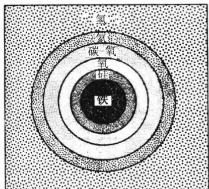
图3.19a Ⅱ型超新星
爆发前的星核结构

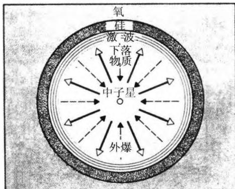
图3.19b Ⅱ型超新星爆发

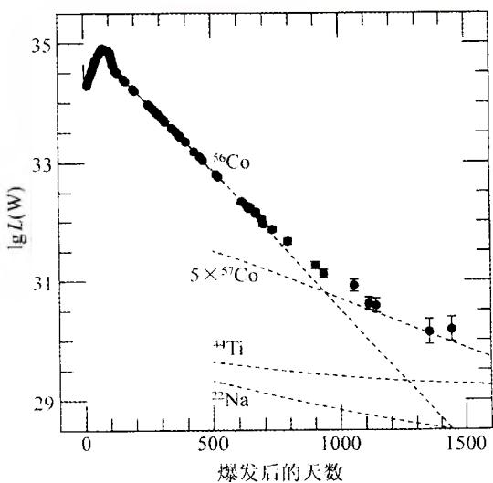
图 3.20 超新星 SN 1987A 爆发后 1444 天

铁中心核的坍缩过程非常迅速，几乎是以自由落体速度进行的。按照(3.5)所示的自由落体时标估计，当中心核密度为 $10^{10}\ g/cm^{3}$ 时，这一时标仅为 $\sim(G\rho)^{-1/2}\sim40\ ms$ 。在铁核的坍缩过程中，还有一个重要的现象值得关注，这就是激波的产生和内核的反弹。由于坍缩总是使越靠中心部分的密度越大，而密度越大的地方坍缩的时标越短，故中心核可以大致分为内核与外层。内核首先坍缩形成致密的中子结构，其密度 $(\sim8\times10^{14}\ g/cm^{3})$ 接近于核子的密度，不能再被压缩了，实际上也就形成了一颗中子星。外层物质向内层表面下落时，速度是超声速的，可达70 000 km/s，这样就形成了强大的激波。激波遇到固态的内核表面产生反弹，反弹使激波掉头向外，此时激波所蕴含的巨大动能可以将外层物质冲开，并引发富含高能中微子(数目可达 $10^{53}$ 个)的外壳爆炸。这里要注意,超新星爆发时所发出的强大中微子流产生于中心核附近,而爆发所发出的光辐射来自于恒星表面附近(温度约为几十万度),它们都是激波扫过时所引发的。因此,中微子流爆发的时刻要早于光辐射产生的时刻,两者相差的时间,应当是激波以声速从中心核传播到恒星表面的时间,大约为几小时到几天(取决于恒星的大小)。如上一章中所述,人类第

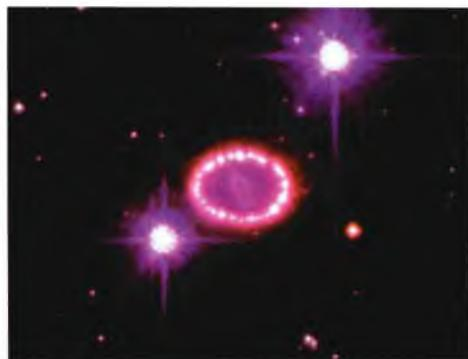
图3.21 “哈勃”拍到的超新
星SN1987A的发光气体环

一次接收到的河外超新星爆发的中微子流来自超新星SN1987A，它们到达地球的时间比光辐射要早3个小时左右。这个观测事实一方面验证了上述有关Ⅱ型超新星爆发的理论，另一方面也证实了SN1987A是一颗Ⅱ型超新星，因为Ia型超新星的爆发不会伴随有大量的中微子出现。与通常超新星不同的是，SN1987A爆发前是蓝超巨星而不是红超巨星，这一点现在的看法是，它曾是一个质量大约为 $20M_{\odot}$ 的恒星，演化到红超巨星阶段时，巨大的星

风将它外层大约 $5 \sim 10 M_{\odot}$ 的物质吹散到宇宙空间，剩下一个质量为 $10 \sim 15 M_{\odot}$ 的恒星，因为表面温度很高，看上去就是一个蓝超巨星。

顺便指出,如果内核坍缩成为黑洞的话,则因为黑洞没有一个固态的表面,不能使激波反弹,超新星爆发的威力也就会大打折扣。

#### 3.6.3 中微子及其探测

Ⅱ型超新星爆发前，铁中心核发生的光致分解和中子化过程都属于弱相互作用过程，这一过程的特点是伴随有中微子产生。中微子的概念最早是1930年泡利提出的，当时实验发现β衰变过程中测到的总能量不守恒。为解决这一疑难，泡利提出，在β衰变过程中，除了电子以外，同时还有一种不带电的、质量极小的粒子发出。这种粒子与其他物质粒子相互作用极弱，以至无法探测到。1933年，费米又进一步提出了β衰变的定量理论，他指出，自然界中除了已知的引力和电磁力作用外，还有一种弱相互作用，β衰变就是属于这样的相互作用过程。在β衰变中，原子核内的一个中子通过弱作用衰变成一个电子、一个质子和一个中微子。实际上，除了地球上的β衰变实验外，太阳上的氢聚变以及其他一些轻核反应过程也发射中微子。根据现代核反应理论，可以算出太阳中微子到达地球时的通量大约是7×

$10^{10} / (\mathrm{cm}^2 \cdot \mathrm{s})$ 。虽然看上去这个数目是巨大的，但由于中微子只参与弱作用，反应截面极小，即使如地球这样的庞然大物，它们也轻而易举地一穿而过。我们每个人每秒钟都要经受大约10000亿个太阳中微子的轰击，但我们对此毫无知觉，这表明中微子探测起来极为困难。诺贝尔奖评委会曾写下一段评语来形容此项工作的艰巨：“探测中微子，相当于在整个撒哈拉沙漠寻找一粒沙子。”这段评语是为小柴昌俊（Masatoshi Koshiba）和戴维斯(R. Davis)而写的，他们由于探测宇宙中微子的出色工作，而获得2002年诺贝尔物理学奖。

最早提出中微子探测办法的是我国物理学家王淦昌，他在1941年就建议，可以利用 $^{7}Be$ 的K电子俘获过程来检测中微子的存在。K俘获过程是轨道电子俘获中最容易发生的过程，即原子核俘获原子最内层(K层)的电子。对于 $^{7}Be$ ，这一过程是

$$
{ } ^ { 7 } \mathrm{Be} + \mathrm{e} ^ { - } \rightarrow { } ^ { 7 } \mathrm{Li} + \nu\tag{3.104}
$$

测量 $^{7}$ Li核的反冲能量和动量，由能量动量守恒即可以求出中微子的能量和动量。之所以选用 $^{7}$ Be，是因为生成的 $^{7}$ Li质量较小，因而反冲较为显著，反冲的能量和动量比较容易测量。王淦昌的建议立即得到了实验物理学家的重视和响应。从1942年到1952年，美国的几个实验小组分别用 $^{7}$ Be和 $^{37}$ Cl做了多次实验，最终实现了王淦昌的建议，间接地证实了中微子的存在。

但是，要探测来自宇宙空间的中微子，困难就更大了，因为我们不可能去测量天体上的反冲核，必须想办法直接探测中微子。第一次直接捕捉到中微子是在1956年，但还是在实验室中产生的中微子，所用的中微子源是核反应堆。美国物理学家雷尼斯(F. Reines)选用氢核(质子，实际实验用的是200升醋酸镉水溶液)作为靶核，他观察到有下列反应发生：

$$
\nu + \mathrm{p} \rightarrow \mathrm{n} + \mathrm{e} ^ {+}\tag{3.105}
$$

具体说来，是观察到有正电子与靶液中的 $\mathbf{e}^{-}$ 湮灭，随即产生两个向相反方向运动的 $\gamma$ 光子（此过程不到 $10^{-9}$ 秒），每个的能量为 $511\mathrm{keV}$ ，正好等于一个电子或正电子的静止能量。另一方面，中子产生后与靶液中的氢核碰撞慢化，大约几微秒后才被靶液中的镉吸收而放出 $3\sim 4$ 个 $\gamma$ 光子。全部过程发出的辐射很有特点：先是两个反方向的 $511\mathrm{keV}\gamma$ 光子，过几微秒是 $3\sim 4$ 个总能量为几MeV的 $\gamma$ 光子。这样的过程不难被探测到，当然必须要把设备环境的本底干扰消除掉。雷尼斯1956年测得的中微子记数率是每小时大约3个，而他使用的核反应堆产生的中微子通量却高达 $5\times 10^{13} / (\mathrm{cm}^2\cdot \mathrm{s})!$ 由此可见探测中微子是何等的困难。

目前对中微子的直接探测方法大体分为两类，即放射化学方法和电子学方法。因为弱作用的反应截面极小，故探测器必须含有数目巨大的靶原子，同时必须严格消除环境的本底干扰，通常是将探测器放到深度几百米到数千米的地下，以最大限度地避免宇宙线和地面上其他因素的影响。最早的太阳中微子探测器，是美国国立布鲁海文实验室的戴维斯(2002年获诺贝尔奖)，在美国南达科他(South Dakota)的霍姆斯泰克(Homestake)的一个金矿井里放置的，该矿井之上有 $1500\mathrm{m}$ 厚的岩层覆盖，相当于 $4000\mathrm{m}$ 的深水屏蔽。这一方法属于放射化学方法，实验所用的材料是380000升四氯乙烯 $(\mathrm{C}_2\mathrm{Cl}_4)$ ，靶原子核是 $^{37}\mathrm{Cl}$ 。四氯乙烯是工业上用的清洗剂，也用于制造某些医学上用氯制剂。太阳中微子与 $^{37}\mathrm{Cl}$ 反应生成放射性的 $^{37}\mathrm{Ar}$ ：

$$
\nu_ {e} + ^ {3 7} \mathrm{Cl} \rightarrow e ^ {-} + ^ {3 7} \mathrm{Ar}\tag{3.106}
$$

将 $^{37}Ar$ 从 $C_{2}Cl_{4}$ 液体中分离出来并测定它的放射性强度，就可以定出 $^{37}Ar$ 的数量，也就是中微子与 $^{37}Cl$ 反应的次数。这个反应的截面是已知的，因而就测得了到达

地球的太阳中微子数目。

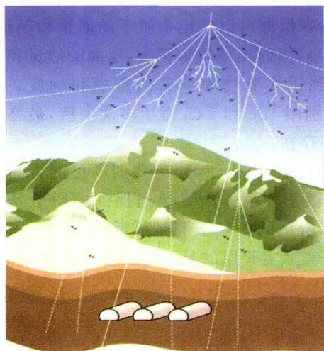
图 3.22 建于意大利亚平宁山脉深处
的 Gran Sasso 中微子实验室示意图

还有另外两个研究组也采用放射化学方法。一个组称为 GALLEX，是欧洲-以色列-美国联合组建的，位于意大利罗马东北的格兰萨索（Gran Sasso）隧道内（图 3.22），隧道上方的岩石厚度为 1200 m，相当于 3400 m 深的水层。实验采用 30 吨天然丰度的 $CaCl_{3}-HCl$ 溶液作为探测器，主要反应是

$$
\nu_ {\mathrm{e}} + ^ {7 1} \mathrm{Ga} \rightarrow \mathrm{e} ^ {-} + ^ {7 1} \mathrm{Ge}\tag{3.107}
$$

镓探测器比氯探测器灵敏度更高，而且能探测到能量较低的中微子。另一个组叫 SAGE，是由美国和前苏联联合组建的，位于前苏联高加索巴克珊（Baksan）地区的一个山洞中，岩层厚度相当于 4700 m 水层。实验室周围用 60 cm 厚

的水泥屏蔽起来,探测器用的是60吨液态镓,实验的主要反应与(3.107)相同。

放射化学方法测量的是反应后产生的核素。与此不同，电子学方法测量的是反应所产生的电子和其他粒子，以及 $\gamma$ 光子。测量是实时的，而且可以得到入射中微子的能量和方向。采用电子学方法的最早实验是由日本研究组（学术带头人是小柴昌俊）完成的。他们在位于东京以西 300 km 的岐阜县神冈町，一座深 1000 m 的锌矿矿井中，安置了一个装满 2140 吨纯水的容器，容器周围设置了 948 只光电倍增管。最初的实验证实了中微子确实来自太阳。在第一阶段成功的基础上，他们又建立了第二套设备，称为超神冈或神冈Ⅱ。实验用纯水量增加到5万吨，光电倍增管也增加到11200个。这个实验的主要反应是，太阳中微子进入水中时，与水分子中的电子发生弹性碰撞，

$$
\nu_ {e} + e ^ {-} \rightarrow \nu_ {e} + e ^ {-}\tag{3.108}
$$

利用光电倍增管，可以探测到水中高速电子所产生的契伦科夫辐射的闪光，这一辐射的方向与电子的运动方向一致。这样，中微子的运动方向就容易定出了。除了神冈之外，还有一些实验室也采用类似的方法，例如建在美国俄亥俄州一座盐矿地下深处的IMB国家实验室，还有加拿大和美国联合出资，在加拿大萨德堡（Sudberg）的一个镍矿井中（等效水深6100m）建立的实验装置。后者不同的是使用1000吨重水。重水是由氘和氧组成的，因而太阳中微子除了与电子发生弹性散射外，还将与氘发生如下反应：

$$
\nu_ {\mathrm{e}} + ^ {2} \mathbf {D} \rightarrow \nu_ {\mathrm{e}} + \mathbf {p} + \mathbf {n}\tag{3.109}
$$

这一反应可以增加发现中微子的几率，因而可以提供更多的中微子信息。

#### 3.6.4 中微子的未解之谜

在我们已知的基本粒子当中，中微子算得上是一种非常奇特的粒子，它身上长期笼罩着许多谜团。例如，自1968年开始，戴维斯对太阳中微子进行了多次探测。到1988年为止，他把测量结果做了平均，扣除宇宙线的影响后，发现每天记录到的中微子流量大约是2.6 SNU，这里SNU称为太阳中微子单位， $\mathrm{SNU} =$ 每 $10^{36}$ 个靶核每秒有一次反应。而太阳的标准模型预言我们能够测到大约8 SNU。也就是说，实际测到的太阳中微子数目只有理论值的 $1/3$ 。从1987年到1990年初，神冈研究组也得到了大体相同的结论，这就是著名的太阳中微子之谜。这样大的差异表明，有什么地方出了严重的问题。

人们提出了各种各样的解释。一种可能是实验本身有缺陷，例如探测器的灵敏度不够，有些中微子没有探测出来。但经过多年的仔细检查和精密测量，现在普遍认为，实验结果是正确的。这样一来，问题就回到了理论上。一方面是有关太阳的理论，例如太阳核反应率的理论值、太阳内部结构模型等等，是否会出现问题；另一方面是中微子本身，我们对它的了解是否足够？对前一个方面可能存在的问题，人们做了大量的推究和研讨，认为基本上没有多大出入，因而矛盾最后就集中在中微子身上了。现在我们知道中微子有三种类型，即电子中微子 $\nu_{\mathrm{e}}$ 、 $\mu$ 子中微子 $\nu_{\mu}$ 和 $\tau$ 子中微子 $\nu_{\mathrm{r}}$ ，且每一种都有相应的反中微子。我们上面讨论的和实验测到的中微子都是电子中微子，因为它们总是出现在有电子（或正电子）的反应里。这一类型的中微子是在太阳里产生的，并与地球实验室的靶核相互作用。现在有一种理论，称为中微子振荡理论，它认为， $\nu_{\mathrm{e}}$ 、 $\nu_{\mu}$ 和 $\nu_{\tau}$ 只不过是中微子的三种质量本征态，随着时间的推移，这三种成分的比例在不停地变化，类似于正弦或余弦曲线那样振荡。如果中微子确有振荡，则产生于太阳的 $\nu_{\mathrm{e}}$ 到达地球时，就会有一部分变为 $\nu_{\mu}$ 和 $\nu_{\tau}$ 了。我们在地球上探测到的仅仅是 $\nu_{\mathrm{e}}$ ，平均起来，它当然只有太阳产生的总数的 $1/3$ 。这一理论现在已经得到多数物理学家和天体物理学家的支持。但地面上加速器和反应堆的实验至今并没有得到中微子振荡的确凿结果，这也许是由于实验的距离小于振荡长度所致。目前对中微子振荡理论最强的支持来自加拿大萨德堡的研究组，他们的研究结果表明，太阳中微子在到达地球之前，改变类型的可能性大约有 $50\%$ 。

显然，中微子振荡理论的基本假设是中微子必须具有一定的静止质量，哪怕很小，但不能为零。也就是说，三种类型的中微子，至少要有一种具有非零的质量。这就又引出另一个重要的话题：中微子的静止质量到底是多少？这个问题自从中微子被发现以来始终是个谜，不仅粒子物理学家，还有天体物理学家，都一直密切关注着这个问题的答案。我们将在宇宙学一章中讨论到宇宙暗物质，而中微子就曾是暗物质粒子的最热门的候选者之一。如果中微子的质量足够大，它将主导宇宙的演化命运，使宇宙在膨胀到一定程度之后坍缩。由此可见，看似微不足道的中微子，在现实宇宙中可能会起到举足轻重的作用。

为了探测中微子的静止质量，几十年来人们曾经想过许多办法，例如通过 $\beta$ 衰变测定中微子的能量和动量，再由能量和动量求出它的质量。但由于反冲核的能量太小，测不准，致使得到的中微子质量的误差太大。因此到了20世纪50年代，这一方法就不再被采用了。后来又采用测量 $\beta$ 能谱的办法，但得到的结果只是一个上限，始终不能排除静止质量 $m_{\nu} = 0$ 的结论。地面实验举步维艰，人们又把目光投向宇宙太空。如果某个遥远的天体发射一批 $m_{\nu} \neq 0$ 的中微子，则中微子的运动速度必然与能量有关：由狭义相对论（取 $c = 1$ ）有 $E = m_{\nu} / \sqrt{1 - v^2}$ ，故能量大的速度快，先到达地球；能量小的速度慢，因而晚些时间到达。如果能够测出不同能量的中微子到达地球的时间分布，中微子的静质量就马上可以求出了。似乎是天遂人愿，1987年2月23日，位于南半球的几个天文台宣布，他们观测到了超新星SN1987A的爆发。听到这个消息，几个有大型中微子探测装置的实验室立即查阅数据记录磁带，日本神冈、美国IMB和前苏联巴克珊的实验室都发现，记录到了这次超新星爆发所发射的中微子，数目分别为11个、8个和5个，均来自大麦哲伦云的方向，且中微子到达的时间比光学爆发要早3个小时。虽然这次探测由于中微子总数太少，对于解决中微子质量问题没有起到很大作用，但它的意义还是重大的。这是人类第一次接收到来自河外的中微子信息，从而把我们观察宇宙的粒子窗口延伸到十几万光年远的深处，打开了中微子天文学新的一页。

#### 3.6.5 超新星遗迹

无论是Ⅰ型超新星还是Ⅱ型超新星，爆发时都会把大量物质抛射出去，形成超新星遗迹(图3.23)，著名的蟹状星云也是其中之一(图2.14)。在年轻的超新星遗迹里，我们还可以看到被抛出的物质在膨胀。这些遗迹非常重要，因为它们把恒星演化过程中，以及超新星爆炸中产生的重元素扩散到广大的星际空间。在这之后，富含重元素的星际物质将形成下一代恒星，开始一个新的循环(图3.24)。回顾前面的讨论我们看到，在元素周期表中，铁之前的元素（除了氢、氦、锂、铍、硼等轻元素以外，它们是宇宙早期核合成的结果，见第7章）可以通过正常的（大质量）恒星

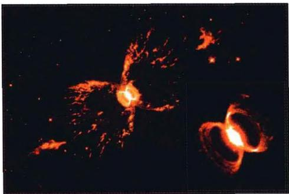
(a) 南天蟹状星云 He2-104

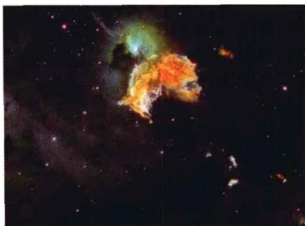

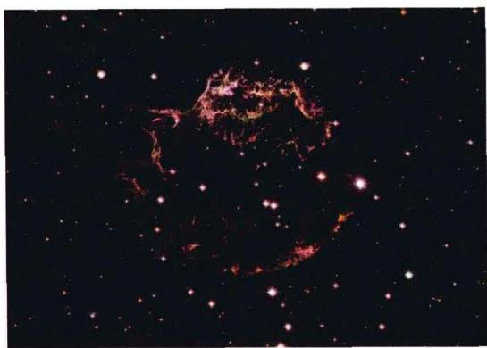
(c) 仙后座 A

(b) N63
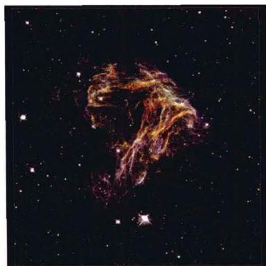
(d) N49
图3.23 形态各异的超新星遗迹

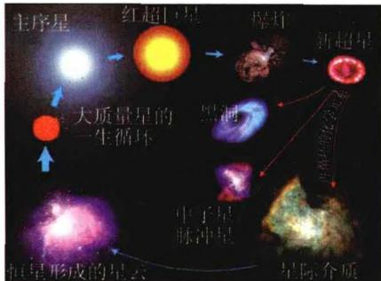
图3.24 大质量恒星的一生循环

内部核反应产生，但铁之后的元素只能在超新星爆炸的过程中合成。因此，地球上、包括我们自己身体上的比铁重的元素，都来自于超新星遗迹。可以毫不夸张地说，没有超新星爆发和超新星遗迹，人类也就不会在宇宙中出现了。

对超新星遗迹的观测发现,它们通常都具有很强的磁场,而且有大量高能电子存在。由经典电动力学我们得知,强磁场中的高能电子会发出同步加速辐射,这种

辐射具有很典型的特点,它的能谱呈幂律谱形式,并且有很强的偏振。观测得到的超新星遗迹的能谱,辐射强度随波长呈负指数幂下降。或者用对数坐标表示时,是一条向波长减小方向下降的直线,例如蟹状星云的能谱就是这样,见图3.25。图

中显示，射电部分的辐射强度远大于其他部分的强度，但由于整体辐射实在太强，使得我们可以在整个波谱上探测到同步加速辐射，从射电波段一直到 $\gamma$ 射线波段。这表明，蟹状星云所包含的电子发出的辐射能量极大。但我们又知道，高能电子在发出同步加速辐射时，会在很短的时间内失去能量。然而，蟹状星云已经存在了将近1000年，我们今天仍然观测到它发出的强烈辐射。这又提出了一个令人困惑的问题：在蟹状星云这样的超新星遗迹里，持续不断地提供高能电

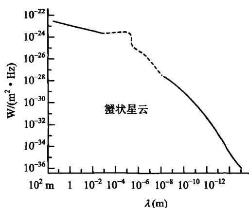
图3.25 蟹状星云的辐射
能谱，从射电波到 $\gamma$ 射线

子的源头在何处？目前较普遍的看法是，这一源头就是超新星爆发时诞生的中子星，也就是存在于超新星遗迹里的脉冲星。

