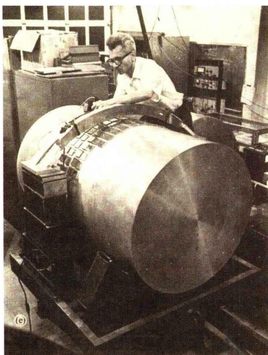
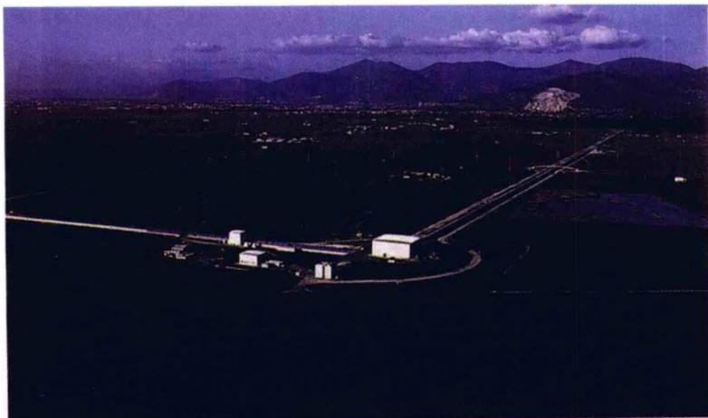
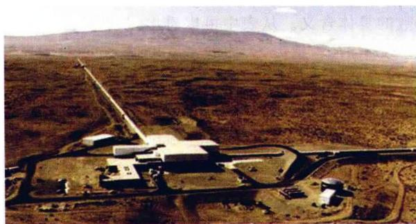

### 3.8 引力波辐射

引力波听起来有些神秘，往往认为只有学习了广义相对论才会了解它。其实，从牛顿力学出发也容易理解引力波的产生。例如，树上结的一只苹果，在某个时刻苹果枝突然折断，苹果落到地面。这意味着地球的质量分布有了一个突然的变化，于是，地球周围的引力场也就有一个突然的变化。但场的变化不会在整个空间中同时发生——在任何给定的空间点，场的变化要延迟一段时间，它等于光信号从地球传播到该点所需的时间。因此引力场的扰动以光速向外传播，这样传播的引力场的扰动就称为引力波。笼统地说，当一个系统的质量分布发生变化时，一般就会有引力波产生。所以，引力波的存在应当是狭义相对论的一个直接结果：引力作用不能以无限大的速度传播。因为无限大的速度不满足洛伦兹不变性，并且当信号速度超过光速时会发生因果关系的破坏。因为光速是唯一洛伦兹不变的速度，我们自然期望引力作用以波的形式传播，并且传播的速度等于光速。

当然，引力波的具体计算包括强度和类型（如正负螺旋型）是与引力理论的细节有关的，因而通过引力波的实验研究就可以检验引力理论。更加重要的是：引力波不是电磁波，电磁波在宇宙空间中传播时所受到的种种干扰（例如被星际物质吸收和散射），对引力波不起作用。因此，引力波具有极强的穿透力，从而在电磁波窗口、粒子窗口之外，再为我们开辟了一个观察宇宙的窗口。引力波天文学是对光学、射电以及X射线、γ射线天文学的有益补充，它将使我们能够“窥探”到类星体的核心以及其他强引力场区域。引力辐射暴的能量、脉冲形状和偏振，能够向我们揭示暴源处的天体物理过程。

类似于电磁学中的电偶极辐射或磁偶极辐射，两个相互绕转的天体（参见图3.26）会发出引力辐射，其计算过程大体类似于电动力学。所不同的是，电动力学中电磁波的源是随时间变化的电荷或磁荷分布，而引力波的源是随时间变化的质量（严格地说是能量-动量）分布。在图3.26所示的双星情况下（以下我们用脚标1,2代替原图中的a,b)，理论计算得到的该系统辐射的引力能功率是

$$
\frac {\mathrm{d} E}{\mathrm{d} t} = \frac {3 2 G}{5 c ^ {5}} \left(\frac {m _ {1} m _ {2}}{m _ {1} + m _ {2}}\right) r ^ {4} \omega^ {6}\tag{3.122}
$$

其中 $\omega$ 是双星的轨道运动频率。另一方面，开普勒第三定律给出轨道运动频率是

$$
\omega^ {2} = \frac {G (m _ {1} + m _ {2})}{r ^ {3}}\tag{3.123}
$$

故(3.122)式变为

$$
\frac {\mathrm{d} E}{\mathrm{d} t} = \frac {3 2 G ^ {4}}{5 c ^ {5} r ^ {5}} (m _ {1} m _ {2}) (m _ {1} + m _ {2}) ^ {2}\tag{3.124}
$$

由于该双星系统因引力辐射而损失能量,两个天体之间距离减小的速率是

$$
\frac {\mathrm{d} r}{\mathrm{d} t} = - \frac {6 4 G ^ {3}}{5 c ^ {5} r ^ {3}} m _ {1} m _ {2} (m _ {1} + m _ {2}) ^ {2}\tag{3.125}
$$

并且轨道频率增加的速率是

$$
\frac {\mathrm{d} \omega}{\mathrm{d} t} = - \frac {3 \omega}{2 r} \frac {\mathrm{d} r}{\mathrm{d} t} = \frac {9 6}{5} \left[ \frac {G (m _ {1} + m _ {2})}{c ^ {2} r} \right] ^ {3 / 2} \frac {G ^ {2} m _ {1} m _ {2}}{c ^ {2} r ^ {4}}\tag{3.126}
$$

从(3.124)～(3.126)可见，在两颗子星质量不变的情况下，引力辐射的功率、两星之间的距离变化以及轨道频率的变化都随 $r$ 的减小而显著增大。这就是说，只要轨道半径很小，双星系统就会有明显的引力辐射。遗憾的是，引力作用比电磁作用弱得多，两者之比大约为 $10^{-38}$ ；同时，探测器的频率还要求与引力波源的频率尽可能相近，以得到共振条件。但根据目前的技术条件，近期在地球上探测到双星引力波辐射的希望还是不大的。

然而，引力波可以由双星系统能量损失所引起的轨道变化而间接地探测到。双星系统由于引力辐射而失去能量，这使得它的轨道频率增加（(3.126)式），也就是轨道周期减小。例如，最著名的就是前面提到过的脉冲双星系统PSR1913+16，它是泰勒和赫尔斯在1974年用阿雷西博射电望远镜搜寻脉冲星时发现的。这一系统由一颗脉冲星（发出射电脉冲的转动中子星）和一颗伴星组成，伴星也是一颗中子星，两者的轨道非常接近，只有几百万公里，两者相互绕转的周期为7小时45分，运动速度达 $300\mathrm{km / s}$ 。观测发现，PSR1913+16的轨道周期每秒钟减少 $2.4\times$ $10^{-12}s$ （合每年减小 $76\mu s$ )，这与广义相对论的理论模型给出的结果符合得非常好，因而被看成是广义相对论关于引力波存在的一个有力证据，尽管是间接的证据。

计算表明，大约3亿年之后，这两颗中子星将碰撞在一起，产生最后的引力爆发。

如上所述，由于引力波的辐射强度十分微弱，在地球上要探测到它是非常困难的，探测器必需做得极其灵敏。两个小球用弹簧连接起来构成一个简单的谐振子，就可以用来作为引力波探测器，因为入射到这一系统的引力波将产生潮汐力，从而激发起振动。对于一个强引力辐射的天体物理源——例如，一个距离为10 kpc的超新星——引力波可能具有的振幅大约是 $10^{-18}$ 。这意味着如果我们把地-月系统看作是一个引力谐振子，则在该引力波的影响下，地-月距离将变化大约 $10^{18}$ 分之

图 3.34 韦伯 (T. Weber)20 世纪 60 年代建造的引力波探测器。大量压电换能器贴在圆柱体的中间。在运行时，探测器置于一个真空容器之中

一，即大约 $10^{-8}$ cm。利用激光脉冲技术，地-月距离测量的精度现在可以达到 1 cm 的量级，但显然，这对于探测超新星的引力波还是远远不够的。

为更加精密地测量距离的变化, 现在普遍应用的是激光干涉仪。已经建造了好几个臂长几十米的干涉仪, 用于探测入射引力波引起的距离变化。对于频率大约为 $1 \mathrm{kHz}$ 的引力波, 它们达到的灵敏度的量级是 $10^{-19}$ 。此外, 已有几台臂长为数百米到几千米的干涉探测仪开始工作或接近完成, 例如位于比萨附近的 VIR- GO(意大利-法国合作, 臂长 $3 \mathrm{~km}$ , 见图 3.35), 位于汉诺威的 GEO600(德国-英国合作, 臂长 $600 \mathrm{~m}$ ), 位于日本东京附近的 TAMA(臂长 $300 \mathrm{~m}$ )。最引起关注的是美国的两台迈克尔逊干涉仪型引力波探测器(一台位于路易斯安娜州, 臂长 $4 \mathrm{~km}$ , 另一台

位于华盛顿州，臂长 2 km)，它们联合组成 LIGO(Laser Interferometer Gravitational-wave Observatory，即激光干涉引力波天文台，见图 3.36)，预期达到的灵敏度量级是 $10^{-22}$ 。人们希望LIGO正式投入使用后，将能探测到双星、超新星以及星系中心黑洞大规模吸积物质时发出的引力波。

图 3.35 位于意大利比萨附近的引力波激光干涉仪 VIRGO

图3.36 位于美国华盛顿州的LIGO

