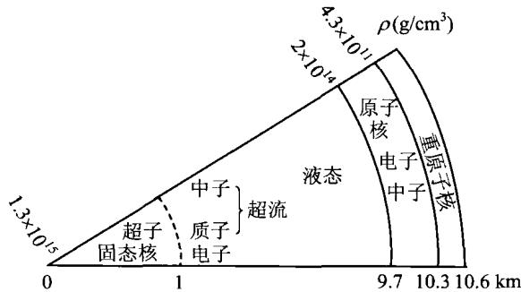

### 4.2 中子星

1932年英国卡文迪许实验室的查德威克(J. Chadwick)发现中子后不久，前苏联物理学家朗道(L. Landau)就指出，在极高的温度和压力下，质子和电子可能结合为中子，因此可能存在完全由中子构成的稳定的中子星。1934年，两位在美国工作的欧洲天体物理学家巴德(W. Baade, 德国)和兹威基(F. Zwicky, 瑞士)又提出，中子星可能是超新星爆发的产物，即星体爆炸后残留的致密星核。他们在一篇短文中写道：“超新星代表从普通恒星到中子星的转变。所谓中子星，就是恒星的最终阶段，它完全由挤得极紧的中子构成。”随后(1939年)，美国物理学家奥本海默(J. Oppenheimer)和沃尔科夫(G. Volkoff)从理论上建立了第一个定量的中子星模型，但他们采用的物态方程是理想的简并中子气模型。这显然过于简单了，但当时也只能如此，因为那时大家对致密中子状态下的物质特性几乎一无所知。

#### 4.2.1 中子星的结构

中子星依靠简并中子压来实现静力学平衡，所以对它的讨论很多地方类似于白矮星，但要把电子换成中子。让我们估计一下中子星的基本物理参数。首先来看简并时中子的数密度。由(4.4)并把 $m_{e}$ 换成中子的质量 $m_{n}$ （即取中子的费米动量 $p_{F}\approx m_{n}c$ ），得

$$
n _ {\mathrm{n}} \approx \frac {8 \pi}{3} \left(\frac {m _ {\mathrm{n}} c}{h}\right) ^ {3} \approx 1 0 ^ {3 9} / \mathrm{cm} ^ {3}\tag{4.17}
$$

可见由于中子的质量为电子质量的 $\sim 10^{3}$ 倍，结果使中子数密度为白矮星情况下电子数密度的 $\sim 10^{9}$ 倍。这样高的数密度使得中子之间的距离仅为 $\sim n_{\mathrm{n}}^{-1 / 3}\sim 10^{-13}$ cm，相当于中子一个挨一个地排列。再由(4.5)，相应的物质密度为

$$
\rho \approx m _ {\mathrm{p}} \mu_ {\mathrm{n}} n _ {\mathrm{n}} \approx 1 0 ^ {1 5} \mathrm{g/cm} ^ {3}\tag{4.18}
$$

注意此时 $\mu_{n}$ 表示每一个中子对应的核子数，显然 $\mu_{n}=1$ 。现在一般认为，中子星的密度范围是 $\rho\sim10^{14\sim15}~g/cm^{3}$ 。这样的密度实际上已经接近核子自身的密度，因此相互作用中的核力就变得非常重要，而且广义相对论效应也不能忽略。

前面讨论白矮星时曾得到钱德拉塞卡极限(4.13)，现如果取 $\mu_{n}=1$ ，则可得中子星质量上限的估计值为 $M\sim6M_{\odot}$ 。但由于至今对强相互作用时的物态方程还没有统一的认识，而且中子星的结构和性质对物态方程十分敏感，故中子星的质量上限目前仍没有一个确定的值，按不同的物态方程计算出来的值在 $0.7\sim2.9M_{\odot}$ 之间。现在普遍认为，静态中子星的质量上限是 $2.2M_{\odot}$ ，而转动中子星的质量上限是 $2.9M_{\odot}$ 。超过了这样的极限，中子星将不可避免地坍缩成为黑洞。

作为估计，我们取中子星的质量为太阳质量，按(4.14)可以算出它的半径约为 $R\approx10\ km$ ，相当于白矮星半径的 $m_{c}/m_{n}\sim1/1\ 000$ ，可见它的体积非常小。设想中子星位于最近的恒星那样近的距离（～10光年），且表面温度与太阳一样为6 000 K，则视星等将是 $27^{m}$ ，这是用光学方法目前极难观测到的。故人们首先是用射电方法观测到中子星，即下一节要讨论的脉冲星。

从中子星表面到中心，密度从通常的铁晶体密度很快增加到 $10^{15} \mathrm{~g/cm}^3$ ，变化范围超过10个以上的数量级。现在知道，中子星外部有一层大气（等离子体）。表面以内是外壳，开始主要是 $^{56}\mathrm{Fe}$ 原子核形成的晶格点阵以及简并的电子气体，表层密度大约为 $\sim 10^{6} \mathrm{~g/cm}^3$ 。从外向内密度逐渐增加，电子的费米能量也逐渐升高，最后高到迫使电子同核内质子结合成一系列富含中子的核，例如 $^{62}\mathrm{Ni}, ^{82}\mathrm{Ge}, ^{80}\mathrm{Zn}, ^{124}\mathrm{Mo}$ 和 $^{118}\mathrm{Kr}$ ，最后的 $^{118}\mathrm{Kr}$ 包含82个中子和36个质子。核内的中子化过程一直进行到密度为 $4.3 \times 10^{11} \mathrm{~g/cm}^3$ ，这时还几乎没有核外的自由中子。超过这一密度，就过渡到内壳，此时开始有自由中子出现，主要是含中子最丰富的 $^{118}\mathrm{Kr}$ 释放中子，这个过程称为中子漏(neutron drip)。故内壳的中子星物质是由形成点阵的重原子核、自由电子以及自由中子所组成的，压力主要还是以简并电子压为主。外壳和内壳都是固态的，总厚度大约为 $1 \mathrm{~km}$ 。内壳以内是核区，此时中子漏过程随着密度的增大而越发显著，当密度增加到 $\sim 2 \times 10^{14} \mathrm{~g/cm}^3$ （即每立方厘米2亿吨）以上时，原子核就完全离解消失，绝大部分核子中子化，中子星物质变成杂有少量电子、质子的连续中子流体。在这样高的密度下，物态方程远比理想气体的物态方程复杂。当密度超过 $10^{15} \mathrm{~g/cm}^3$ ，物态方程就变得越来越不明确，而当密度达到 $10^{16} \mathrm{~g/cm}^3$ 以上时，物态方程就完全不得而知了。这是最重的中子星中心可能达到的密度，在这样的密度下，粒子间距为 $0.7 \mathrm{fm}(1 \mathrm{fm} = 10^{-13} \mathrm{fm})$ 。为了测定如此短程的核力，需要对能量接近 $1 \mathrm{GeV}$ 的中子相互作用进行测量。正是由于核区物态方程的不确定性，使得中子星质量上限的各种计算结果有相当大的分歧。

简并中子流体处于超流状态，即粘滞力几乎为零，但简并电子气并没有相应地变为超导，仍属于正常状态。在简并中子流体的情况下，能量接近费米能的中子彼此吸引，形成中子对；然后，能谱中出现大约1 MeV宽的间隙，这一间隙阻碍了粘性所必需的能量再分布，使流体出现超流性质。对于质子流体，则会出现超导性。因而，整个中子流体区域是超流的，同时质子是超导的，但电子是正常的。中子流体区域从密度 $2\times10^{14}\ g/cm^{3}$ 延伸到大约 $10^{15}\ g/cm^{3}$ ，其厚度为8 km左右。

密度达 $10^{15}$ g/cm $^{3}$ 时，中子的费米能很大，会产生下述反应：

$$
\begin{array}{r l}\mathrm{n+n→p+} \Sigma^ {-}, \mathrm{n+} \Lambda , \mathrm{p+} \Delta^ {-}\\\mathrm{e} ^ {-} + \mathrm{p} \rightarrow \Lambda + \nu_ {\mathrm{e}}\\\mathrm{e} ^ {-} + \mathrm{n} \rightarrow \Sigma^ {-} + \nu_ {\mathrm{e}}\end{array}\tag{4.19}
$$

即出现超子。当电子的费米能量达到 106 MeV，亦可以发生

$$
\mathrm{e} ^ {-} \rightarrow \mu^ {-} + \bar {\nu} _ {\mu} + \nu_ {\mathrm{e}}\tag{4.20}
$$

即出现 $\mu$ 子。密度大于 $10^{15} ~g/cm^{3}$ 的区域为中子星的核心，它是固态的，半径约

1 km。这个区域的物质主要由 $\Lambda$ 和 $\Sigma$ 超子组成。也有人认为，当密度超过核子密度时，可能会出现 $\pi^{-}$ 介子：

$$
\mathrm{n} \rightarrow \mathrm{p} + \pi^ {-}\tag{4.21}
$$

因为 $\pi^{-}$ 是玻色子，因而就可能形成与通常的玻色-爱因斯坦凝聚一样的 $\pi$ 凝聚相。但是，由于强相互作用的影响，这一看法还没有得到公认。还有人认为，也可能核心的物质是夸克物质或强子汤等形式。表4.2列出了中子星内部结构各部分的主要特性，结构简图见图4.2。

表 4.2 中子星内部的主要物理特征

|  | 密度 | 主要物理特征 | 厚度 |
|---|---|---|---|
| 外壳 | $10^6 \sim 4.3 \times 10^{11} \text{ g/cm}^3$ | 固体外壳,主要由Fe原子核的晶格点阵和简并自由电子气构成 | ≤1 km |
| 内壳 | $4.3 \times 10^{11} \sim 2 \times 10^{14} \text{ g/cm}^3$ | 重核晶格,自由中子和自由电子 | &lt;1 km- |
| 内部 | $2 \times 10^4 \sim 10^{15} \text{ g/cm}^3$ | 主要是超流中子流体,并杂有少量超流质子、电子、μ-子,状态是超流、超导 | ~8 km |
| 核心 | $\geqslant 10^{15} \text{ g/cm}^3$ | 固态超子核,亦可能出现π凝聚相、夸克等形式 | ≤1 km |

图4.2 中子星结构简图

#### 4.2.2 中子星的自转与磁场

在恒星坍缩成中子星的过程中,如果角动量完全守恒,则坍缩后的中子星可以获得很高的自转角速度。我们用一个简单的模型来对此做一估计。设恒星坍缩前

后都可以看成是均匀球体，则角动量为

$$
J = I \omega = \frac {2}{5} M R ^ {2} \omega\tag{4.22}
$$

假定坍缩前恒星的各项参数与太阳差不多，即 $M, R, \omega$ 取为太阳的值（这基本上是合理的，但对于自转角速度 $\omega$ 而言可能还是保守的估计，因为与我们看到的其他恒星相比，太阳的自转并不算很快）。由于 $J$ 在坍缩过程中保持为常量，恒星总质量也假设基本不变，故坍缩后有

$$
\omega R ^ {2} = \omega_ {\odot} R _ {\odot} ^ {2}\tag{4.23}
$$

即

$$
\frac {\omega}{\omega_ {\odot}} = \left(\frac {R _ {\odot}}{R}\right) ^ {2} \approx 5 \times 1 0 ^ {9}\tag{4.24}
$$

计算中取 $R \approx 10 \, km$ 。太阳的自转周期约为 30 天 ( $\sim 2.6 \times 10^{6} \, s$ )，因而由 (4.24) 算出中子星的自转周期为

$$
P \approx \frac {2 . 6 \times 1 0 ^ {6}}{5 \times 1 0 ^ {9}} \mathrm{s} \approx 0. 5 \mathrm{ms}\tag{4.25}
$$

即约为毫秒量级，也就是一秒钟内要旋转1000周以上。这样高的自转速度在通常恒星的情况下是绝对不可能出现的。中子星内部大部分是超流的流体，但在高速自转的情况下，流体内部会产生强烈涡动（旋涡），这将导致某种粘滞性出现，结果把流体内部与固态外层耦合在一起。

类似于角动量的讨论,如果恒星表面的磁通量在坍缩时也是守恒的,则由于磁通量正比于磁场强度和表面积,就会有

$$
B R ^ {2} = \text { 常   量 }\tag{4.26}
$$

因此，磁场强度 B 应当反比于 $R^{2}$ ，这一比率与（4.24）是一致的。假设中子星起初具有太阳表面的磁场强度，即大约 1 高斯，按（4.24）中子星表面磁场强度就可达到约 $10^{10}$ 高斯。实际上，恒星表面 100 高斯的磁场是很普遍的，更不用说宇宙中还有磁场为几千高斯的磁星，因而中子星表面磁场很容易达到 $10^{12}$ 高斯甚至更高。虽然这样来解释磁场的起源比较简单直观，但起初对这么强的磁场的寿命问题还是有争论的，因为欧姆耗散可能会使强磁场在短时间内衰减掉。目前的看法是，在高速自转的情况下，中子星内部的超导电性有助于建立起很强的磁场。强的磁场又有高速转动，必然会产生强大的电磁辐射，这就是脉冲星。

总之，中子星具有强引力、强磁场以及极高的密度，它本身包含了自然界全部四种基本相互作用（引力、强、弱以及电磁），可以称为宇宙极端条件下的综合实验室。因此，对于研究物质深层次结构、探索极端条件下的物理规律，中子星起着一

种独特的作用。

最后，再补充一点关于中子星温度的情况。当中子星刚刚被超新星爆发的烈焰“锻造”出来时，它的温度极高，可达 $T\sim10^{11}$ K。在形成后的第一天，它的冷却是通过所谓的乌卡（URCA）过程（乌卡是巴西里约热内卢的一家著名赌场，据说在这家赌场中，钱可以被神不知鬼不觉地从一个不走运的人身上转移掉），即

$$
\begin{array}{r l}\mathrm{n}&\rightarrow \mathrm{p} + \mathrm{e} ^ {-} + \overline {{\nu}} _ {\mathrm{e}}, \quad \mathrm{n} + \mathrm{e} ^ {+} \rightarrow \mathrm{p} + \overline {{\nu}} _ {\mathrm{e}}\\&\quad \mathrm{p} + \mathrm{e} ^ {-} \rightarrow \mathrm{n} + \nu_ {\mathrm{e}}\end{array}\tag{4.27}
$$

当中子和质子像这样来回相互转变时，大量的中微子和反中微子产生出来。它们悄无声息地离开中子星而逃逸到周围的宇宙空间，同时携带走大量的能量，这就使得中子星发生迅速冷却。经过大约一天的时间，中子和质子都进入低能的简并状态，中子星内部的温度也降到大约 $10^{9}\mathrm{K}$ ，乌卡过程就停止了。但其他的中微子过程继续主导冷却，这一情况将持续1000年左右，之后的冷却过程由星体表面发出的光辐射所主导。当中子星的年龄在几百年时，内部温度降到 $10^{8}\mathrm{K}$ ，表面温度降到几百万度。在此后大约1万年的时间内，表面温度将一直维持在 $10^{6}\mathrm{K}$ 左右。

