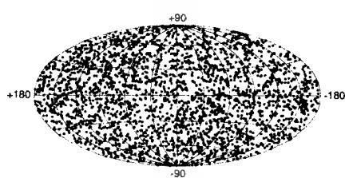
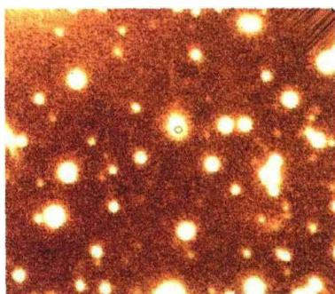
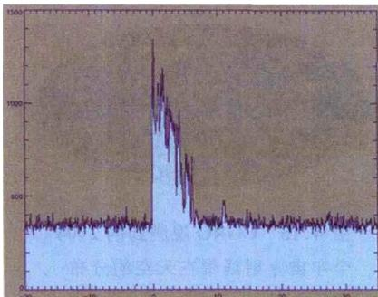
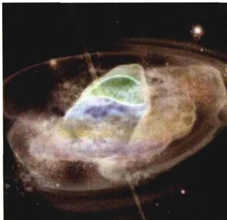
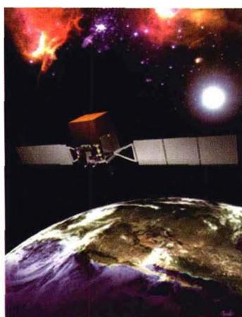

### 4.5 宇宙 $\gamma$ 射线暴

宇宙中的 $\gamma$ 射线暴（Gamma-Ray Bursts，简称GRB)首先是由维拉（Vela）军事卫星发现的。1963年，为了监督前苏联是否实际遵守了禁止核试验条约，以美国为首的西方国家发射了系列军事卫星，取名“维拉”（西班牙语，看守人之意）。卫星上装有检测核爆炸所发 $\gamma$ 射线的装置，而且是成对

发射到25万km高的轨道上，两颗卫星遥遥相对，以监视地球上的核活动。为了避免与宇宙空间的信号相混淆，卫星也对宇宙其他方向进行了检测。1967年，两颗卫星同时纪录到相似的γ射线爆发的信号，后经仔细分析确认，爆发不是起源于地球上，而是地球以外的宇宙空间。这一发现直到1973年才对外界公布，当即引起了全世界天体物理学家的强烈兴趣。根据开头几年的观测，γ射线暴每年大约出现12次，每次时间持续0.1～100s。卫星上接收到的它们的平均能量约为 $10^{-4}\mathrm{erg}/(\mathrm{s}\cdot\mathrm{cm}^{2})$ ，如果这是在光学波段，就相当于金星那样明亮。设想它们与我们相距3000光年（这算是银河系中与我们较近的距离），可以算出它们的辐射功率（光度）为大约 $10^{40}\mathrm{erg/s}$ ，比太阳的光度要大出6～7个数量级。观测还发现，γ射线暴的强度变化（即光变）十分迅速，有的光变时标在几毫秒内，这样相应的暴源尺度不会超过几千公里，有的甚至在几百公里以下。如此高的能量从这样小的范围内发出，这在当时是不可思议的。维拉卫星的任务是监测地球上的核爆炸，结果却发现了宇宙间另外的猛烈无比的爆炸，听起来真有点像是传奇故事。自那以后，许多天体物理学家便开始对宇宙γ射线暴的起源做出种种猜测，提出过的模型有上百种。这些模型几乎涉及所有的高能天体过程，例如中子星、白矮星、黑洞和超新星爆发，以及正反物质湮灭和其他更离奇的一些模型。但长期以来这一问题始终没有得到解决，人们甚至搞不清楚，这些爆发源究竟是在银河系内，还是远在银河

系外的宇宙空间。

1991年，康普顿 $\gamma$ 射线空间天文台(CGRO)发射升空后，发现的宇宙 $\gamma$ 射线

暴的数量大为增加,大约每天都会发现一例。其在天空的分布是完全随机的(见图4.16),这表明它们的起源并非银河系内。 $\gamma$ 光子的能量大约从1 keV到若干GeV以上(虽然这一范围的低端包括了X射线光子,但爆发的大部分能量是在 $\gamma$ 射线波段),爆发持续的时间通常是从 $10^{-2}\sim10^{3}$ s,且一般特征是在 $10^{-4}$ s内迅速爆发,随后是较慢的指数衰减。

图4.16 CGRO观测到的2704个宇宙 $\gamma$ 射线暴在天空的分布

爆发的光变曲线通常显现多个峰,但没有一个典型的轮廓。

对 $\gamma$ 射线暴起源的研究,关键是它们距离的确定,这个问题直到 1997 年才解

图 4.17 2005 年 7 月 24 日发生的一次 γ 射线暴(图中以小圆圈代表),以及它的可见光余辉(小圆圈所在的白斑)

决。1997年2月28日，由意大利空间局和荷兰航空航天计划局共同研制的BeppoSAX空间飞行器发现， $\gamma$ 射线暴GRB970228消失后，原爆发地点仍然有逐渐暗淡下去的X射线以及光学余辉(参见图4.17)存在。随后由凯克望远镜和哈勃空间望远镜共同对这一余辉进行了跟踪观测，并由其中的谱线红移测量，确定GRB970228发生于一个遥远的星系中。后来，利用 $\gamma$ 射线暴的余辉又测定了一大批 $\gamma$ 射线暴源的距离，发现它们都位于银河系以外的遥远星系。特别值得一提的是，SWIFT空间望远镜升空后不久，就于2005年3月发现了两次 $\gamma$ 射线爆发（GRB050318和

GRB 050319)。紫外和光学余辉表明，它们的红移分别为2.7和3.24，相应的与地球的距离分别为105亿光年和116亿光年。在这样大的距离(红移)上发现 $\gamma$ 射线暴，是当时人们完全没有预料到的，发现后立即引起了学术界的强烈兴趣和广泛关注。半年以后，又一个更大红移的 $\gamma$ 射线暴GRB050904被发现了，它的红移达到 $z = 6.3$ ，与目前观测到的最大红移的类星体(见第6章)差不多。

从观测结果来看, 宇宙 $\gamma$ 射线暴基本分为两种类型: 一类称为长暴(long-soft GRB, 见图 4.18), 另一类称为短暴(short-hard GRB)。前者爆发持续时间在 2 秒以上， $\gamma$ 光子具有较低能量；而后者持续时间短于2秒，且 $\gamma$ 光子的能量较高。现在认为，长暴与超新星爆发密切有关，而短暴产生于中子星与中子星、或中子星与

图 4.18 SWIFT 空间望远镜 2004 年 12 月 11 日观测到的一次 $\gamma$ 射线暴。横轴表示时间，纵轴表示纪录到的 $\gamma$ 光子数。该次爆发持续时间大约为 7 秒

黑洞的并合。

γ射线长暴与超新星爆发的直接关联有两个著名的例子。一个是GRB980425和超新星SN1998bw，另一个是GRB030329和超新星SN2003dh。关于超新星爆发时如何产生γ射线暴，目前有两种看法。一种看法认为，当超新星的前身星具有足够大的质量时，星核坍缩的结果将形成黑洞，且超新星碎片回落后，在黑洞周围将形成一个由碎片构成的吸积盘（debris disk，图4.19）。由于强磁场的作用，会有相对论性的喷流从碎片盘中心附近发出，喷流遇到周围下落的物质时，会使物质极度加热并形成火球，从而产生强烈

的 $\gamma$ 射线暴。第二种看法认为，核坍缩时首先形成的不是黑洞，而是一颗转动的中子星，其质量范围在 $2.2M_{\odot} < M < 2.9M_{\odot}$ 。它具有很强的磁场，但强磁场与周围物质的作用，会使得中子星的转动速度在几周或几个月的时间内变慢下来。当中

子星的转速变慢时，就有可能发生进一步的引力坍缩而形成黑洞。如果在黑洞的周围还形成一个碎片盘，则相对论性的喷流就会有条件产生，并从而形成γ射线暴。这个模型的好处是，由于黑洞是在超新星爆发之后一段时间才形成的，超新星爆发把外层绝大部分重子物质抛射了出去，故黑洞周围的重子物质很少，因此喷流不会马上减速，而能够在相当一段时间内保持为相对论性。

γ 射线短暴第一次被探测到并被确定位置是在 2005 年 3 月 9 日, SWIFT 空间望远镜发现了它并同时观测到它的 X 射线余辉。不久, 2005 年 7 月 9

图 4.19 黑洞周围的碎片吸积盘(模拟图)

日，NASA的高能暂现源观测卫星(HETE-2)观测到了一次短暂 $\gamma$ 射线爆发，持续时间只有十分之一秒。两天半之后，钱德拉卫星捕捉到了它的X射线余辉，夏威

夷和智利的地面望远镜跟着也观测到它的可见光余辉，并由此得出它与地球的距离为18亿光年。接着，SWIFT在7月24日也观测到一次持续时间只有0.25秒的短暂γ暴，一天以后，美国的VLA在射电波段发现了它的余辉，并确定它位于一个主要由老恒星组成的星系中，距离我们28亿光年。这次爆发的光学余辉也被观测到，于是它成为第一个在X射线、可见光和射电波段都观测到余辉的γ射线短暴。

现在认为， $\gamma$ 射线短暴是由一对致密双星的碰撞并合而产生的。上一章引力波辐射一节中提到的脉冲双星系统 $\mathrm{PSR}1913 + 16$ ，其最后归宿将是两颗中子星碰撞到一起，且发出 $\gamma$ 射线短暴。研究表明，如果这样的并合发生在距地球几亿光年的距离内，则它发出的引力波辐射就可以被LIGO这样的引力波探测器探测到。

图 4.20 正在研制的新一代 $\gamma$ 射线望远镜 GLAST, 将专门用于观测宇宙 $\gamma$ 射线暴
