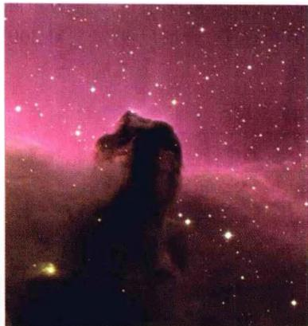
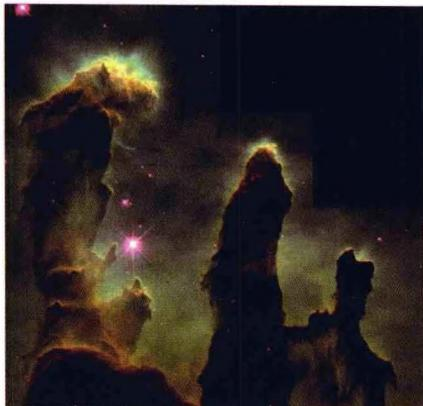
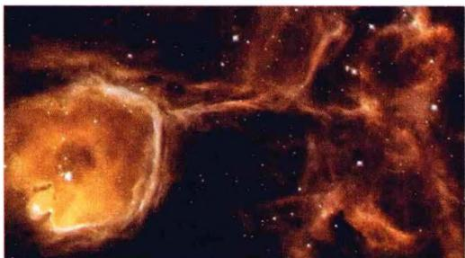
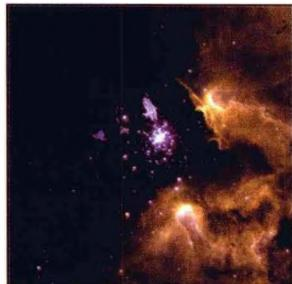
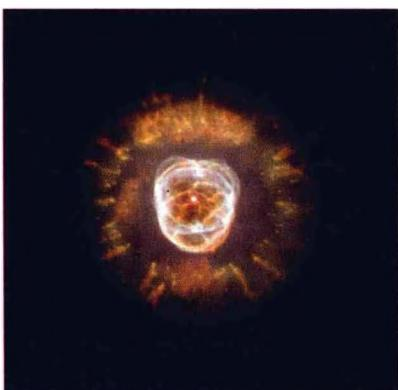
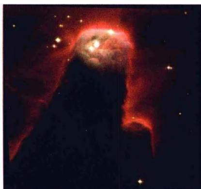

## 第5章 星际物质

### 5.1 星际物质的概况

恒星之间存在大量的稀薄气体和尘埃，它们被统称为星际物质（或星际介质）。在宇宙学一章中我们还要谈到星系际物质，它们延展的尺度和包含的质量都达到星系的量级。本章我们只讨论星际物质，它们既是恒星诞生的摇篮，也是恒星演化的归宿之一（例如恒星演化晚期抛射的行星状星云，见图3.12）。实际上，早在18世纪末，英国天文学家威廉·赫歇尔就已经注意到恒星之间有弥漫的星云存在，并发现银河中有一些暗的、缺少恒星的“空洞”和“裂隙”。他认为，这些暗区并不是真正缺少恒星，而是由于大量暗星云的存在，把恒星发出的星光遮蔽了。但直到19世纪30年代，这种看法才被大多数人所接受，这其中最主要的证据来自对恒星光谱的研究。1904年就有人注意到，猎户座 $\delta$ 星这一分光双星的光谱中，除了周期性移动的谱线（由于双星轨道运动，引起两颗星的谱线产生多普勒频移）外，还有一条静止的CaⅡ谱线，这显然不是双星发出的，而应当是来自双星与地球之间的星际钙离子云。不久，又陆续发现了星际NaI、CaI、KI、FeI和TiⅡ的谱线。同时，由于对星际红化的研究，还发现了星际物质中存在微小的固体颗粒（尘埃）。通过观测人们了解到，这些气体和尘埃在银河中的分布不是均匀的，而是较多地聚集在不规则的星云之中。这样，人们对于星际物质的认识才逐渐清晰起来。

现在我们知道，星际物质的成分，除了星际气体、尘埃以外，还包括星际磁场和宇宙线，严格来讲还应当有弥漫于各处的星光。在银河系中星际物质的总质量约占 $10\%$ ，密度范围是 $10^{-20} \sim 10^{-25} \mathrm{~g/cm}^3$ ，平均密度一般取为 $10^{-24} \mathrm{~g/cm}^3$ ，相当于平均数密度每立方厘米1个氢原子，约为宇宙平均物质密度的 $10^{5}$ 倍。作为对比，地面实验室里所能达到的最高真空度为 $10^{-12} \mathrm{mmHg}$ ，相当于每立方厘米32000个原子。现在习惯上把数密度超过每立方厘米10个原子（或离子、分子）的星际物质聚集区称为星云或星际云，而把星云以外更为稀薄的星际物质区域称为星际介质。星云的典型密度为每立方厘米几十个到几百万个原子，典型尺度为3到300光年。表5.1列出了各种不同成分的星际物质的密度。

表 5.1 星际物质的密度

| 星际物质的成分 | 密度 |
|---|---|
| 星际气体 | $0.025M_{\odot}/pc^{3}$ |
| 星际尘埃 | $0.002M_{\odot}/pc^{3}$ |
| 宇宙射线 | $0.5eV/cm^{3}$ |
| 星际磁场 | $0.2eV/cm^{3}$ |
| 星光 | $0.5eV/cm^{3}$ |

总的说来，星际物质的一些主要特点是：

密度分布可相差很大，当数密度超过 $10\sim 10^{3} / \mathrm{cm}^{3}$ 时，成为星际云，云与云之间的密度为 $0.1 / \mathrm{cm}^3$ 。局部温度也相差很大，从 $10\mathrm{K}$ 可以到 $10^{7}\mathrm{K}$ 。因而，光子在星云中的平均自由程也有很大差别，这就使得对一定能量的光子，有些区域是透明的，但另一些区域是不透明的。

\- 星际物质通常和年轻恒星一起，高度集中在银道面，尤其是在旋臂中（银道面厚度约200pc，但银河系直径约30 kpc）。

\- 星际气体。包括气态的原子、分子、电子、离子，其化学成分可以通过各种电磁波谱线的测量得出。结果表明，星际气体的元素丰度与根据太阳、恒星、陨石得出的宇宙丰度相似，即氢最多，约占 $60\%$ ，氦约占 $30\%$ ，其他元素含量很低。根据其主要成分——氢原子所处的物理状态，星际气体通常分为中性氢（H I）区、电离氢区（H II）区和分子云。H I区的数量最多，约占星际气体总质量的 $90\%$ 。在明亮的O型星、B型星及其星团周围，由这些恒星发射的波长 $\leqslant 912\AA$ 紫外线使大部分氢原子电离，其中一部分又复合，成为激发态原子，会形成发射线；或者再吸收紫外辐射又电离——故总的来看电离与复合达到动态平衡。这种电离区称为H II区，或发射星云。它的温度约 $10^{4}\mathrm{K}$ ，相当于萨哈公式中氢的电离温度。在离O型和B型星 $10\sim 100\mathrm{pc}$ 处，电离的H II区就过渡到中性的H I区。分子云通常出现在密度较高的中性氢云里面，形状呈无规则的弥漫状态，其典型数密度为 $500\sim$ $5000 / \mathrm{cm}^3$ ，质量为 $3\sim 100M_{\odot}$ ，温度大约 $15\sim 50\mathrm{K}$ 。它们延展的尺度可达几个pc。还有一些分子云由尘埃和气体混合而成，称为巨分子云，例如图5.1a所示的马头星云，它只是猎户座巨分子云的一部分。现在银河系内已知的巨分子云有数以千计，大多数位于银河系的旋臂上。这些巨分子云典型的温度是 $\sim 15\mathrm{K}$ ，质量可达 $10^{5}\sim 10^{6}M_{\odot}$ ，典型尺度为 $50~\mathrm{pc}$ 。在这些巨分子云的内部，可以观测到一些较为致密的核区甚至热的核区。例如美国NASA发射的斯必泽红外望远镜（SST），以及欧洲空间局发射的红外空间天文台（ISO），都发现了一些巨分子云中的热核，它们的特征尺度为 $0.05\sim 0.1\mathrm{pc}$ ，温度 $100\sim 300\mathrm{K}$ ，数密度 $10^{7}\sim 10^{9} / \mathrm{cm}^{3}$ ，质量 $10\sim$ $3000M_{\odot}$ ，其中发现有许多大质量的年轻O型星和B型星。由此可见，巨分子云中的这些热核应当是新恒星的诞生区。

(a) 马头星云

(b) 天鹰星云

(c) 三裂星云

(d) NGC3603 云

(e) “爱斯基摩”星云 NGC2392

图5.1 几个著名的星云

(f) 锥状星云 NGC2264

\- 星际尘埃。星际尘埃只占星际物质质量的百分之几，它们是直径 $\sim 10^{-5}$ cm左右的固态颗粒，最小的只有 $1\mathrm{nm}$ ，大约只包含20到100个原子。星际尘埃一般由下列物质组成：

1） $H_{2}O$ ，甲烷 $\left(\mathrm{CH}_{4}\right)$ ，氨 $\left(\mathrm{NH}_{3}\right)$ 等冰状物；

2） $SiO_{2}$ ， $Fe_{2}O_{3}$ ，FeS等矿物；

3) 石墨晶粒。

较大的颗粒一般自身还有结构，核心可能是由硅化物和碳组成，核心外是各种物质构成的幔，例如一层含有固态的水和氨，另一层含有固态的氧、氮和一氧化碳，甚至还可能有氢形成的薄薄外层。

尘埃对光学观测的影响是产生星际消光和星际红化。星际消光是由于尘埃对光的吸收和散射，使星光变暗，即视星等增加。星际红化是由于尘埃对星光散射时，根据瑞利定律，散射截面 $\sigma \propto 1 / \lambda^4$ ，故短波光（蓝、紫色）散射很强烈，而长波光（红色）大部可以透射过来，这就使我们看到的恒星颜色变红，就像大气散射使得日出和日落时的太阳颜色变红一样。

尘埃可以通过3条途径被加热：1)吸收恒星的辐射；2)与星际分子碰撞（非弹性碰撞），分子的动能传给尘埃；3)尘埃表面分子形成时束缚能的相当部分将存储在尘埃上，例如当 $2H\rightarrow H_{2}+4.48eV$ ，束缚能的1/3，即约1.5eV可以用于加热尘埃。只要尘埃的温度达到绝对温度几十度，就可以发出红外辐射，我们就可以通过红外光的观测来了解它们的一些物理性质，例如温度等。附带提到，尘埃对星际分子的形成和存在具有重要作用：一方面能够阻挡紫外线，使星际分子不致离解；另一方面尘埃可以作为催化剂，加速星际分子的形成。

目前的看法是，除了一部分是超新星爆发的产物外，大多数尘埃颗粒是由红巨星包层的物质流失而形成的。当物质离开星体表面时，它们相当热而且呈气态。当远离恒星表面时，它们便冷却下来。如果温度降到 $1000\sim 2000\mathrm{K}$ ，许多物质，例如硅酸盐，就不能以气体的形式存在而形成小的固体颗粒。这些颗粒通过星风、物质抛射等方式或作为行星状星云的一部分，进入到星际气体云中。然后，它们可以在气体中聚集粒子而长大，但长大的尺度有一定的极限。例如，当颗粒上有一层分子氢或一个分子团时，就不会再有氢吸附上来。另一方面，颗粒也会由于碰撞等原因而变小。

