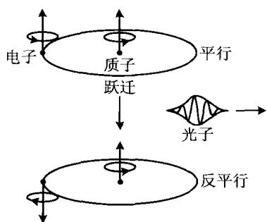
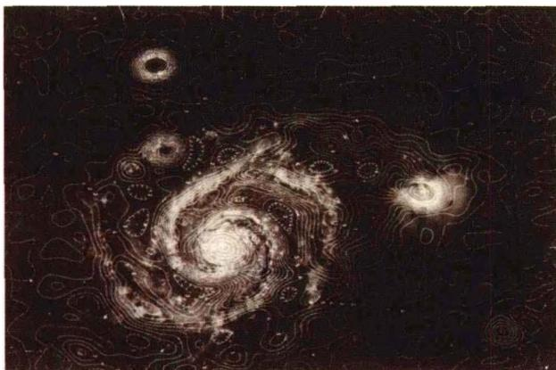

### 5.2 中性氢区(H I 区)与射电 21 cm 谱线

中性氢云的密度约为10个氢原子/ $cm^{3}$ ，平均半径为 $10\ pc(\sim10^{19}\ cm)$ ，平均质量约为 $10^{3}M_{\odot}$ 。星云中气体的热运动速度大约为10 km/s，这只相应于不到100 K的温度，同时，星云的密度又很低，这就使得中性氢原子绝大部分处于基态，只有极少处于激发态。例如，取 $n_{H}\approx1\ cm^{-3}$ ，中性原子的碰撞截面是 $\sigma_{c}\approx10^{-15}\ cm^{2}$ ，因而碰撞的平均自由程为

$$
l _ {c} \approx 1 / n _ {\mathrm{H}} \sigma_ {c} \approx 1 0 ^ {1 5} \mathrm{cm}\tag{5.1}
$$

如果气体的温度是 $T$ ，则原子的平均速度由下式给出

$$
\frac {1}{2} m _ {\mathrm{H}} \overline {{{v}}} ^ {2} = \frac {3}{2} k T\tag{5.2}
$$

这样算出的碰撞率是

$$
\begin{array}{r l} & {\frac {1}{\tau_ {c}} \approx \frac {\overline {{{v}}}}{l _ {c}} \approx \left(\frac {3 k T}{m _ {\mathrm{H}}}\right) ^ {1 / 2} n _ {\mathrm{H}} \sigma_ {c}} \\ & {\qquad \approx 7 \times 1 0 ^ {- 1 2} T ^ {1 / 2} \mathrm{s} ^ {- 1}} \end{array}\tag{5.3}
$$

如取 $T \approx 80 \, \text{K(H I区通常的温度)}$ ，可得原子之间的平均碰撞时间约为 500 年。这样长的碰撞时间意味着，中性氢云中的绝大部分氢原子处于基态，只有极少数处于激发态，因此很难观测到中性氢的谱线发射。

1944年，荷兰天文学家范·德·胡斯特(Vande Hulst)首先提出，考虑到原子核的自旋，氢原子的基态能级会分裂而形成超精细结构，因此有可能在银河系中观测到星际氢原子的谱线发射，这一谱线相应的波长为 $21\mathrm{cm}$ ，在射电波段。几乎同时，前苏联的史克洛夫斯基(I.Shklovski)也做了类似的理论分析。经过几年的努力，到1951年，美国、荷兰、澳大利亚的天文学家几乎同时观测到了这一谱线。

射电 21 cm 谱线的产生, 是由于氢原子基态的两个超精细能级之间的跃迁。我们知道, 基态氢原子的原子态是 $1^{2}S_{1/2}$ , 它的轨道角动量 L = 0, 电子自旋角动量 $s = \frac{1}{2}$ , 故总角动量 J 中只有电子自旋的贡献, 结果是 $J = \frac{1}{2}$ 。这样, 原子基态的能级就是唯一的。但另一方面，氢原子核也具有核自旋角动量 $I=\frac{1}{2}$ ，这一角动量可以与电子的自旋角动量相耦合，耦合的结果给出（见图 5.2）：

$$
F = J \pm I
$$

$F = \left\{ \begin{array}{ll}1 & \text{电子自旋与核自旋平行} \\ 0 & \text{电子自旋与核自旋反平行} \end{array} \right.$ $↑↑$ （上能级） $\uparrow ↓$ （下能级）

(5.4)

因此，原来的单一能级就分裂为超精细结构的两个能级。这两个能级的差为 $5.8 \times 10^{-6}$ eV，相应的跃迁光子的频率 $\nu = \Delta E / h = 1420$ MHz，波长 $\lambda = 21.11$ cm。这就是 21 cm 射电谱线的产生。

如果处在上能级的原子数很少,我们仍然不能指望有什么观测效应。但情况并非如此。按照玻尔兹曼统计,原子在这两个超精细能级的布居数之比为:

图 5.2 射电 21 cm 谱线的产生

$$
\frac {n _ {1}}{n _ {0}} = \frac {g _ {1}}{g _ {0}} \exp \left(- \frac {h \nu_ {1 0}}{k T _ {s}}\right)\tag{5.5}
$$

其中 $n_1, n_0, g_1, g_0$ 分别为 $F = 1$ 和 0 的子能级的原子数及统计权重， $g = 2F + 1$ ，这样有 $g_1 / g_0 = 3 / 1 = 3$ 。 $T_s$ 为激发温度（自旋温度），在通常星际气体的情况下， $T_s \simeq T (T$ 是气体的动力学温度）。(5.5)式指数中的 $h\nu_{10} / k \approx 0.07\mathrm{K}$ ，故只要 $T_s$ 大于几度 $\mathbf{K}$ ，就有 $\exp (-h\nu_{10} / kT_s) \approx 1$ ，因而(5.5)式最后有

$$
\frac {n _ {1}}{n _ {0}} \approx \frac {g _ {1}}{g _ {0}} = 3\tag{5.6}
$$

这表明，即使在通常的情况下，处在基态的上能级的原子数也远大于下能级的原子数，即出现了布居数的反转。正是由于 $n_1 > n_0$ ，并且星际气体中氢的含量十分巨大，故虽然跃迁几率很低，仍足以产生可观测的效果。

对于 21 cm 射电辐射, 精细结构上下能级之间自发跃迁的几率是

$$
A _ {1 0} = \frac {6 4 \pi^ {4} \nu^ {3}}{3 k c ^ {3}} \mu_ {B} ^ {2} = 2. 8 4 \times 1 0 ^ {- 1 5} / \mathrm{s}\tag{5.7}
$$

其中 $\mu_{B}$ 是玻尔磁子, 可见这一自发跃迁的几率非常低, 相应于氢原子处在 F = 1 子能级上的时间(寿命)为

$$
\tau \simeq A _ {1 0} ^ {- 1} \simeq 3. 5 \times 1 0 ^ {1 4} \mathrm{s} \simeq 1. 1 \times 1 0 ^ {7} \text {年}\tag{5.8}
$$

但计算表明,原子碰撞跃迁(自上而下)的几率比自发跃迁大 $10^{3}$ 倍,所以跃迁主要是碰撞跃迁。在这个意义上,可以说射电 21 cm 辐射实质上是热辐射。氢原子的这一跃迁在地面上是观测不到的，因为跃迁的几率太低，属于禁戒跃迁。但在星际空间的距离上，数目巨大的禁戒跃迁的总和却不能忽略，足可以使我们观测到这条谱线。

由于星际尘埃对于射电辐射是透明的，故利用射电21 cm谱线可以观测到银心乃至宇宙的深处，不受星际尘埃吸收的影响。此外，因为它是谱线，我们就能够通过谱线的多普勒频移来测量气体的运动速度，以及利用谱线的塞曼效应去测量星际磁场的强度。今天，人们甚至在计划利用21 cm谱线的宇宙学红移，来探测宇宙极早期第一代天体的形成。图5.3显示射电21 cm谱线描绘的河外星系M51的旋涡结构。下一章图6.14显示该谱线描绘的银河系旋臂结构。

图 5.3 21 cm 射电图显示的河外星系 M51 的旋涡结构

