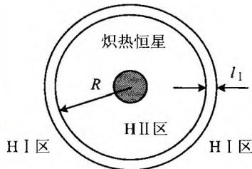

### 5.3 电离氢区(HⅡ区)与斯特龙根球

在炽热的 O、B 型星的周围，通常伴有明亮的弥漫星云，这是由于这些恒星发射的紫外光子，使周围星际气体中大部分氢原子电离而形成的。氢原子的电离能是 $E_{R}=13.6\ eV$ ，相应的电离光子的波长是 $\lambda=912\ \AA$ ，正好在紫外波段。根据维恩位移定律即(2.7)式， $\lambda=912\ \AA$ 对应的温度是 $T\simeq30\ 000\ K$ ，只有 O、B 型星才会有这样高的温度。再估计一下电离氢的数量。一颗恒星可以电离的氢的数量，正比于恒星光度 $\times$ 炽热阶段的年龄。计算表明，一颗炽热恒星在其一生中能电离 $10^{37}\mathrm{g}$ 氢，相当于 $5000M_{\odot}$ 。因而，虽然O、B型星只占恒星总数的几百分之一，数量并不多，但也能使数量相当可观的星际氢电离。

HⅡ区与HⅠ区之间是边界区域，其厚度约为光子在中性氢中的平均自由程（见图5.4），这一平均自由程为

$$
l _ {1} \sim \left(n _ {\mathrm{H}} \sigma_ {1}\right) ^ {- 1} \sim n _ {\mathrm{H}} ^ {- 1} \cdot 3 \times 1 0 ^ {1 6} \mathrm{cm} \sim n _ {\mathrm{H}} ^ {- 1} \times 1 0 ^ {- 2} \mathrm{pc}\tag{5.9}
$$

这里 $n_{H}$ 是氢原子的数密度， $\sigma_{I} \sim r_{h}^{2} \sim 3 \times 10^{-17} \, cm^{2}$ 是中性氢原子的有效几何截面。如果光子所经过的气体是完全电离的，则对辐射的散射主要是自由电子的汤姆孙散射，此时的碰撞截面为 $\sigma_{II} = \sigma_{T} \sim 7 \times 10^{-25} \, cm^{2}$ 。对于能量 >13.6 eV （波长 <912Å）的辐射，所经过的气体必然是电离

图5.4炽热恒星周围的电离氢区与中性氢区

$$
l _ {\parallel} \sim (n _ {e} \sigma_ {\parallel}) ^ {- 1} \sim n _ {e} ^ {- 1} \cdot 1 0 ^ {2 4} \mathrm{cm} \sim n _ {e} ^ {- 1} \cdot 3 \times 1 0 ^ {5} \mathrm{pc}\tag{5.10}
$$

$$
n _ {\mathrm{e}}
$$

由上可见，我们有 $l_{1} \ll l_{\parallel}$ 。这表明，恒星发出的紫外光子可以比较自由地通过HⅡ区，直接达到HⅠ区，然后在厚度为 $l_{1}$ 的一层内被吸收，从而使该层内的中性氢被电离。一个热的年轻恒星的辐射主要集中在 $\lambda < 912\AA$ 部分，它足以使周围的中性氢几乎全部电离，形成一个球对称的HⅡ区，称为斯特龙根(strömgren)球。

我们来估算一下斯特龙根球的大小。设恒星的辐射近似为黑体辐射，则能量 $E > E_{B} = 13.6\mathrm{eV}$ 的光子流量（光子数 $/cm^{2}\cdot s$ ）为

$$
F _ {\nu} = \int_ {\nu_ {B}} ^ {\infty} \frac {c B _ {\nu} (T) \mathrm{d} \nu}{h \nu} = \frac {2}{c ^ {3}} \int_ {\nu_ {B}} ^ {\infty} \frac {\nu^ {2} \mathrm{d} \nu}{\mathrm{e} ^ {h \nu / k T} - 1}\tag{5.11}
$$

其中 $\nu_{B}=E_{B}/h$ 。

设恒星周围半径为 R 的球形区域已被电离。考虑其边缘处厚度为 dr 的球壳，球壳内的中性氢原子数为 $4\pi R^{2} n_{H} dR$ 。设恒星在 dt 时间内发出 $dN_{i}$ 个致电离光子，它们使得此球壳内的中性原子全部电离，故电离球的半径增大了 dR，且有

$$
\frac {\mathrm{d} N _ {i}}{\mathrm{d} t} = 4 \pi R ^ {2} n _ {1 1} \frac {\mathrm{d} R}{\mathrm{d} t}\tag{5.12}
$$

实际上，已电离了的原子还有一定的几率复合为中性原子，故还需要考虑斯特龙根球内部的复合。复合使离子成为中性原子，再把它电离还要消耗光子，因此有

$$
\frac {\mathrm{d} N _ {i}}{\mathrm{d} t} = 4 \pi R ^ {2} n _ {\mathrm{H}} \frac {\mathrm{d} R}{\mathrm{d} t} + \frac {4 \pi}{3} R ^ {3} n _ {\mathrm{i}} n _ {\mathrm{c}} \alpha (T)\tag{5.13}
$$

其中 $n_{i}$ 和 $n_{e}$ 分别为离子和自由电子的数密度，复合率因子 $\alpha(T)\sim4\times10^{-13}\mathrm{cm}^{3}/\mathrm{s}$ 。如果达到电离-复合平衡，则球的半径不再增加，即 $dR/dt=0$ 。设此时的球半径是 $R_{s}$ ，则有

$$
\frac {\mathrm{d} N _ {i}}{\mathrm{d} t} = \frac {4 \pi}{3} R _ {s} ^ {3} n _ {\mathrm{i}} n _ {\mathrm{e}} \alpha (n _ {\mathrm{i}} \approx n _ {\mathrm{e}})\tag{5.14}
$$

另一方面，电离光子是炽热恒星表面发出的，应满足

$$
\frac {\mathrm{d} N _ {i}}{\mathrm{d} t} = 4 \pi R _ {*} ^ {2} F _ {*}\tag{5.15}
$$

这里 $R_{\star}$ 是恒星的半径， $F_{\star}$ 由(5.11)的计算结果给出。对一些典型的恒星， $R_{\star}$ 和 $F_{\star}$ 的有关数据见表5.2：

表 5.2 典型恒星的 $F_{*}$ 与 $R_{*}$

| 光谱型 | $O_{5}$ | $O_{7}$ | $O_{9}$ | $B_{0}$ |
|---|---|---|---|---|
| $F_{\cdot}/10^{23} cm^{-2}s^{-1}$ | 8.7 | 5.5 | 2.3 | 0.36 |
| $R_{\cdot}/R_{\odot}$ | 17.8 | 13 | 11 | 7.4 |

(5.14)和(5.15)两式给出

$$
R _ {s} n _ {\mathrm{e}} ^ {2 / 3} \simeq (3 R _ {*} ^ {2} F _ {*} / \alpha) ^ {1 / 3}\tag{5.16}
$$

利用上面的 $\alpha$ 值，并取 $n_{e} = 10^{3}\mathrm{cm}^{-3}$ ，就得到斯特龙根球的半径 $R_{s}$ ，例如

$$
\begin{array}{r l} {R _ {s} = 0. 7 2 \mathrm{pc}} & {(\mathrm{O} _ {5} \text {型星})} \\ {R _ {s} = 0. 1 4 \mathrm{pc}} & {(\mathrm{B} _ {0} \text {型星})} \end{array}\tag{5.17}
$$

它们显然远远大于恒星自身的半径。同时，由于复合过程中放出的光子还可能再引起电离，故这样得到的 $R_{s}$ 只是一个下限值，实际的 $R_{s}$ 可能还要大几倍，甚至 10 倍。

上面的讨论中还有一个问题，即没有考虑到压力的变化。因为电离使一个中性氢原子变为一个离子加一个电子，因而HⅡ区的粒子数至少是HⅠ区的两倍。即便温度相同，HⅡ区的压力也应为HⅠ区的两倍。事实上，HⅠ区典型的温度为 $10^{2}$ K，数密度为 $0.1\sim10^{2}$ ；而HⅡ区的典型温度为 $10^{4}$ K，数密度为 $10^{3}\sim10^{5}$ 。此外，还要考虑电离区光子对压力的贡献，这样两个区域的压力差将非常大，大致有 $P_{HII}\sim200P_{HI}$ 。这一巨大的压力差会使电离区的扩张十分迅速，甚至出现超声速向外扩张的激波，产生超声速的星风或气流，它们的速度对于O型星可达每秒数千km，对于太阳这样的恒星为每秒400km。

除了炽热恒星对周围星际气体的电离外，超新星爆发也是另一个重要的电离源。超新星爆发使周围的星际气体加热，温度和压力陡增，于是气体急剧膨胀，膨胀的速度将超过声速，这样就形成了激波。激波的波前近似为一个球面，它迅速扫过星际气体，就像是一个膨胀的高温气泡（图3.21）。计算表明，激波扫过的星际气体可达上千个太阳质量，远远超过超新星爆发时的物质抛射。在整个过程中，超新星爆发的巨大能量转化为星际气体的动能和热能，因而使得相当一部分气体被电离。

