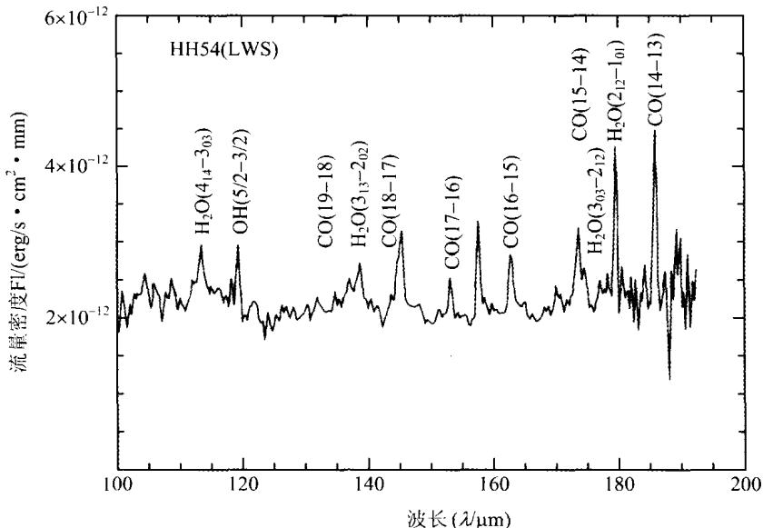
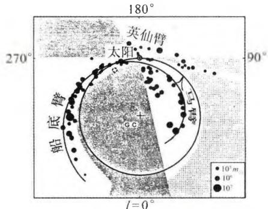
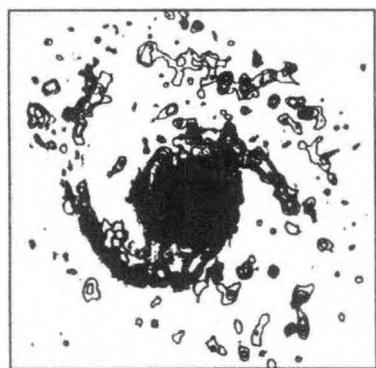
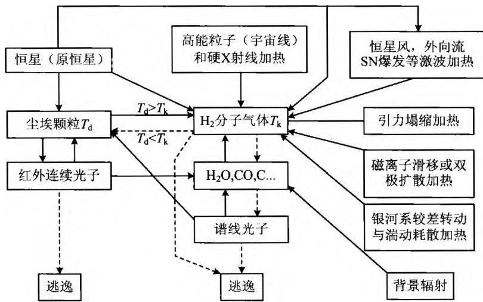
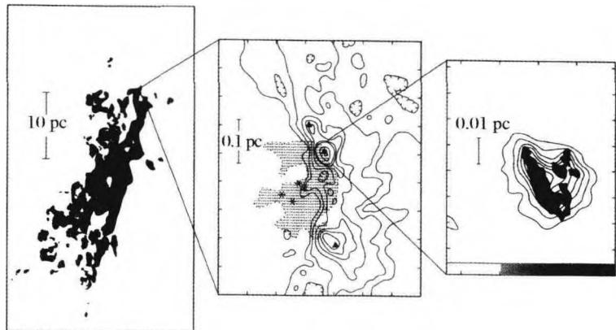
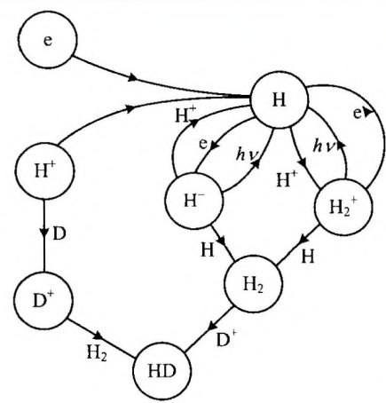
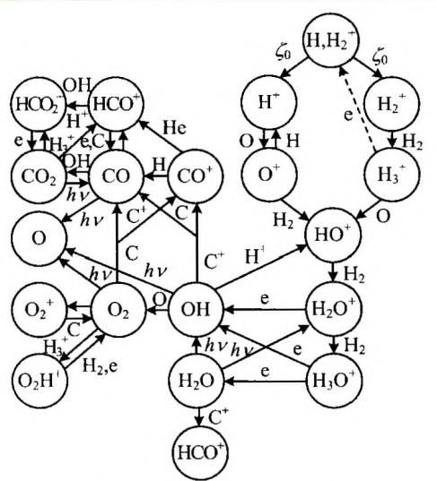
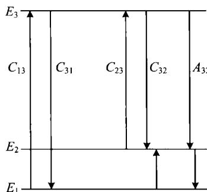

### 5.4 星际分子

#### 5.4.1 星际分子的发现

星际分子是20世纪60年代天文学的四大发现之一，并由此而诞生了一个新的研究领域——分子天体物理学（包括分子天体化学）。事实上，早在20世纪30年代，人们就已经发现了星际分子CH的紫外吸收线，到1940年前后共有CH， $\mathrm{CH^{+}}$ 和CN三种星际分子得到确认。但是，从那以后20多年的时间里，星际分子的研究并没有得到人们的重视，因为人们普遍认为，星际空间极低的温度和密度，不可能产生足够多的分子。即使少量分子可以形成，恒星发出的紫外辐射又会使它们很快电离，因而这些稀少的星际分子并不具有天体物理意义。

自二战结束后，微波和雷达技术被广泛用于天文观测，大大推动了射电天文学的发展。1951年发现了射电21 cm的辐射后，就有人开始寻找星际OH，因为氢是宇宙中最丰富的元素，氧的丰度也不算低，它们组合成OH的机会比较大。经过近10年的努力，美国天文学家巴瑞特(A. Barrett)和温雷伯(S. Weinreb)等研制成功了一种新型自相关数字式谱线接收机，他们把它装在一个84英尺的抛物面天线上，于1963年10月指向著名的超新星遗迹仙后座A，结果发现了OH基态两条主线(1 665 MHz 和1 667 MHz)的微波吸收谱线。这项发现被誉为20世纪60年代天文学的四大发现之一。1965年，威沃尔(H. Weaver)等首次发现了OH分子的受激发射，即“脉泽(MASER)”发射。1968年，汤斯(C. Townes)等在人马座A探测到氨 $NH_{3}$ 的谱线(波长1.3 cm)，1969年又在人马座B2和猎户座A探测到水分子 $H_{2}O$ 的强受激发射谱线(波长1.35 cm)。紧接着，甲醛分子 $H_{2}CO$ 的4 830 MHz吸收线也被斯奈德(L. Snyder)等人观测到了，这是在宇宙空间发现的第一种有机分子。1970年，在2.6 mm的波长上发现了宇宙中丰度仅次于 $H_{2}$ 的CO分子。同年，一个载有小型望远镜和紫外光谱仪的火箭升空，发现了期盼已久的氢分子 $\mathrm{H}_{2}$ 。这一系列重要发现给人们带来了极大的鼓舞，并最终使人们确信，即使在星际空间这样严酷的自然条件下，星际气体也完全有可能形成足够多的复杂分子，而且形成的分子可以有效抵御各种不利的外部因素（例如紫外辐射），而长期存活下来。

20世纪70年代以来，随着各种波段的空间望远镜的不断发射上天，特别是近十几年来哈勃空间望远镜、红外空间天文台(ISO)和远紫外光谱探测卫星(FUSE)的投入使用，星际分子的观测和研究获得了日新月异的进展。至2005年7月，已经探测到的星际分子达125种(包括分子的离子和基)，其中大多数是含有C、H、O元素的分子(图5.5)，从双原子分子例如 $\mathrm{H}_{2}$ 和CO，到三原子分子例如 $\mathrm{H}_{2}\mathrm{O}$ 和 $\mathrm{H}_3^+$ ，一直到复杂的有机大分子，例如 $\mathrm{HC}_{11}\mathrm{N}$ 、 $\mathrm{CH}_2\mathrm{OHCHO}$ （糖分子）和 $\mathrm{HOCH_2CH_2OH}$ （防冻剂分子）。除了这些分子以外，还观测到不少与它们相应的同位素分子。近年来还发现和证认了一些天文固相分子——星际冰。每种分子往往不止观测到一条谱线，而且不止一个源。这些分子在宇宙中分布极其广泛，而且与各种各样的天体成协，反映出它们生存环境的多样性。在已知的天文分子源中，人马座A和人马座B2是最著名的分子源，在那里可以找到目前已经发现的大部分星际分子。

图5.5 原恒星HH54的星际分子的谱线

#### 5.4.2 星际分子的天体物理学意义

星际分子广泛存在于各种天体环境中，例如星际云、恒星形成区、电离星云、恒星包层、星系前物质、类星体吸收线区、年轻的超新星遗迹以及河外星系中的星际物质，星系中心甚至某些活动星系核等。可以说，从宇宙第一代天体的形成，直到恒星演化晚期的遗迹，都能找到分子的踪迹。因此对星际分子的研究，可以给我们提供大量有关多种天体环境的物理信息（如温度、密度、质量、元素丰度和运动速度）。同时，分子的电子、振动、转动能级之间的跃迁，可以产生从厘米波、毫米波、亚毫米波到红外、远红外以至远紫外波段，范围广阔、且信息极为丰富的谱线（其中特别是射电和红外波段，因其波长较长，故非常适合于观测冷的、对可见光不透明的星云）。这样，我们对天体的研究就有了范围更大的窗口，而且从传统的原子过程和原子核过程扩展到分子过程。观测表明，分子谱线示踪的星际气体的参数范围远远超过了原子谱线，因此带来的信息十分丰富。其中使用最广泛的是CO分子的毫米波谱线，因为CO分子的丰度仅次于 $\mathbf{H}_2$ ，比其他分子的丰度高出许多，而且容易激发和观测，可以用来示踪形成恒星的原初气体，并估计它们的质量和运动速度。除了CO外，硫化碳(CS)和甲醛 $(\mathrm{H}_2\mathrm{CO})$ 也是常用的分子。

以银河系为例(图 5.6a)，现在已经知道，银河系中大约 50% 的星际物质是以分子形式(主要成分是 $H_{2}$ )存在的。在离银心 4～8 kpc 处有一个分子环带，其中分子物质占星际物质总量的约 90%。观测发现，氢分子 $H_{2}$ 在银心附近有很强的分布，80%～90% 的 $H_{2}$ 集中在太阳圈内，特别是在上述分子环区域内。在银河系中分子的分布与中性氢（H I）的分布相差很远，但与电离氢（H II）的分布比较接近，H II区明显地和较热的大分子云或巨分子云成协。较热的分子云（T>10 K）主要分布在旋臂上，而较冷的分子云（T<10 K）则有相当均匀的盘状分布。CO 分子的观测表明，银河系内恒星的形成是与分子云密不可分的。河外星系 M51 也有类似的情况，CO 分子云的观测显示，分子云散布在旋臂和臂间区（图 5.6b），两处的密度比约为 3～5：1，较热的分子云存在于旋臂上。现在认为，巨分子云是较小的云通过密度波（见下一章）的轨道聚集作用而形成的。

(a) 银河系中质量 $>10^{5}M_{\odot}$ 的分子云在银道面上的分布

未分析部分 观测不完全部分

(b) 旋涡星系 M51 中
CO分子云的分布
图5.6 分子云在星系中的分布

星际分子对许多天体物理过程有着重要的意义。分子常常控制着天体的温度和电离结构，它们的存在可以起到加强或抑制动力学不稳定性的作用，因而可能决定性地影响它们参与形成的天体的演化。例如在原始星云凝聚为原恒星的过程中，分子就起到至关重要的作用。观测表明，分子云常常和年轻的恒星紧密联系在一起，说明分子云是恒星形成的主要场所。这其中的一个重要原因是，星云气体的凝聚过程中，必须把一部分能量损失掉，使总能量减少（见3.1节）。这一过程的实现主要是通过各种形式的辐射。其中分子辐射的作用十分重要，这是因为分子能级（主要是振-转能级）之间的差异很小，跃迁时产生长波（红外）辐射，它们比较容易穿透稠密的云层而散发掉，从而促使星云很快冷却并进一步坍缩。图5.7画出了分子云中的能量转移过程图，其中包括各种主要的加热机制和冷却机制。

图 5.7 分子云中的各种能量转移过程图, 其中
实线箭头表示加热过程,虚线箭头表示冷却过程

当然，分子云与恒星形成的关系是很复杂的，其中有很多需要深入探讨的问题，例如：分子云是如何形成与演化的？分子云与原子云的关系？什么是支撑分子云的动力学因素？恒星在分子云中的何处形成？星际磁场在分子云的支撑、碎裂和坍缩过程中的作用？等等。尽管许多问题至今还没有完全解决，但人们对分子云的认识已经深入了许多。例如人们已经知道，大质量的O、B型星主要是在巨分子云中形成的，而低质量星更倾向于与小分子云成协。图5.8显示猎户座A巨分子云的结构，它明显包含团块、稠密核、纤维、空洞等多种结构形态。目前，恒星主序前演化的几个关键阶段，如分子云开始坍缩、稠密核的形成、被星云吸积盘包围的原恒星的出现等，相应的分子过程和谱线发射均已发现。

图 5.8 猎户座 A 巨分子云, 显示出团块、
稠密核、纤维、空洞等多种结构形态

在恒星演化的晚期阶段(例如红巨星的渐进巨星阶段)，显著的质量流失形成了一个由分子和尘埃组成的光学厚的星周包层，它是物质由恒星返回星际空间的结果。星周包层有效地屏蔽了星际紫外辐射，成为丰富的分子源，它们提供了有关包层、中心星的质量抛射及其内部核燃烧过程的大量信息。因此可以说，分子的研究给我们提供了恒星从诞生到死亡，星际物质从星云到恒星、再返回星际空间的大量信息。

分子天文学发展的同时也促进了天体化学的发展。如果说前者关注的是宇宙中有哪些分子，则后者关注的是这些宇宙分子是如何产生的，并通过分子丰度的演化来了解星云以及相关天体的演化。我们已经知道，星际分子存在于各种极端条件的天体环境中，这意味着它们的化学也是高度复杂的，其中包括：发生在尘埃颗粒表面的化学；有关离子-分子气相反应的化学；恒星演化晚期包层和大气中的化学；激波激发的化学等。最有兴趣的问题之一是，宇宙中的第一个分子如何形成。我们在第7章中将谈到，当宇宙温度下降到 $4000\mathrm{K}$ 左右时，电离的氢复合为中性氢，此时物质与辐射脱耦。宇宙化学应当始于这一时刻，第一个分子应当是氢分子。复合后残余的离子和电子是形成氢分子的催化剂，它们通过两种机制产生氢分子（见图5.9）：

$$
\mathrm{H} + \mathrm{H} ^ {+} \rightarrow \mathrm{H} _ {2} ^ {+} + \gamma , \quad \mathrm{H} _ {2} ^ {+} + \mathrm{H} \rightarrow \mathrm{H} _ {2} + \mathrm{H} ^ {+}\tag{5.18}
$$

$$
\mathrm{H} ^ {+} + \mathrm{e} ^ {-} \rightarrow \mathrm{H} ^ {-} + \gamma . \quad \mathrm{H} ^ {-} + \mathrm{H} \rightarrow \mathrm{H} _ {2} + \mathrm{e} ^ {-}\tag{5.19}
$$

氢分子可以使星云气体很快冷却，故对第一代天体的形成起到决定性的作用。在弥漫云、巨分子云、暗分子核中，离子-分子化学是大多数种类分子形成的最主要机制。近20年来，激波化学的研究有了很大进展，人们发现，激波对分子和分子谱线的形成有重要作用。这是因为，激波对气体的加热将迅速克服化学反应中的活化能势垒，从而产生低温下无法进行的一些吸热反应，例如 $\mathrm{C}^{+} + \mathrm{H}_{2}\rightarrow \mathrm{CH}^{+} + \mathrm{H}$ $\mathrm{S}^{+} + \mathrm{H}_{2}\rightarrow \mathrm{SH}^{+} + \mathrm{H}$ 等反应。在低温下，O不能与 $\mathbf{H}_2$ 反应，而是通过 $\mathrm{O}^+$ 和 $\mathrm{H}_{2}$ 反应来形成OH和 $\mathrm{H}_2\mathrm{O}$ 的。但在激波产生的高温下，下列反应可以迅速进行：

$$
\mathrm{O} + \mathrm{H} _ {2} \rightarrow \mathrm{OH} + \mathrm{H}, \quad \mathrm{OH} + \mathrm{H} _ {2} \rightarrow \mathrm{H} _ {2} \mathrm{O} + \mathrm{H}\tag{5.20}
$$

这就大大增加了OH和 $\mathrm{H}_2\mathrm{O}$ 的丰度。图5.10显示了弥漫星云中典型含氧分子的

图5.10 弥漫星云中典型含氧分子的生成途径

图5.9 早期宇宙的氢化学模型

生成途径。

#### 5.4.3 天体分子脉泽

自1965年第一次发现星际OH的强发射，1966年被证认为天体脉泽以来，天体分子脉泽的研究得到了迅速的发展。脉泽（MASER，即Microwave Amplification by Stimulated Emission of Radiation)的意思是微波激射放大，它产生的机制是分子受激发射，即由另一个光子的激发，引起分子发射光子。作为最简单的说明，只考虑分子有两个能级，且分子起初处于较高的能级。假如有一个光子的能量正好等于这两个能级之差，并击中了这个分子。这时分子不能吸收光子，因为分子已经处于高能态。但是，由于这个光子的碰撞激励，分子从高能态跌落到低能态，并在这个过程中发射一个光子。这样，在整个受激发射过程中，一个光子进入，两个光子发出。这两个光子有相同的波长，相同的位相，并向同一方向行进。这两个光子一路上继续不断地激励更多的分子发射，从而引起连锁反应，最终辐射不断被放大而产生强大的能量输出。这一受激发射的机制完全类似于激光原理，只不过现在是由分子来完成的，且产生的辐射位于微波波段。显然，要实现受激发射，最重要的条件是要有大量分子事先处于较高的能级，这就需要有一种机制，来实现粒子布居数的反转。单靠两能级系统是不可能实现反转的，这是因为热碰撞跃迁总是向下的几率大于向上的几率，最终使粒子布居趋于下能级。导致脉泽能级布居数反转的机制称为抽运(Pump)机制，其中最简单的是三能级抽运模型。

如图5.11所示，假定有3个能级 $E_{1} < E_{2} < E_{3}$ 的系统，其中 $E_{3}$ 的作用是能源储存器。分子脉泽源起初处于基态能级 $E_{1}$ ，由于分子间的碰撞而跃迁到 $E_{3}$ 。一般情况下，系统是从 $E_{3}$ 直接跃迁回到到 $E_{1}$ ，或通过 $E_{2}$ 并很快回到 $E_{1}$ ，这样就无法实现粒子数反转。但对于一些分子来说，例如对于 $\mathrm{OH}$ 和 $\mathrm{H}_2\mathrm{O}$ 分子，从 $E_{3}$ 到 $E_{2}$ 的辐射衰变几率很高，但接下来从 $E_{2}$ 到 $E_{1}$ 的跃迁几率却非常低，这就使得大量分子聚集在 $E_{2}$ 的能态，其数目甚至超过处于基态 $E_{1}$ 的数目，这就实现了粒子数的反转。此时若有一个频率正好等于

图5.11 三能级抽运模型

$E_{2}-E_{1}$ 的外部光子射入，就会产生受激发射，即分子脉泽发射。脉泽的产生需要从基态 $E_{1}$ 到 $E_{3}$ 的能量抽运，这一能量来自于分子之间的碰撞或外部的红外、紫外源或 HⅡ区。

迄今为止，已经观测发现了3000多个天体分子脉泽源，主要是OH, $\mathrm{H}_2\mathrm{O}$ ,SiO和 $\mathrm{CH}_3\mathrm{OH}$ 4种分子产生的，近年来又发现了一些新的脉泽分子，如 $\mathrm{H}_2\mathrm{CO},\mathrm{HCN},$ $\mathrm{NH_3}$ ,SiS等。这些脉泽源主要分布在银河系的恒星形成区或晚期恒星的包层中，大多具有成团、成块的特征，称为脉泽源斑。单个源斑的最小尺度只有一个天文单位，但源斑的亮度却很大，相应的亮温度高达 $10^{9}\sim 10^{15}\mathrm{K}$ 。许多天体脉泽具有偏振性，绝大多数脉泽源还具有程度不同的光变，有的还出现爆发现象。目前认为，脉泽是大、中质量恒星正在形成的一个标志，也是恒星即将死亡的一种指示。

在河外星系中也观测到 OH 和 $H_{2}O$ 的超强脉泽，例如河外 OH 脉泽已经发现 50 多个，它们通常与活动星系核成协，其中最突出的是 NGC3079，其脉泽光度高达 $520L_{\odot}$ 。这样强的脉泽辐射使人们联想到，有可能用它们示踪宇宙中超大黑洞的存在。
