## 第6章 星系

星系是构成宇宙大尺度结构的基本组元，它们通常由几十亿至几千亿颗恒星以及星际气体和尘埃等物质构成，占据空间范围为几千光年至几十万光年。

17世纪望远镜发明后，人们陆续观测到一些云雾状的天体，称之为星云。到20世纪初，登记在各种星表中的星云数目就已经超过了一万个。其中最引人注目的是仙女座大星云（即M31，图6.1a），以及早在麦哲伦环球航行时就仔细描述过的南半球天空上的大、小麦哲伦云（图6.1b，c）。18世纪大哲学家康德(I.Kant)

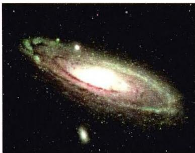
图 6.1a 仙女座大星云(M31)

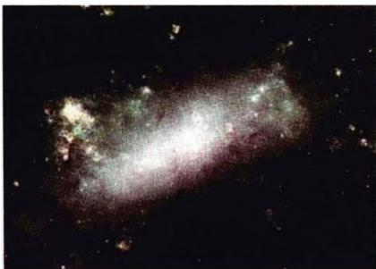
图6.1b 大麦哲伦云

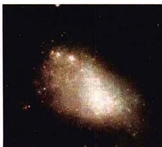
图6.1c 小麦哲伦云

曾大胆提出猜想，认为这些云状天体是像银河系一样由恒星构成的宇宙岛。他在其名著《宇宙发展史概论》中说，银河系不是唯一的，宇宙中还有无数个像银河系一样的恒星系统。但由于距离太远无法分辨，星云的本质到底是什么，自康德之后人们一直在激烈地争论。1786年，著名英国天文学家W.赫歇尔观测了29个星云，发现其中大多数都可以分解为单个的恒星，于是他宣称这些星云都是河外星系，即宇宙岛。实际上，他观测的星云绝大部分都是银河系内的球状星团和疏散星团。1790年，他在金牛座发现了一个行星状星云，中间是一颗星，外围呈弥漫的云雾状，看似行星；后来又发现了一些无法分解为恒星的星云，于是他最终宣布放弃星云是河外星系的主张。1845年，英国天文学家帕森斯（W.Parsons）用直径 $1.8\mathrm{m}$ 的望远镜（建于爱尔兰）分解了许多赫歇尔没能分解的星云，并首次观测到一些星云的旋涡结构，宇宙岛的观点又重新活跃起来。1864年，哈金斯（W.Huggins）通过分光观测，发现一批星云的光谱是发射线，说明这些星云是发光的气体，因而宇宙岛之说重归黯淡。

1920年4月26日在华盛顿的美国国家科学院，曾有过一场关于仙女座大星云(M31)距离的著名大辩论。辩论双方是威尔逊山天文台的沙普利(H.Shapley)和里克天文台的柯蒂斯(H.D.Curtis)，主持人是威尔逊山天文台台长海尔(G.Hale)。沙普利的一个主要论据是基于M31中新星的视星等。此前他曾用威尔逊山天文台的 $1.5\mathrm{m}$ 望远镜测定了一些最有名的球状星团的距离，并由此推断这些星团组成星团系，其中心就是银河系的中心，而银河系的整个范围大约是30万光年。他认为，如果M31的盘直径也像银河系那样大，则由它在天空的张角而计算出的距离将会过大，从而使这一星云中发现的新星的光度，比银河系中新星的光度要大出许多倍。因此他的结论是，仙女座大星云应处在银河系的范围之内。而柯蒂斯却认为，仙女座大星云应远在银河系之外，距离至少为 $150\mathrm{kpc}$ （约49万光年）。这样，这些新星的内禀亮度才会与银河系的新星一致。他们的争论当时并没有结果，因为我们现在知道，双方所用的观测数据中实际都存在着较大的误差。直到1924年，哈勃用当时世界上最大的 $2.5\mathrm{m}$ 望远镜，在仙女座大星云和三角座星云等星云中发现有造父变星，并利用周光关系定出这几个星云的距离（75～150万光年），才完全肯定它们是河外星系，从而结束了这一场长达180年的宇宙岛之争。接着在1929年，哈勃又发现了星系退行速度 $\pmb{v}$ 与距离 $\pmb{r}$ 之间成正比的哈勃关系，即 $v = H_0r$ ，向人们展示了一幅宇宙膨胀的图像。

### 6.1 星系的主要特征

#### 6.1.1 形态与分类

星系的外形和结构是多种多样的。1926年哈勃按星系的形态进行了分类(图6.2)，把星系分为椭圆星系(E)、旋涡星系(S)和不规则星系(Irr)三大类。旋涡星系又分为正常旋涡与棒旋(SB)两族，每族按旋臂伸开程度分a、b、c三个次型。哈勃所提出的星系分类判据是：1)核球相对扁盘的大小；2)旋臂的特征；3)旋臂或星系盘分解为恒星和电离氢区的程度。

哈勃系统是一种形态分类，它直接以观测为依据，因此被广泛采用。星系的不同形态称为星系的哈勃型。但哈勃当初曾认为，不同类型的星系代表星系演化的不同阶段，一个星系在其演化过程中会遍历这些类型，正如当时人们曾认为恒星一生会沿主星序演化一样。现在我们知道，这一看法是不对的。

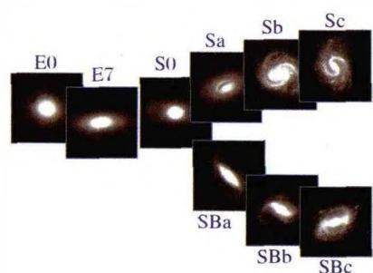
图6.2a 星系的哈勃型
(椭圆星系与旋涡星系)

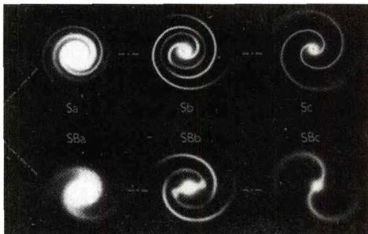
图6.2b 旋涡星系
哈勃型的图示

#### 1. 椭圆星系

椭圆星系按它们的扁率分类,看上去像球形的(零扁率)称为 E0, 扁率最大的称为 E7(参见图 6.3)。表示扁率的数字定义为

$$
n = \frac {a - b}{a} \times 1 0\tag{6.1}
$$

其中 $a, b$ 分别表示以角度为单位的椭圆半长轴与半短轴。

## 椭圆星系的主要特征是：

质量相差很大， $M=10^{6}\sim10^{13}M_{\odot}$ 。椭圆星系中最普遍的是矮椭圆星系，它们的典型大小是几千秒差距，质量是几百万个太阳质量，与球状星团相当。最壮观的是巨椭圆星系（例如图6.3a所示的巨椭圆星系M87），它们的尺度可以大到100kpc，质量达 $10^{13}M_{\odot}$ ，是宇宙中最大的星系。

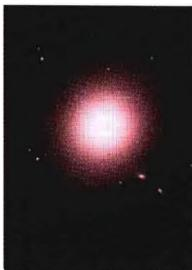
(a) 巨椭圆星系
M87,E0型

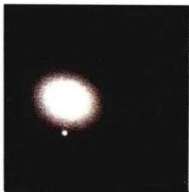
(b) M49, E1 型

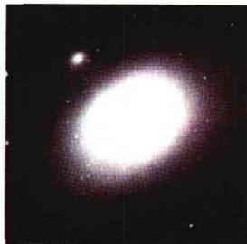
(c) M84, E3 型
图6.3 几种典型的椭圆星系

没有或仅有少量的星际气体或尘埃。由 $21\mathrm{cm}$ 谱线的观测，以及红外卫星（例如IRAS卫星）对尘埃微弱发射的观测，表明星际介质质量的可能上限约为所有恒星质量的 $1\%$ 。低的气体含量意味着，椭圆星系不可能通过旋转变平而成为旋涡星系，因为旋涡星系中的气体和尘埃比椭圆星系中多得多。值得注意的是，尽管椭圆星系中没有O型星和B型星，但它们的金属丰度并不低。例如巨椭圆星系的金属丰度就相当高，大约是太阳的两倍。

利用光度测量可以得到椭圆星系内的亮度分布。由于我们看到的星系是一个两维投影，因此方便的做法是处理单位表面积上的光度 $L(r)$ ，其中 $r$ 是从椭圆星系中心算起的投影距离。研究表明，大多数椭圆星系的面光度分布可以很好地用一个简单的公式来表示（称为德·沃库勒轮廓，即 de Vaucouleurs profile）

$$
L (r) = L _ {0} \mathrm{e} ^ {- (r / r _ {0}) ^ {1 / 4}}\tag{6.2}
$$

式中 $L_{0}$ 和 $r_0$ 为常数。人们发现 $L_{0}$ 的值变化不大，其典型值 $\sim 2\times 10^{5}L_{\odot} / \mathrm{pc}^{3}$ ，而 $r_0$ 的值却相差悬殊。

#### 2. 旋涡星系

旋涡星系约占全部亮星系总数的三分之二。它们的普遍特征是中心为透镜状，中间是星系核，周围围绕着扁平的圆盘；圆盘上从核球延伸出若干条旋臂。正常旋涡星系又分为a、b、c3个次型(参见图6.2及图6.4)，这种分类所根据的两个主要特征是：1)旋臂缠绕的开放或卷紧程度；2)星系的中心核球相对于盘的重要程度。例如 Sa 型有最大的核球和卷得最紧的旋臂，而 Sc 型的核球最小，旋臂也最开放。图 6.1a 所示的仙女座大星云 M31 属于 Sb 型，图中左下方的伴星系 NGC205 属于 E6 型。所有旋涡星系的转动角速度均属较差自转，即与核球中心不同距离处的转速有不同的值。所有旋涡星系的质量范围是 $M \simeq 10^{9} \sim 10^{12} M_{\odot}$ 。顺便指出，上面所提到的星系名称是指某种星表刊载的第几号天体，例如 M31 指的是梅西尔 (Messier) 星云星团表第 31 号天体，而 NGC205 指的是星云星团新总表 (New General Catalogue of Nebulae and Clusters of Stars, 简称 NGC) 第 205 号天体。

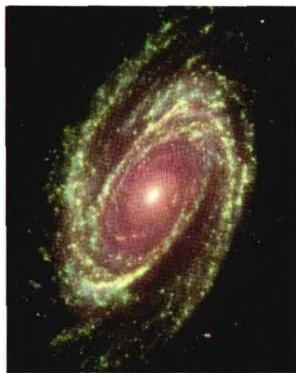
(a) M81. Sa 型

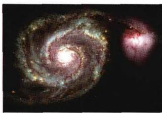

(b) M51, Sb 型, 其一端与伴星系 NGC5195 相连
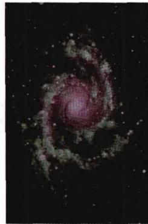
(c) NGC2997, Sc 型
图6.4 几种典型的旋涡星系

正常旋涡星系的旋臂形状可以用对数螺线表示。旋臂上聚集着高光度O、B型星，超巨星以及电离HⅡ区，同时有大量的尘埃和气体分布在星系盘上。从侧面看，在主平面上有一条窄的尘埃带（如图6.5）。星系晕中的典型代表是球状星团。

一个中等质量的旋涡星系往往有100～300个球状星团，随机地散布在星系盘周围的空间。一般把星系中的天体分为两个星族，即星族Ⅰ和星族Ⅱ。两个星族的天体在物理特性、演化和空间分布方面都有明显不同。概括地说，星族Ⅰ天体构成星系盘和旋臂，其中包含有大量的气体、尘埃和电离HⅡ区，以及数量众多的早型星，这些恒星的重元

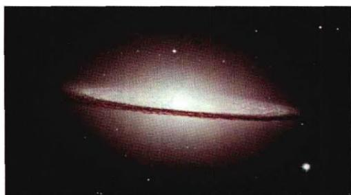
图 6.5 “墨西哥草帽”星系 M104, 它
有巨大的核球，属于 Sa 型旋涡星系

素丰度可高达 $1\% \sim 2\%$ ，一般认为它们属于年轻的天体或新一代天体。星族Ⅱ天体主要构成星系核、星系晕和星系冕，它们的重元素丰度通常比较低，一般认为它们是老一代的天体。球状星团以及前面谈到的椭圆星系都属于典型的星族Ⅱ天体。它们所含的星际气体或尘埃都非常少甚至完全没有，而且都没有典型的星族I天体——蓝巨星。

旋涡星系的重要特征是大量存在星际介质——气体和尘埃。旋涡星系所发出的光辐射，包含了数量不多但作用重要的蓝色星的贡献，这说明恒星的形成过程还在继续。在一般情况下，星系盘的光度 $L(r)$ 随与中心的距离r急剧下降，这一关系可以用下面的公式来表示

$$
L (r) = L _ {0} \mathrm{e} ^ {- r / D}\tag{6.3}
$$

其中 $L_{0}$ 为中心光度， $D$ 为星系半径在可见光波段的特征尺度，其典型值为 $5\mathrm{kpc}$ 。

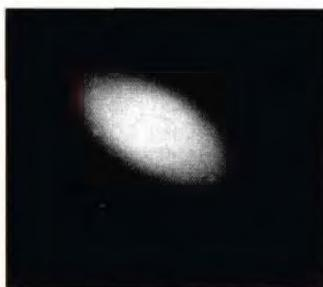
图6.6 典型的

图 6.2 所示的星系哈勃型中，S0 型是介于椭圆和旋涡之间的星系（亦参见图 6.6），它们与旋涡星系有某些共同特征，但并不显示旋臂，故也称为透镜星系。这一类型星系的核球几乎与盘的其余部分一样大，使得星系的形态几乎呈球形。某些 S0 星系也包含气体和尘埃，这表明它们应当属于旋涡星系。然而，在大多数 S0 型星系中探测不到气体。目前对 S0 星系的作用还不十分清楚。

S0 星系 NGC1201

棒旋星系(见图 6.7)的明显特征是在其中央有一条明亮的棒状结构,旋臂从棒的两端向外扩展。

旋臂通常与棒体成 $90^{\circ}$ 角。SBa, SBb 的棒状结构光滑, SBc 的棒体和旋臂上有明显可见的亮星或亮团。棒旋星系的核心通常是一个大质量的快速旋转体。

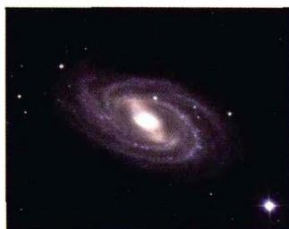
NGC 3992
SBa型

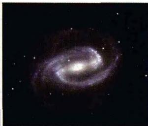
NGC 1300 SBb型
图 6.7 典型的棒旋星系

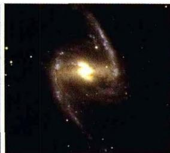
NGC 1365 SBc型

表 6.1 旋涡星系和椭圆星系的主要性质比较

| 性质 | 旋涡星系 | 椭圆星系 |
|---|---|---|
| 气体 | 有 | 无 |
| 尘埃 | 有 | 无 |
| 年轻恒星 | 有 | 无 |
| 形状 | 扁平 | 椭球 |
| 恒星运动 | 圆周运动 | 随机运动 |
| 颜色 | 蓝 | 红 |

#### 3. 不规则星系

不规则星系没有固定的形态，在全部星系总数中只占百分之几。它们的主要特征是：外形不规则，没有明显的核和旋臂，没有盘状对称结构，质量约为 $10^{8} \sim 10^{9} M_{\odot}$ 。在不规则星系中，O、B型星，HⅡ区，气体和尘埃等年轻的星族I天体占了很大比例。不规则星系还可以分为两类：Irr I星系能分辨出恒星和星云，气体含量超过旋涡星系，但尘埃云不显著，颜色偏蓝；Irr II星系中除恒星外，尘埃云比较明显，颜色偏黄。我们银河系的近邻——大、小麦哲伦云（参见图6.1b,c），都属于不规则星系。这两个星系离我们分别为17万光年和20万光年，大小分别为6万光年和2.5万光年，质量分别为 $2 \times 10^{10} M_{\odot}$ 和 $2 \times 10^{9} M_{\odot}$ 。这两个星系均有气体桥与银河系相连。最近发现，小麦哲伦云实际上是两个星系，它们好像是被银河系的引力撕裂成不规则的外形。此外，还发现大麦哲伦云内有暗弱的旋涡结构。

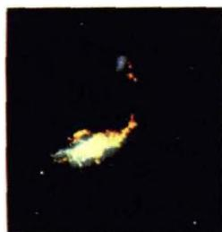
(a) NGC4485和NGC4490，它们之间显然有相互作用

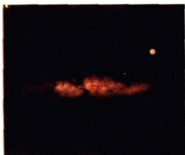
(b) M82 看起来像是在爆发,但原因不清楚

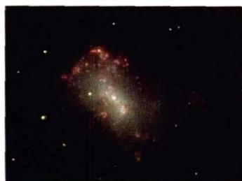
(c) 大多数不规则星系都小而暗，但 NGC4449 在大小和光度上都与银河系相似
图6.8 典型的不规则星系

#### 4. 星暴星系(Starburst Galaxies)

1983年发射上天的红外天文卫星(IRAS)发现,许多星系发出强烈的红外辐射,例如大熊座里的一个形状奇特的星系M82,它仅在红外波段的辐射能量就超过银河系辐射总能的20倍。这样的星系已发现有数千个,它们基本上属于旋涡星系,红外光度显著地高于光学光度。还有一个共同特点是,这些星系中都有一个巨大的恒星暴发区,尺度为kpc量级,显示那里正在经历迅速的恒星形成阶段,其恒星形成的速率远高于正常星系中的恒星形成率。这些刚形成的恒星发出大量的紫外光子,被尘埃吸收后就产生强烈的红外辐射。这些星系被称为星暴星系(参见图6.9)。

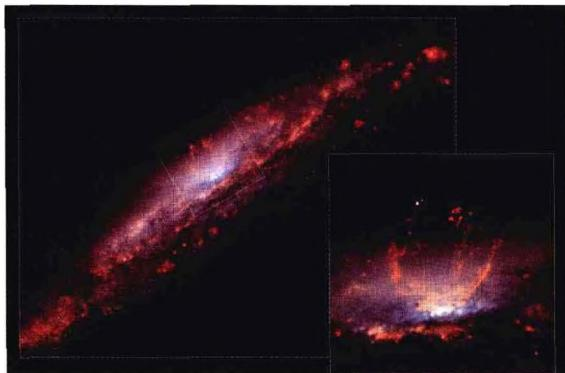
(a) NGC3079

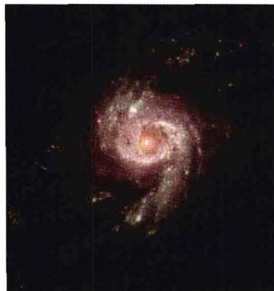
(b) NGC3310
图6.9 星暴星系

我们知道,恒星主要在分子云中形成。现在可以通过一氧化碳(CO)在毫米波段的辐射来探测分子云。把 CO 图和远红外图做比较,可以看到 CO 辐射和远红外辐射都是在同一地方最强。这说明星暴星系中存在的大量分子云就是大量恒星的诞生之地。大质量的恒星演化的时标短,很快就会演化到超新星爆发而留下超新星遗迹,这些遗迹可以通过它们的射电辐射而被探测到。射电观测的确已经发现了许多这样的遗迹。

为什么会有如此多的大质量星同时形成？这是当前研究的一个热门话题。目前流行的看法是，星暴现象产生于星系与邻近星系的相互作用，即星系之间的碰撞。当然这种碰撞不是刚性碰撞，而是更多地表现为两个星系的星际气体之间相互交会与混合。这样的碰撞可以使星系从邻近星系掠取大量的气体和物质，这些气体和物质大部分沉降到星系的中心，并形成浓密的分子云，结果导致大规模的恒星形成，即星暴。

#### 6.1.2 星系质量的测定

星系的质量是建立星系动力学模型的一个基本参数。同时，对宇宙学来说，宇宙结构的基本组元是星系，因而，星系质量的确定，对于研究宇宙中的物质分布具有重要的意义。目前，对星系质量的测定主要是依据动力学的方法，因为发光的物质（如恒星）在整个宇宙的物质组成中只占很少的一部分。不同形态的星系具有不同的动力学特征，因而测定它们质量的方法也就有所不同。下面我们主要讨论椭圆星系和旋涡星系的质量测定。

#### 1. 椭圆星系的质量测定

椭圆星系的质量测定与第2章中恒星质量的测定类似，可以通过位力定理求出。设星系中的恒星处于位力平衡，则有

$$
2 T + U = 0\tag{6.4}
$$

其中 T 是平均动能，U 是平均引力势能，

$$
U = - \frac {1}{2} \sum_ {i \neq j} \frac {m _ {i} m _ {j} G}{\left| r _ {i} - r _ {j} \right|} \approx - \alpha \frac {M ^ {2} G}{R}\tag{6.5}
$$

这里 $m_{i}$ 代表第 $i$ 颗恒星的质量， $r_{i}$ 是其相应的位置矢量， $M = \sum m_{i}$ 是星系的总质量， $2R$ 代表整个星系的特征尺度，参数 $\alpha$ 是一个量级为1的因子，具体大小决定于哈勃型。可以假设星系中恒星的质量相差不大，故平均动能 $T$ 可以写为

$$
T = \frac {1}{2} \sum_ {i} m _ {i} v _ {i} ^ {2} + T _ {r o t} \approx \frac {1}{2} M \overline {{v ^ {2}}} + T _ {r o t}\tag{6.6}
$$

其中 $T_{rot}$ 表示星系的整体转动动能。对于椭圆星系，整体转动动能 $T_{rot}$ 很小，可以设为

$$
T _ {r o t} \approx \frac {1}{2} \beta M \overline {{{{v ^ {2}}}}} (0 <   \beta <   1)\tag{6.7}
$$

恒星的速度弥散 $\overline{v^2}$ 可如下求出。设星系中的恒星轨道偏心率都很大，可近似为谐振子（这是椭圆星系的一般情况）。定义总的速度弥散 $\sigma^2 \equiv \overline{v^2}$ ，且三个方向的速度弥散平均值相同，则视线方向的速度弥散是

$$
\sigma_ {r} ^ {2} = \frac {1}{3} \sigma^ {2}\tag{6.8}
$$

再进一步假定，视线方向恒星的速度分布满足高斯分布，即位于 $v_{r}$ 到 $v_{r} + \mathrm{d}v_{r}$ 之间的分布函数是

$$
\Phi (v _ {r}) \mathrm{d} v _ {r} = - \frac {1}{\sqrt {2 \pi} \sigma_ {r}} \exp \left(- \frac {v _ {r} ^ {2}}{2 \sigma_ {r} ^ {2}}\right) \mathrm{d} v _ {r}\tag{6.9}
$$

因而可以通过观测 $\Phi(v_{r})$ 来确定 $\sigma_{r}^{2}$ 。

在上述条件下，位力定理写为

$$
M \cdot 3 \sigma_ {r} ^ {2} + \beta M \cdot 3 \sigma_ {r} ^ {2} = \alpha \frac {M ^ {2} G}{R}\tag{6.10}
$$

这样得到的星系质量是

$$
M = \frac {3 \sigma_ {r} ^ {2} R (1 + \beta)}{\alpha G} \approx 7 \times 1 0 ^ {9} R \sigma_ {r} ^ {2} \frac {(1 + \beta)}{\alpha} M _ {\mathrm{c}}\tag{6.11}
$$

其中 R 的单位是 $kpc \cdot \sigma_{r}$ 的单位是 100 km/s。

#### 2. 旋涡星系的质量测定——转动曲线

因为旋涡星系的动能主要是转动动能，例如太阳附近的恒星围绕银河系中心的转动速度为 $200\sim 300\mathrm{km / s}$ ，而随机运动的速度只有 $0\sim 10\mathrm{km / s}$ 因此不能用上面椭圆星系的方法。通常是利用开普勒定律，即假定恒星沿着圆轨道绕星系核转动，速度为 $v$ ，这样有

$$
\frac {G M m}{r ^ {2}} = \frac {v ^ {2} m}{r}\tag{6.12}
$$

因而求出星系的质量为

$$
M = \frac {v ^ {2} r}{G} = 2 \times 1 0 ^ {1 1} \left(\frac {v}{2 5 0}\right) ^ {2} \left(\frac {r}{1 0}\right) M _ {\text {分}}\tag{6.13}
$$

其中 v 的单位是 km/s·r 的单位是 kpc。

如果星系的质量集中在中心附近，则在距中心较远处 M 可以看成是常数，此时由(6.13)应有 $v \propto 1/r^{1/2}$ 。这就是熟知的开普勒运动的轨道速度分布，例如太阳系中行星的轨道速度就满足这一分布规律。但近几十年来，用射电 21 cm 谱线观测到的大多数旋涡星系，包括银河系在内，速度分布曲线（称为转动曲线）并不遵从开普勒轨道速度的变化规律，而是在很大一段范围内保持为平坦（见图 6.10）。这说明旋涡星系的质量分布，并不是如我们所看到的恒星那样，集中在星系的中心附近，而是分布在一个比星系可见部分更大的范围。通常把星系全部质量分布的区域称为星系晕。显然在整个星系晕中，发光的恒星只占据一小部分，其余的大部分物质不发光，称为暗物质。

旋涡星系的转动曲线在远处保持为平坦，这是宇宙暗物质存在的一个直接的证据。在平性的转动曲线下，设这一转动速度为 $V_{0}$ ，则星系物质总密度分布 $\rho(r)$ 应满足(6.12)，即有

$$
M (r) = \frac {V _ {0} ^ {2} r}{G}\tag{6.14}
$$

以及

$$
M (r) = \int_ {0} ^ {r} \rho (r ^ {\prime}) 4 \pi r ^ {\prime 2} \mathrm{d} r ^ {\prime}\tag{6.15}
$$

由此两式容易得出，

$$
\rho (r) = \frac {V _ {0} ^ {2}}{4 \pi r ^ {2} G} \propto \frac {1}{r ^ {2}}\tag{6.16}
$$

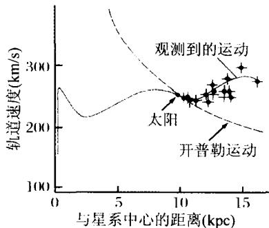
(a) 银河系的转动曲线

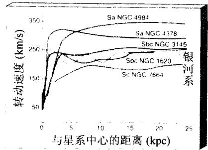
(b)一些典型星系的转动曲线
图 6.10 旋涡星系的转动曲线

椭圆星系的位力平衡方法，以及旋涡星系的转动曲线方法，所求得的星系质量都是动力学质量。观测表明，所有星系的动力学质量总是大于光度质量（即利用恒星的计数统计，由恒星的光度而得到的相应质量）。通常把动力学质量与光度之比 $M / L$ 定义为质光比，并采用太阳的质量与光度之比 $M_{\odot} / L_{\odot}$ 作为计量单位。表6.2列出了不同类型星系的质光比，以及气体质量 $M_{\mathrm{gas}}$ 与总质量之比：

表 6.2 不同类型星系的质光比及气体质量与总质量之比

| 星系类型 | $M/L \left( {{M}_{\odot }/{L}_{\odot }}\right)$ | ${M}_{\text{gas }}/M$ |
|---|---|---|
| E | 20~40 | $\leqslant 10^{-6}$ |
| S0 | 10~15 |  |
| Sa.SBa | 10~13 |  |
| Sb.SBb | ~10 | 0.05 |
| Sc.SBc | &lt;10 | 0.1 |
| Irr | ~3 | 0.2 |

由表中可以看出，所有星系的质光比均显著大于1，且椭圆星系的质光比一般要比旋涡星系的大许多。这些数据充分表明，星系的全部质量中，发光的恒星物质(重子物质)只贡献很少的一部分，其余绝大部分应归于不发光的宇宙暗物质。

#### 6.1.3 旋涡星系和椭圆星系的“标准烛光”

在第2章中我们谈到过，旋涡星系和椭圆星系的距离测定可以借助于两个关系作为“标准烛光”，即旋涡星系的突利-费舍尔关系和椭圆星系的法博-杰克森关

系。下面我们对这两个关系做一简单说明。

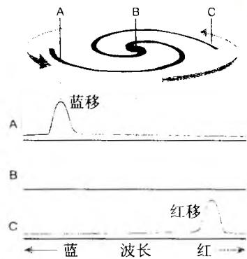
图6.11 恒星或气体轨道
运动引起的多普勒频移

1977年，突利和费舍尔研究旋涡星系中中性氢云的 $21\mathrm{cm}$ 谱线时发现，该谱线有一个展宽（后来也在谱的可见光部分发现有同样的展宽），而且谱线宽度随星系的光度而增加。这一关系称为突利-费舍尔关系。谱线展宽的原因是，气体云环绕星系中心做轨道运动产生多普勒频移，例如向观测者方向运动时谱线产生蓝移，而向观测者相反方向运动时产生红移（参见图6.11）。设谱线的本征波长为 $\lambda$ ，频移所产生的波长变化范围为 $\Delta \lambda$ ，则由多普勒频移的分析有

$$
\frac {\Delta \lambda}{\lambda} \simeq \frac {v _ {r}}{c}\tag{6.17}
$$

其中 $v_{r}$ 表示气体元运动速度在观测者视线方向上的投影。注意由于旋涡星系转动曲线的平坦性，所有气体元轨道速度的大小是与到星系中心的距离无关的。如果星系侧向面对观测者（所谓 edge-on），即观测者的视线与星系盘的法线方向垂直，此时谱线被最大程度加宽，且 $v_{r}$ 的最大值即气体元的轨道速度， $v_{r\max} = V_0$ 。如果星系盘面向观测者（所谓 face-on），谱线就只保持其自然宽度，不受转动影响。这里我们只讨论星系侧向面对观测者的情况。由(6.14)，并设星系的边缘相应于 $r = R$ ，此时 $M(R) = M$ ，有

$$
M = \frac {V _ {0} ^ {2} R}{G}\tag{6.18}
$$

再假设所有的旋涡星系具有相同的质光比. 即 $M/L \equiv \alpha$ . (6.18) 化为

$$
L = \frac {V _ {0} ^ {2} R}{\alpha G}\tag{6.19}
$$

另一方面，星系的光度 $L$ 与其半径 $R$ 之间一般有 $L \propto R^2$ ，或者 $L / R^2 \approx \beta$ ，其中 $\beta$ 可以看作是一个常量，因而(6.19)及(6.17)给出

$$
L = \frac {V _ {0} ^ {4}}{\alpha^ {2} \beta G ^ {2}} \propto V _ {0} ^ {4} \propto \left(\frac {\Delta \lambda}{\lambda}\right) ^ {4}\tag{6.20}
$$

这样，星系的光度就和谱线的展宽联系起来了，这就是突利-费舍尔关系，可以用作旋涡星系光度的指示，即标准烛光。谱线的展宽可以直接测量，因而光度也就容易得到了。有了光度，就可以求出星系的距离。

对于椭圆星系,1976年发现的法博-杰克森关系,也显示了星系光度与恒星速度弥散之间的类似相关性。我们可以利用位力平衡时的结果(6.11),即

$$
M \propto \sigma_ {r} ^ {2} R\tag{6.21}
$$

其中 $\sigma_r^2$ 表示视线方向的恒星速度弥散， $M, R$ 分别为星系的质量和半径。这一关系与(6.18)完全相似，只不过现在用速度弥散代替了圆周轨道速度。再往下的推导就与上面旋涡星系的相同，结果显然有

$$
\boxed {L \propto \sigma_ {r} ^ {4}}\tag{6.22}
$$

这就是法博-杰克森关系的最一般形式,利用它可以由观测到的 $\sigma_{r}^{2}$ 得出椭圆星系的光度,从而进一步求出星系的距离。近年来把光度和星系的表面亮度结合到一个参数 $D_{n}$ 中,这样得到的法博-杰克森关系也称为 $D_{n}-\sigma$ 关系,但这里我们不再详述。

#### 6.1.4 银河系的主要特征

我们的银河系是一个典型的旋涡星系。最先确定太阳在银河系内真实位置的是 H·沙普利。他通过观测造父变星和天琴 RR 型变星，求出了球状星团的距离从而得到它们在空间中的分布，并发现所有的球状星团形成了一个球形分布，球的中心离太阳约 10 kpc。于是他认为球状星团分布的中心就是银河系的中心（银心），这意味着太阳到银河系中心的距离是 10 kpc（1985 年确定为 8.5 kpc，约 28 000 光年）。图 6.12a 为银河系的结构略图。中心区域称为核球，扁平的盘面称为银盘，银盘的中央平面称为银道面，球状星团分布的广大区域称为银晕。图 6.12b 为 COBE 卫星拍摄到的银河系侧视图。因为拍摄所用的波长在近红外波段，故可以明显看到核球最亮的部分。银河系的一些主要参数见表6.3。

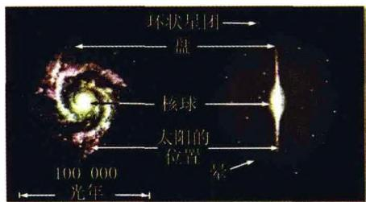
图6.12a 银河系结构略图

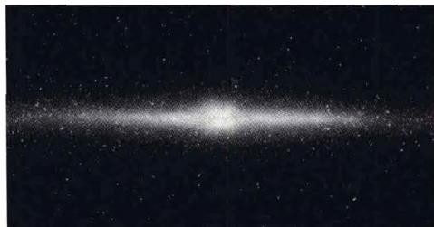
图6.12b COBE卫星在
近红外波段拍摄的银河系

表 6.3 银河系的主要参数

| 盘直径 | 30 kpc |
|---|---|
| 盘厚(气体成分平均) | 0.14 kpc |
| (恒星成分平均) | 0.31 kpc |
| 质量 | $\sim 10^{12} M$ .(由转动曲线定出) |
| 太阳与银河系中心的距离 | 8.5 kpc (1985年确定) |
| 太阳绕银河系中心的轨道速度 | 220 km/s (1985年确定) |
| 太阳绕银河系中心一周的运行时间 | $2.4 \times 10^{8}$ 年 |

核球是银河系中央的恒星密集区，直径约12000光年，质量大约 $10^{10}M_{\odot}$ 。核球中多是年老的恒星，例如天琴座RR型星、晚型矮星和红超巨星。核球中央的部分称为银核，那里有最密集的恒星群。但对于银核的大小现在看法还不一致，一般认为它是银心附近半径约10光年的一个小区域。据红外天文卫星（IRAS）的观测，距银心半径5光年的范围内分布着200万颗恒星，这一恒星密度比球状星团还要高出1000倍，其中很多是年轻的大质量蓝巨星。VLA（甚大阵）和VLBI（甚长基线干涉仪）的观测和空间卫星的X射线观测显示，银心附近有呈弧状结构的强烈气体喷发，且有延展的X射线辐射，表明曾有过大量的超新星爆发和大规模的恒星形成过程。与银河系其他地方相比，银核附近的分子物质相当稠密，典型的温度为70K，密度大于 $10^{4}cm^{-3}$ ，估计分子物质的总量可高达 $10^{8}M_{\odot}$ ，这就为恒星的形成提供了一个非常有利的环境。近年来还发现，银核中的恒星以很高的速度绕银心转动。例如红外观测的结果表明，距银心860AU的恒星轨道周期不到16年，而距银心275AU（约38光小时）的恒星轨道周期仅为2.8年。由此推断出，轨道中央应有一个大质量天体，其质量大约为几个 $10^{6}M_{\odot}$ 。巧合的是，处于银心位置有一个致密的射电源人马座A $^{*}$ ，它发出很强的射电辐射，辐射强度是太阳可见光度的10倍，但辐射区域的尺度小于30亿km，大约相当于土星轨道的大小。同时，红外天文卫星（IRAS）还发现有一个红外辐射源IRS16，它的位置与人马座A $^{*}$ 完全重合。因此许多人认为，人马座A $^{*}$ 处很可能有一个质量量级为 $10^{6}M_{\odot}$ 的巨型黑洞。但一个这样质量的黑洞，史瓦西半径仅为 $r_{s}\approx3\times10^{6}km$ ，只数倍于太阳的半径。如果这个黑洞位于银心，则从地球上看去，它的张角只有 $\sim10^{-6}$ 角秒，就像从数百万km以外看一只乒乓球。因此，我们是不可能直接看到银心处的黑洞的，只能通过间接的办法。近年空间X射线卫星（爱因斯坦天文台）观测到，在距银心小于几光年的范围内有一个低能X射线源，之后在其附近又发现一个高能X射线源。此外，在银河系中心区还探测到有高速喷流现象，喷流长度达13光年。这些都是大质量黑洞可能存在的证据。到现在为止，对银心黑洞的研究和探索还在继续进行(参见4.4.7节)。

银盘的直径约 30 kpc，因为气体和尘埃的阻挡，这一大小很难定得十分准确。在银道面附近，恒星的密度很大，向两侧逐渐减小。银盘内的天体属于星族Ⅰ。它们被认为是银河系内的年轻物质，其特征是富含金属，还包含大量星际气体和尘埃。观测表明，在太阳轨道上，中性氢（HⅠ）气体层的厚度约为 300 pc，而在外边缘处厚度约为 3 kpc。这意味着离银河系中心越远，HⅠ气体层越厚，这称为“侧倾”。此外，最近还发现银盘并不完全是扁平的，而是有一些翘曲，就像是有些翘曲的草帽边缘。这一现象在其他星系中也有发现（参见图 6.13）。边缘翘曲的原因，

目前认为是由于邻近星系的引力作用。

在银盘内， $\mathbf{H}_2$ 的丰度（通常是从CO的分布间接推出 $\mathbf{H}_2$ 的分布）随与银心的距离下降比HI要快得多。观测结果是，在太阳轨道以内， $\mathbf{H}_2$ 的质量近似等于HI，即约为 $1\times 10^{9}M_{\odot}$ 。在太阳轨道之外， $\mathbf{H}_2$ 的质量约为 $5\times 10^{8}M_{\odot}$ ，大致等于HI的四分之一。在距银心约6kpc处， $\mathbf{H}_2$ 的分布出现一个峰值，这称为分子环。现在普遍认为，大部分 $\mathbf{H}_2$ 集中在几千个巨分子云中而

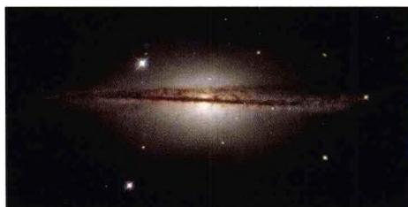
图 6.13 哈勃望远镜拍摄到的星系 ISO510-G13 的照片, 显示其具有翘曲的边缘。近年来发现银河系也有类似现象

不是大量的小云中。另一方面， $\mathbf{H}_2$ 云的厚度大约只及HI的一半，即氢分子比氢原子更贴近银道面。同时， $\mathbf{H}_2$ 也显示有与HI相同的侧倾和翘曲。与分子云混在一起的通常还有大量的尘埃，这使得沿银道面的星际红化非常显著，特别是在银心方向。在太阳附近几百pc范围内有一些浓密的暗星云，这就造成肉眼明显可见的银河“大分岔”的黑暗区域。

银盘中的一个显著结构特征是旋臂。旋臂含有大量热的蓝星、年轻的星团、尘埃和气体云，旋臂内的总物质密度大约是旋臂之间区域的10倍。我们在第5章中已经知道，利用中性氢原子的21 cm谱线，可以探测到银河系的旋涡结构（图6.14），其四条明显的旋臂分别是人马臂、猎户臂、英仙臂和3 kpc臂，太阳位于猎户臂内侧。随着分子云的发现，人们希望利用它们进一步揭示银河系旋臂的特征，因为在其他星系里已经看到，旋臂结构的光学示踪体，如OB星协、HⅡ区、尘埃带等，都与巨分子云相连。许多研究小组已经对银河系进行了大规模的CO巡天观测。近年发现的一个重要而有趣的观测结果是，银盘内区显示旋臂有棒旋特征（见图6.15）。这表明，我们的银河系不是原先一直认为的那样是一个正常旋涡星系，而是一个棒旋星系。

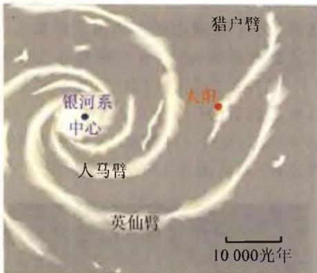
图 6.14 射电 21 cm 谱线所
显示的银河系旋臂结构

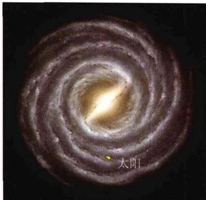
图 6.15 艺术家描绘的银河系
旋臂结构图。图中显示，银河系是一个棒旋星系

银晕的直径约30万光年，是一个近似球形的结构。其中观测到的主要成员是以球状星团为典型代表的星族Ⅱ天体。它们被认为是银河系中最古老的天体，估计年龄在130～170亿年之间。球状星团的主要特点是金属含量很低，且周围没有气体和尘埃。这可能是由于它们的轨道偏心率以及轨道面与银道面的交角比较大，因此，当它们不断穿越物质较为稠密的银盘时，星团内的气体和尘埃就逐渐丢失掉了。银晕中也发现有气体，但比银盘中要少得多。现在认为，银晕的质量主要是由不发光的暗物质所贡献的。20世纪80年代，γ射线天文卫星COS-B发现银河系的高纬度处存在着弥散的γ射线辐射。1997年，观测又发现银河系存在巨大的γ射线晕。现在的看法是，这些弥散的γ射线可能来自中子星，也可能是宇宙线散射，亦有可能与银河系外层的反物质粒子有关。

#### 6.1.5 旋臂生成——密度波理论

旋涡星系的旋臂上主要是年轻的亮星(O、B型星)以及HⅡ区。通常旋臂又窄又长，能延伸几十万光年。假如旋臂由固定的恒星及气体组成，则由于不同轨道半径处的圆周运动速度相同(转动曲线的平性)，将会使旋臂越旋越紧(参见图6.16)。例如，太阳在银河系年龄即大约 $10^{10}$ 年之中，应旋转40圈左右。但观测表明，所有的旋涡星系，旋臂的形状不随时间而变。这一问题曾使人们长期感到困惑不解。

1963年，美籍华裔科学家林家翘、徐遐生提出密度波理论来解释旋臂的生成。这个理论认为，恒星还是在圆轨道上运动，但由于整体转动速度和空间密度分布造成引力势的扰动，就形成密度波，这种波动变化既绕中心环形传播，又沿径向向外传播，因而密度极大的波峰就构成了旋涡状的旋臂（参见图6.17）。而且，一旦旋涡图像在星系内建立起来，就能够在长时期内保持这一图像。旋臂的作用相当于引力势阱：恒星和气体进入旋臂时，空间密度变大，这样的聚集有

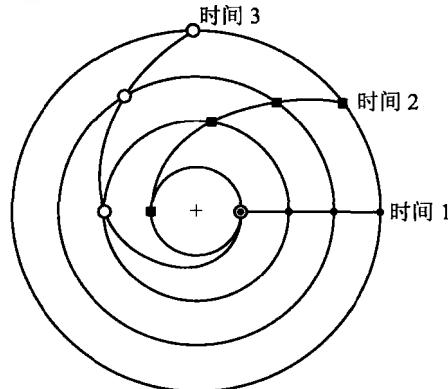
图 6.16 由于不同半径的轨道上恒星的线速度相同,旋臂将越旋越紧

利于恒星特别是亮星在旋臂处形成。总的图像是旋臂图样长期保持不变，但恒星和气体川流不息地进出旋臂。这有些像从空中俯瞰一个城市的机动车流：在某些交通易阻塞的路段，往往车辆拥挤，车速缓慢，形成车流密度较大的区域；而交通顺畅的地方车流密度就相对较小。从空中看，这些车流密度较大的区域的位置是基本固定不变的，即整个城市车流疏密分布的图样基本不变，但所有的车辆却在运动，它们在疏密相间的图样中穿行。要强调的是，虽然密度波被称为波，但与我们所熟悉的通常的行波有所不同。例如，水面的波纹一圈一圈向外传播，但水分子只是上下振动并不向外运动；而密度波的波形在空间基本保持不变，但恒星和气体却在不停运动。因而在某种意义上，可以把密度波理解为引力势扰动自身形成的驻波。到现在为止，关于扰动的产生和旋臂维持不变的原因还在进一步研究。

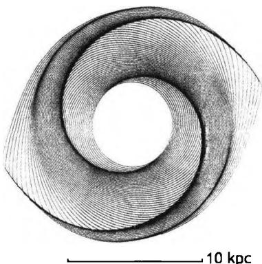
图6.17a 密度波理论给出的两旋臂生成图样

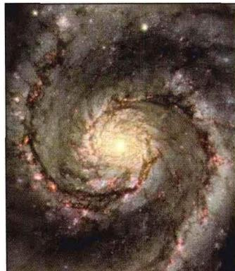
图6.17b 与真实的
两旋臂星系比较

