### 6.2 活动星系与活动星系核

射电天文学特别是空间天文学的发展，使我们得以从各个波段对宇宙天体进行观察，许多过去仅由光学观测得到的结论被改写了。星系就是一个显著的例子。以往传统的看法是，星系是相当宁静的恒星系统，它们的形态和物理特征是长期稳定不变的。而全波段的观测却显示，星系中普遍存在活动的现象，只是活动规模的大小有所不同。绝大部分星系的活动规模较小，我们称之为正常星系；约占2%的星系有剧烈的活动，其主要物理特征呈现快速、明显的变化，我们把它们称之为活动星系。

活动星系的特殊性质在于星系核的活动，以及主星系和伴星系之间的相互扰动，但最主要的特征是星系核的剧烈活动和爆发。根据射电、红外、光学和X射线光度变化的时标，可以估算各个波段活动区域的大小，通常为几十光分、光小时，长的为光年级，所以核的活动发生在很小的范围。但它们在活动期间所发出的能量非常大，例如射电星系可达 $10^{60}\mathrm{erg}$ ，类星体达 $10^{62}\mathrm{erg}$ ，比银河系整个生存期间释放的总能量还要大。这样小的空间区域却可以产生如此巨大的能量，其产能机制立即引起天体物理学家的强烈关注。正因为如此，活动星系和活动星系核（Active Galactic Nucleus，简称AGN)的研究，近30多年来一直是天体物理研究中最活跃的前沿领域之一。

#### 6.2.1 活动星系的主要观测特点

根据观测上的特点,活动星系分为几种主要类型,包括类星体(QSO)、塞弗特星系、射电星系、BL Lac 天体(蝎虎座天体),以及 LINERs(即低电离辐射线核区)。除了 LINERs 比较独特外,其他活动星系的一些共同特点是:

\- 形态:从照片上看,大多数具有一个很亮的致密核,同时还可看到核心区爆发留下来的痕迹,如光学喷射物,纤维状的辐射物等。

● 核区光度特征: 有很高的光度, 与正常星系相比, 有很强的射电、红外和 X 射线辐射。通常连续谱在红外和蓝光波段分别有明显的隆起(见图 6.18)。核区

光度有快速变化，时标短的只有几十分、几小时，长的可达月、年。此外，连续谱多是幂律谱，即辐射功率与频率之间满足

$$
F _ {r} \propto \nu^ {\alpha}\tag{6.23}
$$

谱指数一般有 $\alpha\approx1$ 。偏振和幂率谱的特征表明，核区的辐射应当是高能电子发出的同步加速辐射（见图6.19）。

● 光谱:有亮核的特殊星系,核区光谱都有较宽的发射线和高激发、高电离的禁线。

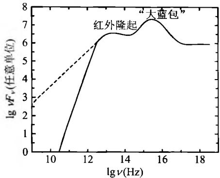
图6.18 AGN连续谱的一般特征

● 动力学特征：射电辐射强的

AGN, 其核周围区域往往可观测到高速运动的物质喷流(jet), 其速度可以接近光速。

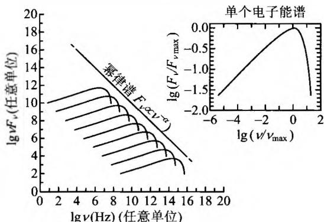
图6.19 一群电子同步加速辐射所发出的
幂律谱。右上方图为单个电子发出的辐射

#### 1. 塞弗特(Seyfert)星系

属异常的旋涡星系，1943年由美国天文学家C. Seyfert发现，故以他的名字命名。在全部最亮的星系中，塞弗特星系占到约 $10\%$ 。它们的主要特征是：

\- 有一个小而亮的恒星状的核，大多数没有完整的旋臂（参见图6.20）。如果短暂曝光，它们看起来像是周围有朦胧斑点包围的恒星，而长时间曝光则像旋涡星系。作为对照，正常星系无论怎样短暂曝光都不会看起来像恒星。这个恒星状物体就是塞弗特星系的星系核。核周围的模糊斑点就是它的星系盘。因此塞弗特星系应当就是具有异常明亮的核的旋涡星系。亮核的尺度一般不超过10光年，其中有不足1光年的异常活动区，区内的辐射功率在强烈活动时超过银河系100倍。

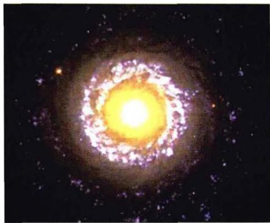
(a) NGC7742

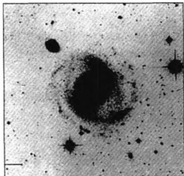
(b) NGC4151

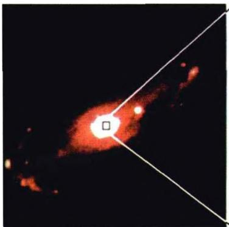

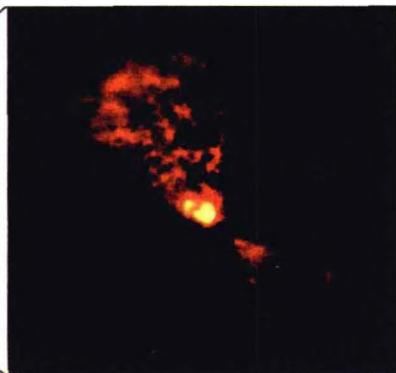
(c) NGC5728, 其中右图为它的核心部分放大图
图6.20 典型的塞弗特星系

核的光谱显示有高激发、高电离的气体发射线和 OⅢ，OⅡ，NeⅢ等禁线，这是在正常星系的光谱中看不到的。观测到的这些发射谱线很强很宽，宽度大于 $10^{3}$ km/s，是正常星系的十倍以上。这说明由于受到中心源的激发和电离，同时受中心源的辐射压，外围气体以每秒几千公里的高速向外运动。如果谱线展宽是由于气体热运动的多普勒效应引起，则谱线宽度意味着温度超过 $10^{7}$ K。按照谱线特征，塞弗特星系可以分为两类：塞弗特Ⅰ型具有宽的发射线（允许谱线HⅠ，HeⅠ和HeⅡ，以及很窄的禁线如OⅢ，参见图6.21a）。塞弗特Ⅱ型只有窄发射线（包括允许线及禁线），谱线宽度显示气体的运动速度只有大约每秒500 km（参见图6.21b）。塞弗特星系的红外辐射是尘埃发出的热辐射，这一特征表明，这些星系中含有丰富的尘埃和气体，有些可能还有许多很热很亮的年轻恒星。

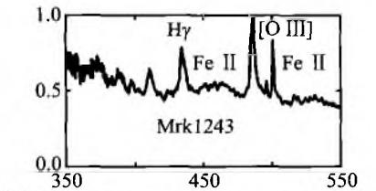

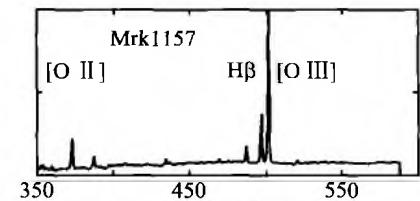

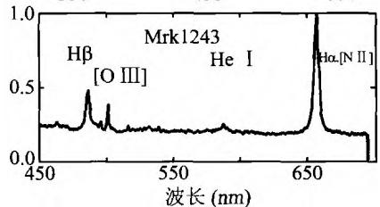
图6.21a 典型的塞弗特I型
星系 Mrk1243 的发射谱线

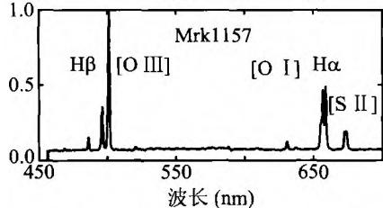
图 6.21b 典型的塞弗特Ⅱ型
星系 Mrk1157 的发射谱线

有较强的光度和很蓝的连续谱，连续谱有时标为几个月的变化，变幅达2～3倍，然而发射线却经常不变。这表明星系中心有一个很小的区域产生非热连续谱，外面有一个很大的产生发射谱线的区域。

位于后发座的星系NGC4151(图6.20b)就是一个典型的塞弗特星系，距离我们4千万光年。它有一个特别明亮的核，每年从核中抛射出来的物质质量达 $100M_{\odot}$ 。对它短时间拍照只能看到明亮的核，长时间曝光才能看到旋涡结构。从光变时标判断，它的核区大小只有约1.6光年，是整个星系大小的几千分之一。

#### 2. 射电星系

具有强射电辐射的星系称为射电星系。最早被发现的是天鹅座 A(Cyg A，即 3C405)，其射电强度是银河系射电强度的百万倍以上，仅射电强度就超过银河系所有波段辐射总和的 20 多倍。1948 年发现它时，看到它的射电图像很奇特，射电像分开为两部分，每一部分都呈圆斑状，称为射电瓣，两个瓣之间的距离很远（见图 6.22）。当时，在它的位置上并没有找到任何光学对应体。直到 1954 年，才在两个射电瓣之间发现一个暗弱的、像是两个星系正在碰撞并合的旋涡星系。光谱测量结果表明,它的红移是 z=0.057,相应的距离为 $170h^{-1}$ Mpc(当 $h\simeq0.7$ 时这一距

离约 240 Mpc，即大约 7.9 亿光年）。两个射电瓣之间分开的距离是 43 万光年。到 20 世纪 70 年代末，综合孔径射电望远镜的分辨率大大提高，对射电星系特别是核与射电瓣结构的描绘也越加细致。现在 VLBI 观测得到的射电星系精细结构分辨率已达～0.001″，大大超过了光学望远镜。射电星系的一般特征是：

\- 结构(核晕结构-延展结构)约3/4的射电星系呈现双源结构，

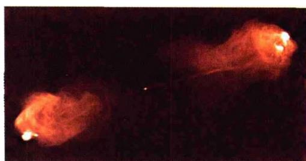
图 6.22 天鹅座 A(红移 $z \simeq 0.06$ ) 的 VLA 射电像。中心可见一个非常小的亮核，两边是分开很远的两个射电瓣，两瓣之间的距离达 43 万光年。图中喷流清晰可见

通常是两个分立的射电源(射电瓣或射电子源)，中心是光学天体，一般情况下是巨椭圆星系(参见图6.23和图6.24)。中心光学源一般也由两个子源组成，两者之间是一个射电致密核。两个射电瓣之间的距离最大可达10 Mpc，瓣的宽度可达1 Mpc。这样的射电瓣结构使人想到从中央天体喷射出来的物质。高分辨率的射电图像中，还可以看到从星系中心指向射电瓣的很窄的射电喷流。除双源型外，还有致密型(占～15%)。它具有0.001"或更小的精细结构，与光学天体位置重合。

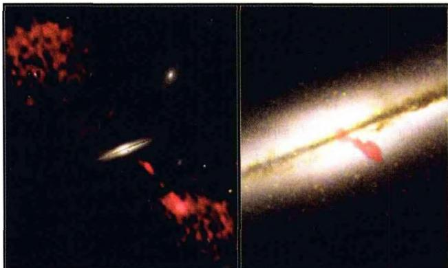
图 6.23 射电星系 0313-192。中心是星系的可见
光图像，星系两侧是射电波段拍摄到的射电瓣图像

有些人认为,所有的射电星系都具有一个核(很多情况下核还可以再分成双源结构）、一对瓣和一对喷流，只是由于其指向与视线方向的夹角不同，才使我们看到不同的射电星系图像。

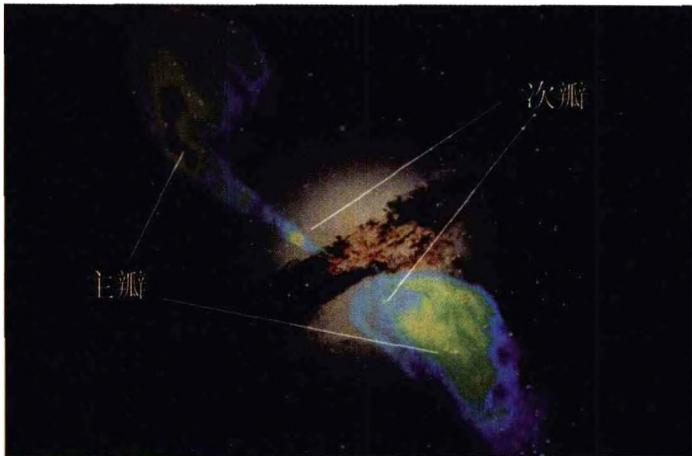
图 6.24 射电星系半人马座 A(NGC5128)。这是一个巨椭圆星系，可能是 5 亿年前的一次星系碰撞所造成的。图中显示了可见光图像，以及主射电瓣及次射电瓣

辐射特征 射电辐射的总能量估计为 $10^{61}\mathrm{erg}$ ，相当于 $10^{10}$ 颗超新星爆发释放的能量。射电星系的辐射谱大致为同步加速谱 $F_{\mathrm{e}} \propto \nu^{-\alpha}$ ，谱指数一般在 $0 < \alpha < 1.2$ 之间。此外，辐射也是偏振的。与塞弗特星系类似，射电星系也分为宽线和窄线两种类型。宽线射电星系具有亮的、类似恒星的核，核外裹着暗淡模糊的包层。而窄线射电星系都是巨型的椭圆星系。

尽管有相互类似之处，射电星系和塞弗特星系之间的区别还是明显的。例如，虽然塞弗特星系的核区也发出射电辐射，但相比于射电星系，这种射电辐射是宁静的。此外，几乎所有的塞弗特星系都是旋涡星系，而强的射电星系中却没有旋涡星系。

表 6.4 不同天体射电辐射功率的比较

| 射电源 | 太阳 | SNR(超新星遗迹) | 正常射电星系 | 强射电星系 |
|---|---|---|---|---|
| 射电辐射功率(erg/s) | $10^{19}$ | $10^{35}$ | $10^{37} \sim 10^{40}$ | $10^{40} \sim 10^{45}$ |

#### 3. BL Lac 天体(蝎虎座天体)

1929年发现蝎虎座BL是一个暗弱的、光变不规则的天体，只有连续谱，谱线几乎观测不到，因而无法得知它的距离。当时认为它是银河系中的一颗不规则变星，其亮度有时在一周内可以变化两倍，有时在几个月内变化15倍，没有什么规律性。短时间曝光类似于恒星的像，长时间曝光后便显出非恒星的特征，有延伸结构，周边显毛绒状。但如果把它的中心核的光挡住，则周边毛绒状部分的光谱与椭圆星系十分类似，这说明BL Lac天体应当是椭圆星系，但有一个很亮的中心核。从谱线的测量得出它的红移为 $z = 0.07$ ，相应的距离在10亿光年以上，是一个遥远的宇宙学距离上的天体。至1998年已发现350个左右这样的天体，总称为BL Lac天体。它们总的特点是：

● 星系核比塞弗特星系更加明亮，最亮时比正常星系亮一万倍。

● 射电、红外、X射线和光学辐射都有快速变化，时标一般为几天到几个月，最短可至几小时。这说明它们的核活动更为剧烈，且核的尺度比塞弗特星系更小。

● 连续谱高涨，吸收线和发射线或者没有，或者很弱。

● 发出的辐射为非热辐射，且偏振度大，可达 35%。

现在把具有快速光变，且辐射强烈偏振的活动星系核称为耀变体（Blazars）。BL Lac天体就是一类典型的耀变体，它们中 $90\%$ 是椭圆星系。此外还有一类耀变体，即所谓OVV类星体，它们具有很强的射电辐射，强的偏振和快速光变，光度比BL Lac天体要大得多。

#### 4. 类星体(QSO)

这是20世纪60年代初发现的一类新型天体，它们在照相底片上显示类似恒星的像，但光谱却非常怪异，以致一开始大家都不知道这些光谱相应于地球上的什么元素。比如1960年美国天文学家马修斯（T. Matthews）和桑德奇（A. Sandege）最早发现的射电源3C48，它的光学对应体是一个视星等为 $16^{m}$ 的恒星状天体，但光谱中的发射线非常奇怪，无法用地球上的元素加以证认。1963年发现射电源3C273的光学对应体是一颗 $13^{m}$ 的蓝星，其光谱线仍然无从辨认。后来更仔细地观察，发现它的周围有朦胧的斑点，在最清晰的照片上显露有从核心向外延伸的一股喷流，恰如射电星系。在同一年，美国加州理工学院的天文学家马丁·施密特(M. Schmidt)指出，实际上这些发射线是氢的巴尔未线，只是红移很大，达 $z = 0.158$ （见图6.25）。如果这一红移是宇宙学的，则表明3C273的哈勃距离大约为 $440h^{-1}\mathrm{Mpc}$ ，显然是一个极其遥远的天体。从它的视星等和距离不难算出，它的绝对星等应当是 $-26^{m}$ ，作为对比，太阳的绝对星等约为 $+5^{m}$ ，两者相差31个星等。这样大的差值相当于超过 $10^{12}$ 的光度比。也就是说，3C273发出 $10^{12}$ 倍于太阳的可见光，但它在射电波段发出的辐射能量还要高于可见光。因而，这样的一个天体不可能是一颗恒星，而是一个比银河系还要亮得多的星系！由此，类星天体奇怪谱线之谜便被解开。例如第一颗类星天体3C48的红移高达 $z = 0.367$ ，相应的哈勃距离达 $900h^{-1}$ Mpc。这些天体当时是作为射电源被发现的，称为类星射电源，简称Quasar。后来发现还有许多天体，在光学照片上很像Quasar，而且也有很大的红移，但是没有任何射电辐射。现在把它们与Quasar一起统称为类星体，即Quasi-Stellar Objects，简称QSO。类星体的共同特点是：大红移、远距离、高能量、小尺度。由于距离遥远，我们现在看到的它们的像，实际上是它们在几十亿年以前的形象，那时的宇宙还很年轻，处于演化的早期阶段。因此，类星体对研究宇宙早期演化，以及宇宙大尺度结构的形成具有十分重要的意义。现已发现的类星体总数大约有50000颗，其中红移 $z > 4$ 的已超过500颗。

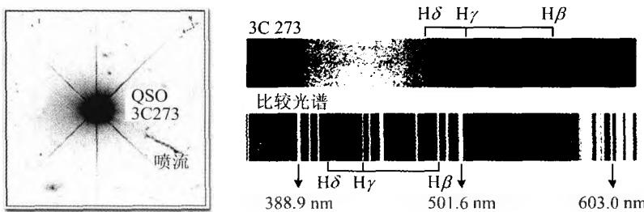
图6.25 类星体3C273的光学像及其光谱，光学像中喷流明显可见

表 6.5 典型活动星系的光度与银河系比较

| 星系 | 光度 |
|---|---|
| 银河系 | $\sim 10^{44}$  erg/s |
| Seyfert | $\sim 10^{45}$  erg/s |
| 强射电星系 | $\sim 10^{45}$  erg/s |
| QSOs | $\sim 10^{47}$  erg/s |

下面我们再把类星体的主要特征归纳一下：

\- 具有类似恒星的像，说明它们的角直径 $< 1^{\prime \prime}$ 。极少数有微弱的星云状包层（如3C48），还有些有喷流结构（如图6.25所示的3C273，其喷流从中心延伸的距离达 $39h^{-1}\mathrm{kpc}$ ）。

● 光谱中有强而宽的发射线，最常出现的是 H、O、C、Mg，而 He 线非常弱或没有。同时，发射线很宽，说明产生发射线的气体团的随机运动速度弥散很大。

\- 紫外辐射强，因而颜色显得发蓝。光学波段连续光谱的能量分布呈幂律谱形式。

● 类星射电源发出强烈的非热射电辐射，射电结构多数呈双源型，少数呈复杂结构，还有少数是致密的单源，角直径 $\leqslant 0.001^{\prime \prime}$ 。致密源的位置通常都与光学源重合，射电辐射的频谱指数平均为0.75，一般 $\alpha > 0.4$ 称陡谱， $\alpha < 0.4$ 的称平谱。陡谱射电源多数是双源，平谱多数是致密单源，它在厘米波段的辐射特别强。

\- 光学、连续射电谱一般都有非周期光变，变幅为 $0.1^{m} \sim 3^{m}$ ，变化时标一般为几个月到几年，也有短至几天的。由此可估计出类星体的发光区域很小，比星系小得多。这是由于光速是有限的，光变时标即光源亮度发生整体变化的时间，不能短于光跑过整个发光区域所需时间，否则的话，发光区域前后不同部分所发光信号就会相互叠加，最后使得有规律的光变信号被抹平。这也就是说，发光天体的几何尺度 $l$ ，不能超过光变时标 $\Delta t$ 内光线传播的距离，即

$$
l <   c \Delta t\tag{6.24}
$$

这是根据天体的光变时标判断天体几何尺度的一个简单有效的方法，在天体物理观测中被广泛应用。例如，如果一个天体具有时标为一个月的光变，则它辐射区域的大小必定小于一个“光月”；如果光变时标为一小时，则辐射区域的大小不超过一个“光小时”，如此等等。显然，从类星体的光变时标可以看出，类星体发光区域的尺度不会超过几个光年，有的只有几个“光月”甚至“光日”，远远小于普通星系的尺度，有的只比太阳系大一些。

● 发射线有很大红移，至今为止最大红移为 z = 6.42。一个类星体的所有发射线都有相同的红移，但如果光谱中有吸收线，则 $z_{吸收} \leqslant z_{发射}$ 。吸收线通常很窄，宽度小于 300 km/s。目前认为，类星体吸收线是类星体与观测者之间的星系际气体或中间暗星系晕所产生的，那里具有比较低的温度。大量密集的吸收线形成了显著的 Lyα 线丛（Lyman-α forests，见图 6.26），它们对于研究宇宙早期的电离历史以及早期天体的形成有重要的意义。

关于类星体红移的起源，历史上曾存在过激烈的争论。当时有些人认为，如果类星体果真处在宇宙学距离上，则它们的光度将大大超过普通星系，如前面我们对3C273所分析的那样。而且这样巨大的能量辐射发自一个极小的区域，尺度只有几光日到几光年，即 $10^{15} \sim 10^{17}\mathrm{cm}$ ，高能电子源的产生区域还要更小。这样的辐射机制在类星体刚被发现的那个时期是不可想象的。因此，引力红移之说、运动学之说等便应运而生。但引力红移之说无法解释类星体也遵从的视星等-红移关系（即哈勃关系）。而运动学之说无法解释，为什么看不到因向我们运动而谱线呈现蓝移的类星体。随着黑洞吸积盘模型的不断改进完善，类星体中央存在巨型黑洞的看法，现已被天体物理学家普遍接受。正是黑洞吸积周围物质而释放出巨大能量，才使得类星体能在极小的空间区域内产生大大超过正常星系的光度。因此，曾长期困扰天体物理学家的“类星体能源之迷”终于有了答案，多年来笼罩在类星体头上

的神秘面纱，至今可以说已被揭开了。

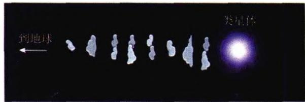

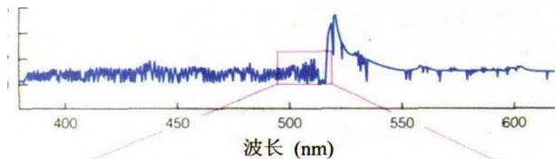

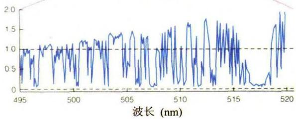
图6.26 类星体的Lyα吸收线丛及其产生

类星体一开始是作为强射电源被发现的，但今天看来，射电辐射在类星体总的辐射输出中并不占主要地位。具有强射电辐射的类星体只占总数的约 $10\%$ ，有 $90\%$ 的类星体基本不发出射电辐射。空间卫星的观测表明，相当多的类星体是强X射线源。1981年，天文学家观测到3C48周围的暗云及其光谱，光谱显示其红移与3C48一致，这表示3C48存在于一个“寄主星系”之中，它只不过是这个寄主星系的亮核。哈勃空间望远镜观测到的类星体，大部分都已发现有寄主星系（参见图6.27），其余的可能是尚未被观测到。因而类星体是活动星系的亮核的观点，现已被广泛接受。此外，以前曾认为类星体是宇宙中最遥远、最古老的天体，但随着越来越多高红移正常星系的被发现，这种看法也逐渐被否定了。至今发现的正常星系的最大红移已达 $z\sim 7$ ，超过了类星体的最大红移，这表明类星体并不是星系形成和演化中的必经一环。因此我们可以想象，在宇宙演化早期，当最早的一批星系形成时，其中有活动星系，也有正常星系。它们之间的主要区别只是在于星系核的活动程度，也就是星系核心的黑洞与周围物质相互作用的程度，而黑洞应当是在所

有的星系核中普遍存在的。

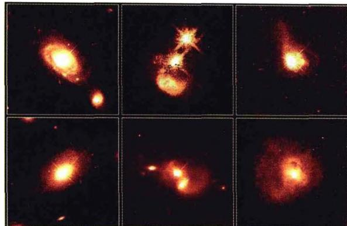
图 6.27 哈勃望远镜拍摄的类星体及其寄主星系
最后，再补充一个关于活动星系核（AGN）的重要观测结果。大规模红移巡天（包括光学、X射线）的观测表明，包括类星体在内的AGN的（共动）空间数密度随时间（宇宙学红移）有明显演化，且大约在 $z\approx 2$ 时数密度达到极大（见图6.28）。这一观测事实对所有AGN形成与演化的理论模型都是很重要的。

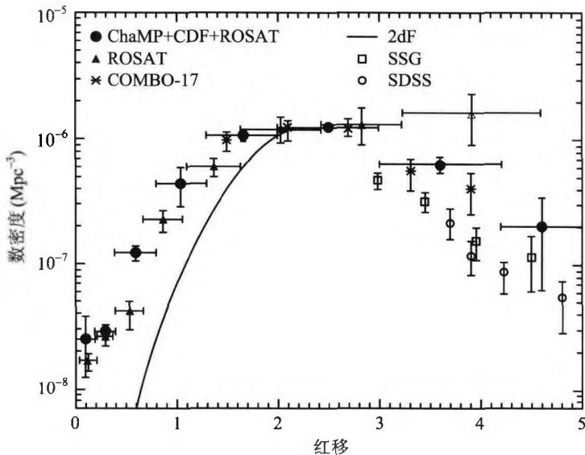

图6.28 AGN的共动数密度随红移的分布
5. LINERs(Low Ionization Nuclear Emission-Line Regions)

即低电离辐射线核区，它们是一些核光度非常低的星系，但其低电离辐射线（如 O I 和 N II 的禁线）相当强。它们的光谱与塞弗特Ⅱ型星系的低光度端类似，一般认为它们代表了活动星系核现象的低能极限，即由于吸积物质供应不足而导致光度剧烈下降。但低电离辐射线在许多旋涡星系的高灵敏度观测中也被发现，此外还有星暴星系和HⅡ区。因此，对LINERs的本质还有待进一步研究。

#### 6.2.2 活动星系核(AGN)的统一模型

从上面的分析我们看到,塞弗特星系、BL Lac 天体、射电星系以及类星体等这些 AGN 有许多特征是共同的,主要表现在致密核区的剧烈活动以及释放出的巨

大能量。它们之间也有一些不同之处，例如有的有宽发射线，而有的却没有；此外在射电和X射线辐射强度上也各有区别。因此，自然就会想到，这些外观不同的天体，本质上是否相同？也就是说，它们是否可以用一个统一的模型来描述？现在已经有了这样的模型，称为AGN的统一模型，如图6.29所示。

#### 1. AGN 统一模型的要点

● 星系核中心有一个超大质量的黑洞，质量范围为 $10^{5} \sim 10^{9} M_{\odot}$ 。

● 黑洞吸积盘延展到 10～1 000 $R_{s}$ ，其中 $R_{s}$ 为黑洞的史瓦西半径。吸积盘发出 X 射线、远紫外、紫外、光学等波段的辐射。

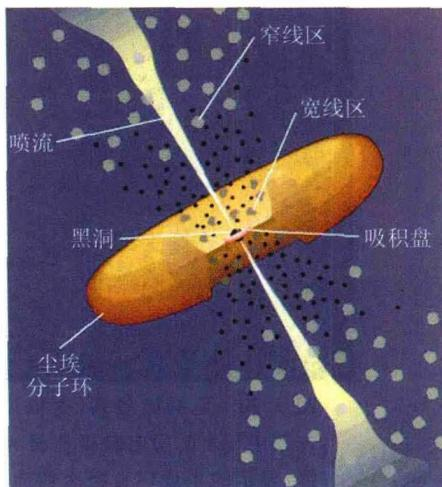
图 6.29 AGN 的统一模型

\- 黑洞附近有一个宽线区(BLR,即宽发射线区),由稠密的气体云团构成,云中电子密度达 $n_{\mathrm{e}} \simeq 10^{9} \sim 10^{10} \mathrm{~cm}^{-3}$ 。宽线区分布在黑洞附近 $0.1 \sim 1 \mathrm{pc}$ 的范围,并以 $v_{\mathrm{BLR}} \leqslant 10^{4} \mathrm{~km} / \mathrm{s}$ 的速度环绕黑洞运动。

\- 比宽线区再远一些有一个窄线区(NLR,即窄发射线区),气体团内电子密度为 $n_{\mathrm{e}} \leqslant 10^{5} \mathrm{~cm}^{-3}$ ,分布范围达几个 pc,围绕黑洞的运动速度是 $v_{\mathrm{NLR}} \simeq 10^{2} \sim 10^{3} \mathrm{~km/s}$ 。不仅发射窄的允许谱线,而且发射窄的禁线。

\- 吸积盘外面有一个由尘埃和分子构成的环状体(torus)，环形平面与吸积盘平面相平行，内半径约1pc，外半径50～100pc。环状体发出红外到毫米波辐射(参见图6.30和图6.31)。

\- 喷流:尺度范围为 $0.1 \sim 10^{6} \mathrm{pc}$ , 发出很强的同步加速辐射, 频谱几乎覆盖所有波段。

按照这个统一模型,所有 AGN 的结构都是类似的,只是由于观测者的视线与吸积盘取向之间的角度不同，才显示出不同的辐射特征。例如，如果视线方向大致与吸积盘平面(因而也与尘埃环的平面)平行，则由于视线方向尘埃环的强烈吸收，观测者观测到的主要是强的射电辐射，且向两边喷射的喷流形状最为明显，因而活

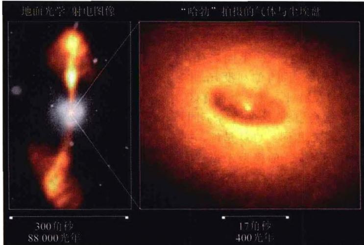
图 6.30 巨椭圆星系(射电星系)NGC4261 的射电/光学图像。左图中显示的射电瓣延伸至大约 60 kpc。右图为哈勃望远镜拍摄，显示的尘埃环直径大约为 100 pc。环中心的光点应当就是黑洞之所在

动星系核就呈现出射电星系的特征。如果视线方向与喷流的方向很接近，则致密

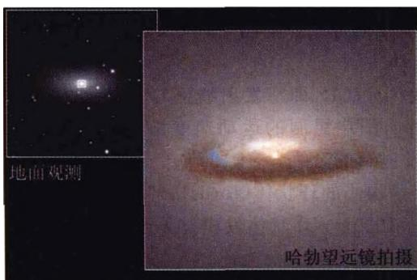
图 6.31 椭圆星系 NGC7052 中心的尘埃环

核区就容易被观测到，活动星系核就呈现出类星体的特征。从其他适当角度亦可以呈现塞弗特星系或BL Lac天体的特征。当然，中心黑洞的质量和物质吸积率的大小，以及吸积盘的厚薄、结构和磁场强度等对结果的影响也是非常重要的。总之，这一模型原则上已经被越来越多的天体物理学家所接受，但它还不够完善，许多细节还在进一步研究改进之中。

#### 2. AGN 的中心引擎——黑洞

我们在前面讨论过，核反应最多只能提供 $0.7\%$ 的能量转换率。而活动星系核则要求高得多的能量转换率，大约比核反应要高几十倍。什么能源能提供如此高的能量转换率呢？人们自然就想到黑洞。因此在AGN的统一模型中，黑洞起到中心引擎的作用，为AGN的辐射提供强大的能量输出。我们来估计一下黑洞辐射的能量转换效率。一个质量为 $m$ 的粒子，从远方下落到质量为 $M$ 的黑洞的史瓦西半径 $R_{s} = 2GM / c^{2}$ 附近时，所能辐射的最大能量等于转化的引力势能，即

$$
E _ {\max} = \frac {G M m}{R _ {s}} = \frac {G M m}{2 G M / c ^ {2}} = \frac {m c ^ {2}}{2}\tag{6.25}
$$

显然，能够转化为辐射的能量高达粒子静能的一半，即 $E_{\mathrm{max}} / (mc^2) = 1 / 2$ ，这大大高于核反应。因而，辐射的最大功率即最大光度就取决于黑洞的吸积率 $\mathrm{dm} / \mathrm{dt}$ ，即

$$
L _ {\max} = \frac {1}{2} \frac {\mathrm{d} m}{\mathrm{d} t} c ^ {2}\tag{6.26}
$$

例如，当吸积率为 $\mathrm{dm} / \mathrm{dm} = 1M_{\odot} / \mathrm{yr}$ 时，不难算出 $L_{\mathrm{max}} = 3\times 10^{46}\mathrm{erg / s}$ ，它几乎相当于太阳光度的 $10^{13}$ 倍！

当然，事实上的能量转化率并没有这么大。因为如果粒子是直线落下来的，则大部分能量将被黑洞所吸收，能发出的辐射将很有限。为了最大限度获取辐射能量，必须让下落的粒子沿近乎圆形的螺旋轨道围绕黑洞缓慢下落。在这种情况下大约可以有 $40\%$ 的静能转化为辐射能。计算表明，为了使射电星系产生观测到的光度，要求黑洞的质量至少要达到 $10^{7}M_{\odot}$ 。

中心黑洞的质量,可以采用恒星动力学或气体动力学测量方法得到。目前的研究结果表明,中心黑洞的质量 M 与周围恒星的速度弥散 $\sigma_{*}$ 之间有下列关系(参见图 6.32):

$$
M \propto \sigma_ {*} ^ {4}\tag{6.27}
$$

这一关系表明,黑洞的质量与寄主星系的质量密切相关。现在人们普遍认为,AGN及其中心黑洞,是与寄主星系共同演化的。

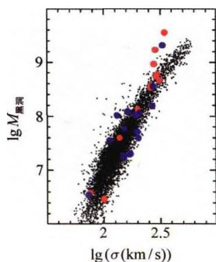

#### 3. 喷流的产生和维持

从中心天体向两边高速喷出的喷流是非常壮观的天象。例如图6.22显示的天鹅座A的喷流，长度达 $50h^{-1}$ kpc。图6.33显示的活动星系M87的喷流，进入射电瓣之前的长度达1.5kpc，喷流中

图 6.32 AGN 中心黑洞的质量与核区恒星或宽线区速度弥散的关系

明显可见一连串的亮结点；观测还发现，在与它对称的空间位置上还有一条很微弱的反向喷流。喷流的产生和维持机制引起了天体物理学家的极大兴趣。喷流是高度定向的，最长可达 $10^{6}\mathrm{pc}$ ，有些喷流的速度甚至接近光速。很早就有人提出，喷流之所以定向，是由于两种作用相互“较力”的结果：一方面是黑洞的吸积，使黑洞周围形成稠密的气体层，它阻挡物质从黑洞表面附近向外运动；另一方面，黑洞的强磁场使带电粒子沿磁力线方向加速，它们试图冲破周围稠密气体层的束缚而向外运动。这两种作用“较力”的结果，最终使带电粒子（主要是电子）冲破稠密气体的薄弱处，形成“喷嘴”而向外喷射。喷射的物质中不仅有电子，而且有周围电离气体的粒子。由于黑洞磁场的两个磁极处磁场强度最强，所以带电粒子最可能从这两处冲开缺口，形成喷嘴向外喷射。现在认为，这可能是厚吸积盘情况下喷流形成的原因。但对于薄的吸积盘，喷流可能就是带电粒子直接沿磁力线向外高速运动。另一个问题是，在一些射电星系中只观测到单个喷流，但射电瓣总是有两个。这一情况可能的解释是，背离观测者的喷流发出的光束集中在它的前方，因此我们看不到，这称为射束(beaming)效应。

关于喷流维持的机制，目前也没有完全一致的看法。相对论性电子因为发出同步辐射将很快失去能量。按理论计算的估计，喷流中的相对论性电子最多只能维持1万年的辐射。但射电星系3C236的喷流长约百万光年，这表明电子在旅途中一定还有某种能量补充(加速)机制。有人认为是激波引起的磁场挤压效应，也有人认为是辐射压加速电子。总之，关于喷流的形成和维持机制目前还没有定论，还有许多问题需要深入探讨。

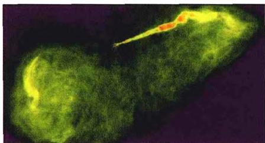
(a) X 射线像

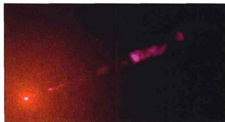
(b) 光学像
图 6.33 活动星系 M87 的喷流

#### 4. 喷流的视超光速运动

观测发现，一些 AGN 喷流的运动速度超过了光速。例如图 6.34 所示的类星体 3C345 和射电星系 M87 的喷流都是如此，后者的运动速度竟达到光速的 5 倍以上。这看来严重违背了狭义相对论的基本原理，因而引起了学术界的强烈关注。

这种超光速的运动究竟是实质性的，或仅仅是表观上的？实际上，我们对喷流速度的测量并不是直接的，因为喷流中一般观测不到谱线，故无法用谱线的频移来测定运动速度。实际的做法是，由喷流(或某一天体)在天空移动的角位移速度，再乘以

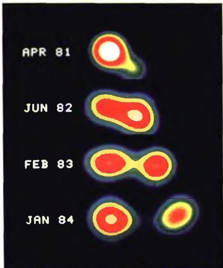
图6.34a 从类星体3C345的核
(图左)中出射的喷流(图右)

M87喷流中的视超光速运动
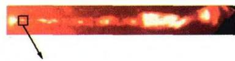

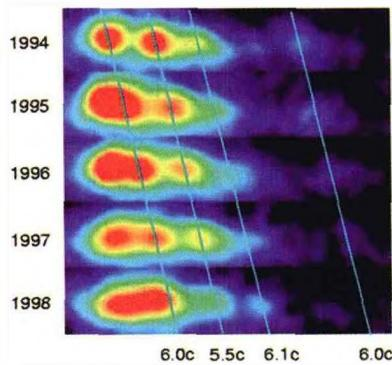
图 6.34b 射电星系
M87 喷流的运动

喷流(AGN)到观测者的距离,就得出喷流横向的线速度,即

$$
v = \frac {\mathrm{d} \theta}{\mathrm{d} t} D\tag{6.28}
$$

其中 $\mathrm{d}\theta / \mathrm{d}t$ 表示角位移的时间变化率， $D$ 是AGN到我们的距离。仔细的研究指出，其实这里有一个狭义相对论的效应，利用它就可以解释看到的超光速运动现象。如图6.35所示，设有一个天体从 $O$ 点出发，移动到相距 $r$ 的 $P$ 点。天体的真实速度为 $v$ ，运动方向与视线的夹角为 $\theta$ 。我们取视线为 $x$ 方向，横向为 $y$ 方向，观察到的天体是沿 $y$ 方向运动，也就是天体在天空的投影位置发生变化。因为

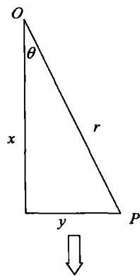

$$
x = r \cos \theta , \quad y = r \sin \theta\tag{6.29}
$$

天体移动距离 r 所需时间为 t = r / v 。光线从 P 点到达观测者的时间，比从 O 点到达观测者的时间要少 x / c ，因此，观测者看到的天体从 O 移动到 P 的“视”时间为

至观测者

图6.35 视超光速运动的狭义相对论解释

天体物理概论

$$
\begin{array}{r l} t _ {a p p} & = t - x / c \\ & = \frac {r}{v} - \frac {r}{c} \cos \theta = \frac {r}{v} (1 - \beta \cos \theta) \end{array}\tag{6.30}
$$

其中 $\beta\equiv v/c$ 。于是，观测者看到的天体的“视”速度（横向表观速度）是

$$
\begin{array}{r l} v _ {a p p} & = \frac {y}{t _ {a p p}} = \frac {r \sin \theta}{(r / v) (1 - \beta \cos \theta)} \\ & = \frac {v \sin \theta}{1 - \beta \cos \theta} \end{array}\tag{6.31}
$$

当 $v \ll c$ 时， $\beta \to 0$ ，因而 $v_{app} \simeq v \sin \theta$ ，这是我们熟悉的结果。但是如果 $v \to c$ ，则可能会有 $v_{app} > v$ ，甚至会有 $v_{app} > c$ 。为看到这一点，我们来求当 $v$ 给定时，相应于 $v_{app}$ 最大值的夹角 $\theta$ 。这不难从(6.31)式的求导得出，结果是

$$
\cos \theta = \beta , \quad \sin \theta = \sqrt {1 - \beta^ {2}}\tag{6.32}
$$

把这一结果代回(6.31)，就得到 $v_{app}$ 的最大值为

$$
\left(\frac {v _ {a p p}}{v}\right) _ {\max} = \frac {1}{(1 - \beta^ {2}) ^ {1 / 2}}\tag{6.33}
$$

显然，当 $v \to c$ 且 $\theta \to 0$ 时，即天体运动速度接近光速，且运动方向与视线方向的夹角非常小时，就可以得到非常大的 $v_{app}$ ，其值可能大大超过光速。但在这种情况下，天体的真实运动速度 $v$ 并没有超过光速，因而也就没有违背狭义相对论。总之，这种超光速运动只是一种表观现象，我们把这一现象称为视超光速运动。目前所有观测到的超光速运动现象（例如喷流），实质上都是视超光速运动。

