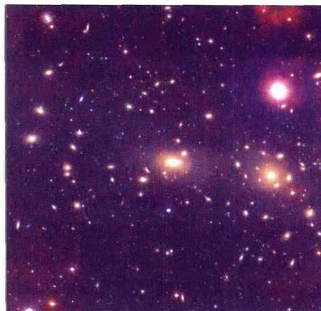
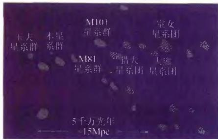
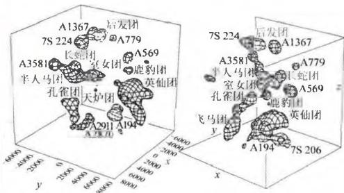
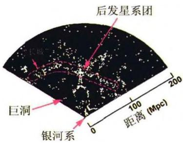
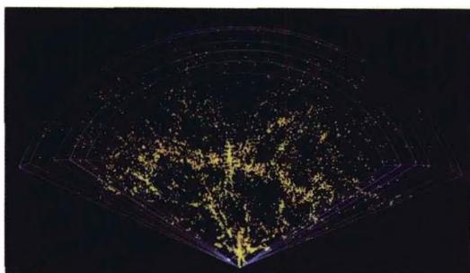
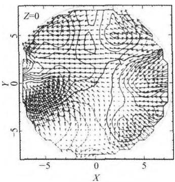
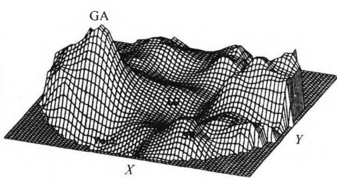
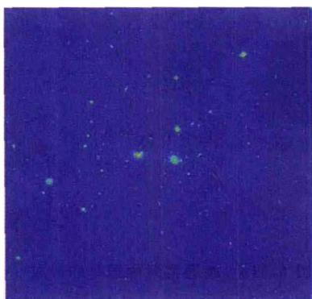
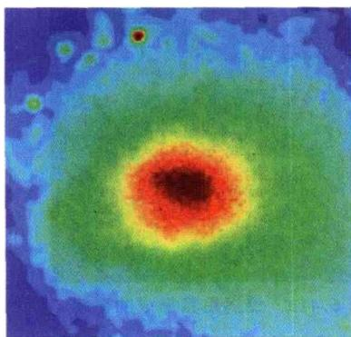

### 6.3 星系团和超星系团

#### 6.3.1 星系的大尺度成团结构

星系聚集成团的现象在天空中很普遍。从小范围讲，星系常以双重星系、三重星系及多重星系出现。双星系中有时会发现有互扰星系以及并合星系。约有半数的明亮星系构成双重或多重星系，这些多重结构又可进一步构成小的星系群。例如，大小麦哲伦云是双重星系（大麦云距离我们17万光年，小麦云距离20万光年，它们之间相距5万光年），它们与银河系构成三重星系（大小麦云中都含有大量星际气体，在银河系的引力作用下，一部分气体伸向银河系，形成“气体桥”），并进而与御夫星系等近距星系形成多重星系。这个系统又与以 M31 为中心的另一个多重星系构成本星系群的两个星系集中区。本星系群是以 M31 为中心，尺度大约为 1 Mpc 的一个空间范围，成员约 40 个左右，其中有两个巨型旋涡星系（银河系与 M31），一个中型 S 星系（M33），其余都是矮椭圆星系和不规则星系。

星系群的成员数一般在100个以下。比星系群更大的成团结构是星系团，它包括成百上千个星系，多的可达上万个。一般来说，星系的尺度量级为 $10\mathrm{kpc}$ ，多

重星系为 100 kpc，星系团为 1 Mpc。星系团的质量可以用类似前面椭圆星系的方法，即通过位力定理求出。结果表明，星系团的质量范围是 $10^{13} \sim 10^{15} M_{\odot}$ ，但几何尺度相差并不是很大。它们的形状各有不同，有的结构紧致，有的相当松散。例如，离我们最近（约 19 Mpc）的室女座（Virgo）星系团，成员超过 2500 个，是一个外形不规则的星系团。而离银河系约 113 Mpc 的后发座（Coma）星系团（图 6.36），包含星系总数估计在 1 万个以上，则显出中央非常密集的形状，中央亮星系数超过 1000 个，其中有两个超巨型星系，即巨椭圆星系 NGC4889 和巨旋涡星系

图 6.36 后发座(Coma)星系团, 包括一万个以上的星系, 其中亮星系超过 1000 个

NGC4874。观测结果表明，至少有 $85\%$ 的星系是处在群或团这样的成团结构之中；而且，在星系团里的星系约有 $80\%$ 是椭圆星系，而不在星系团中的星系（即所谓场星系），约有 $80\%$ 是旋涡星系。近年来的空间观测发现，许多星系团中弥漫着很强的X射线辐射，但对于这些X射线辐射的起因，目前还没有得到令人信服的解释。

比星系团更高一级的成团结构称为超星系团。例如，本星系群和室女团、大熊星系团以及其他约50个左右较小的群或团组成了本超星系团(图6.37)，它是一个巨大的、呈扁平状的星系集群，其中包括2175个亮星系，中心在室女团附近，尺度约30～75 Mpc。本星系群位于该超星系团的边缘附近，估计银河系统本超星系团中心公转的周期为1000亿年。除成员最多的本超星系团外，其他超星系团一般只包含几个星系团，呈扁长状，长度在60～100 Mpc左右。超星系团成员之间的引力作用，要比星系团内星系之间的引力作用弱得多，说明在这样大的尺度上，引力成

团的趋势明显减弱。

图6.37b 本星系群附近 $80h^{-1}\mathrm{Mpc}$ 范围内星系团的分布

图6.37a 本超星系团的主要成员

超星系团的存在，表明宇宙空间的物质分布在大约100 Mpc的尺度内是不均匀的。除了超星系团外，还发现宇宙中存在一些区域，其中的星系特别少，这称为空洞或巨洞。比如在牧夫座方向就发现一个尺度达60 Mpc的巨大空洞，空洞内的星系密度只有平均值的1/5或更低。而在另外一个离银河系约100 Mpc的地方，有一个横向跨距很大、呈片状的星系密集区，长约170 Mpc，宽约60 Mpc，厚度大约5 Mpc，称为宇宙“长城”（图6.38），其中的星系密度是平均密度的5倍左右，总质量为银河系的几十万倍，是目前所知的宇宙中最大的星系聚集结构。

图6.38a 宇宙在一个扇形“切

图6.38b 更细致的图像
片”中显示的空洞和“长城”结构

超星系团之上是否还有更高的成团结构？经过大量的观测分析，人们发现超星系团之间不再有成团的倾向，而是趋于均匀分布。也就是说，我们的宇宙在大于几百个Mpc的尺度上，就可以看作是均匀、各向同性的了。目前把我们观测所及的宇宙部分称为总星系，总星系的典型尺度为100亿光年。

#### 6.3.2 星系的大尺度本动速度

由于星系的分布在大约 100 Mpc 的尺度上呈现不均匀性，因此在这一尺度上，每个星系所受到的周围星系或星系团的平均引力作用就不会完全抵消。这样，除了与宇宙膨胀同步的运动（即所谓哈勃流）外，每个星系都还有自己的本动速度，即由于周围引力大小的涨落而产生的附加速度，或对哈勃流的偏离速度。本质上说，本动速度的起因是周围物质密度的涨落，其中不仅有恒星等发光物质的贡献，也包括不发光的暗物质的贡献，实际上后者的作用更为重要。因而，对本动速度的测量可以提供宇宙物质特别是宇宙暗物质分布的重要信息。

对星系大尺度本动速度的系统研究开始于1976年卢宾(V. Rubin)等人的测量工作。他们用全天分布的96个旋涡星系样本，得到太阳相对于上述样本星系平均背景的运动速度约为 $600\mathrm{km / s}$ ，方向为 $\alpha \approx 30^{\circ}$ ， $\delta \approx 50^{\circ}(\alpha, \delta$ 分别代表天球坐标的赤经、赤纬）。而宇宙微波背景辐射(Cosmic Microwave Background radiation，简称CMB)的偶极各向异性表明，太阳相对于CMB的运动速度约为 $370\mathrm{km / s}$ ，方向为 $\alpha = 168^{\circ}, \delta = -7^{\circ}$ 。由这两个速度差可以算出这些样本星系相对于CMB的运动速度大约为 $600\mathrm{km / s}$ ，即它们所分布的区域(尺度大约为85Mpc，其中包含几千个星系)正以大约 $600\mathrm{km / s}$ 的速度相对于哈勃流漂移。这样大的本动速度是远远超出当时人们所预期的。利用太阳相对于CMB的运动速度，扣除掉太阳相对于银河系、银河系相对于本星系群中心的速度，现在得到的本星系群相对于CMB的本动速度是 $627\mathrm{km / s}$ ，向着长蛇座方向。

当然，星系本动速度的测量不是一件容易的事情。必须用与红移无关的方法测定星系的距离，从而得到它的哈勃速度；再用红移所表征的实际速度减去哈勃速度，才得到本动速度。现在已经有了一些较为可靠的、与红移无关的测定星系距离的方法，例如我们前面讨论过的，利用旋涡星系的自转速率与星系光度之间的突利-费舍尔关系，即把自转速率作为星系本身光度的一种指示，再由光度和视星等的关系求出距离；或利用椭圆星系的光度与速度弥散 $\sigma$ 之间的法博-杰克森关系（即 $L\infty \sigma^4$ 或 $D_{n} - \sigma$ 关系），来确定星系的绝对光度，从而得出距离，等等。自20世纪80年代以来，人们采用多种不同的方法，在不同的尺度上进行了大量的测量工作，为研究星系大尺度本动速度积累了丰富的观测数据。

在此基础上，由观测到的星系大尺度本动速度场就可以求出物质密度扰动场的分布，即实现密度扰动场的重构。我们在此不详述细节，简单说来就是，把本动速度场 v 表示为某个标量场 $\psi$ 的梯度

$$
\boldsymbol {v} = - \nabla \psi\tag{6.34}
$$

$\psi$ 称为速度势。再由相关的流体力学方法可以得到速度势所满足的泊松方程

$$
\nabla^ {2} \psi = H f a ^ {2} \delta\tag{6.35}
$$

其中 $H, f, a$ 等是与空间坐标无关的宇宙学参数。因此，只要知道了速度势函数的空间分布，就可以根据(6.35)得出密度扰动场 $\delta$ 的分布，即完成密度扰动场的重构（见图6.39）。这一方法被称之为POTENT方法。结果表明，在几十个Mpc的范围内，所有的星系都受到一个质量巨大的巨吸引子(Great Attractor)的引力吸引，从而朝着它的方向运动。这个巨吸引子的中心位于长蛇座和半人马座之间的方向，距离我们约为 $42h^{-1}\mathrm{Mpc}$ （见图6.39b），总质量达 $5\times 10^{16}M_{\odot}$ 。但在那个区域只观测到大约7500个星系，它们的总质量最多只有巨吸引子质量的 $10\%$ 左右。因此人们猜测，巨吸引子质量的大约 $90\%$ 应当是宇宙暗物质贡献的。总之，关于这个巨吸引子的本质以及它是如何形成的，至今仍然是一个谜。

图 6.39a 用 POTENT 方法得到的本超星系团平面上的速度-密度分布, 矢量场表示本动速度场, 等高线代表密度分布
图 6.39b 由本动速度场重构的物质密度分布，图中 GA 代表巨吸引子(银河系位于图的中央)

#### 6.3.3 星系团的 X 射线辐射

自1977年高能天文台(HEAO)系列计划的X射线卫星陆续发射后，就观测到许多星系团发出的X射线辐射(参见图6.40)。这些X射线观测加上光学观测的结果表明，星系团内包含大量的星系际介质。星系际介质的成分可以分成两种，一种是弥漫的、不规则分布的恒星，另一种是热的、大致均匀分布的星系际气体，这些气体占据了星系之间的广大空间，并充满整个星系团的引力势阱。X射线的光度范围达 $10^{36} \sim 10^{38}\mathrm{W}$ ，或 $10^{43} \sim 10^{45}\mathrm{erg / s}$ ，且对于许多富星系团来说，X射线比光学波段更亮。据估计，室女星系团的核心包含大约 $5 \times 10^{13} M_{\odot}$ 的X射线辐射气体，后发星系团的核心包含大约 $3 \times 10^{13} M_{\odot}$ ，这些气体的质量超过相应区域恒星质量的数倍。现在发现，X射线发自热气体的韧致辐射，且X射线谱显示，气体的成分多为高电离的离子，如FeXXV和FeXXVI，以及硅、氖离子。这表明，这些气体经历了星系中恒星的核合成过程。但问题随之而来：它们是如何从星系里面逃逸到星系际空间中去的呢？可能的解释是，在星系团形成的过程中，星系的碰撞与并合会经常发生（见下一节）。星系的碰撞与并合可能会使相当部分气体离开星系而进入星系际空间，也可能由于碰撞与并合而产生大量的星暴（即形成星暴星系，参见图6.9及图6.43d），重元素气体由此形成并被抛射到星系际空间。

图 6.40a 后发星系团的光学像

图6.40b 后发星系团的X射线像

