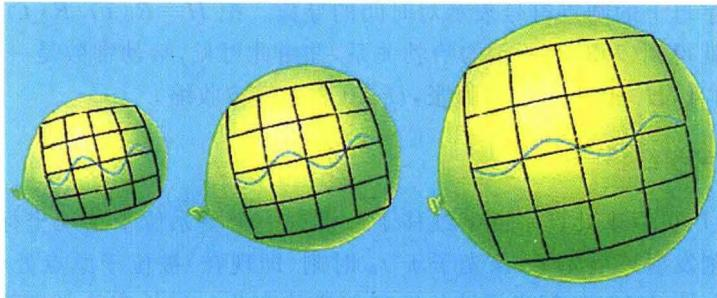
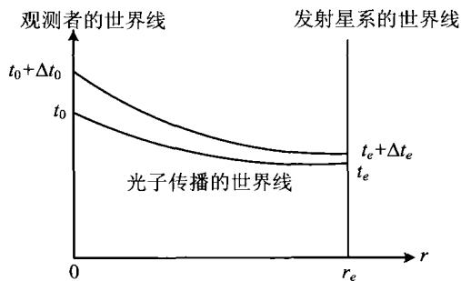
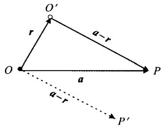
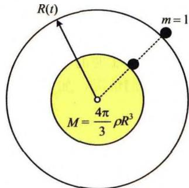

### 7.4 几何宇宙学

#### 7.4.1 宇宙学原理

由星系分布的大尺度均匀性和微波背景辐射的各向同性,我们可以猜想,宇宙中所有天体的分布总体上是均匀、各向同性的。这实际上是爱因斯坦最早创立现代宇宙学理论时提出的一个假设,现在被称之为宇宙学原理:

宇宙在大尺度上是均匀且各向同性的。

因此，我们可以把宇宙看作是密度到处都相同的流体，而星系或星系团就是组成这种流体的质点或质元，这种流体只会静止、或者各向同性地膨胀或收缩。用另外的话来说，宇宙学原理也可以表述为：

宇宙中不同地点、同一时刻看到的宇宙图像相同；不同地点看到的宇宙演化图景也相同。

这就是说，宇宙中没有任何一个地点是特殊的，所有的地点都是平等(平权)的。爱因斯坦当时解释说，之所以采用这样一个观点，是由于无法找到被考察区域的空间边界条件，只好用这一“近似的假定”来代替边界条件的作用。爱因斯坦的考虑当然是对的，因为我们的确不知道，今天所看到的宇宙之外是什么。但现在人们更倾向于认为，宇宙学原理不仅仅是一种权宜的无奈选择，而是我们周围均匀各向同性的宇宙向其他未知区域的自然扩展和延伸。这样的看法实际上包含着人类的一种美好理念，就像开普勒曾把行星运动看作是宇宙和谐的韵律一样，我们的宇宙是一个和谐的宇宙，而均匀各向同性就是宇宙和谐的一个基本特征。

#### 7.4.2 三维常曲率空间与罗伯森-沃克度规

下面我们就开始来构建宇宙学模型。根据宇宙学原理和空间可能弯曲的考虑，我们希望构建一个三维的常曲率（即空间各点处具有同样的曲率）空间。为简单直观起见，我们先来看一个二维的常曲率空间，这样的空间实际就是一个二维球面，它的半径为 r，面积为 $4\pi r^{2}$ ，曲率为 $1/r^{2}$ 。在球极坐标下，球面上的一段线元的长度（球面上两点之间的距离）是

$$
\mathrm{d} s ^ {2} = r ^ {2} \mathrm{d} \theta^ {2} + r ^ {2} \sin^ {2} \theta \mathrm{d} \varphi^ {2}\tag{7.4.1}
$$

现在让我们来想象一个三维常曲率球面。这样一个曲面上的两点距离为：

$$
\mathrm{d} s ^ {2} = f (r) \mathrm{d} r ^ {2} + r ^ {2} \mathrm{d} \theta^ {2} + r ^ {2} \sin^ {2} \theta \mathrm{d} \varphi^ {2}\tag{7.4.2}
$$

其中 $f(r)$ 表示空间弯曲的程度。显然当 $f(r) = 1$ 时，空间就是平直的，而 $f(r) \neq 1$ 表示空间弯曲。如 $r =$ 常数，即 $\mathrm{d}r = 0$ ，三维球面就回归到二维球面。

高斯曾给出一个求曲率的公式,按照这个公式,对于(7.4.2)所示的三维常曲率球面,空间曲率等于

$$
K = \frac {\mathrm{d} f (r)}{\mathrm{d} r} \frac {1}{2 f ^ {2} (r) r}\tag{7.4.3}
$$

此式可以化为

$$
\frac {\mathrm{d}}{\mathrm{d} r} \left(\frac {1}{f (r)}\right) = - 2 K r\tag{7.4.4}
$$

积分给出

$$
\frac {1}{f (r)} = C - K r ^ {2}\tag{7.4.5}
$$

这一关系应对一切 K 成立, 于是由平直空间的 K = 0, f = 1, 得出 C = 1, 最后得到

$$
f (r) = \frac {1}{1 - K r ^ {2}}\tag{7.4.6}
$$

现在我们把上述三维球面放到四维时空中。宇宙学原理要求，在同一时刻 $t$ ，宇宙各处的空间曲率应相同。当然，空间曲率可以随时间 $t$ 做整体变化，因而可写为 $K(t)$ ，这里的 $t$ 称为宇宙学时间。这样(7.4.2)就变为

$$
\mathrm{d} s ^ {2} = \frac {\mathrm{d} r ^ {2}}{1 - K (t) r ^ {2}} + r ^ {2} \mathrm{d} \theta^ {2} + r ^ {2} \sin^ {2} \theta \mathrm{d} \varphi^ {2}\tag{7.4.7}
$$

因为 $K(t)$ 是一个随时间变化的量, 我们可以定义

$$
K (t) \equiv \frac {k}{R ^ {2} (t)}, \quad k \left\{ \begin{array}{c} + 1 (\text {正曲率空间或闭合空间}) \\ 0 (\text {平直空间}) \\ - 1 (\text {负曲率空间或开放空间}) \end{array} \right.\tag{7.4.8}
$$

再定义 $\xi = r / R(t)$ （注意 $R$ 具有长度量纲，故 $\xi$ 是一个无量纲量），则(7.4.7)化为

$$
\mathrm{d} s ^ {2} = R ^ {2} (t) \left[ \frac {\mathrm{d} \xi^ {2}}{1 - k \xi^ {2}} + \xi^ {2} \mathrm{d} \theta^ {2} + \xi^ {2} \sin^ {2} \theta \mathrm{d} \varphi^ {2} \right]\tag{7.4.9}
$$

式中 $R(t)$ 称为宇宙尺度因子， $\xi, \theta, \varphi$ 称为共动坐标。“共动”的意思是，它们就像二维球面上的经纬线那样，随球面一起膨胀或收缩（参见图7.18）。这里要注意，当球面膨胀或收缩时，相对于球面静止的观测者或质点，其共动坐标是不变的，但固有坐标（或物理坐标） $r$ 在变（因为 $r = R(t) \xi$ ）。共动坐标取好之后，再在每一个坐标点处放置一只钟纪录宇宙学时间，并根据宇宙学原理，各处的钟走时（即宇宙学时间）是相同的。对一个静止于共动坐标系的观测者来说，其世界线是 $\xi, \theta, \varphi$

图7.18 膨胀的二维宇宙及其共动坐标

为常值的线。在这样的坐标系下，时空中两点之间的原时间隔现在写为

$$
\mathrm{d} \tau^ {2} = c ^ {2} \mathrm{d} t ^ {2} - R ^ {2} (t) \left[ \frac {\mathrm{d} \xi^ {2}}{1 - k \xi^ {2}} + \xi^ {2} \mathrm{d} \theta^ {2} + \xi^ {2} \sin^ {2} \theta \mathrm{d} \varphi^ {2} \right]\tag{7.4.10}
$$

显然，对于静止（ $R$ 不随时间变）且平直 $(k = 0)$ 的宇宙，原时间隔就回到我们熟悉的狭义相对论形式，即 $\mathrm{d}\tau^2 = c^2\mathrm{d}t^2 -\mathrm{d}r^2 -r^2\mathrm{d}\theta^2 -r^2\sin^2\theta \mathrm{d}\varphi^2$ 。习惯上，仍把(7.4.10)中的 $\xi$ 写为 $r$ ，即

$$
\mathrm{d} \tau^ {2} = c ^ {2} \mathrm{d} t ^ {2} - R ^ {2} (t) \left[ \frac {\mathrm{d} r ^ {2}}{1 - k r ^ {2}} + r ^ {2} \mathrm{d} \theta^ {2} + r ^ {2} \sin^ {2} \theta \mathrm{d} \varphi^ {2} \right]\tag{7.4.11}
$$

这样，现在 $r$ 是无量纲的共动坐标，而固有坐标是 $R(t)r$ 。注意对于 $k = 0$ 的平直宇宙和 $k = -1$ 的开放宇宙， $r$ 的变化范围没有限制；而对于 $k = +1$ 的闭合宇宙， $r$ 的变化范围是从 $0 \to 1$ ，这意味着空间的大小是有限的。（7.4.11）给出的时空度规称为罗伯森-沃克度规（Robertson-Walker Metric，简称为R-W度规）。在广义相对论中，度规是一个张量，由(7.4.11)可以立即得出该张量的相关分量，但这里我们就不详细讨论了。如果在 $t$ 时刻有两个星系，一个星系位于 $(r = 0, \theta, \varphi)$ ，另一个星系位于 $(r, \theta, \varphi)$ ，即它们之间的共动距离是 $r$ ，则按照(7.4.11)，此时它们之间的固有(物理)距离是

$$
D = R (t) \int_ {0} ^ {r} \frac {\mathrm{d} r}{\sqrt {1 - k r ^ {2}}} = \left\{ \begin{array}{c c} R (t) \arcsin r & \dot {k} = 1 \\ R (t) r & k = 0 \\ R (t) \operatorname{arsinh} r & k = - 1 \end{array} \right.\tag{7.4.12}
$$

这里注意, 因为 D 是指 t 时刻的距离, 故在使用(7.4.11)式时取了 dt = 0 。这两个星系之间的相对固有速度, 就是固有距离对时间的导数, 即

$$
v = \frac {\mathrm{d} D}{\mathrm{d} t} = \dot {R} (t) \int_ {0} ^ {r} \frac {\mathrm{d} r}{\sqrt {1 - k r ^ {2}}} = \frac {\dot {R}}{R} \cdot D\tag{7.4.13}
$$

按照习惯, 字母上的圆点符号表示对时间的导数。把 $H \equiv \dot{R}(t)/R(t)$ 定义为哈勃常数, 我们就得到 (7.3.3) 所示的哈勃关系, 并由此可见, 哈勃常数是一个随时间变化的量。而且, H > 0 表示宇宙膨胀, H < 0 表示宇宙收缩。

#### 7.4.3 宇宙学红移

现在我们可以来计算宇宙学红移了。设有一个星系位于共动坐标 $r = r_e$ 处，并在 $t_e$ 时刻发射一个光子，该光子于 $t_0$ 时刻（即现在）被位于原点处 ( $r = 0$ ）的观测者接收到（图7.19）。问光子波长应有怎样的变化？波长变长了即宇宙学红移，反之则为蓝移。根据原时间隔（7.4.11），注意到光子的传播总满足 $d\tau = 0$ ，且此时光子是沿径向传播的 ( $\theta, \varphi$ 保持不变），因而有

$$
\mathrm{d} \tau^ {2} = 0 = c ^ {2} \mathrm{d} t ^ {2} - \frac {R ^ {2} (t) \mathrm{d} r ^ {2}}{1 - k r ^ {2}}\tag{7.4.14}
$$

图7.19 宇宙学红移

我们把光看作是波，发射时的波长为 $\lambda_{e}$ ，波的周期为 $\Delta t_{e}$ ，且 $\lambda_{e} = c\Delta t_{e}$ ；接收时相应地变为 $\lambda_0, \Delta t_0$ ，且 $\lambda_0 = c\Delta t_0$ 。这样，沿图7.19所示的光传播的世界线，波的开头相应于(7.4.14)的积分

$$
c \int_ {r _ {e}} ^ {t _ {0}} \frac {\mathrm{d} t}{R (t)} = \int_ {0} ^ {t _ {e}} \frac {\mathrm{d} r}{\sqrt {1 - k r ^ {2}}}\tag{7.4.15}
$$

波的结束相应于积分

$$
c \int_ {t _ {e} + \Delta t _ {e}} ^ {t _ {0} + \Delta t _ {0}} \frac {\mathrm{d} t}{R (t)} = \int_ {0} ^ {r _ {e}} \frac {\mathrm{d} r}{\sqrt {1 - k r ^ {2}}}\tag{7.4.16}
$$

此两式给出

$$
\int_ {t _ {e} + \Delta t _ {e}} ^ {t _ {0} + \Delta t _ {0}} \frac {\mathrm{d} t}{R (t)} = \int_ {t _ {e}} ^ {t _ {0}} \frac {\mathrm{d} t}{R (t)} \Rightarrow \int_ {t _ {e}} ^ {t _ {e} + \Delta t _ {e}} \frac {\mathrm{d} t}{R (t)} = \int_ {t _ {0}} ^ {t _ {0} + \Delta t _ {0}} \frac {\mathrm{d} t}{R (t)}\tag{7.4.17}
$$

当 $\Delta t_{e}$ 和 $\Delta t_{0}$ 都远小于使 $R(t)$ 发生明显变化的时间尺度时，上式等号两边被积函数中的 R 都可以近似看作不变，即分别等于 $R(t_{e})$ 和 $R(t_{0})$ ，因此得到

$$
\frac {\Delta t _ {e}}{R (t _ {e})} = \frac {\Delta t _ {0}}{R (t _ {0})} \Rightarrow \frac {\Delta t _ {0}}{\Delta t _ {e}} = \frac {R (t _ {0})}{R (t _ {e})}\tag{7.4.18}
$$

而 $\Delta t_0 = \lambda_0 / c, \Delta t_e = \lambda_e / c$ （注意此处 $\lambda_0$ 指的是接收到的波长，与前面(7.3.1)的定义不同），上式化为

$$
\frac {\lambda_ {0}}{\lambda_ {e}} = \frac {R (t _ {0})}{R (t _ {e})}\tag{7.4.19}
$$

于是，观测者接收到的光子的宇宙学红移，亦即星系的宇宙学红移为

$$
z \equiv \frac {\lambda_ {0} - \lambda_ {e}}{\lambda_ {e}} = \frac {R (t _ {0})}{R (t _ {e})} - 1\tag{7.4.20}
$$

显然当宇宙膨胀时有 z > 0，收缩时有 z < 0，对静态宇宙总有 z = 0。对于膨胀的宇宙，星系发光时刻越早，相应的 $R(t_{e})$ 就越小，观测到的宇宙学红移也就越大。如果光子是在大爆炸时刻发出的，此时有 $R(t_{e} = 0) = 0$ ，故 $z = \infty$ ，即观测到的光子能量变为零，这就产生了视界。

#### 7.4.4 宇宙学视界

在膨胀宇宙中,如果光源位于这样远的位置,使得观测者接收到的光子波长红移为无穷大(此时光子能量为零,实际上也等于接收不到光子),则光源所在位置就是视界。为了与黑洞的视界相区别,这里的视界称为宇宙学视界(cosmological horizon),也称为粒子视界(partical horizon)。显然,宇宙学视界是以观测者为中心、视界到观测者的距离为半径的一个球面。由(7.4.20)看到,宇宙学视界相应的是t=0,R=0的大爆炸点,即所谓原初火球。如果宇宙没有大爆炸起源,即没有R=0的时刻,就不会有视界。另一方面,如果宇宙是静态的,R不随时间而变,则由(7.4.20)看出,无论星系的距离有多远,宇宙学红移总是为零,也不存在视界。

现在我们来求视界的大小, 即视界到观测者的距离。我们只讨论膨胀宇宙的情况, 因为这是观测到的现实宇宙。膨胀宇宙一定有 R = 0 的时刻 (此时刻 t = 0), 因此一定存在宇宙学视界。仍根据光子的传播方程 (7.4.14), 即

$$
c ^ {2} \mathrm{d} t ^ {2} = \frac {R ^ {2} (t) \mathrm{d} r ^ {2}}{1 - k r ^ {2}}\tag{7.4.21}
$$

设视界所在处的共动坐标为 $r_{h}$ ，则光子于 t=0 时从视界出发，在时刻 t 到达观测者的过程，应满足(7.4.21)式分离变量后的积分等式

$$
c \int_ {0} ^ {t} \frac {\mathrm{d} t ^ {\prime}}{R (t ^ {\prime})} = \int_ {0} ^ {r _ {\mathrm{h}}} \frac {\mathrm{d} r}{\sqrt {1 - k r ^ {2}}}\tag{7.4.22}
$$

按照(7.4.12)给出的求固有距离的公式，t 时刻的视界大小应等于共动距离 $r_{h}$ 相应的固有距离，即

$$
D _ {\mathrm{h}} (t) = R (t) \int_ {0} ^ {r _ {\mathrm{h}}} \frac {\mathrm{d} r}{\sqrt {1 - k r ^ {2}}}\tag{7.4.23}
$$

利用(7.4.22)，这就给出

$$
D _ {\mathrm{h}} (t) = c R (t) \int_ {0} ^ {t} \frac {\mathrm{d} t ^ {\prime}}{R \left(t ^ {\prime}\right)}\tag{7.4.24}
$$

由此式可见，视界大小随时间变化的规律取决于 $R(t)$ 的具体形式。例如，如果 $R(t)$ 具有幂律形式，即 $R(t)\propto t^n$ （以后会看到，实际的宇宙的确如此，且有 $0 < n$ $< 1$ ），则由(7.4.24)得到

$$
D _ {\mathrm{h}} (t) = c R (t) \int_ {0} ^ {t} \frac {\mathrm{d} t ^ {\prime}}{R (t ^ {\prime})} = c t ^ {n} \int_ {0} ^ {t} \frac {\mathrm{d} t ^ {\prime}}{t ^ {\prime n}} = \frac {1}{1 - n} c t\tag{7.4.25}
$$

此结果表明，视界的大小在随时间 $t$ 增长，即我们看到的宇宙范围是在不断扩大的。由(7.4.22)， $t$ 增长也意味着 $r_h$ 一定增长，即视界的共动距离也在增加，因而视界的共动坐标位置并不是保持不变的。另一方面，人们为简单起见常说，视界的大小就是 $ct$ ，也就是光在宇宙年龄的时间内跑过的距离。但(7.4.25)的结果表明，实际的视界大小并不严格等于 $ct$ ，而是还要乘以一个因子 $1/(1-n)$ 。这是宇宙膨胀所引起的。试想如果宇宙不膨胀，则 $R$ 不随时间而变，这相应于幂指数 $n=0$ ，只有在这种情况下，(7.4.25)给出 $D_h = ct$ 。一般情况下 $0 < n < 1$ ，因而有 $D_h > ct$ 。

由(7.4.13)所示的固有(退行)速度与固有距离之间的哈勃关系 v = HD，如果距离足够大，使得该处退行速度 v = c，则此距离称为哈勃距离，记为 $L_{H}$ ，且

$$
L _ {\mathrm{H}} (t) = \frac {c}{H (t)} = \frac {c R (t)}{\dot {R} (t)}\tag{7.4.26}
$$

显然 $L_{H}$ 也是会随时间变化的。对于现在时刻， $t = t_{0}$ ，哈勃距离为

$$
L _ {\mathrm{H}} = \frac {c}{H _ {0}} \sim 3 0 0 0 h ^ {- 1} \mathrm{Mpc}\tag{7.4.27}
$$

这给出了目前可见宇宙的近似大小。

这里我们解释一下常常会引起疑惑的两个问题。一个问题是，如果星系的距离大于哈勃距离，即 $D > L_{\mathrm{H}}$ ，那么就会有 $v > c$ ，即星系的退行速度超过光速，这可能会发生吗？第二个问题是，如果星系的退行速度超过了光速，我们还能看到它吗？

第一个问题的回答是肯定的:星系退行的速度可以超过光速。因为“运动速度不能超过光速”是狭义相对论的结果,而狭义相对论讨论的是平直且静态空间中的运动,并且速度指的是一个物体相对于某个惯性参照系的运动速度。而我们现在的情况下,空间是动态(膨胀)的,还可能是弯曲的。以图7.7a所示的膨胀二维空间(球面)为例,A、B两点相对于球面并没有运动,两个点的共动坐标位置都没有发生变化,它们之间的相对运动并不是由于两个点的运动所引起,而是空间(球面)

膨胀的结果。如果两点之间的距离足够远，当然可能会有 v>c 。但这并不违背狭义相对论，因为在膨胀球面上并不存在一个大范围的、把 AB 两点都包括在内的惯性参考系。

第二个问题的回答也是肯定的:即使星系的退行速度超过光速,我们仍然可能看到它。当然不一定是现在看到,可能是将来某个时刻看到。答案之所以和一般想像的不同,本质上还是由于对时空的理解。这个问题的提出者考虑的是,星系退行速度 v>c,方向背离我们而去;而星系发出的光的速度是 c,方向朝向我们。这两个速度叠加,结果显然还是一个离我们而去的速度,所以光信号永远到达不了观测者。这样的考虑中有两个错误:一是运用了伽利略速度合成,而伽利略速度合成是牛顿力学的结果,对于光是不适用的。这一点读者在学习狭义相对论时应该注意到了,涉及光的速度合成一定要用洛伦兹变换。第二个错误是没有考虑空间的膨胀,仍然考虑的是平直静态的时空。

针对第二个问题,我们先来计算一下,膨胀宇宙的视界大小与哈勃距离之比。当 $R(t) \propto t^{n}$ 时,视界大小由(7.4.25)给出,哈勃距离由(7.4.26)给出,且有 $\dot{R}/R = n/t$ ,这样得到两者之比为

$$
\frac {D _ {\mathrm{h}}}{L _ {\mathrm{H}}} = \frac {n}{1 - n}\tag{7.4.28}
$$

由此可见，当 n=1/2 时 $D_{h}=L_{H}$ ，当 $n>1/2$ 时 $D_{h}>L_{H}$ 。这表明，我们看到的宇宙（视界以内），可以包括膨胀速度等于、甚至大于光速的部分。

我们再来计算一下视界膨胀的速度。由(7.4.24)，视界膨胀的速度是

$$\begin{array}{r l} \frac {\mathrm{d} D _ {\mathrm{h}}}{\mathrm{d} t} & = c \dot {R} (t) \int_ {0} ^ {t} \frac {\mathrm{d} t ^ {\prime}}{R (t ^ {\prime})} + c R (t) \frac {\mathrm{d}}{\mathrm{d} t} \int_ {0} ^ {t} \frac {\mathrm{d} t ^ {\prime}}{R (t ^ {\prime})} = \frac {\dot {R} (t)}{R (t)} c R (t) \int_ {0} ^ {t} \frac {\mathrm{d} t ^ {\prime}}{R (t ^ {\prime})} + c \\ & = \frac {\dot {R} (t)}{R (t)} D _ {\mathrm{h}} + c = H (t) D _ {\mathrm{h}} + c \end{array} \tag{7.4.29}
$$

其中 $H(t)D_{h}$ 表示现在位于视界处的星系的退行速度。(7.4.29)表明，视界膨胀的速度比位于视界处的星系退行速度多出一个光速。因而这一结果意味着，当视界膨胀时，越来越多的星系不断进入我们宇宙的可见部分。

#### 7.4.5 牛顿宇宙学

通常会认为，膨胀宇宙的解只有用广义相对论才能得出。但事实上，我们用牛顿理论加宇宙学原理，同样也可以得到膨胀的宇宙模型。设宇宙中的物质如均匀分布的流体并忽略压力，则按照牛顿力学，可以得到下列熟悉的基本方程组（参见(3.6)～(3.8))：

(连续性方程)

$$
\frac {\partial \rho}{\partial t} + \nabla \cdot (\rho \pmb {v}) = 0\tag{7.4.30}
$$

(动力学方程)

$$
\frac {\partial \boldsymbol {v}}{\partial t} + \boldsymbol {v} \cdot \nabla \boldsymbol {v} = - \nabla \Phi\tag{7.4.31}
$$

(泊松方程)

$$
\nabla^ {2} \Phi = 4 \pi \rho G\tag{7.4.32}
$$

图7.20 牛顿宇宙的图解

设观测者位于图 7.20 中的 O 点。从 O 点看来， $O'$ 点和 P 点的位置矢量分别为 r 和 a，且这两点的运动速度分别为 $v(r, t)$ ， $v(a, t)$ 。另一方面，从 $O'$ 点看 P 点的速度是

$$
\boldsymbol {v} ^ {\prime} (\boldsymbol {a} - \boldsymbol {r}, t) = \boldsymbol {v} (\boldsymbol {a}, t) - \boldsymbol {v} (\boldsymbol {r}, t)\tag{7.4.33}
$$

这实际上就是伽利略速度合成。但根据宇宙学原理，宇宙中不同地点的观测者，在同一时刻看到的

宇宙图像应相同, 这样 P 对 $O'$ 的速度应等于图 7.20 中 $P'$ 点对 O 点的速度, 即

$$
\boldsymbol {v} ^ {\prime} (\boldsymbol {a} - \boldsymbol {r}, t) = \boldsymbol {v} (\boldsymbol {a} - \boldsymbol {r}, t)\tag{7.4.34}
$$

因此(7.4.33)变为

$$
\boldsymbol {v} (\boldsymbol {a} - \boldsymbol {r}, t) = \boldsymbol {v} (\boldsymbol {a}, t) - \boldsymbol {v} (\boldsymbol {r}, t)\tag{7.4.35}
$$

这一等式必须对所有的 $r, a$ 成立，所以 $\pmb{v}$ 应当是 $\pmb{r}$ 的线性函数：

$$
\pmb {v} (\pmb {r}, t) = \pmb {H} (t) \pmb {r}\tag{7.4.36}
$$

其中 $H(t)$ 是一个只与时间有关、而与位置无关的常数。(7.4.36)等号右边无附加的常数项，这是由于速度各向同性的要求。显然，当 $t$ 一定时，(7.4.36)给出的正是哈勃关系(参见图7.7b)， $H(t)$ 也正是哈勃常数。所以，只根据牛顿理论和宇宙学原理，我们就得出了宇宙膨胀的结果。实际上，(7.4.36)等号的右边乘以0或乘以-1后，也满足等式(7.4.35)，这样得到的解代表静态宇宙或收缩的宇宙。但静态宇宙是不稳定的，一个小扰动就会使宇宙越来越偏离静态平衡。因此，一个只有引力作用的均匀各向同性宇宙，要么整体收缩，要么整体膨胀。

利用(7.4.36)，并把 $H(t)$ 表示为 $H(t)=\dot{R}(t)/R(t)$ ，我们就可以进一步研究宇宙尺度因子 $R(t)$ 满足的动力学方程。将(7.4.36)代入连续性方程(7.4.30)，得到

$$
\frac {\partial \rho}{\partial t} + \nabla \cdot \left(\rho \frac {\dot {R}}{R} r\right) = 0 \Rightarrow \frac {\partial \rho}{\partial t} + 3 \frac {\dot {R}}{R} \rho = 0\tag{7.4.37}
$$

此即

$$
\frac {\mathrm{d}}{\mathrm{d} t} (\rho R ^ {3}) = 0 \Rightarrow \rho R ^ {3} = \text {常量}\tag{7.4.38}
$$

如果设 $t_{0}$ 为现在时刻，t 为任意时刻，则上式表明

$$
\rho (t) = \frac {R ^ {3} (t _ {0})}{R ^ {3} (t)} \rho (t _ {0})\tag{7.4.39}
$$

容易验证,泊松方程(7.4.32)有解

$$
\Phi = \frac {2 \pi G}{3} \rho r ^ {2}\tag{7.4.40}
$$

将这一解代入运动方程(7.4.31)，得到

$$
\frac {\partial}{\partial t} \left(\frac {\dot {R} r}{R}\right) + \left(\frac {\dot {R}}{R} r\right) \nabla \cdot \left(\frac {\dot {R}}{R} r\right) = - \frac {2 \pi G}{3} \rho \cdot 2 r\tag{7.4.41}
$$

简单计算后给出

$$
\left(\frac {\ddot {R}}{R} + \frac {4 \pi G}{3} \rho\right) r = 0\tag{7.4.42}
$$

因为 r 是任意给定的矢量, 故等号左边的括号必须始终为零, 即

$$
\ddot {R} = - \frac {4 \pi G}{3} \rho R = - \frac {4 \pi G R ^ {3} (t _ {0}) \rho (t _ {0})}{3 R ^ {2} (t)}\tag{7.4.43}
$$

其中用到(7.4.39)式。把(7.4.43)两边乘 $\dot{R}$ 并积分，结果得到

$$
\frac {1}{2} \dot {R} ^ {2} = \frac {4 \pi G R ^ {3} (t _ {0}) \rho (t _ {0})}{3 R (t)} + C ^ {\prime}\tag{7.4.44}
$$

这个结果相当于图7.21所示的情况，即一个半径为 $R(t)$ 的三维球在膨胀，对于静止在球面上的一个单位质量 $(m = 1)$ 的质点，其动能加引力势能守恒：

$$
\frac {1}{2} \dot {R} ^ {2} - \frac {G M}{R} = - \frac {1}{2} k c ^ {2}\tag{7.4.45}
$$

这里

$$
M = \frac {4 \pi}{3} \rho (t _ {0}) R ^ {3} (t _ {0})
$$

(7.4.46)

相当于球面内包含的球体质量, 是一个不变量; $-kc^{2}/2$ 相当于(7.4.44)中的积分常数 $C'$ 。在广义相对论中可以证明, 这里的 k 就是 R-W 度规(见(7.4.11))中的 k, 它表示空间的曲率。显然, 如果

图 7.21 膨胀的球表面上, 单位质量的质点的动能与势能之和守恒

$k \leqslant 0$ ，宇宙就是开放的或平直的，R 可以无限膨胀；如果 k > 0，则是闭合宇宙，R 不能无限膨胀，膨胀到一定限度后将开始坍缩。这就是 $R(t)$ 的动力学性质。这里我们看到，宇宙的几何性质与动力学性质联系在一起了。

最后我们再强调，用牛顿理论得到的上述结果，与广义相对论得到的结果基本相同，这其中的原因归于宇宙学原理。宇宙学原理告诉我们，宇宙各个局部的运动状态都是一样的，因此我们可以在一个足够小的局部范围内来研究宇宙膨胀的动力学。在小范围内，星体的相对运动速度小于光速 $c$ ，故可以应用牛顿力学。而对大尺度的问题，如高红移天体的红移、距离、光度等，牛顿理论就不再适用了，必须用广义相对论来处理。

#### 7.4.6 宇宙减速因子 $q_{0}$

由上面的能量方程(7.4.45)，取临界情况即 k=0，得到

$$
\frac {1}{2} \dot {R} ^ {2} = \frac {4 \pi G R ^ {3} (t _ {0}) \rho (t _ {0})}{3 R (t)}\tag{7.4.47}
$$

再由前面(7.4.43)，

$$
\ddot {R} = - \frac {4 \pi G R ^ {3} (t _ {0}) \rho (t _ {0})}{3 R ^ {2} (t)}\tag{7.4.48}
$$

以上两式相除得

$$
\frac {- \ddot {R}}{\frac {1}{2} \dot {R} ^ {2}} = \frac {1}{R (t)} \Rightarrow - \frac {\ddot {R} R}{\dot {R} ^ {2}} = \frac {1}{2}\tag{7.4.49}
$$

定义宇宙减速因子

$$
q (t) \equiv - \frac {\ddot {R} R}{\dot {R} ^ {2}}\tag{7.4.50}
$$

表示宇宙膨胀时的“减速度”大小，则(7.4.49)给出 $q(t)=1/2$ ，这相应于k=0即平直宇宙的情况。如果k>0，由(7.4.45)及(7.4.48)有

$$
\frac {1}{2} \dot {R} ^ {2} <   \frac {4 \pi G R ^ {3} (t _ {0}) \rho (t _ {0})}{3 R (t)}\tag{7.4.51}
$$

$$
\frac {- \ddot {R}}{\frac {1}{2} \dot {R} ^ {2}} > \frac {1}{R (t)} \Rightarrow q (t) > \frac {1}{2}\tag{7.4.52}
$$

类似地，可以得到

$$
k <   0 \Rightarrow q (t) <   \frac {1}{2}\tag{7.4.53}
$$

至此为止,我们已经有了两个重要的宇宙学参数:哈勃常数 $H(t)$ 和宇宙减速因子 $q(t)$ , 它们的目前值 $(t = t_{0}$ 的值) 分别记为 $H_{0}$ 和 $q_{0}$ :

$$
H _ {0} \equiv \frac {\dot {R} (t _ {0})}{R (t _ {0})} = 1 0 0 h \mathrm{km} \mathrm{s} ^ {- 1} \mathrm{Mpc} ^ {- 1}, h \simeq 0. 7 2 \quad (\text {哈勃常数})\tag{7.4.54}
$$

$$
q _ {0} \equiv - \frac {\ddot {R} (t _ {0}) R (t _ {0})}{\dot {R} ^ {2} (t _ {0})} (\text {宇宙减速因子})\tag{7.4.55}
$$

要指出的是， $H_0$ 和 $q_{0}$ 都是可观测量。 $H_0$ 的测定前面已经讨论过，下面来谈一下 $q_{0}$ 的测定。由(7.4.48)得 $\ddot{R} (t_0) = -4\pi G\rho (t_0)R(t_0) / 3$ ，再由哈勃常数的定义有 $\dot{R}^2 (t_0) = H_0^2 R^2 (t_0)$ ，因此可以把(7.4.55)定义的 $q_{0}$ 化为

$$
q _ {0} = \frac {4 \pi G \rho (t _ {0})}{3 H _ {0} ^ {2}} = \frac {1}{2} \left(\frac {\rho_ {0}}{\rho_ {c}}\right)\tag{7.4.56}
$$

其中 $\rho_0 = \rho(t_0),\rho_c$ 称为宇宙临界密度，它的值是

$$
\rho_ {c} \equiv \frac {3 H _ {0} ^ {2}}{8 \pi G} \simeq 1. 9 \times 1 0 ^ {- 2 9} h ^ {2} \mathrm{g/cm} ^ {3}\tag{7.4.57}
$$

可见除了引力常数 G 外， $\rho_{c}$ 只与 $H_{0}$ 有关。故(7.4.56)表明，只要得到 $\rho_{0}$ 及 $H_{0}$ 的观测值， $q_{0}$ 的大小也就确定了。

再由能量方程(7.4.45)，

$$
\begin{array}{r l} \frac {1}{2} k c ^ {2} & = \frac {4 \pi G \rho_ {0} R ^ {2} (t _ {0})}{3} - \frac {1}{2} \dot {R} ^ {2} (t _ {0}) \\ \Rightarrow k & = \frac {2 R ^ {2} (t _ {0})}{c ^ {2}} \left[ \frac {4 \pi G}{3} \rho_ {0} - \frac {1}{2} H _ {0} ^ {2} \right] \\ & = \frac {2 R ^ {2} (t _ {0})}{c ^ {2}} \left[ q _ {0} H _ {0} ^ {2} - \frac {1}{2} H _ {0} ^ {2} \right] = \frac {2 R ^ {2} (t _ {0}) H _ {0} ^ {2}}{c ^ {2}} \left(q _ {0} - \frac {1}{2}\right) \end{array}\tag{7.4.58}
$$

此式把 k 与 $q_{0}$ 联系起来了。因为 k 描述的是宇宙的拓扑性质，宇宙诞生后 k 就保持不变，因此上式表明，尽管 $q(t)$ 可能是随时间变化的，但它大于、等于或小于 1/2 的结果不会变。例如，如果宇宙一诞生就是平直的，即 k=0，则无论宇宙此后如何演化，始终都有 $q(t)=1/2$ 。最后要强调的是，上面对 $q_{0}$ 的讨论是针对宇宙学常数为零的特殊情况。一般情况下的结果见下一节。

