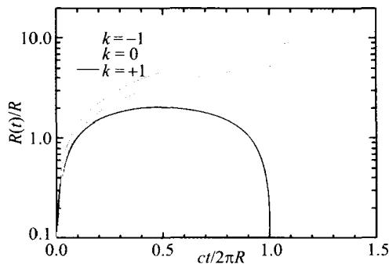
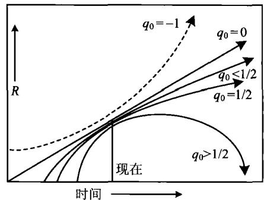
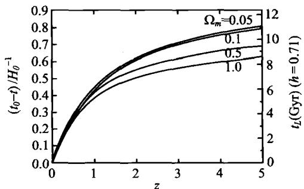
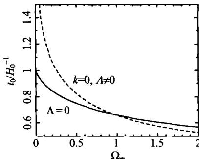

### 7.5 标准宇宙学模型

#### 7.5.1 弗里德曼方程

从前面的讨论可以看到，在 R-W 度规下，膨胀宇宙的动力学性质取决于 $R(t)$ 的时间演化。但 $R(t)$ 的准确求解必须利用广义相对论，因为牛顿理论不适用于对宇宙大尺度结构的描述。这里我们不讨论广义相对论的严格处理方法，只介绍它的主要结果，并把它的结果与牛顿宇宙学的结果进行对比。

在 R-W 度规下,从广义相对论的爱因斯坦场方程出发,可以得到 $R(t)$ 的动力学方程为(取光速 c=1)

$$
\frac {\ddot {R}}{R} = - \frac {4}{3} \pi G (\rho + 3 p) + \frac {\Lambda}{3}\tag{7.5.1}
$$

其中 $\rho, p$ 分别是宇宙物质的能量(质量)密度和压力， $\Lambda$ 称为宇宙学常数。 $\Lambda$ 这个常数就是爱因斯坦1917年求解 $R(t)$ 时，为了避免宇宙的坍缩或膨胀，而人为地加上去的一个常数。当时他认为，如果没有这个常数，则(7.5.1)表明 $\ddot{R} < 0$ ，即宇宙空间整体加速度不为零，就会成为动态，而这是和传统的静态宇宙相矛盾的。从动力学的角度看，(7.5.1)等号右边第一项(负号项)代表引力作用，为了平衡引力，爱因斯坦加上了一个正号项即宇宙学常数项。由此看来，宇宙学常数的物理意义就应该是，它代表了宇宙间的某种斥力，而这种斥力就联系到我们下面要谈到的宇宙暗能量。

把(7.5.1)与(7.4.43)相比较,可以看出广义相对论的结果比牛顿力学只多出了两项:一项是压力 p,它表示在广义相对论中,压力也像能量(质量)那样可以成为引力的源;另一项就是宇宙学常数 $\Lambda$ 项,但这一项并不是广义相对论所必然带来的,实际上,牛顿理论也可以人为加上这一项。因此看来,只有压力项是广义相对论带来的实质性改进。但这一改进对宇宙演化是至关重要的:压力 p 的出现使我们可以有物态方程,从而描述宇宙物质的真实状态。否则就像牛顿宇宙学那样,压力始终被忽略,宇宙物质只能永远如冷的零压粒子(“尘埃”);这样的宇宙没有热辐射主导的阶段,也就不会发生我们以后将看到的、宇宙早期热历史中丰富多样的物理过程。

我们继续对(7.5.1)的讨论。在体积 V 内，宇宙物质的总能量是 $U = \rho V$ 。由热力学第一定律，绝热膨胀中，当 V 变化时，dU 等于压力做功的负值：

$$
\mathrm{d} U = - p \mathrm{d} V = \rho \mathrm{d} V + V \mathrm{d} \rho\tag{7.5.2}
$$

后一个等式实际上就是 $U = \rho V$ 的全微分。由(7.5.2)第二个等式得出

$$
\mathrm{d} \rho = - (\rho + p) \frac {\mathrm{d} V}{V} \Rightarrow \dot {\rho} = - (\rho + p) \frac {\dot {V}}{V}\tag{7.5.3}
$$

其中点符号代表对时间的导数,如我们以前约定的那样。因为三维空间的体积 $V\propto R^{3}$ ,故(7.5.3)变成

$$
\dot {\rho} = - 3 (\rho + p) \frac {\dot {R}}{R}\tag{7.5.4}
$$

利用这一等式，(7.5.1)可以化为

$$
\begin{array}{r l} \ddot {R} & = - \frac {4}{3} \pi G [ 3 (\rho + p) - 2 \rho ] R + \frac {\Lambda}{3} R \\ & = \frac {4 \pi G}{3} \frac {\dot {\rho}}{\dot {R}} R ^ {2} + \frac {8 \pi G}{3} \rho R + \frac {\Lambda}{3} R \end{array}\tag{7.5.5}
$$

两边分别乘以 $\dot{R}$ ，得到

$$
\dot {R} \ddot {R} = \frac {4 \pi G}{3} \dot {\rho} R ^ {2} + \frac {8 \pi G}{3} \rho R \dot {R} + \frac {\Lambda}{3} R \dot {R} = \frac {4 \pi G}{3} \frac {\mathrm{d}}{\mathrm{d} t} (\rho R ^ {2}) + \frac {\Lambda}{3} R \dot {R}\tag{7.5.6}
$$

积分后给出

$$
\frac {1}{2} \dot {R} ^ {2} = \frac {4 \pi G}{3} \rho R ^ {2} + \frac {\Lambda}{6} R ^ {2} - \frac {1}{2} k\tag{7.5.7}
$$

即

$$
H ^ {2} \equiv \left(\frac {\dot {R}}{R}\right) ^ {2} = \frac {8 \pi G}{3} \rho + \frac {\Lambda}{3} - \frac {k}{R ^ {2}}\tag{7.5.8}
$$

这一方程称为弗里德曼(A. Friedmann)方程。广义相对论的严格证明给出， $k$ 就是前面定义过的宇宙曲率，即 $k = 0, \pm 1$ 。通常把基于宇宙学原理和爱因斯坦场方程的宇宙学模型称为标准宇宙学模型，因而，弗里德曼方程就是标准宇宙学模型的基本方程。

(7.5.8)式对一切宇宙时刻成立,故对现在时刻 $t = t_{0}$ 也成立,即

$$
H _ {0} ^ {2} = \frac {8 \pi G}{3} \rho_ {0} + \frac {\Lambda}{3} - \frac {k}{R _ {0} ^ {2}}\tag{7.5.9}
$$

它可以改写成

$$
1 = \frac {8 \pi G}{3 H _ {0} ^ {2}} \rho_ {0} + \frac {\Lambda}{3 H _ {0} ^ {2}} - \frac {k}{H _ {0} ^ {2} R _ {0} ^ {2}}\tag{7.5.10}
$$

或

$$
1 = \frac {\rho_ {0}}{\rho_ {c}} + \frac {\Lambda}{3 H _ {0} ^ {2}} - \frac {k}{H _ {0} ^ {2} R _ {0} ^ {2}}\tag{7.5.11}
$$

其中 $\rho_{c} = 3H_{0}^{2} / 8\pi G$ 为宇宙临界密度（见(7.4.57))。由此，我们得到了一个重要的关系式

$$
1 = \Omega_ {m} + \Omega_ {\Lambda} + \Omega_ {k}\tag{7.5.12}
$$

其中几个 $\Omega$ 的定义分别是

$$
\Omega_ {m} = \frac {\rho_ {0}}{\rho_ {c}} = \frac {8 \pi G \rho_ {0}}{3 H _ {0} ^ {2}} \quad (\text { 宇宙密度参数 })\tag{7.5.13}
$$

$$
\Omega_ {\Lambda} = \frac {\Lambda}{3 H _ {0} ^ {2}} \quad (\text { 宇宙学常数参数 })\tag{7.5.14}
$$

$$
\Omega_ {k} = - \frac {k}{H _ {0} ^ {2} R _ {0} ^ {2}} \quad (\text { 宇宙曲率参数 })\tag{7.5.15}
$$

对于 $\Lambda = 0$ 的宇宙，可以分为以下几种情况（参见图7.22a）：

$$
\begin{array}{r l r l} \Omega_ {m} > 1 & \Rightarrow & \Omega_ {k} <   0 & \Rightarrow k = + 1 \quad (\text {闭合宇宙——膨胀后坍缩}) \\ \Omega_ {m} <   1 & \Rightarrow & \Omega_ {k} > 0 & \Rightarrow k = - 1 \quad (\text {开放宇宙——永远膨胀}) \\ \Omega_ {m} = 1 & \Rightarrow & \Omega_ {k} = 0 & \Rightarrow k = 0 \quad (\text {平直宇宙——永远膨胀}) \end{array}\tag{7.5.16}
$$

其中平直宇宙的情况，通常称为爱因斯坦-德西特(Einstein-de Sitter)模型。

现在人们更关注 k=0 但 $\Lambda\neq0$ 的情况。最近的观测结果表明，我们的宇宙在加速膨胀，且上述宇宙学参数目前的观测值分别是

$$
\begin{array}{l} \Omega_ {m} = 0. 2 7 \pm 0. 0 2 \\ \Omega_ {\Lambda} = 0. 7 3 \pm 0. 0 2 \\ \Omega_ {k} = 0 \end{array}
$$

(7.5.17)

图 7.22a $\Lambda = 0$ 时，平直、开放、闭合宇宙中 $R(t)$ 的演化

图 7.22b 包括 $\Lambda \neq 0$ 在内的一般情况, 不同 $q_{0}$ 值时 $R(t)$ 的演化

我们注意到， $\Omega_{\Lambda}$ 和 $\Omega_{m}$ 在方程(7.5.12)中的地位是平等的，因此 $\Omega_{\Lambda}$ 代表宇宙学常数 $\Lambda$ 对能量的贡献。而(7.5.17)的结果意味着，宇宙现在的能量，是由宇宙学常数所主导的（参见7.8.4节），而通常的物质粒子（包括辐射）的能量，只占宇宙总能量的一小部分。回忆一下，宇宙学常数当初只不过是爱因斯坦为了得到一个静态宇宙学解，人为地加上去的一个数学常数。现在，这一数学常数却有了深刻的物理意义：它表示在宇宙中占统治地位的能量！但这一能量的本质现在还不清楚，这就是目前全世界的宇宙学家和物理学家正在努力探索的宇宙暗能量问题。我们将在7.8.4节再来讨论它。

当 $\Lambda\neq0$ 时，由(7.4.55)定义的减速因子 $q_{0}$ 可以表示为

$$
\begin{array}{r l} q _ {0} & \equiv - \frac {\ddot {R} (t _ {0}) R (t _ {0})}{\dot {R} ^ {2} (t _ {0})} = - \frac {4 \pi G \rho_ {0} - \Lambda}{3 \dot {R} ^ {2} (t _ {0}) / R ^ {2} (t _ {0})} \\ & = \frac {4 \pi G \rho_ {0}}{3 H _ {0} ^ {2}} - \frac {\Lambda}{2 H _ {0} ^ {2}} = \frac {1}{2} \Omega_ {m} - \Omega_ {\Lambda} \end{array}\tag{7.5.18}
$$

其中利用了(7.5.1)并忽略了宇宙目前时刻辐射压力的贡献(即取 p=0)。由此可见，如果取 $\Omega_{m}=0.27,\Omega_{\Lambda}=0.73,\Omega_{k}=0$ ，则有 $q_{0}\simeq-0.6$ 。减速因子为负即表示加速，因此，我们的宇宙现在是在加速膨胀的。图 7.22b 显示包括 $\Lambda\neq0$ 在内的一般情况下，不同 $q_{0}$ 值时 $R(t)$ 随时间的演化趋势。

#### 7.5.2 宇宙的年龄

7.3 节中我们介绍了对宇宙年龄的观测结果。现在我们来计算一下，各种理论模型给出的宇宙年龄是多少，以与观测结果相比较。

R=0 的时刻相应于 t=0，是时空奇点，也是宇宙年龄的开始。下面我们先讨论最简单的情形，即 $\Lambda=0, k=0$ 的爱因斯坦-德西特宇宙，因为可以得到简单的解析结果。此时根据弗里德曼方程(7.5.8)，并取 $\Lambda=0, k=0$ ，有

$$
\dot {R} ^ {2} = \frac {8 \pi G}{3} \rho R ^ {2}\tag{7.5.19}
$$

此外，设宇宙年龄的主要部分是以物质粒子为主的，则任一固有体积 $(V\propto R^{3})$ 内所包含的物质质量(能量)可以看成不变，即

$$
\rho (t) R ^ {3} (t) = \rho (t _ {0}) R ^ {3} (t _ {0})\tag{7.5.20}
$$

则(7.5.19)化为

$$
\dot {R} ^ {2} = \frac {8 \pi G}{3} \frac {\rho_ {0} R _ {0} ^ {3}}{R} = \frac {H _ {0} ^ {2} R _ {0} ^ {3}}{R}\tag{7.5.21}
$$

其中 $R_0 \equiv R(t_0)$ ，并且用到 $H_0^2 = 8\pi G\rho_0 / 3$ （见(7.5.9)）。此式即

$$
\dot {R} = H _ {0} R _ {0} ^ {3 / 2} R ^ {- 1 / 2} \Rightarrow R ^ {1 / 2} \mathrm{d} R = H _ {0} R _ {0} ^ {3 / 2} \mathrm{d} t\tag{7.5.22}
$$

积分此式,并取 t=0 时 R=0, 得

$$
t = \frac {2}{3 H _ {0}} \left(\frac {R}{R _ {0}}\right) ^ {3 / 2}\tag{7.5.23}
$$

因此，宇宙目前 $(R = R_0)$ 的年龄是

$$
t _ {0} = \frac {2}{3 H _ {0}} = 6. 5 h ^ {- 1} \mathrm{Gyr}\tag{7.5.24}
$$

可以看到,这一结果只有前面(7.3.13)给出的哈勃年龄的2/3,且当

$$
h \approx 0. 7 \Rightarrow t _ {0} \approx 9. 3 \mathrm{Gyr}\tag{7.5.25}
$$

即宇宙年龄还不到100亿年。这显然与我们前面讨论过的各种观测结果相矛盾。这也就是20世纪末发现宇宙加速膨胀之前，宇宙学曾面临严重危机的主要原因。

宇宙加速膨胀即表明宇宙学常数 $\Lambda \neq 0$ 。下面的分析将表明， $\Lambda \neq 0$ 将使 $t_0$ 的理论值增大，从而能与宇宙年龄的观测结果相符。我们还是从弗里德曼方程(7.5.8)开始，即

$$
\left(\frac {\dot {R}}{R}\right) ^ {2} = \frac {8 \pi G}{3} \rho + \frac {\Lambda}{3} - \frac {k}{R ^ {2}}\tag{7.5.26}
$$

在宇宙学的研究中，除了 $R(t)$ 外，也常用归一化的无量纲变量 $a(t) \equiv R(t) / R_0$ 来表示宇宙尺度因子，其中 $R_0 \equiv R(t_0)$ ，并显然有 $a(t_0) \equiv 1$ 。在这样的变换下，(7.5.26)现在写为

$$
\left(\frac {\dot {a}}{a}\right) ^ {2} = \frac {8 \pi G}{3} \rho + \frac {\Lambda}{3} - \frac {k}{a ^ {2} R _ {0} ^ {2}} \Rightarrow \dot {a} ^ {2} = \frac {8 \pi G}{3} \rho a ^ {2} + \frac {\Lambda a ^ {2}}{3} - \frac {k}{R _ {0} ^ {2}}\tag{7.5.27}
$$

注意到(7.5.20)现在变成 $\rho(t)a^{3}(t)=\rho_{0}$ ，且(7.5.13)给出 $8\pi G\rho_{0}/3=H_{0}^{2}\Omega_{m}$ ，再利用(7.5.14)、(7.5.15)定义的 $\Omega_{\Lambda}$ 和 $\Omega_{k}$ ，(7.5.27)化为

$$\begin{array}{r l} \dot {a} ^ {2} & = H _ {0} ^ {2} \left(\frac {\Omega_ {m}}{a} + \Omega_ {\Lambda} a ^ {2} + \Omega_ {k}\right) = H _ {0} ^ {2} \left[ \frac {\Omega_ {m}}{a} + \Omega_ {\Lambda} a ^ {2} + (1 - \Omega_ {m} - \Omega_ {\Lambda}) \right] \\ & = H _ {0} ^ {2} \left[ 1 + \Omega_ {m} \left(\frac {1}{a} - 1\right) + \Omega_ {\Lambda} (a ^ {2} - 1) \right] \end{array} \tag{7.5.28}
$$

其中用到恒等式(7.5.12)。在上面的推导中，我们仍然假设宇宙年龄的绝大部分时期，宇宙能量由物质粒子所主导。以后将会看到，这一假设是合理的。

宇宙学时间 t 也常用宇宙学红移 z 来表示, 因为它们之间是一一对应的。由宇宙学红移的定义(7.4.20)有

$$
z = \frac {R (t _ {0})}{R (t)} - 1 = \frac {1}{a (t)} - 1\tag{7.5.29}
$$

或

$$
1 + z = \frac {1}{a (t)}\tag{7.5.30}
$$

此式对时间求导给出

$$
\frac {\mathrm{d} a}{\mathrm{d} t} = - \frac {1}{(1 + z) ^ {2}} \frac {\mathrm{d} z}{\mathrm{d} t} \Rightarrow \mathrm{d} t = - \frac {\mathrm{d} z}{\dot {a} (1 + z) ^ {2}}\tag{7.5.31}
$$

再利用(7.5.28)及(7.5.30)，可以得到

$$
\mathrm{d} t = - \frac {\mathrm{d} z}{H _ {0} (1 + z) ^ {2} \sqrt {1 + \Omega_ {m} \left(\frac {1}{a} - 1\right) + \Omega_ {\Lambda} \left(a ^ {2} - 1\right)}}
$$

$$
= - \frac {\mathrm{d} z}{H _ {0} (1 + z) \sqrt {(1 + z) ^ {2} (1 + \Omega_ {m} z) - z (2 + z) \Omega_ {\Lambda}}}\tag{7.5.32}
$$

方程两边分别积分，

$$
t _ {0} - t = \frac {1}{H _ {0}} \int_ {0} ^ {z} \frac {\mathrm{d} z}{(1 + z) \sqrt {(1 + z) ^ {2} (1 + \Omega_ {m} z) - z (2 + z) \Omega_ {\Lambda}}}\tag{7.5.33}
$$

等号右边的积分很复杂，一般情况下只能通过数值计算方法才能求得结果。利用(7.5.18)定义的 $q_{0}$ ，当 $z < 1$ 时，(7.5.33)可以近似表示为

$$
t _ {0} - t = \frac {z}{H _ {0}} - \left(1 + \frac {1}{2} q _ {0}\right) \frac {z ^ {2}}{H _ {0}} + \dots\tag{7.5.34}
$$

$t - t_{0}$ 通常称为回溯时间(lookback time)，它表示从宇宙现在的时刻 $t_{0}$ 倒退回到红移 z 时所经历的时间(参见图 7.23)。显然， $z = \infty$ 时相应于 t = 0，此时回溯时间就等于宇宙的年龄 $t_{0}$ 。图 7.24 给出了不同参数下宇宙年龄的计算结果。从图中可以看到，在 $\Omega_{k} = 0$ 的平直宇宙情况下，宇宙学常数不为零时的宇宙年龄要比 $\Lambda = 0$ 时长，这正是我们所希望的。

在很小(百分之几)的误差内, $t_{0}$ 可用下面的近似式来表示

$$
t _ {0} \simeq \frac {2}{3 H _ {0}} (0. 7 \Omega_ {m} + 0. 3 - 0. 3 \Omega_ {\Lambda}) ^ {- 0. 3}\tag{7.5.35}
$$

或

$$
t _ {0} \simeq \frac {2}{3 \Omega_ {\Lambda} ^ {1 / 2} H _ {0}} \mathrm{ln} \Big (\frac {1 + \Omega_ {\Lambda} ^ {1 / 2}}{\Omega_ {m} ^ {1 / 2}} \Big) \qquad (\text {对于} \Omega_ {k} = 0 \text {且} \Omega_ {\Lambda} \neq 0)\tag{7.5.36}
$$

例如，如果取 $\Omega_{m} \simeq 0.27, \Omega_{\Lambda} \simeq 0.73$ ，并取 $h \simeq 0.72$ ，则(7.5.35)给出 $t_{0} \simeq 9.63 h^{-1}$ Gyr $\simeq 13.4$ Gyr。这一结果与观测的要求是相符的。

图7.23 回溯时间 $t - t_0$ 作为宇宙学红移 $z$ 的函数。宇宙取为 $k = 0$ 的平直宇宙，曲线上所标的数字为 $\Omega_m$ 的值

图7.24 宇宙的年龄 $t_0$ 与宇宙学参数 $\Omega_{m}$ 及 $\Lambda$ 的关系

