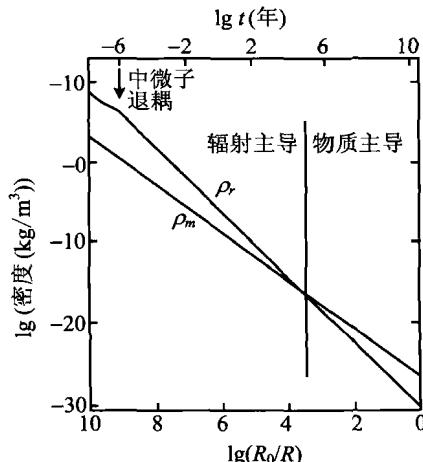
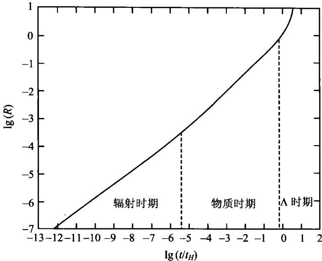

### 7.6 物理宇宙学——具有物质和辐射的宇宙

几何宇宙学自1917年就开始发展了，而物理宇宙学只是在1965年发现宇宙微波背景辐射以后，才有了巨大的发展。物理宇宙学研究的是，在上一节讨论的时空几何条件下，宇宙物质的演化和宇宙结构的形成过程，以及这些过程可直接观测到的物理效应。

宇宙中目前物质粒子的总密度约为 $\rho_{m0} \simeq 2.6 \times 10^{-30} \mathrm{~g/cm}^3$ （其中包括发光的重子，即构成原子核的质子和中子，其密度大约为 $\rho_{B0} \approx 4 \times 10^{-31} \mathrm{~g/cm}^3$ ；其余为不发光的暗物质粒子），除物质粒子外，还有宇宙背景辐射光子，其密度大约为 $\rho_{r0} \approx 4 \times 10^{-34} \mathrm{~g/cm}^3$ 。有了这些基本的观测数据，我们就可以推测宇宙的演化过程。

宇宙的膨胀可以看成是绝热的。一个绝热膨胀系统，满足热力学第一定律

$$
\mathrm{d} E + p \mathrm{d} V = 0\tag{7.6.1}
$$

其中

$$
E = M c ^ {2} = \left(\rho_ {m} + \rho_ {r}\right) V c ^ {2} = \rho V c ^ {2}\tag{7.6.2}
$$

$\rho_{m}$ 和 $\rho_{r}$ 分别表示物质密度和辐射密度， $\rho = \rho_{m} + \rho_{r}$ 。由于 $V \propto R^{3}(t)$ ，以上两式给出

$$
\frac {\mathrm{d}}{\mathrm{d} t} \left(\rho R ^ {3}\right) + \frac {p}{c ^ {2}} \frac {\mathrm{d}}{\mathrm{d} t} \left(R ^ {3}\right) = 0\tag{7.6.3}
$$

我们把物质粒子看成是非相对论性的，即它们的压力可以忽略，则方程中的压力 $p$ 仅为辐射的贡献。当宇宙是物质为主时， $\rho \simeq \rho_{m}, p \simeq 0$ ，我们得到

$$
\frac {\mathrm{d}}{\mathrm{d} t} (\rho_ {m} R ^ {3}) = 0\tag{7.6.4}
$$

这与前面牛顿理论的结果(7.4.38)一致。如果宇宙是辐射为主 $\left(\rho_{r}\gg\rho_{m}\right)$ ，此时有

$$
p _ {r} = \frac {1}{3} \rho_ {r} c ^ {2}\tag{7.6.5}
$$

于是(7.6.3)式成为

$$
\frac {\mathrm{d}}{\mathrm{d} t} \left(\rho_ {r} R ^ {3}\right) + \frac {1}{3} \rho_ {r} \frac {\mathrm{d}}{\mathrm{d} t} \left(R ^ {3}\right) = 0\tag{7.6.6}
$$

此即

$$
\dot {\rho} _ {r} R ^ {3} + 3 \rho_ {r} R ^ {2} \dot {R} + \rho_ {r} R ^ {2} \dot {R} = 0 \Rightarrow \frac {1}{R} \frac {\mathrm{d}}{\mathrm{d} t} (\rho_ {r} R ^ {4}) = 0\tag{7.6.7}
$$

这表明

$$
\rho_ {r} (t) = \rho_ {r 0} \left[ \frac {R (t _ {0})}{R (t)} \right] ^ {4}\tag{7.6.8}
$$

当物质与辐射两者都有时,如果物质是非相对论性的,则其对压力无贡献,总压力 $p = p_{r}$ (取 c = 1), 此时(7.6.3)写为

$$
\begin{array}{l} \frac {\mathrm{d}}{\mathrm{d} t} (\rho_ {m} R ^ {3}) + \frac {\mathrm{d}}{\mathrm{d} t} (\rho_ {r} R ^ {3}) + \frac {1}{3} \rho_ {r} \frac {\mathrm{d}}{\mathrm{d} t} (R ^ {3}) = 0 \\ \Rightarrow \frac {\mathrm{d}}{\mathrm{d} t} (\rho_ {m} R ^ {3}) + \frac {1}{R} \frac {\mathrm{d}}{\mathrm{d} t} (\rho_ {r} R ^ {4}) = 0 \end{array}\tag{7.6.9}
$$

如果我们认为物质严格守恒，即物质与辐射之间不互相转化，则应分别有

$$
\frac {\mathrm{d}}{\mathrm{d} t} (\rho_ {m} R ^ {3}) = 0, \quad \frac {1}{R} \frac {\mathrm{d}}{\mathrm{d} t} (\rho_ {r} R ^ {4}) = 0\tag{7.6.10}
$$

即

$$
\rho_ {m} = \rho_ {m 0} (R _ {0} / R) ^ {3}, \quad \rho_ {r} = \rho_ {r 0} (R _ {0} / R) ^ {4}\tag{7.6.11}
$$

显然，由于 $\rho_r\propto R^{-4}$ 而 $\rho_{m}\propto R^{-3}$ ，当时间倒退回去即 $R$ 越变越小时， $\rho_r$ 比 $\rho_{m}$ 更快地增长。因而，如果回溯到宇宙的早期，即 $R\ll R_0$ 时，辐射的作用就会越来越重要。目前辐射与物质的能量密度之比为 $\rho_{r0} / \rho_{m0}\approx 1.5\times 10^{-4}$ ，但在宇宙早期的某

一时刻 $t_{eq}$ ，必然有辐射与物质的能量密度相等（见图7.25），即 $\rho_r(t_{eq}) = \rho_m(t_{eq})$ ，此时的宇宙尺度因子为

$$
R (t _ {e q}) = \frac {\rho_ {r 0}}{\rho_ {m 0}} R (t _ {0})\tag{7.6.12}
$$

从上面的分析看到，当 $t < t_{eq}$ 时有 $\rho_r > \rho_m$ ，宇宙以辐射为主；当 $t > t_{eq}$ 时有 $\rho_r < \rho_m$ ，宇宙以物质为主。另一方面，如果辐射是黑体辐射， $\rho_r \propto T^4$ ，则根据(7.6.11)必然有

$$
T \propto R (t) ^ {- 1}\tag{7.6.13}
$$

因而宇宙早期 $(R\ll R_0)$ 的温度很高，是热宇宙。从辐射为主过渡到物质为主以后，宇宙就逐渐变为冷宇宙。我们来估计一下 $\rho_r = \rho_m$ 时的温度。容易看到，此时有

图 7.25 物质密度与辐射密度随时间的演化

$$
\frac {\rho_ {r 0}}{\rho_ {m 0}} = \frac {R (t _ {e q})}{R (t _ {0})} = \frac {T _ {0}}{T _ {e q}} \approx 1. 5 \times 1 0 ^ {- 4}\tag{7.6.14}
$$

如果取 $T_0 \simeq 2.7\mathrm{K}$ , 则

$$
T _ {e q} = \left(\frac {\rho_ {m 0}}{\rho_ {r 0}}\right) T _ {0} \approx 1. 8 \times 1 0 ^ {4} \mathrm{K}\tag{7.6.15}
$$

再来看具有物质和辐射的宇宙中， $R(t)$ 如何随时间演化。(7.5.26)现在是

$$
\left(\frac {\dot {R}}{R}\right) ^ {2} = \frac {8 \pi G}{3} \left(\rho_ {r} + \rho_ {m}\right) + \frac {\Lambda}{3} - \frac {k}{R ^ {2}}\tag{7.6.16}
$$

为简单起见,我们只讨论 $\Lambda=0,k=0$ 的爱因斯坦-德西特宇宙,此时有

$$
\left(\frac {\dot {R}}{R}\right) ^ {2} = \frac {8 \pi G}{3} \left[ \rho_ {r 0} \left(\frac {R _ {0}}{R}\right) ^ {4} + \rho_ {m 0} \left(\frac {R _ {0}}{R}\right) ^ {3} \right]\tag{7.6.17}
$$

仍把 $R(t)$ 化为归一化的宇宙尺度因子 $a(t) \equiv R(t) / R_0$ ，(7.6.17)变成

$$
\left(\frac {\dot {a}}{a}\right) ^ {2} = \frac {8 \pi G}{3} \rho_ {m 0} \left[ \frac {\rho_ {r 0}}{\rho_ {m 0}} a ^ {- 4} + a ^ {- 3} \right]\tag{7.6.18}
$$

或者

$$
\left(\frac {\dot {a}}{a}\right) ^ {2} = \frac {8 \pi G \rho_ {0}}{3} (a _ {e q} a ^ {- 4} + a ^ {- 3})\tag{7.6.19}
$$

这里我们取 $\rho_0 \equiv \rho_{m0} + \rho_{r0} \simeq \rho_{m0}$ ，且 $a_{eq} = \rho_{r0} / \rho_{m0}$ 。利用

$$
\frac {8 \pi G \rho_ {0}}{3} = H _ {0} ^ {2}\tag{7.6.20}
$$

(7.6.19)化为

$$
\frac {a \mathrm{d} a}{(a _ {e q} + a) ^ {1 / 2}} = H _ {0} \mathrm{d} t\tag{7.6.21}
$$

积分结果给出

$$
t _ {e q} = H _ {0} ^ {- 1} \int_ {0} ^ {a _ {e q}} \frac {a \mathrm{d} a}{\left(a _ {e q} + a\right) ^ {1 / 2}} \approx 0. 3 9 H _ {0} ^ {- 1} a _ {e q} ^ {3 / 2}\tag{7.6.22}
$$

取 $H_{0}^{-1}\approx13.6\ Gyr$ ，就得到 $t_{eq}\approx10^{4}\ yr$ ，即宇宙诞生后大约只经过1万年，就从辐射为主转变到物质为主。这一时间与现在宇宙的年龄相比，的确是微不足道的。因此我们可以说，宇宙演化至今，绝大部分时间是以物质为主的。

根据(7.6.21)，我们还可以求得宇宙尺度因子 $a(t)$ （或 $R(t)$ )随时间变化的规律（参见图7.26）。例如，当辐射为主时 $(a\ll a_{eq})$ ，(7.6.21)近似给出

$$
a \mathrm{d} a \propto \mathrm{d} t \Rightarrow a ^ {2} \propto t \Rightarrow a \propto t ^ {1 / 2} (\text {辐射为主})\tag{7.6.23}
$$

而当物质为主时 $(a\gg a_{eq})$ ，(7.6.21)近似给出

$$
a ^ {1 / 2} \mathrm{d} a \propto \mathrm{d} t \Rightarrow a ^ {3 / 2} \propto t \Rightarrow a \propto t ^ {2 / 3} (\text {物质为主})\tag{7.6.24}
$$

由图 7.26 还可见, 从不久前开始, $a(t)$ 随时间做指数函数膨胀。这是由于 (7.6.16) 中的 $\Lambda$ 实际不为零的结果, 我们将在 7.8.4 节中讨论这一情况。

图 7.26 宇宙尺度因子随时间的演化

作为本节的小结，我们这里再强调两点。一点是，上述这些分析，根据的是宇宙中光子和物质粒子的能量密度观测结果。因此，虽然观测到的光子（微波背景辐射）能量密度很小，但其宇宙学意义却是巨大的。没有宇宙微波背景辐射的观测结果，就不会有热大爆炸宇宙模型。另一点是，实际上，我们以上所谈的“辐射”中还应当包括其他相对论性的粒子，例如静质量为零的中微子。相对论性粒子的能量密度随 $R(t)$ （或 $a(t)$ ）的变化规律和光子是相同的 $(\infty R^{-4})$ ，因此在宇宙演化的早期，它们也对宇宙的能量密度有重要的贡献。特别是中微子，它们的数量和光子大致相同。虽然它们与其他粒子（包括光子）退耦的时间很早（见下一节），但退耦后中微子仍然保持原来的能量分布（费米分布），只是温度比光子的温度略低（约为光子温度的1/1.4），其温度 $T\propto R^{-1}$ ，变化规律与光子相同。这样，在计算 $t_{eq},T_{eq}$ 以及 $a_{eq}$ 时，中微子的能量密度也应当考虑在内。大致说来，考虑了相对论性粒子的贡献之后，上面分析中的“辐射”能量密度应当增加一倍，即 $\rho_{r0}\approx8\times10^{-34}g/cm^{3}$ 。因此，(7.6.15)给出的 $T_{eq}$ 应降低一半左右， $T_{eq}\approx9000K$ ；(7.6.14)给出的 $R_{eq}$ （以及 $a_{eq}$ ）应增加一倍， $a_{eq}=\rho_{r0}/\rho_{m0}\approx3\times10^{-4}$ ；而(7.6.22)给出的 $t_{eq}$ 现在应为 $t_{eq}\approx2^{3/2}\times10^{4}yr\approx3\times10^{4}yr$ 。

