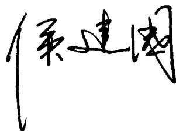

# 天体物理概论

彩色版

向守平 编著

# 天体物理概论

TIANTI WULI GAILUN

彩色版

向守平 编著

## 总序

2008年是中国科学技术大学建校五十周年。为了反映五十年来办学理念和特色，集中展示教材建设的成果，学校决定组织编写出版代表中国科学技术大学教学水平的精品教材系列。在各方的共同努力下，共组织选题281种，经过多轮、严格的评审，最后确定50种入选精品教材系列。

1958年学校成立之时，教员大部分都来自中国科学院的各个研究所。作为各个研究所的科研人员，他们到学校后保持了教学的同时又作研究的传统。同时，根据“全院办校，所系结合”的原则，科学院各个研究所在科研第一线工作的杰出科学家也参与学校的教学，为本科生授课，将最新的科研成果融入到教学中。五十年来，外界环境和内在条件都发生了很大变化，但学校以教学为主、教学与科研相结合的方针没有变。正因为坚持了科学与技术相结合、理论与实践相结合、教学与科研相结合的方针，并形成了优良的传统，才培养出了一批又一批高质量的人才。

学校非常重视基础课和专业基础课教学的传统，也是她特别成功的原因之一。当今社会，科技发展突飞猛进、科技成果日新月异，没有扎实的基础知识，很难在科学技术研究中作出重大贡献。建校之初，华罗庚、吴有训、严济慈等老一辈科学家、教育家就身体力行，亲自为本科生讲授基础课。他们以渊博的学识、精湛的讲课艺术、高尚的师德，带出一批又一批杰出的年轻教员，培养了一届又一届优秀学生。这次入选校庆精品教材的绝大部分是本科生基础课或专业基础课的教材，其作者大多直接或间接受到过这些老一辈科学家、教育家的教诲和影响，因此在教材中也贯穿着这些先辈的教育教学理念与科学探索精神。

改革开放之初，学校最先选派青年骨干教师赴西方国家交流、学习，他们在带回先进科学技术的同时，也把西方先进的教育理念、教学方法、教学内容等带回到中国科学技术大学，并以极大的热情进行教学实践，使“科学与技术相结合、理论与实践相结合、教学与科研相结合”的方针得到进一步深化，取得了非常好的效果，培养的学生得到全社会的认可。这些教学改革影响深远，直到今天仍然受到学生的欢迎，并辐射到其他高校。在入选的精品教材中，这种理念与尝试也都有充分的体现。

中国科学技术大学自建校以来就形成的又一传统是根据学生的特点，用创新的精神编写教材。五十年来，进入我校学习的都是基础扎实、学业优秀、求知欲强、勇于探索和追求的学生，针对他们的具体情况编写教材，才能更加有利于培养他们的创新精神。教师们坚持教学与科研的结合，根据自己的科研体会，借鉴目前国外相关专业有关课程的经验，注意理论与实际应用的结合，基础知识与最新发展的结合，课堂教学与课外实践的结合，精心组织材料、认真编写教材，使学生在掌握扎实的理论基础的同时，了解最新的研究方法，掌握实际应用的技术。

这次入选的50种精品教材，既是教学一线教师长期教学积累的成果，也是学校五十年教学传统的体现，反映了中国科学技术大学的教学理念、教学特色和教学改革成果。该系列精品教材的出版，既是向学校五十周年校庆的献礼，也是对那些在学校发展历史中留下宝贵财富的老一代科学家、教育家的最好纪念。

2008年8月

## 序

天体物理学是天文学与物理学学科交叉而结的硕果。学科的交叉也推动了这两大古典学科的发展。首先，天体物理学加速了传统天文学向现代天文学的转化，它自身也逐渐成为天文学的主流。正是天体物理学的诞生与发展，推动当代天文学进入了全电磁波段（连续谱和谱线）观测和研究的时代，促成人类对宇宙的研究进入了精确宇宙学阶段。第二方面，它也推动了物理学的发展。天体物理学在更广、更深的层面对物理学规律进行检验，获得更精确的物理规律。因而这一交叉学科也成为物理学的重要组成部分。它开拓了物理学的研究范围，将地面实验室中发现的规律应用到遥远的宇宙天体之上，使浩瀚的宇宙变成物理学的实验室。它拓展了极端条件下的物理研究，探索和建立了超强引力场、超强磁场、超高温、超高密度、极低密度等条件下的物理学。第三方面，天文学与物理学之间的交融与互动，使我们能够更深入地探索大自然的奥秘。例如目前困扰科学界的宇宙暗能量问题，很可能预示我们对于自然规律的理解又要经历一次根本性的变革。

《天体物理概论》课程在中国科学技术大学开设已有二十多年的历史。在多年的教学实践中，该课程已经建设成为一门特色鲜明的课程，深受天文专业和非天文专业学生的欢迎。该课程对天文知识的介绍中突出了物理，但不深奥，只要学过普通物理都能听懂。对于天文专业的同学，学完这门课后，为进一步学习其他专业课，打下了良好的基础。对于非天文学专业但有兴趣选修的同学，也可以使他们了解现代天文学和当代宇宙学的基本概况，这对于拓展他们的视野、培养科学探索精神、提

高自身科学素质是大有帮助的。

本书是作者在多年授课讲义的基础上形成的。书中讲述深入浅出，并采用了大量的彩色图片，尽可能地做到了图文并茂，使读者增加了阅读的兴趣。我希望能有更多的读者通过这本书和相关课程的学习，对宇宙现象有更深入的了解和进一步求知的渴望。

周又元

2008年6月于中国科学技术大学

## 前言

自从伽利略和牛顿两位经典物理学大师先后把自制的望远镜指向天空，天文学与物理学的发展就日益密切地走到了一起。但真正意义上的天体物理学开始于19世纪中叶，分光学、光度学和照相术广泛应用于天体的观测研究，使人们对天体结构、化学成分、物理状态的了解越来越深入，天体物理学也逐渐形成完整的科学体系。特别是上世纪60年代，类星体、宇宙微波背景辐射、脉冲星和星际有机分子的相继发现，极大地促进了天体物理学的发展，并从根本上改变了人类的传统宇宙观。自上世纪60年代开始的一系列空间观测和行星际探测活动，大大地延伸了人类的视野，也进一步增强了社会公众对宇宙科学的兴趣。现在，大爆炸宇宙、奇妙的中子星、遥远的类星体和神秘的黑洞等，不仅是科学工作者深入研究的课题，也成为公众热切关注的对象。我国每年举办的科技活动周中，天文知识都是各地公众（特别是广大青少年）追求的热点，不久以前“嫦娥一号”绕月卫星发射成功并顺利开展探月工作，标志着我国已经成为具备深空探测能力的世界航天强国之一，也使得我国公众探索宇宙奥秘的热情更加高涨。21世纪将是我国天文学和天体物理学发展的黄金时期，国家需求和国际竞争需要培养和造就大批专业人才，也需要更多的公众了解和支持这一领域的发展。

本书是在作者多年授课的讲义基础上形成的。上世纪80年代，本课程刚开始在中国科学技术大学开设时，授课对象全部是研究生，课程内容是按照研究生的教学要求来设计的，理论性、专业性都很强。到了90年代中期以后，授课对象扩大为包括新设立的天文专业的本科生，课程内容也按本科与硕士课程贯通的思路进行了重新设计。从90年代末开始，全国高校普遍开展文化素质教育，拓宽学生的知识面，更多地提倡学科之间的交叉与交流，我校也规定所有本科生必须选修一定学分的跨学科课程。本课程作为首批面向全校开设的公共选修课列入教学计划，每年都有许多来自全校各院系的本科生选修。虽然上述几方面的同学专业和学历背景各有不同，但共同之处是已具备大学物理的基础，但缺乏天文学的基础。这是由于我国中小学没有系统地讲授过天文知识，高校中也只有极少数学校设立了天文专业，公众了解宇宙知识的主要渠道还是通过报刊和电视等媒体。即使是天体物理专业的研究生，如果大学本科学的是其他专业，研究生入学时也普遍欠缺天体物理甚至天文学的专业基础。因此，对这门课来讲，可以说所有的同学都差不多处在同一起跑线上。

针对上述情况,本书的内容定位为介绍天文学和天体物理的基本概念和基本研究方法。对本专业的同学来说,这些基本概念方法是进一步学习其他专业课程(如恒星物理、星系天文学、相对论天体物理及宇宙学等)的基础,并有助于他们在今后的学习时有一个全局的视野。对于非专业的同学,也可以达到扩展跨学科的视野、提高自身科学素质的目的,有助于建立科学正确的宇宙观,了解人类认识宇宙的历史和探索精神,并从人类研究遥远宇宙天体的科学方法中得到启发和借鉴,对自己在其他专业的学习和研究有所帮助。

本书所用到的物理知识主要是大学普通物理，极少数必须涉及理论物理（四大力学）和广义相对论的地方也只简单地引用结论，不做详细推导，故具有普通物理基础的读者学习起来不会感到困难。本书注意把天文学和天体物理学发展史上的主要事件结合到课程内容之中介绍，使读者能够比较生动具体地了解人类对宇宙奥秘的艰苦探索过程。在侧重基础的同时，对一些前沿热门问题也进行了适当的介绍和讨论，读者可以根据自己感兴趣的程度对这些内容进行取舍。

天体物理是一门既古老又生机勃勃的学科，新的观测发现不断涌现，新的理论也层出不穷，前沿进展可以说是日新月异，甚至一些基本宇宙学参数的观测值也仍在不断地有所修正。囿于作者的学识，要在本书中全面概括各方面的最新进展，是不可能办到的。因此作者希望有兴趣的读者能及时进行知识的自我更新，并对本书内容的不妥之处给予指正，作者将不胜感激！

周又元院士审阅了全部书稿，并在百忙中为本书写了序言。张家铝院士、程福臻教授、王挺贵教授、袁业飞教授和王俊贤教授都对书稿提出过宝贵的修改意见，作者对他们表示衷心的感谢。此外，本书的编写和出版得到了中国科学技术大学教务处和中国科学技术大学出版社的大力支持和资助，作者在此深表谢意。

由于讲义经过了二十多年的积累，其中部分插图的出处难以查找，未加注明。在此，对插图作者表示感谢，敬请联系，以便在重印再版时补充注明并酌付稿酬。

向守平

2008年5月于中国科学技术大学

## 目次

第1章 绪论 …… (1)
1.1 天体物理学的研究对象 …… (1)
1.1.1 太阳系 …… (3)
1.1.2 恒星世界 …… (13)
1.1.3 星系和星系团 …… (15)
1.2 天体物理学的观测方法简介 …… (15)
1.2.1 地面观测 …… (17)
1.2.2 空间望远镜 …… (25)
1.2.3 空间飞船考察 …… (31)
第2章 基本天体物理量及其测量 …… (41)
2.1 星等 …… (41)
2.1.1 视星等 …… (41)
2.1.2 绝对星等 …… (42)
2.1.3 光度 …… (43)
2.2 温度 …… (44)
2.2.1 色指数与色温度 …… (44)
2.2.2 有效温度 …… (47)
2.3 光谱型 …… (47)
2.3.1 天体光谱研究的开始与发展 …… (47)
2.3.2 恒星光谱的分类 …… (51)
2.3.3 不同光谱型谱线特征的成因 …… (53)
2.4 赫罗图 …… (56)
2.5 变星 …… (58)
2.5.1 脉动变星 …… (59)

2.5.2 爆发变星 …… (62)
2.6 天体距离的测定 …… (67)
2.7 恒星质量的测定 …… (74)
2.7.1 双星系统 …… (74)
2.7.2 质光关系 …… (75)
2.7.3 位力定理 …… (75)
2.8 恒星的年龄 …… (77)
第3章 恒星的形成与演化 …… (79)
3.1 恒星的形成阶段 …… (80)
3.1.1 星云坍缩的条件与金斯判据 …… (80)
3.1.2 星云的快速收缩过程 …… (84)
3.1.3 星云的慢收缩过程——原恒星阶段 …… (85)
3.2 主序星阶段 …… (87)
3.3 恒星结构的基本方程 …… (90)
3.4 积分定理(位力定理) …… (99)
3.5 主序后的演化 …… (101)
3.5.1 小质量恒星的演化 $1M < 2.3M_{\odot}$ …… (101)
3.5.2 中等质量恒星的演化 $2.3M_{\odot} < M < 8M_{\odot}$ …… (106)
3.5.3 大质量恒星的演化 $M > 8M_{\odot}$ …… (107)
3.6 超新星 …… (110)
3.6.1 Ia型超新星 …… (111)
3.6.2 II型超新星 …… (112)
3.6.3 中微子及其探测 …… (114)
3.6.4 中微子的未解之谜 …… (117)
3.6.5 超新星遗迹 …… (119)
3.7 密近双星的演化 …… (121)
3.7.1 洛希等势面 …… (121)
3.7.2 密近双星的演化 …… (124)
3.7.3 几种典型的最终演化结果 …… (126)
3.8 引力波辐射 …… (130)
第4章 致密星 …… (134)
4.1 白矮星 …… (135)
4.1.1 白矮星的质量上限——钱德拉塞卡极限 …… (135)

4.1.2 白矮星的结构与冷却 …… (137)
4.2 中子星 …… (138)
4.2.1 中子星的结构 …… (139)
4.2.2 中子星的自转与磁场 …… (141)
4.3 脉冲星 …… (143)
4.3.1 脉冲星的发现——一个期待了30多年的结果 …… (143)
4.3.2 脉冲星的观测特征与理论模型 …… (146)
4.3.3 脉冲星的距离测量 …… (148)
4.3.4 有待进一步研究的问题 …… (149)
4.4 黑洞 …… (153)
4.4.1 引力半径与视界 …… (153)
4.4.2 引力红移与时钟变慢 …… (156)
4.4.3 宇宙飞船向黑洞下落的过程 …… (157)
4.4.4 克尔黑洞，彭罗斯过程和宇宙监察猜想 …… (160)
4.4.5 黑洞热力学简介 …… (162)
4.4.6 黑洞量子力学简介 …… (164)
4.4.7 搜寻黑洞 …… (169)
4.5 宇宙γ射线暴 …… (174)
第5章 星际物质 …… (178)
5.1 星际物质的概况 …… (178)
5.2 中性氢区(H I区)与射电21cm谱线 …… (182)
5.3 电离氢区(H II区)与斯特龙根球 …… (184)
5.4 星际分子 …… (187)
5.4.1 星际分子的发现 …… (187)
5.4.2 星际分子的天体物理学意义 …… (189)
5.4.3 天体分子脉泽 …… (193)
第6章 星系 …… (195)
6.1 星系的主要特征 …… (197)
6.1.1 形态与分类 …… (197)
6.1.2 星系质量的测定 …… (203)
6.1.3 旋涡星系和椭圆星系的“标准烛光” …… (206)
6.1.4 银河系的主要特征 …… (207)
6.1.5 旋臂生成——密度波理论 …… (210)

6.2 活动星系与活动星系核 …… (212)
6.2.1 活动星系的主要观测特点 …… (212)
6.2.2 活动星系核(AGN)的统一模型 …… (223)
6.3 星系团和超星系团 …… (228)
6.3.1 星系的大尺度成团结构 …… (228)
6.3.2 星系的大尺度本动速度 …… (231)
6.3.3 星系团的X射线辐射 …… (232)
6.4 星系的形成与演化 …… (233)
6.4.1 单个星系的形成与演化概况 …… (233)
6.4.2 星系的相互作用与并合 …… (235)
第7章 宇宙学简介 …… (239)
7.1 人类宇宙观的进化 …… (239)
7.2 宇宙的有限与无限 …… (243)
7.2.1 空间弯曲的观测效应 …… (245)
7.2.2 空间膨胀的观测效应——哈勃关系 …… (248)
7.2.3 时间有限的观测效应——视界 …… (249)
7.3 宇宙学的基本观测事实 …… (249)
7.3.1 大尺度上星系的分布 …… (249)
7.3.2 星系距离与红移之间的哈勃关系 …… (250)
7.3.3 宇宙微波背景辐射 …… (254)
7.3.4 元素丰度 …… (259)
7.3.5 宇宙的年龄 …… (260)
7.3.6 正反物质粒子数之比 …… (262)
7.3.7 光子数与重子数之比 …… (263)
7.4 几何宇宙学 …… (265)
7.4.1 宇宙学原理 …… (265)
7.4.2 三维常曲率空间与罗伯森-沃克度规 …… (265)
7.4.3 宇宙学红移 …… (268)
7.4.4 宇宙学视界 …… (269)
7.4.5 牛顿宇宙学 …… (271)
7.4.6 宇宙减速因子 $q_0$ …… (274)
7.5 标准宇宙学模型 …… (275)
7.5.1 弗里德曼方程 …… (275)

7.5.2 宇宙的年龄 …… (279)
7.6 物理宇宙学——具有物质和辐射的宇宙 …… (282)
7.7 宇宙演化简史 …… (286)
7.7.1 时空创生 …… (286)
7.7.2 宇宙热历史概述 …… (287)
7.7.3 轻元素核合成 …… (290)
7.7.4 宇宙背景辐射 …… (294)
7.7.5 星系和宇宙大尺度结构的形成 …… (297)
7.8 几个重要的前沿课题 …… (307)
7.8.1 宇宙的暴胀 …… (307)
7.8.2 宇宙中的暗物质 …… (312)
7.8.3 引力透镜 …… (315)
7.8.4 宇宙暗能量 …… (320)
7.8.5 宇宙学与物理世界的统一 …… (325)
参考书目 …… (333)

